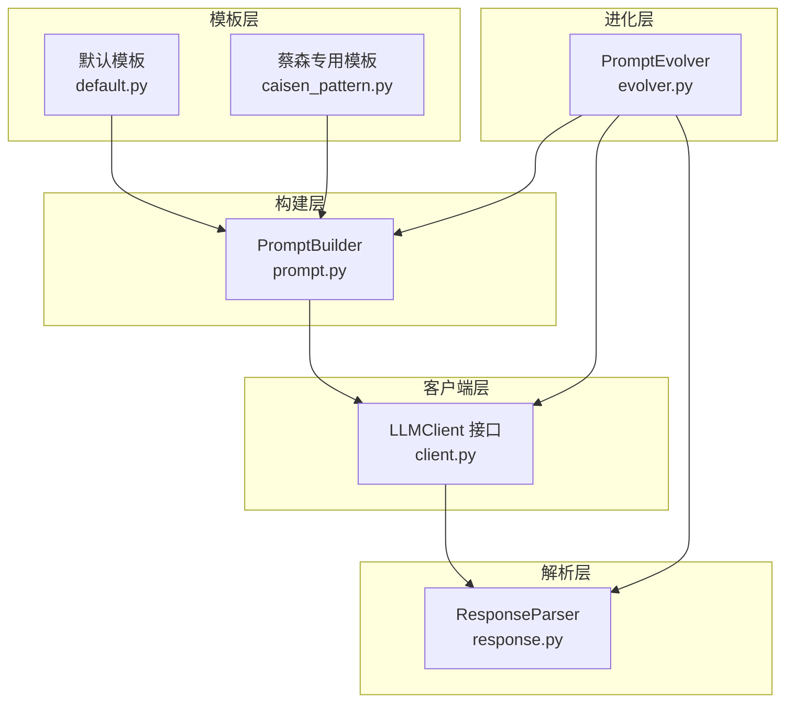
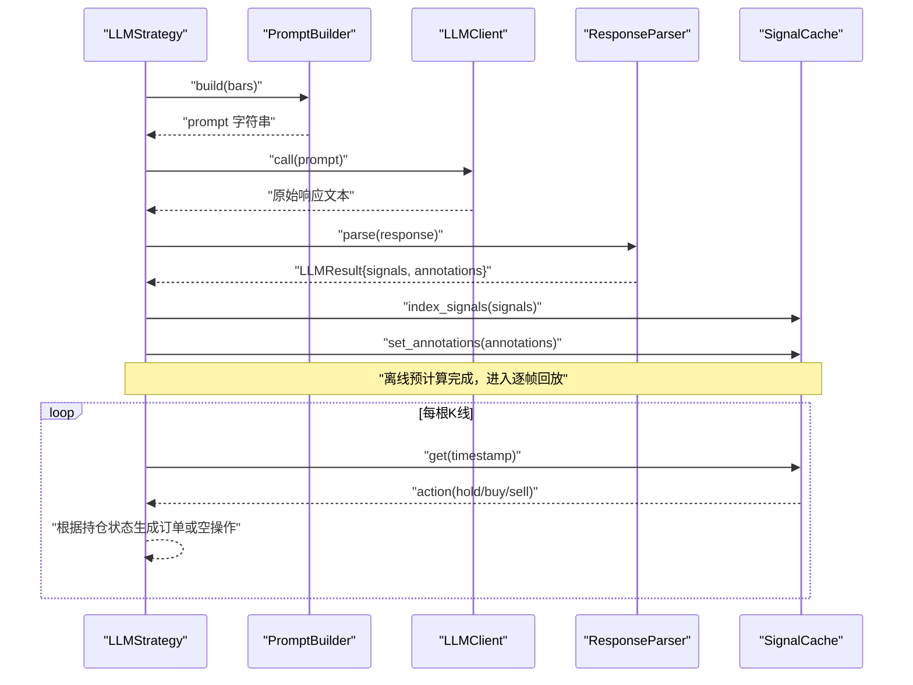
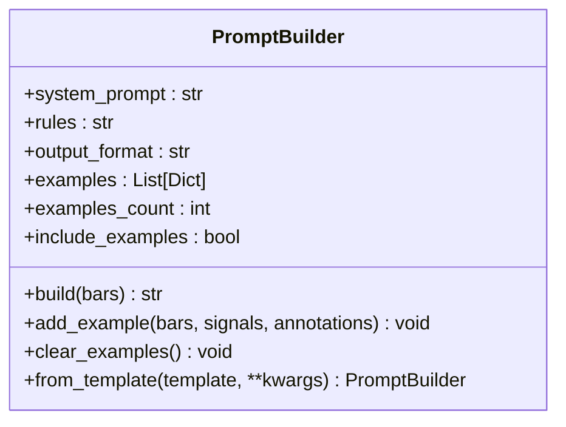
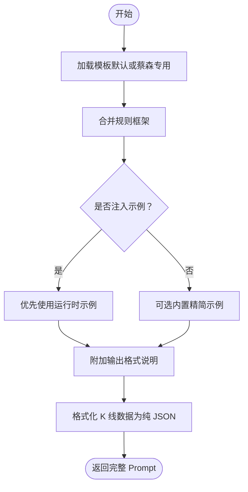
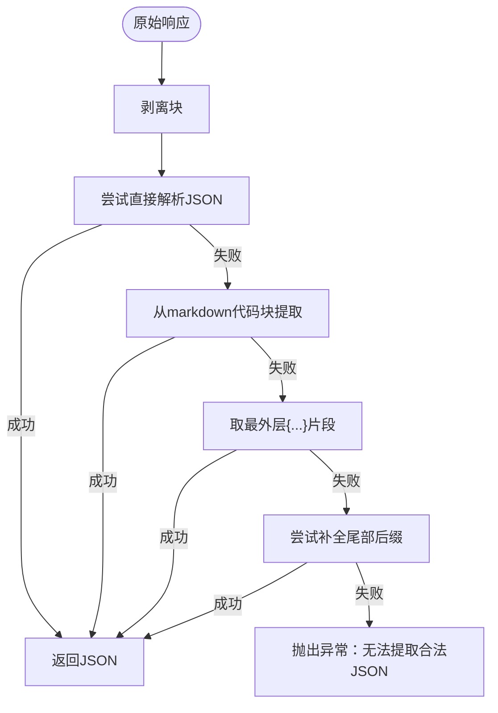
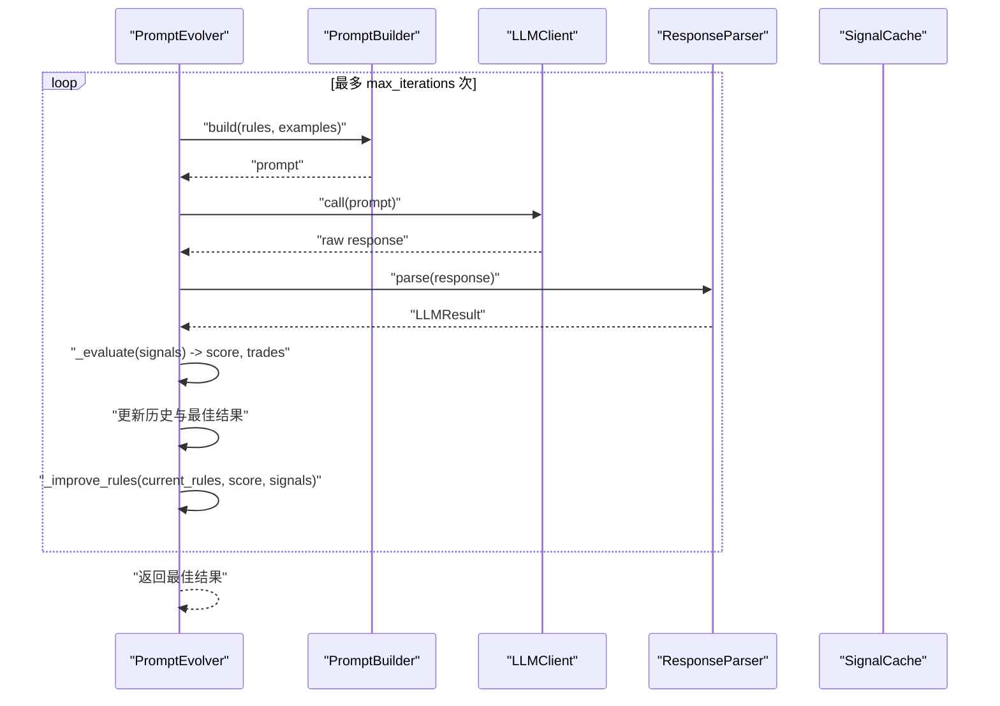
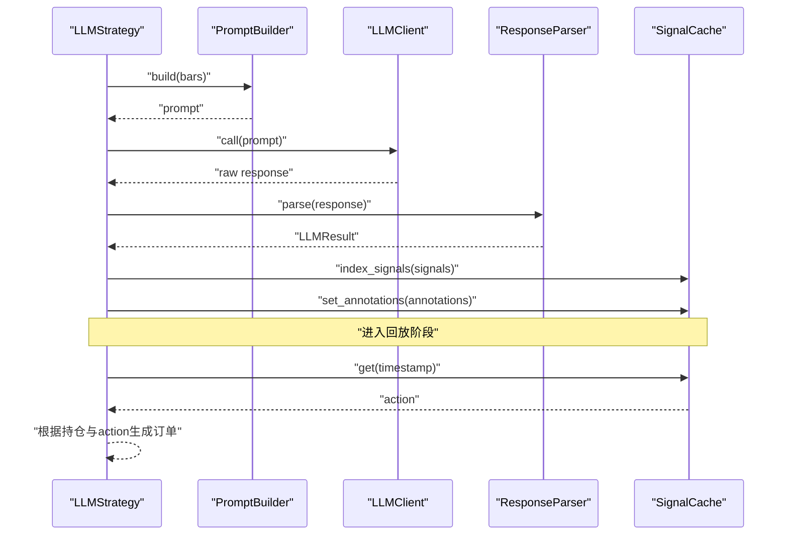
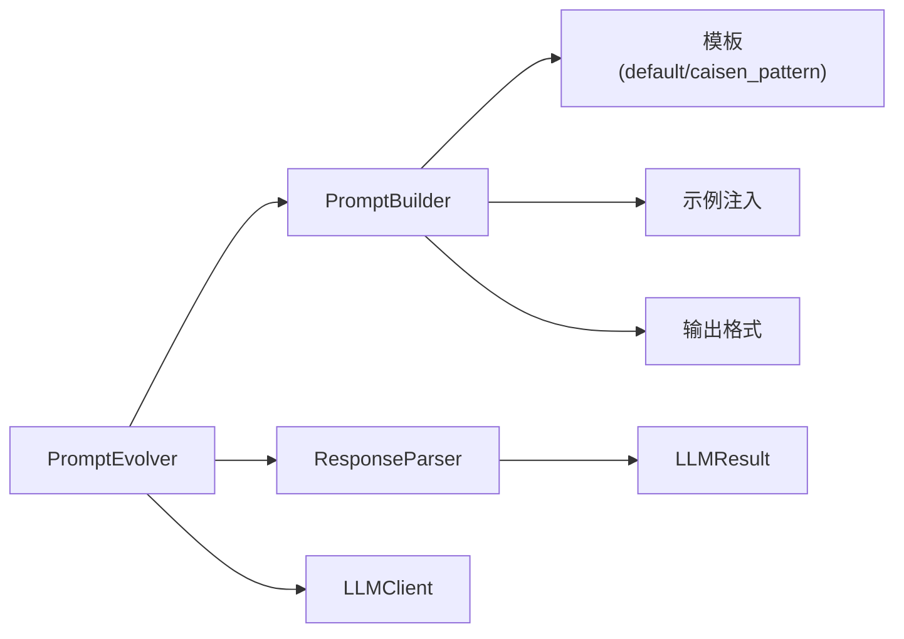

# Prompt 工程系统

<cite>
**本文引用的文件**   
- [prompt.py](file://src/caisen/strategy/llm/prompt.py)
- [default.py](file://src/caisen/strategy/llm/prompts/default.py)
- [caisen_pattern.py](file://src/caisen/strategy/llm/prompts/caisen_pattern.py)
- [__init__.py（llm）](file://src/caisen/strategy/llm/__init__.py)
- [client.py](file://src/caisen/strategy/llm/client.py)
- [response.py](file://src/caisen/strategy/llm/response.py)
- [evolver.py](file://src/caisen/strategy/llm/evolver.py)
- [test_prompt.py](file://tests/test_prompt.py)
- [test_prompt_builder.py](file://tests/test_prompt_builder.py)
- [test_llm_strategy.py](file://tests/test_llm_strategy.py)
- [config_llm_example.yaml](file://configs/strategies/config_llm_example.yaml)
</cite>

## 目录
1. [简介](#简介)
2. [项目结构](#项目结构)
3. [核心组件](#核心组件)
4. [架构总览](#架构总览)
5. [详细组件分析](#详细组件分析)
6. [依赖关系分析](#依赖关系分析)
7. [性能与成本优化](#性能与成本优化)
8. [故障排查指南](#故障排查指南)
9. [结论](#结论)
10. [附录：配置与最佳实践](#附录配置与最佳实践)

## 简介
本文件面向 Caisen 量化回测系统的 Prompt 工程子系统，聚焦于 PromptBuilder 的架构设计与构建流程，涵盖上下文信息收集、技术指标计算、历史数据格式化、交易规则模板系统与示例注入机制，并深入讲解动态参数替换、条件渲染、模板继承等高级特性。同时提供自定义 Prompt 模板开发指南、多模型适配策略与提示词优化技巧、Prompt 版本管理与 A/B 测试支持，以及完整配置示例与调试方法。

## 项目结构
Prompt 工程系统位于 LLM 策略模块中，采用“模板与逻辑分离”的设计：
- 模板层：默认模板与蔡森专用模板，定义系统提示、规则框架、输出格式与 Few-shot 示例。
- 构建层：PromptBuilder 负责组装上下文、指标、示例与 K 线数据，生成最终 Prompt。
- 解析层：ResponseParser 负责从 LLM 响应中提取 JSON 并进行校验。
- 客户端层：LLMClient 抽象不同提供商的统一调用接口。
- 进化层：PromptEvolver 基于评估反馈自动改进规则与示例，形成闭环优化。

图表来源
- [prompt.py:1-153](file://src/caisen/strategy/llm/prompt.py#L1-L153)
- [default.py:1-154](file://src/caisen/strategy/llm/prompts/default.py#L1-L154)
- [caisen_pattern.py:1-184](file://src/caisen/strategy/llm/prompts/caisen_pattern.py#L1-L184)
- [client.py:1-38](file://src/caisen/strategy/llm/client.py#L1-L38)
- [response.py:1-128](file://src/caisen/strategy/llm/response.py#L1-L128)
- [evolver.py:1-282](file://src/caisen/strategy/llm/evolver.py#L1-L282)

章节来源
- [__init__.py（llm）:1-19](file://src/caisen/strategy/llm/__init__.py#L1-L19)

## 核心组件
- PromptBuilder：组合系统提示、规则框架、Few-shot 示例、输出格式与实际 K 线数据，生成可直接发送给 LLM 的字符串。
- 模板系统：默认模板与蔡森专用模板，分别提供通用与专业场景的规则与输出规范。
- ResponseParser：健壮地提取 JSON，兼容推理模型的思考块与截断响应。
- LLMClient：统一调用接口，屏蔽不同提供商差异。
- PromptEvolver：以评分为反馈驱动，迭代改进规则与示例，实现 Prompt 自进化。

章节来源
- [prompt.py:15-153](file://src/caisen/strategy/llm/prompt.py#L15-L153)
- [default.py:100-154](file://src/caisen/strategy/llm/prompts/default.py#L100-L154)
- [caisen_pattern.py:13-184](file://src/caisen/strategy/llm/prompts/caisen_pattern.py#L13-L184)
- [response.py:79-128](file://src/caisen/strategy/llm/response.py#L79-L128)
- [client.py:21-38](file://src/caisen/strategy/llm/client.py#L21-L38)
- [evolver.py:24-282](file://src/caisen/strategy/llm/evolver.py#L24-L282)

## 架构总览
下图展示一次完整的“离线预计算 + 回放”工作流：在 on_init 阶段使用 PromptBuilder 构建 Prompt，调用 LLM 得到信号与标注，缓存后在 on_bar 回放时直接查表执行。

图表来源
- [prompt.py:54-116](file://src/caisen/strategy/llm/prompt.py#L54-L116)
- [client.py:21-38](file://src/caisen/strategy/llm/client.py#L21-L38)
- [response.py:88-113](file://src/caisen/strategy/llm/response.py#L88-L113)
- [test_llm_strategy.py:279-301](file://tests/test_llm_strategy.py#L279-L301)

## 详细组件分析

### PromptBuilder 类与构建流程
- 初始化参数
  - system_prompt：系统提示，默认来自蔡森专用模板。
  - rules：规则框架，默认来自蔡森专用模板。
  - examples：运行时注入的 Few-shot 示例列表，优先级最高。
  - include_examples：是否启用内置精简示例（建议仅在非推理模型时开启）。
- build 流程
  - 拼接系统提示与规则框架。
  - 注入示例（优先运行时注入，否则可选内置示例）。
  - 附加输出格式说明。
  - 将 K 线数据标准化为纯 JSON（避免 markdown 代码块），作为分析任务输入。
- 辅助方法
  - add_example/clear_examples：管理示例集合。
  - from_template：从模板字典创建实例，便于外部配置注入。

图表来源
- [prompt.py:15-153](file://src/caisen/strategy/llm/prompt.py#L15-L153)

章节来源
- [prompt.py:26-153](file://src/caisen/strategy/llm/prompt.py#L26-L153)
- [test_prompt.py:24-113](file://tests/test_prompt.py#L24-L113)
- [test_prompt_builder.py:9-129](file://tests/test_prompt_builder.py#L9-L129)

### 模板系统与示例注入机制
- 默认模板（default.py）
  - SYSTEM_PROMPT：通用角色设定。
  - RULES_FRAMEWORK：通用交易规则框架。
  - OUTPUT_FORMAT：严格 JSON 输出结构。
  - EXAMPLES_TEMPLATE：Few-shot 示例模板。
  - PromptTemplate：可组合模板对象，支持 to_dict/from_dict 序列化。
- 蔡森专用模板（caisen_pattern.py）
  - 强化量价结构与形态识别，明确买入/卖出判定与置信度分级。
  - 新增严格止损纪律与持仓管理规则。
- 示例注入
  - 运行时通过 add_example 注入示例，优先级高于内置示例。
  - include_examples 控制是否启用内置精简示例，避免推理模型因示例过多导致 token 消耗过大。

图表来源
- [default.py:100-154](file://src/caisen/strategy/llm/prompts/default.py#L100-L154)
- [caisen_pattern.py:13-184](file://src/caisen/strategy/llm/prompts/caisen_pattern.py#L13-L184)
- [prompt.py:54-116](file://src/caisen/strategy/llm/prompt.py#L54-L116)

章节来源
- [default.py:1-154](file://src/caisen/strategy/llm/prompts/default.py#L1-L154)
- [caisen_pattern.py:1-184](file://src/caisen/strategy/llm/prompts/caisen_pattern.py#L1-L184)
- [prompt.py:72-93](file://src/caisen/strategy/llm/prompt.py#L72-L93)

### 响应解析与健壮性处理
- 剥离推理模型思考块：支持 <think>...</think> 包裹的输出，若被截断则抛出明确错误。
- JSON 提取策略：
  - 直接解析纯 JSON。
  - 从 markdown 代码块中提取。
  - 降级到最外层 { ... } 片段。
  - 尝试补全常见截断后缀。
- 字段校验：确保每个 signal 包含 timestamp 与 action。

图表来源
- [response.py:10-77](file://src/caisen/strategy/llm/response.py#L10-L77)
- [response.py:88-128](file://src/caisen/strategy/llm/response.py#L88-L128)

章节来源
- [response.py:1-128](file://src/caisen/strategy/llm/response.py#L1-L128)

### Prompt 进化器（A/B 测试与版本管理）
- 目标：通过测试反馈自动优化 Prompt 规则与示例，提升评分。
- 流程：
  - 初始化基础 Prompt（可传入初始规则与示例）。
  - 运行测试，评估结果（简单模拟交易评分，考虑频率惩罚）。
  - 记录历史与最佳结果。
  - 根据评分调整规则（如减少频繁买入、增加止损约束等）。
  - 达到目标评分或最大迭代次数停止。
- 版本管理与 A/B 测试：
  - EvolutionResult 保存每次迭代的 prompt、score、trades 等信息。
  - get_history/save_results 支持导出与对比，便于 A/B 测试与回归验证。

图表来源
- [evolver.py:60-119](file://src/caisen/strategy/llm/evolver.py#L60-L119)
- [evolver.py:121-219](file://src/caisen/strategy/llm/evolver.py#L121-L219)
- [evolver.py:250-282](file://src/caisen/strategy/llm/evolver.py#L250-L282)

章节来源
- [evolver.py:1-282](file://src/caisen/strategy/llm/evolver.py#L1-L282)
- [test_prompt_evolver.py:27-156](file://tests/test_prompt_evolver.py#L27-L156)

### 与 LLM 策略的集成（离线预计算 + 回放）
- analyze：组合 PromptBuilder、LLMClient、ResponseParser，完成离线分析并返回 signals 与 annotations。
- on_bar：在回放阶段根据缓存的信号与当前持仓状态生成订单或空操作。
- 标注：首次 on_bar 时发出 BarResult.annotations，后续为空。

图表来源
- [test_llm_strategy.py:279-301](file://tests/test_llm_strategy.py#L279-L301)
- [test_llm_strategy.py:68-186](file://tests/test_llm_strategy.py#L68-L186)
- [test_llm_strategy.py:213-277](file://tests/test_llm_strategy.py#L213-L277)

章节来源
- [test_llm_strategy.py:1-301](file://tests/test_llm_strategy.py#L1-L301)

## 依赖关系分析
- 模块内耦合
  - PromptBuilder 依赖模板常量与示例模板。
  - ResponseParser 依赖 LLMResult 数据结构。
  - PromptEvolver 依赖 PromptBuilder、LLMClient、ResponseParser。
- 外部依赖
  - LLMClient 抽象不同提供商（OpenAIProvider 等）的具体实现。
  - 配置文件（YAML）用于注入 provider、model、temperature、rules、examples 等。

图表来源
- [prompt.py:1-153](file://src/caisen/strategy/llm/prompt.py#L1-L153)
- [response.py:1-128](file://src/caisen/strategy/llm/response.py#L1-L128)
- [evolver.py:1-282](file://src/caisen/strategy/llm/evolver.py#L1-L282)
- [client.py:1-38](file://src/caisen/strategy/llm/client.py#L1-L38)

章节来源
- [__init__.py（llm）:1-19](file://src/caisen/strategy/llm/__init__.py#L1-L19)

## 性能与成本优化
- 控制示例数量：对推理模型建议关闭内置示例或仅少量注入，避免 thinking token 过多导致响应截断。
- 数据压缩：K 线数据尽量精简必要字段，避免冗余信息。
- 缓存命中：离线预计算后回放，显著降低重复调用成本。
- 温度与采样：降低 temperature 提高稳定性；必要时结合 top_p 控制多样性。
- 超时与重试：对网络波动设置合理超时与重试策略。
- 批量与批处理：在允许的情况下合并请求以降低开销。

## 故障排查指南
- 响应被截断
  - 现象：出现 <think> 未闭合或 JSON 不完整。
  - 处理：检查模型 max_tokens 设置，减少 K 线数量或关闭示例。
- JSON 提取失败
  - 现象：无法从响应中提取合法 JSON。
  - 处理：查看原始响应前 200 字符，确认输出格式是否符合要求。
- 缺少必需字段
  - 现象：signal 缺少 timestamp 或 action。
  - 处理：修正输出格式说明与示例，确保每条 signal 包含必需字段。
- 过度交易
  - 现象：交易频率过高导致评分下降。
  - 处理：在规则中加入更严格的入场条件与止损约束，或在进化器中增加频率惩罚。

章节来源
- [response.py:10-77](file://src/caisen/strategy/llm/response.py#L10-L77)
- [response.py:88-113](file://src/caisen/strategy/llm/response.py#L88-L113)
- [evolver.py:170-179](file://src/caisen/strategy/llm/evolver.py#L170-L179)

## 结论
Prompt 工程系统通过模板化与构建器模式实现了高度可配置的提示词生产流程，结合健壮响应解析与自动化进化能力，形成了从设计、构建、解析到优化的完整闭环。该体系既适用于通用交易场景，也支持蔡森专用的高精度形态识别与严格风控规则，具备良好的扩展性与可维护性。

## 附录：配置与最佳实践

### 配置示例
- LLM 策略配置（YAML）
  - 指定 provider、model、temperature、rules、examples、cache 等关键项。
  - 支持环境变量注入 API Key。

章节来源
- [config_llm_example.yaml:1-40](file://configs/strategies/config_llm_example.yaml#L1-L40)

### 自定义 Prompt 模板开发指南
- 新建模板文件
  - 定义 SYSTEM_PROMPT、RULES_FRAMEWORK、OUTPUT_FORMAT、EXAMPLES_TEMPLATE。
  - 如需组合，使用 PromptTemplate 进行 to_dict/from_dict 序列化。
- 注入到 PromptBuilder
  - 通过 from_template 或直接构造参数覆盖默认模板。
- 示例注入
  - 使用 add_example 添加高质量 Few-shot 示例，注意示例需符合输出格式。
- 条件渲染
  - 在 build 流程中按条件决定是否注入示例或特定规则段落。
- 模板继承
  - 基于默认模板扩展，保留通用部分，仅覆盖差异化内容。

章节来源
- [default.py:100-154](file://src/caisen/strategy/llm/prompts/default.py#L100-L154)
- [prompt.py:136-153](file://src/caisen/strategy/llm/prompt.py#L136-L153)

### 多模型适配策略与提示词优化技巧
- 模型选择
  - 推理模型：关闭示例或仅少量注入，降低 thinking token。
  - 非推理模型：可适当增加示例以提升一致性。
- 提示词优化
  - 明确输出格式与优先级，减少歧义。
  - 在规则中加入硬性约束（如禁止行为、止损纪律）。
  - 使用结构化 reason 字段，便于后续分析与回溯。
- 参数调优
  - temperature 低值提升稳定性；top_p 控制多样性。
  - 针对长序列数据，分批或滑动窗口处理。

章节来源
- [prompt.py:47-52](file://src/caisen/strategy/llm/prompt.py#L47-L52)
- [caisen_pattern.py:105-158](file://src/caisen/strategy/llm/prompts/caisen_pattern.py#L105-L158)

### Prompt 版本管理与 A/B 测试支持
- 版本管理
  - 使用 PromptTemplate.to_dict 保存模板快照。
  - 在 evolver 历史中记录每次迭代的 prompt 与评分。
- A/B 测试
  - 并行运行不同规则/示例组合，比较评分与交易统计。
  - 使用 save_results 导出结果，进行回归验证与可视化对比。

章节来源
- [evolver.py:231-248](file://src/caisen/strategy/llm/evolver.py#L231-L248)
- [default.py:125-142](file://src/caisen/strategy/llm/prompts/default.py#L125-L142)

### 调试方法
- 打印 Prompt 长度与内容，验证是否包含预期字段。
- 单独运行 ResponseParser.parse_raw 查看原始 JSON。
- 使用 MockLLMClient 固定响应，隔离外部依赖。
- 逐步缩小 K 线数量，定位过长序列导致的截断问题。

章节来源
- [test_prompt.py:24-113](file://tests/test_prompt.py#L24-L113)
- [test_prompt_builder.py:9-129](file://tests/test_prompt_builder.py#L9-L129)
- [test_llm_strategy.py:15-29](file://tests/test_llm_strategy.py#L15-L29)