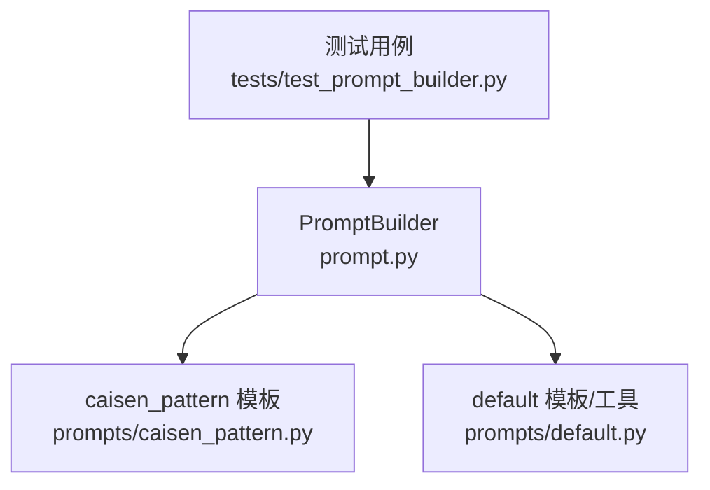
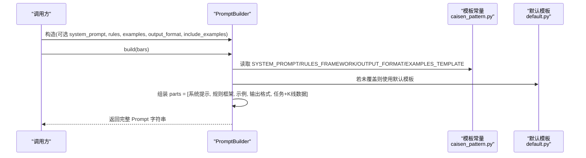
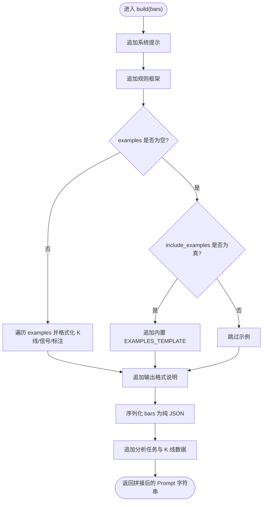
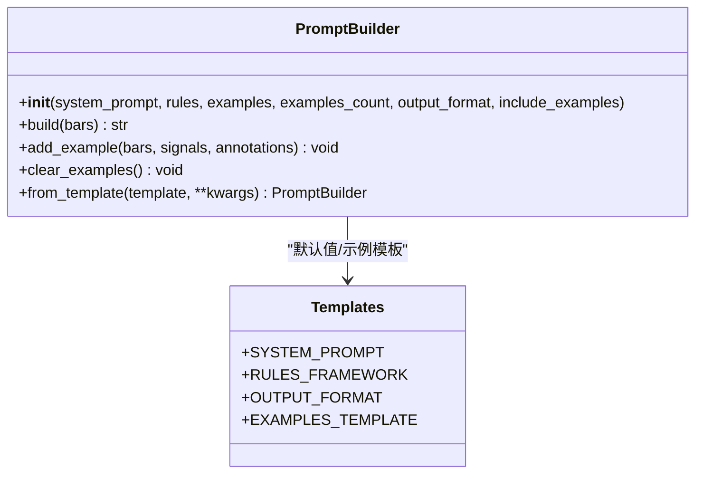

# PromptBuilder 核心类

<cite>
**本文引用的文件**
- [src/caisen/strategy/llm/prompt.py](file://src/caisen/strategy/llm/prompt.py)
- [src/caisen/strategy/llm/prompts/caisen_pattern.py](file://src/caisen/strategy/llm/prompts/caisen_pattern.py)
- [src/caisen/strategy/llm/prompts/default.py](file://src/caisen/strategy/llm/prompts/default.py)
- [tests/test_prompt_builder.py](file://tests/test_prompt_builder.py)
</cite>

## 目录
1. [简介](#简介)
2. [项目结构](#项目结构)
3. [核心组件](#核心组件)
4. [架构总览](#架构总览)
5. [详细组件分析](#详细组件分析)
6. [依赖关系分析](#依赖关系分析)
7. [性能与使用建议](#性能与使用建议)
8. [故障排查指南](#故障排查指南)
9. [结论](#结论)
10. [附录：使用示例与最佳实践](#附录使用示例与最佳实践)

## 简介
PromptBuilder 是 LLM 策略模块中的提示词构建器，负责将系统提示、规则框架、Few-shot 示例、输出格式说明以及 K 线数据组装为最终可发送给大模型的 Prompt。它默认采用蔡森专用模板，同时支持通过构造参数或工厂方法 from_template() 进行自定义覆盖。

## 项目结构
围绕 PromptBuilder 的相关代码组织如下：
- 构建器实现位于 prompt.py
- 默认模板（蔡森专用）位于 prompts/caisen_pattern.py
- 通用默认模板与 PromptTemplate 工具位于 prompts/default.py
- 行为验证用例位于 tests/test_prompt_builder.py

图表来源
- [src/caisen/strategy/llm/prompt.py:15-153](file://src/caisen/strategy/llm/prompt.py#L15-L153)
- [src/caisen/strategy/llm/prompts/caisen_pattern.py:1-184](file://src/caisen/strategy/llm/prompts/caisen_pattern.py#L1-L184)
- [src/caisen/strategy/llm/prompts/default.py:1-154](file://src/caisen/strategy/llm/prompts/default.py#L1-L154)
- [tests/test_prompt_builder.py:1-129](file://tests/test_prompt_builder.py#L1-L129)

章节来源
- [src/caisen/strategy/llm/prompt.py:15-153](file://src/caisen/strategy/llm/prompt.py#L15-L153)
- [src/caisen/strategy/llm/prompts/caisen_pattern.py:1-184](file://src/caisen/strategy/llm/prompts/caisen_pattern.py#L1-L184)
- [src/caisen/strategy/llm/prompts/default.py:1-154](file://src/caisen/strategy/llm/prompts/default.py#L1-L154)
- [tests/test_prompt_builder.py:1-129](file://tests/test_prompt_builder.py#L1-L129)

## 核心组件
- PromptBuilder：负责初始化配置、构建完整 Prompt、管理 Few-shot 示例、从模板创建实例。
- 模板常量：SYSTEM_PROMPT、RULES_FRAMEWORK、OUTPUT_FORMAT、EXAMPLES_TEMPLATE 等定义在 caisen_pattern.py；default.py 提供通用默认模板与 PromptTemplate 工具。

章节来源
- [src/caisen/strategy/llm/prompt.py:15-153](file://src/caisen/strategy/llm/prompt.py#L15-L153)
- [src/caisen/strategy/llm/prompts/caisen_pattern.py:13-184](file://src/caisen/strategy/llm/prompts/caisen_pattern.py#L13-L184)
- [src/caisen/strategy/llm/prompts/default.py:10-154](file://src/caisen/strategy/llm/prompts/default.py#L10-L154)

## 架构总览
PromptBuilder 的构建流程遵循“系统提示 → 规则框架 → 示例处理 → 输出格式 → 任务与数据”的顺序，最终拼接为字符串返回。

图表来源
- [src/caisen/strategy/llm/prompt.py:54-116](file://src/caisen/strategy/llm/prompt.py#L54-L116)
- [src/caisen/strategy/llm/prompts/caisen_pattern.py:13-184](file://src/caisen/strategy/llm/prompts/caisen_pattern.py#L13-L184)
- [src/caisen/strategy/llm/prompts/default.py:10-154](file://src/caisen/strategy/llm/prompts/default.py#L10-L154)

## 详细组件分析

### 初始化参数与默认值
- system_prompt：系统提示文本。若未传入，则回退到蔡森专用模板中的 SYSTEM_PROMPT。
- rules：规则框架文本。若未传入，则回退到 RULES_FRAMEWORK。
- examples：运行时注入的 Few-shot 示例列表，优先级最高。
- examples_count：保留兼容字段，当前未被 build 逻辑使用。
- output_format：输出格式说明。若未传入，则回退到 OUTPUT_FORMAT。
- include_examples：是否注入内置精简示例（来自 EXAMPLES_TEMPLATE）。默认 False，推理模型下建议关闭以避免过多 thinking token 导致响应截断。

章节来源
- [src/caisen/strategy/llm/prompt.py:26-52](file://src/caisen/strategy/llm/prompt.py#L26-L52)
- [src/caisen/strategy/llm/prompts/caisen_pattern.py:13-184](file://src/caisen/strategy/llm/prompts/caisen_pattern.py#L13-L184)

### build() 构建流程
build(bars) 的核心步骤：
1. 系统提示：追加 self.system_prompt。
2. 规则框架：追加 f"\n{self.rules}\n"。
3. Few-shot 示例：
   - 若 self.examples 非空：遍历每个示例，格式化 bars、signals、annotations，并追加到 parts。
   - 否则，若 include_examples 为 True：追加内置 EXAMPLES_TEMPLATE。
4. 输出格式说明：追加 f"\n{self.output_format}\n"。
5. 实际 K 线数据：
   - 对 bars 做统一序列化：优先 to_dict()，其次 dict，最后按 Bar 对象属性补齐 timestamp/open/high/low/close/volume。
   - 追加“分析任务”段落与 JSON 化的 bars 数据。
6. 以换行符拼接所有 parts 并返回。

图表来源
- [src/caisen/strategy/llm/prompt.py:54-116](file://src/caisen/strategy/llm/prompt.py#L54-L116)

章节来源
- [src/caisen/strategy/llm/prompt.py:54-116](file://src/caisen/strategy/llm/prompt.py#L54-L116)

### add_example() 与 clear_examples()
- add_example(bars, signals, annotations=None)：向内部 examples 列表追加一个示例条目，包含 bars、signals、annotations。适合在运行期动态注入高质量示例以提升模型表现。
- clear_examples()：清空已注入的所有示例，恢复为空状态。适合复用同一 builder 实例时重置上下文。

最佳实践
- 在批量构建前，先 clear_examples() 避免历史示例污染。
- 根据场景选择少量高代表性示例，避免过长导致 token 浪费。
- 示例中的 bars 可为字典或带 to_dict() 的对象，signals/annotations 需与输出格式一致。

章节来源
- [src/caisen/strategy/llm/prompt.py:118-134](file://src/caisen/strategy/llm/prompt.py#L118-L134)
- [tests/test_prompt_builder.py:91-129](file://tests/test_prompt_builder.py#L91-L129)

### from_template() 工厂方法
from_template(template=None, **kwargs)：
- 当 template 存在时，从中提取 system_prompt、rules、output_format、examples、examples_count 并传入构造函数，同时合并其他 kwargs。
- 当 template 为空时，等价于直接调用构造函数并透传 kwargs。

适用场景
- 集中化管理模板配置（如从 YAML/JSON 加载），再一次性构建 PromptBuilder。
- 在不改变业务代码的情况下切换不同模板集。

章节来源
- [src/caisen/strategy/llm/prompt.py:136-153](file://src/caisen/strategy/llm/prompt.py#L136-L153)

### 模板与默认行为
- 默认模板（蔡森专用）：
  - SYSTEM_PROMPT：角色设定与交易理念、纪律。
  - RULES_FRAMEWORK：买入/卖出判定、持仓管理与置信度分级。
  - OUTPUT_FORMAT：严格 JSON 结构与 reason 三要素要求。
  - EXAMPLES_TEMPLATE：内置 4 个精简示例，用于演示 reason 格式与信号类型。
- default.py 提供通用默认模板与 PromptTemplate 工具类，便于扩展与组合。

章节来源
- [src/caisen/strategy/llm/prompts/caisen_pattern.py:13-184](file://src/caisen/strategy/llm/prompts/caisen_pattern.py#L13-L184)
- [src/caisen/strategy/llm/prompts/default.py:10-154](file://src/caisen/strategy/llm/prompts/default.py#L10-L154)

## 依赖关系分析
- PromptBuilder 依赖 caisen_pattern 模板常量作为默认值。
- 当未显式覆盖时，system_prompt/rules/output_format 均回退至 caisen_pattern 中的对应常量。
- include_examples=True 时，会引入 EXAMPLES_TEMPLATE。
- 测试用例覆盖了基础构建、包含 K 线数据、包含输出格式、few-shot 示例、规则框架、空示例等关键路径。

图表来源
- [src/caisen/strategy/llm/prompt.py:15-153](file://src/caisen/strategy/llm/prompt.py#L15-L153)
- [src/caisen/strategy/llm/prompts/caisen_pattern.py:13-184](file://src/caisen/strategy/llm/prompts/caisen_pattern.py#L13-L184)

章节来源
- [src/caisen/strategy/llm/prompt.py:15-153](file://src/caisen/strategy/llm/prompt.py#L15-L153)
- [src/caisen/strategy/llm/prompts/caisen_pattern.py:13-184](file://src/caisen/strategy/llm/prompts/caisen_pattern.py#L13-L184)
- [tests/test_prompt_builder.py:1-129](file://tests/test_prompt_builder.py#L1-L129)

## 性能与使用建议
- 控制示例数量：Few-shot 示例会增加 token 消耗，建议在非推理模型或明确需要时开启 include_examples，或使用 add_example() 精准注入少量示例。
- 避免冗余信息：示例中仅保留必要字段，减少不必要的标注与描述。
- 复用 builder 实例：在循环构建多个 Prompt 时，先 clear_examples() 再按需 add_example()，避免重复累积。
- 数据序列化：bars 尽量提供 to_dict() 或标准 dict，以减少分支判断开销。

[本节为通用建议，不直接分析具体文件]

## 故障排查指南
常见问题与定位要点：
- 输出不包含 K 线数据：检查传入的 bars 是否为空或字段缺失。build 会将 bars 序列化为 JSON，确保 timestamp/open/high/low/close/volume 至少具备 timestamp 与 close。
- 输出不包含示例：确认 examples 是否为空且 include_examples 是否为 False。
- 输出格式不符合预期：检查 output_format 是否被覆盖，或示例中的 signals/annotations 是否与输出格式一致。
- 推理模型响应截断：考虑关闭 include_examples 或减少示例长度。

章节来源
- [tests/test_prompt_builder.py:9-89](file://tests/test_prompt_builder.py#L9-L89)
- [src/caisen/strategy/llm/prompt.py:54-116](file://src/caisen/strategy/llm/prompt.py#L54-L116)

## 结论
PromptBuilder 提供了灵活而稳定的 Prompt 构建能力：默认采用蔡森专用模板，支持运行时注入示例与模板覆盖，并通过清晰的构建流程保证输出的一致性与可解析性。配合 from_template() 可实现模板化配置管理，满足多种业务场景需求。

[本节为总结性内容，不直接分析具体文件]

## 附录：使用示例与最佳实践

- 基础用法
  - 使用默认模板构建 Prompt，传入 K 线数据即可。
  - 参考：[tests/test_prompt_builder.py:9-20](file://tests/test_prompt_builder.py#L9-L20)

- 自定义模板
  - 通过构造参数覆盖 system_prompt、rules、output_format。
  - 或通过 from_template() 传入模板字典。
  - 参考：[src/caisen/strategy/llm/prompt.py:136-153](file://src/caisen/strategy/llm/prompt.py#L136-L153)

- 动态示例注入
  - 使用 add_example() 在运行期添加示例，提升模型理解与稳定性。
  - 使用 clear_examples() 清理历史示例，避免污染。
  - 参考：[src/caisen/strategy/llm/prompt.py:118-134](file://src/caisen/strategy/llm/prompt.py#L118-L134), [tests/test_prompt_builder.py:91-129](file://tests/test_prompt_builder.py#L91-L129)

- 包含输出格式与 K 线数据
  - 确保输出中包含 signals 与 annotations 字段，K 线数据以纯 JSON 形式附加。
  - 参考：[tests/test_prompt_builder.py:21-44](file://tests/test_prompt_builder.py#L21-L44)

- 规则框架生效
  - 自定义 rules 后，构建的 Prompt 应包含相应规则关键词。
  - 参考：[tests/test_prompt_builder.py:65-78](file://tests/test_prompt_builder.py#L65-L78)