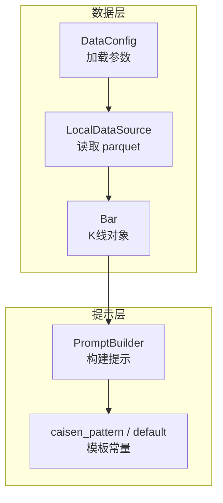
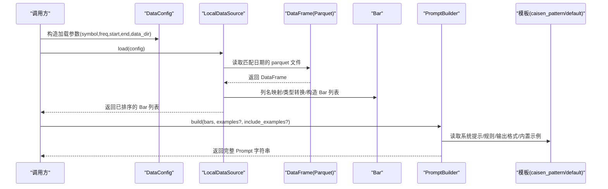
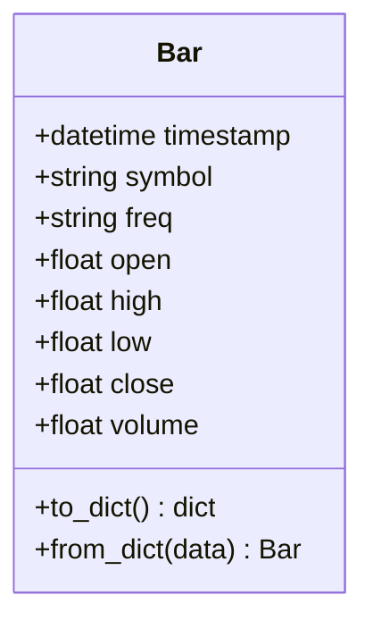
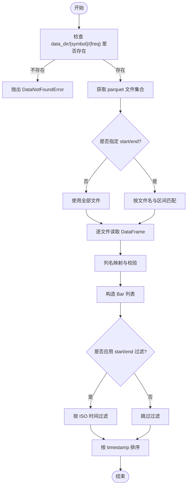
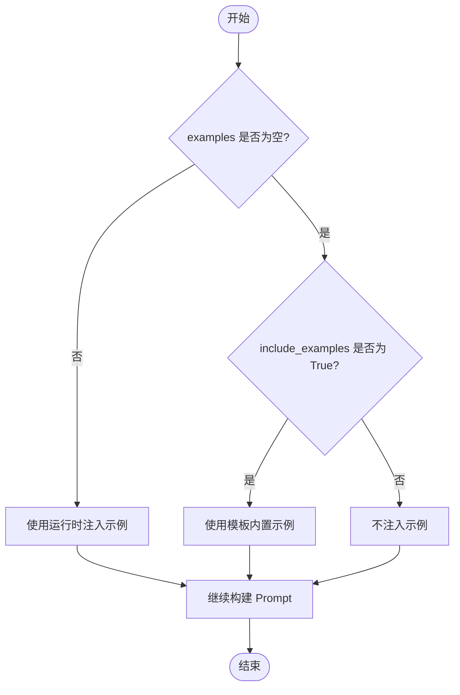
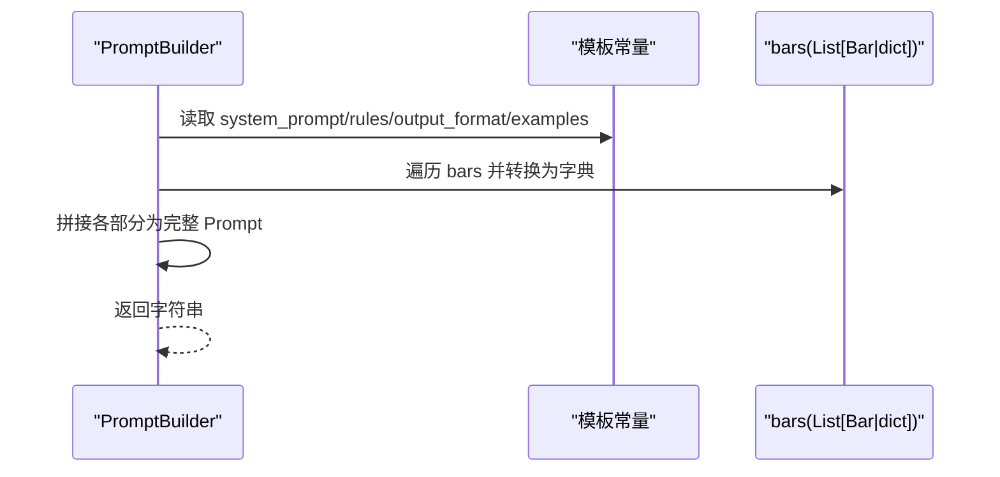

# 上下文数据处理

<cite>
**本文引用的文件**   
- [src/caisen/core/bar.py](file://src/caisen/core/bar.py)
- [src/caisen/data/source.py](file://src/caisen/data/source.py)
- [src/caisen/data/local_source.py](file://src/caisen/data/local_source.py)
- [src/caisen/data/config.py](file://src/caisen/data/config.py)
- [src/caisen/data/exceptions.py](file://src/caisen/data/exceptions.py)
- [src/caisen/strategy/llm/prompt.py](file://src/caisen/strategy/llm/prompt.py)
- [src/caisen/strategy/llm/prompts/caisen_pattern.py](file://src/caisen/strategy/llm/prompts/caisen_pattern.py)
- [src/caisen/strategy/llm/prompts/default.py](file://src/caisen/strategy/llm/prompts/default.py)
- [docs/adr/0002-parquet-data-storage.md](file://docs/adr/0002-parquet-data-storage.md)
</cite>

## 目录
1. [引言](#引言)
2. [项目结构](#项目结构)
3. [核心组件](#核心组件)
4. [架构总览](#架构总览)
5. [详细组件分析](#详细组件分析)
6. [依赖关系分析](#依赖关系分析)
7. [性能考虑](#性能考虑)
8. [故障排查指南](#故障排查指南)
9. [结论](#结论)
10. [附录](#附录)

## 引言
本文件聚焦 Prompt 工程系统中的“上下文数据处理机制”，围绕 K 线数据的预处理、示例数据注入策略、数据验证与清洗、以及大数据量处理优化展开。目标读者包括策略开发者、Prompt 工程师与数据平台维护者，旨在帮助理解从原始数据到 LLM 提示词构建的完整链路，并提供可操作的调优建议。

## 项目结构
与上下文数据处理相关的代码主要分布在以下模块：
- 核心数据结构：Bar（K 线对象）
- 数据源协议与本地实现：DataSource/LocalDataSource
- 数据加载配置：DataConfig
- 异常体系：DataLoadError 及其子类
- Prompt 构建器与模板：PromptBuilder、caisen_pattern、default

图表来源
- [src/caisen/data/config.py:1-51](file://src/caisen/data/config.py#L1-L51)
- [src/caisen/data/local_source.py:1-199](file://src/caisen/data/local_source.py#L1-L199)
- [src/caisen/core/bar.py:1-38](file://src/caisen/core/bar.py#L1-L38)
- [src/caisen/strategy/llm/prompt.py:1-153](file://src/caisen/strategy/llm/prompt.py#L1-L153)
- [src/caisen/strategy/llm/prompts/caisen_pattern.py:1-184](file://src/caisen/strategy/llm/prompts/caisen_pattern.py#L1-L184)
- [src/caisen/strategy/llm/prompts/default.py:1-154](file://src/caisen/strategy/llm/prompts/default.py#L1-L154)

章节来源
- [src/caisen/data/config.py:1-51](file://src/caisen/data/config.py#L1-L51)
- [src/caisen/data/local_source.py:1-199](file://src/caisen/data/local_source.py#L1-L199)
- [src/caisen/core/bar.py:1-38](file://src/caisen/core/bar.py#L1-L38)
- [src/caisen/strategy/llm/prompt.py:1-153](file://src/caisen/strategy/llm/prompt.py#L1-L153)
- [src/caisen/strategy/llm/prompts/caisen_pattern.py:1-184](file://src/caisen/strategy/llm/prompts/caisen_pattern.py#L1-L184)
- [src/caisen/strategy/llm/prompts/default.py:1-154](file://src/caisen/strategy/llm/prompts/default.py#L1-L154)

## 核心组件
- Bar：K 线数据模型，提供 to_dict/from_dict 序列化/反序列化能力，时间戳使用 ISO 格式字符串进行持久化与传输。
- DataConfig：数据加载配置，包含 symbol、freq、start、end、data_dir，并校验 freq 是否在支持列表内。
- DataSource/LocalDataSource：数据源协议与本地 Parquet 实现，负责按日期分区读取、列名映射、时间范围过滤与排序。
- PromptBuilder：将 Bar 序列化为 JSON 片段，组装系统提示、规则框架、Few-shot 示例与输出格式说明，生成最终提示文本。
- 模板常量：caisen_pattern 与 default 提供不同场景下的系统提示、规则与示例模板。

章节来源
- [src/caisen/core/bar.py:1-38](file://src/caisen/core/bar.py#L1-L38)
- [src/caisen/data/config.py:1-51](file://src/caisen/data/config.py#L1-L51)
- [src/caisen/data/source.py:1-62](file://src/caisen/data/source.py#L1-L62)
- [src/caisen/data/local_source.py:1-199](file://src/caisen/data/local_source.py#L1-L199)
- [src/caisen/strategy/llm/prompt.py:1-153](file://src/caisen/strategy/llm/prompt.py#L1-L153)
- [src/caisen/strategy/llm/prompts/caisen_pattern.py:1-184](file://src/caisen/strategy/llm/prompts/caisen_pattern.py#L1-L184)
- [src/caisen/strategy/llm/prompts/default.py:1-154](file://src/caisen/strategy/llm/prompts/default.py#L1-L154)

## 架构总览
下图展示了从数据加载到提示构建的关键流程：配置驱动的数据源读取、Parquet 解析为 Bar、Bar 转字典、示例选择与注入、最终拼接为 Prompt。

图表来源
- [src/caisen/data/config.py:1-51](file://src/caisen/data/config.py#L1-L51)
- [src/caisen/data/local_source.py:1-199](file://src/caisen/data/local_source.py#L1-L199)
- [src/caisen/core/bar.py:1-38](file://src/caisen/core/bar.py#L1-L38)
- [src/caisen/strategy/llm/prompt.py:1-153](file://src/caisen/strategy/llm/prompt.py#L1-L153)
- [src/caisen/strategy/llm/prompts/caisen_pattern.py:1-184](file://src/caisen/strategy/llm/prompts/caisen_pattern.py#L1-L184)
- [src/caisen/strategy/llm/prompts/default.py:1-154](file://src/caisen/strategy/llm/prompts/default.py#L1-L154)

## 详细组件分析

### Bar 对象与字典转换
- 字段与时序：timestamp 使用 datetime；to_dict 将其转为 ISO 字符串；from_dict 支持从 ISO 字符串恢复。
- 数值精度：Bar 的 open/high/low/close/volume 均为 float，未做显式四舍五入或截断；如需控制精度，建议在外部序列化前对数值进行处理。
- 兼容性：to_dict/from_dict 保证与 JSON 互操作，便于在 Prompt 中以纯 JSON 形式嵌入。

图表来源
- [src/caisen/core/bar.py:1-38](file://src/caisen/core/bar.py#L1-L38)

章节来源
- [src/caisen/core/bar.py:1-38](file://src/caisen/core/bar.py#L1-L38)

### 数据源协议与本地实现
- 协议定义：DataSource 定义了 load(name, config) -> List[Bar] 与 name 属性；BaseDataSource 提供默认 name 实现。
- 本地实现要点：
  - 路径组织：{data_dir}/{symbol}/{freq}，按日期分区存储 parquet。
  - 文件匹配：支持单日期文件名与起止日期文件名两种模式，并与查询区间求交集。
  - 列名映射：兼容中英文列名，缺失必填列时抛出 DataValidationError。
  - 时间过滤：若配置了 start/end，则在内存中按 ISO 字符串解析后进行过滤。
  - 结果排序：按 timestamp 升序返回。

图表来源
- [src/caisen/data/local_source.py:1-199](file://src/caisen/data/local_source.py#L1-L199)
- [src/caisen/data/config.py:1-51](file://src/caisen/data/config.py#L1-L51)
- [docs/adr/0002-parquet-data-storage.md:1-11](file://docs/adr/0002-parquet-data-storage.md#L1-L11)

章节来源
- [src/caisen/data/source.py:1-62](file://src/caisen/data/source.py#L1-L62)
- [src/caisen/data/local_source.py:1-199](file://src/caisen/data/local_source.py#L1-L199)
- [src/caisen/data/config.py:1-51](file://src/caisen/data/config.py#L1-L51)
- [docs/adr/0002-parquet-data-storage.md:1-11](file://docs/adr/0002-parquet-data-storage.md#L1-L11)

### 数据验证与清洗机制
- 配置校验：DataConfig.__post_init__ 校验 freq 是否在 SUPPORTED_FREQS 内，否则抛出 ValueError。
- 列完整性校验：LocalDataSource._dataframe_to_bars 检查必需列是否存在，缺失则抛出 DataValidationError。
- 类型规范化：timestamp 若非 datetime 则转换为 Python datetime；价格与成交量统一为 float。
- 时间范围过滤：根据配置的 start/end 进行二次过滤，确保输入一致性。

章节来源
- [src/caisen/data/config.py:1-51](file://src/caisen/data/config.py#L1-L51)
- [src/caisen/data/local_source.py:1-199](file://src/caisen/data/local_source.py#L1-L199)
- [src/caisen/data/exceptions.py:1-47](file://src/caisen/data/exceptions.py#L1-L47)

### 示例数据的选择与注入策略
- 运行时注入优先：若 PromptBuilder.examples 非空，则优先使用运行时注入的示例。
- 内置示例可选：当 examples 为空且 include_examples=True 时，才注入模板中的 EXAMPLES_TEMPLATE。
- 示例内容构造：示例 bars 支持 Bar 对象或字典，内部会统一转换为字典；信号与标注以 JSON 形式拼接。
- 模板差异：caisen_pattern 提供更严格的蔡森形态规则与示例；default 提供通用模板。

图表来源
- [src/caisen/strategy/llm/prompt.py:1-153](file://src/caisen/strategy/llm/prompt.py#L1-L153)
- [src/caisen/strategy/llm/prompts/caisen_pattern.py:1-184](file://src/caisen/strategy/llm/prompts/caisen_pattern.py#L1-L184)
- [src/caisen/strategy/llm/prompts/default.py:1-154](file://src/caisen/strategy/llm/prompts/default.py#L1-L154)

章节来源
- [src/caisen/strategy/llm/prompt.py:1-153](file://src/caisen/strategy/llm/prompt.py#L1-L153)
- [src/caisen/strategy/llm/prompts/caisen_pattern.py:1-184](file://src/caisen/strategy/llm/prompts/caisen_pattern.py#L1-L184)
- [src/caisen/strategy/llm/prompts/default.py:1-154](file://src/caisen/strategy/llm/prompts/default.py#L1-L154)

### 数据到提示的构建流程
- 系统提示与规则：来自模板常量（caisen_pattern 或 default）。
- 输出格式：强制要求严格 JSON，避免 Markdown 代码块包裹，减少 LLM 误用代码块输出的风险。
- 实际数据：将 bars 列表统一转换为字典后直接拼接为 JSON 片段。
- 任务描述：附加“请分析以下 N 根 K 线数据”的任务引导语。

图表来源
- [src/caisen/strategy/llm/prompt.py:1-153](file://src/caisen/strategy/llm/prompt.py#L1-L153)
- [src/caisen/strategy/llm/prompts/caisen_pattern.py:1-184](file://src/caisen/strategy/llm/prompts/caisen_pattern.py#L1-L184)
- [src/caisen/strategy/llm/prompts/default.py:1-154](file://src/caisen/strategy/llm/prompts/default.py#L1-L154)

章节来源
- [src/caisen/strategy/llm/prompt.py:1-153](file://src/caisen/strategy/llm/prompt.py#L1-L153)
- [src/caisen/strategy/llm/prompts/caisen_pattern.py:1-184](file://src/caisen/strategy/llm/prompts/caisen_pattern.py#L1-L184)
- [src/caisen/strategy/llm/prompts/default.py:1-154](file://src/caisen/strategy/llm/prompts/default.py#L1-L154)

## 依赖关系分析
- 低耦合：数据层通过 Protocol/BaseDataSource 抽象，便于扩展新数据源；Bar 作为最小数据单元，被数据层与提示层共同消费。
- 明确边界：DataConfig 仅承载加载参数；LocalDataSource 专注 I/O 与清洗；PromptBuilder 专注提示组装。
- 潜在循环：当前未见循环导入；模板常量由 PromptBuilder 按需引用。

图表来源
- [src/caisen/data/config.py:1-51](file://src/caisen/data/config.py#L1-L51)
- [src/caisen/data/source.py:1-62](file://src/caisen/data/source.py#L1-L62)
- [src/caisen/data/local_source.py:1-199](file://src/caisen/data/local_source.py#L1-L199)
- [src/caisen/core/bar.py:1-38](file://src/caisen/core/bar.py#L1-L38)
- [src/caisen/strategy/llm/prompt.py:1-153](file://src/caisen/strategy/llm/prompt.py#L1-L153)
- [src/caisen/strategy/llm/prompts/caisen_pattern.py:1-184](file://src/caisen/strategy/llm/prompts/caisen_pattern.py#L1-L184)
- [src/caisen/strategy/llm/prompts/default.py:1-154](file://src/caisen/strategy/llm/prompts/default.py#L1-L154)

章节来源
- [src/caisen/data/config.py:1-51](file://src/caisen/data/config.py#L1-L51)
- [src/caisen/data/source.py:1-62](file://src/caisen/data/source.py#L1-L62)
- [src/caisen/data/local_source.py:1-199](file://src/caisen/data/local_source.py#L1-L199)
- [src/caisen/core/bar.py:1-38](file://src/caisen/core/bar.py#L1-L38)
- [src/caisen/strategy/llm/prompt.py:1-153](file://src/caisen/strategy/llm/prompt.py#L1-L153)
- [src/caisen/strategy/llm/prompts/caisen_pattern.py:1-184](file://src/caisen/strategy/llm/prompts/caisen_pattern.py#L1-L184)
- [src/caisen/strategy/llm/prompts/default.py:1-154](file://src/caisen/strategy/llm/prompts/default.py#L1-L154)

## 性能考虑
- 数据分块与增量加载
  - 利用 parquet 按日期分区特性，结合 start/end 精确匹配文件，避免全量扫描。
  - 对超大时间窗口，建议拆分为多个较小窗口并行加载，再合并排序。
- 内存管理
  - 逐文件读取 DataFrame 并即时转换为 Bar，降低一次性载入全部数据的峰值内存。
  - 在内存中对 Bar 列表进行时间过滤与排序，必要时限制批次大小。
- 压缩与传输
  - 采用 Parquet 列式压缩，显著减小磁盘占用与 I/O 成本。
  - 向 LLM 发送数据时，尽量只传递必要字段（如仅 OHLCV），避免冗余信息。
- 数值精度与序列化开销
  - Bar 未做显式精度控制，若需固定小数位，可在 to_dict 之前对数值进行格式化或四舍五入，以减少 JSON 体积与浮点噪声。
- 缓存与复用
  - 对频繁使用的模板与示例，可在进程内缓存，避免重复构建。
  - 对相同 symbol/freq/start/end 的加载结果可短期缓存，提升重复查询性能。

[本节为通用指导，无需源码引用]

## 故障排查指南
- 找不到数据
  - 现象：抛出 DataNotFoundError。
  - 排查：确认 data_dir/{symbol}/{freq} 目录存在，parquet 文件名符合单日期或起止日期命名规范，且与查询区间有交集。
- 数据格式错误
  - 现象：抛出 DataValidationError。
  - 排查：检查 parquet 是否包含必需列（timestamp/open/high/low/close/volume），列名支持中英文别名。
- 频率不支持
  - 现象：构造 DataConfig 时抛出 ValueError。
  - 排查：freq 必须在 SUPPORTED_FREQS 列表中。
- 时间范围无效
  - 现象：抛出 InvalidDateRangeError。
  - 排查：确保 start 早于 end，且格式为 YYYY-MM-DD。
- 提示过长导致响应截断
  - 现象：推理模型因示例过多而 thinking token 超限。
  - 排查：关闭 include_examples 或使用更精简的示例；减少 bars 数量或分批处理。

章节来源
- [src/caisen/data/exceptions.py:1-47](file://src/caisen/data/exceptions.py#L1-L47)
- [src/caisen/data/local_source.py:1-199](file://src/caisen/data/local_source.py#L1-L199)
- [src/caisen/data/config.py:1-51](file://src/caisen/data/config.py#L1-L51)
- [src/caisen/strategy/llm/prompt.py:1-153](file://src/caisen/strategy/llm/prompt.py#L1-L153)

## 结论
本系统通过清晰的职责划分与可扩展的数据源协议，实现了从 Parquet 到 Bar、再到 Prompt 的稳定流水线。Bar 的轻量结构与字典互操作保证了与 LLM 的良好集成；数据验证与清洗确保了输入一致性与鲁棒性。针对大数据量场景，建议结合分区读取、批处理与缓存策略，并在数值精度与序列化层面进行适度优化，以获得更好的性能与稳定性。

## 附录
- 术语
  - Bar：一根 K 线的结构化数据。
  - DataConfig：数据加载参数对象。
  - DataSource：数据源协议，定义统一的加载接口。
  - PromptBuilder：将数据与模板组合为最终提示的工具类。
- 参考文档
  - Parquet 存储设计决策参见 ADR 文档。

章节来源
- [docs/adr/0002-parquet-data-storage.md:1-11](file://docs/adr/0002-parquet-data-storage.md#L1-L11)