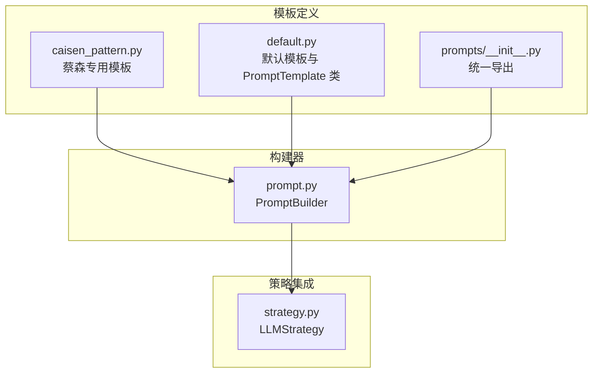
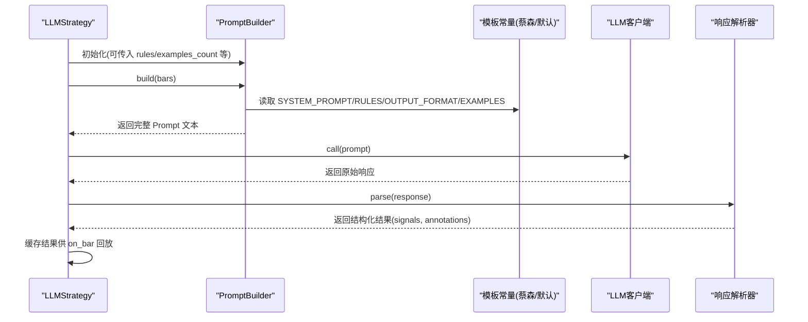
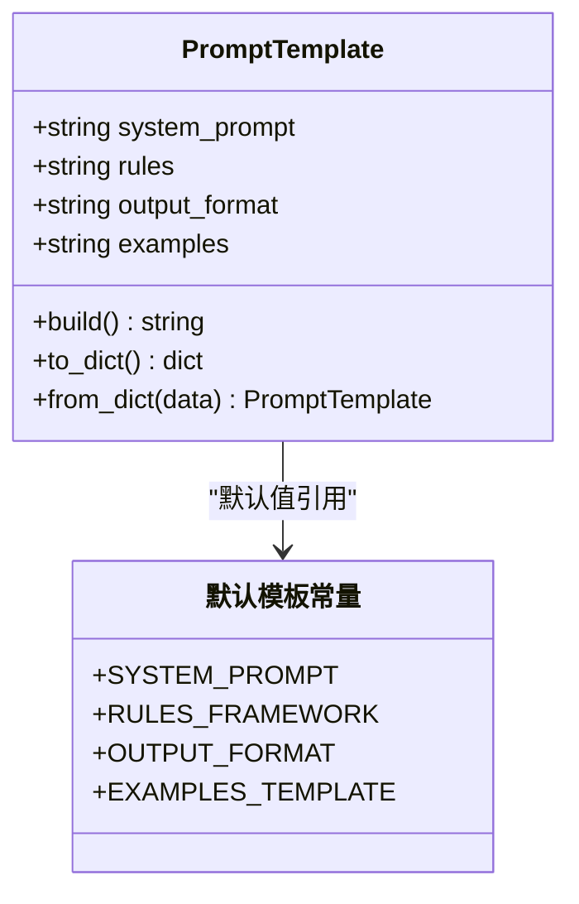
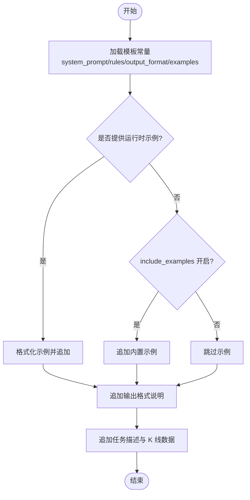
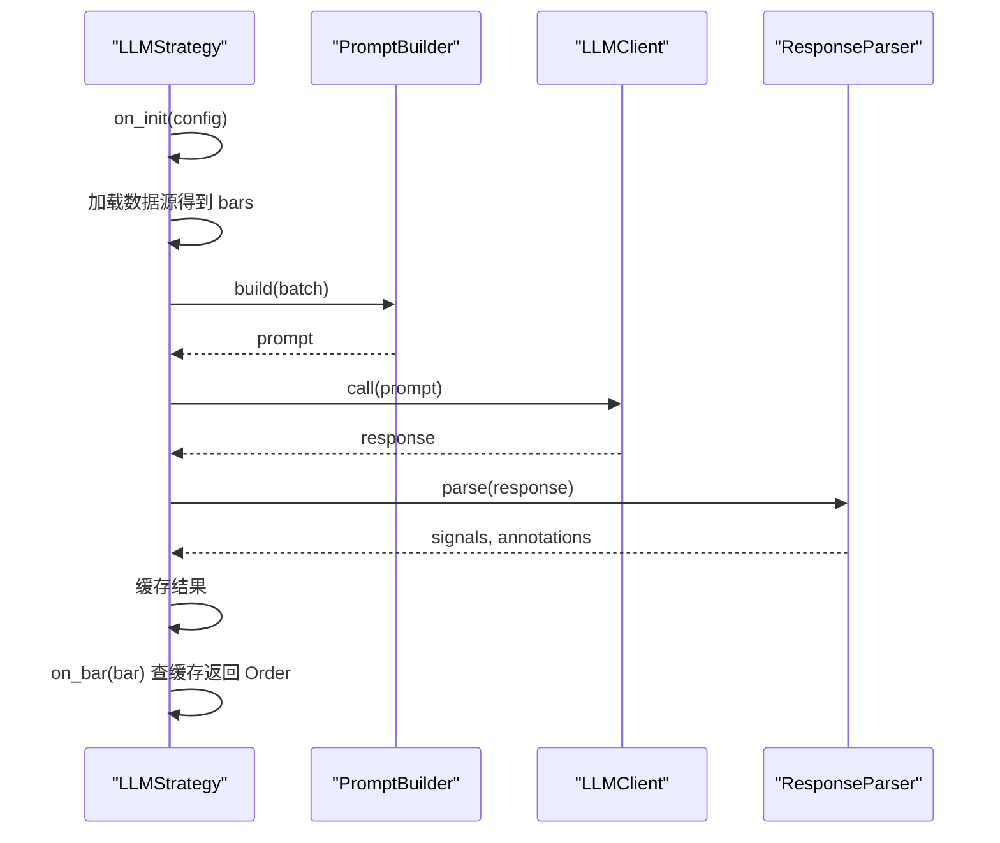
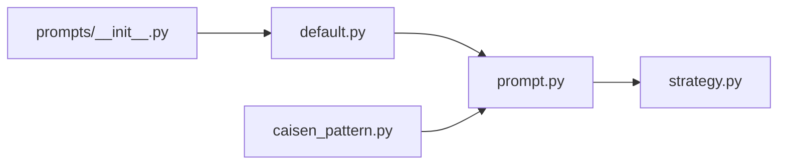

# 模板系统架构

<cite>
**本文引用的文件**
- [caisen_pattern.py](file://src/caisen/strategy/llm/prompts/caisen_pattern.py)
- [default.py](file://src/caisen/strategy/llm/prompts/default.py)
- [__init__.py](file://src/caisen/strategy/llm/prompts/__init__.py)
- [prompt.py](file://src/caisen/strategy/llm/prompt.py)
- [strategy.py](file://src/caisen/strategy/llm/strategy.py)
- [test_prompt.py](file://tests/test_prompt.py)
- [test_prompt_builder.py](file://tests/test_prompt_builder.py)
</cite>

## 目录
1. [简介](#简介)
2. [项目结构](#项目结构)
3. [核心组件](#核心组件)
4. [架构总览](#架构总览)
5. [详细组件分析](#详细组件分析)
6. [依赖关系分析](#依赖关系分析)
7. [性能与容量考虑](#性能与容量考虑)
8. [故障排查指南](#故障排查指南)
9. [结论](#结论)
10. [附录：模板开发指南与版本兼容](#附录模板开发指南与版本兼容)

## 简介
本文件面向 Caisen 的 Prompt 模板系统，系统性说明模板的组织方式、核心组件职责、继承与覆盖策略、自定义模板集成方法以及开发与版本管理最佳实践。重点围绕以下模块展开：
- 蔡森专用模板（caisen_pattern.py）
- 默认模板（default.py）
- 模板构建器（PromptBuilder）
- 策略层集成（LLMStrategy）

目标是帮助开发者快速理解并扩展模板体系，确保输出稳定、可维护、可演进。

## 项目结构
模板系统位于 LLM 子模块中，采用“模板定义 + 构建器 + 策略集成”的分层组织：
- 模板定义层：提供 SYSTEM_PROMPT、RULES_FRAMEWORK、OUTPUT_FORMAT、EXAMPLES_TEMPLATE 等字符串常量，以及可组合的 PromptTemplate 类
- 构建器层：将模板与运行时数据（K 线、示例）组装为最终 Prompt
- 策略层：在回测流程中调用构建器生成 Prompt，驱动 LLM 分析并缓存结果

图表来源
- [caisen_pattern.py:1-184](file://src/caisen/strategy/llm/prompts/caisen_pattern.py#L1-L184)
- [default.py:1-154](file://src/caisen/strategy/llm/prompts/default.py#L1-L154)
- [__init__.py:1-19](file://src/caisen/strategy/llm/prompts/__init__.py#L1-L19)
- [prompt.py:1-153](file://src/caisen/strategy/llm/prompt.py#L1-L153)
- [strategy.py:1-235](file://src/caisen/strategy/llm/strategy.py#L1-L235)

章节来源
- [caisen_pattern.py:1-184](file://src/caisen/strategy/llm/prompts/caisen_pattern.py#L1-L184)
- [default.py:1-154](file://src/caisen/strategy/llm/prompts/default.py#L1-L154)
- [__init__.py:1-19](file://src/caisen/strategy/llm/prompts/__init__.py#L1-L19)
- [prompt.py:1-153](file://src/caisen/strategy/llm/prompt.py#L1-L153)
- [strategy.py:1-235](file://src/caisen/strategy/llm/strategy.py#L1-L235)

## 核心组件
- 模板常量
  - SYSTEM_PROMPT：角色设定与交易理念
  - RULES_FRAMEWORK：信号判定规则框架（买入/卖出/持仓管理/置信度）
  - OUTPUT_FORMAT：严格的 JSON 输出规范与优先级
  - EXAMPLES_TEMPLATE：Few-shot 示例集合
- 模板对象
  - PromptTemplate：封装上述四个部分，支持 build() 拼接与 from_dict()/to_dict() 序列化
- 构建器
  - PromptBuilder：以模板为基础，注入 K 线数据与可选 Few-shot 示例，产出最终 Prompt 文本
- 策略集成
  - LLMStrategy：在 on_init 阶段批量分析并缓存 signals/annotations，on_bar 回放时查缓存返回订单

章节来源
- [caisen_pattern.py:1-184](file://src/caisen/strategy/llm/prompts/caisen_pattern.py#L1-L184)
- [default.py:100-154](file://src/caisen/strategy/llm/prompts/default.py#L100-L154)
- [prompt.py:15-153](file://src/caisen/strategy/llm/prompt.py#L15-L153)
- [strategy.py:15-235](file://src/caisen/strategy/llm/strategy.py#L15-L235)

## 架构总览
下图展示从策略到模板再到 LLM 调用的端到端流程，突出 Prompt 的构建与使用位置。

图表来源
- [strategy.py:98-129](file://src/caisen/strategy/llm/strategy.py#L98-L129)
- [prompt.py:54-116](file://src/caisen/strategy/llm/prompt.py#L54-L116)
- [caisen_pattern.py:13-184](file://src/caisen/strategy/llm/prompts/caisen_pattern.py#L13-L184)
- [default.py:100-154](file://src/caisen/strategy/llm/prompts/default.py#L100-L154)

## 详细组件分析

### 模板常量与结构
- SYSTEM_PROMPT
  - 作用：定义模型角色、核心理念与交易纪律，约束行为边界
  - 蔡森版强调量价结构、形态优先、趋势为王、严格止损与止盈
- RULES_FRAMEWORK
  - 作用：明确买入/卖出判定条件、持仓检查顺序、禁止情形与置信度分级
  - 蔡森版细化了均线、形态、量能、止损/止盈与时间止损等规则
- OUTPUT_FORMAT
  - 作用：强制 JSON 输出结构、字段含义、优先级与硬性校验规则
  - 要求每根 K 线必须输出 signal，reason 包含三要素，confidence 范围限制
- EXAMPLES_TEMPLATE
  - 作用：提供 Few-shot 示例，示范 reason 格式与信号类型
  - 蔡森版示例覆盖平台突破、下降趋势、量能不足、止损触发等场景

章节来源
- [caisen_pattern.py:13-184](file://src/caisen/strategy/llm/prompts/caisen_pattern.py#L13-L184)
- [default.py:10-93](file://src/caisen/strategy/llm/prompts/default.py#L10-L93)

### PromptTemplate 类（可组合模板）
- 功能
  - 封装 system_prompt/rules/output_format/examples 四段内容
  - build() 按固定顺序拼接为完整系统提示
  - to_dict()/from_dict() 支持配置化创建与序列化
- 设计要点
  - 通过构造函数参数实现局部覆盖
  - 提供 get_prompt_template() 便捷工厂函数
  - DEFAULT_TEMPLATE 作为默认实例

图表来源
- [default.py:100-154](file://src/caisen/strategy/llm/prompts/default.py#L100-L154)

章节来源
- [default.py:100-154](file://src/caisen/strategy/llm/prompts/default.py#L100-L154)

### PromptBuilder（构建器）
- 功能
  - 以模板常量为基础，注入 K 线数据与可选 Few-shot 示例，生成最终 Prompt
  - 支持 include_examples 控制是否注入内置示例；examples 列表优先级最高
  - add_example()/clear_examples() 动态管理示例
  - from_template() 从字典创建 Builder
- 关键流程
  - 拼接系统提示 → 规则框架 → 示例（可选）→ 输出格式 → 任务描述 → K 线数据
  - 对 bars 进行标准化处理，兼容对象或字典输入

图表来源
- [prompt.py:54-116](file://src/caisen/strategy/llm/prompt.py#L54-L116)

章节来源
- [prompt.py:15-153](file://src/caisen/strategy/llm/prompt.py#L15-L153)

### 策略集成（LLMStrategy）
- 功能
  - 在 on_init 阶段一次性加载数据并调用 analyze() 批量分析
  - 缓存 signals 和 annotations，on_bar 回放时直接查缓存返回订单
  - 根据配置自动创建 PromptBuilder 与 LLM 客户端
- 关键点
  - analyze() 支持分批处理，避免推理模型因 thinking token 过多导致截断
  - 首次 on_bar 一次性发出所有标注，后续仅处理信号

图表来源
- [strategy.py:131-225](file://src/caisen/strategy/llm/strategy.py#L131-L225)
- [prompt.py:54-116](file://src/caisen/strategy/llm/prompt.py#L54-L116)

章节来源
- [strategy.py:15-235](file://src/caisen/strategy/llm/strategy.py#L15-L235)

## 依赖关系分析
- 模块耦合
  - prompts/__init__.py 统一导出 default 中的常量与类，便于上层导入
  - prompt.py 默认引入 caisen_pattern 的常量作为默认值，同时保留覆盖能力
  - strategy.py 通过 PromptBuilder 与 LLM 客户端协作，解耦模板与调用逻辑
- 外部依赖
  - 无额外第三方库依赖，纯字符串拼接与 JSON 序列化

图表来源
- [__init__.py:1-19](file://src/caisen/strategy/llm/prompts/__init__.py#L1-L19)
- [default.py:1-154](file://src/caisen/strategy/llm/prompts/default.py#L1-L154)
- [caisen_pattern.py:1-184](file://src/caisen/strategy/llm/prompts/caisen_pattern.py#L1-L184)
- [prompt.py:1-153](file://src/caisen/strategy/llm/prompt.py#L1-L153)
- [strategy.py:1-235](file://src/caisen/strategy/llm/strategy.py#L1-L235)

章节来源
- [__init__.py:1-19](file://src/caisen/strategy/llm/prompts/__init__.py#L1-L19)
- [prompt.py:1-153](file://src/caisen/strategy/llm/prompt.py#L1-L153)
- [strategy.py:1-235](file://src/caisen/strategy/llm/strategy.py#L1-L235)

## 性能与容量考虑
- 示例注入
  - 内置示例会增加 Prompt 长度，推理模型可能因 thinking token 消耗过多而截断
  - 建议仅在非推理模型或明确需要时开启 include_examples
- 分批处理
  - analyze() 支持 batch_size 分批，降低单次请求长度，提高稳定性
- 输出格式约束
  - 严格 JSON 结构与 reason 三要素可减少解析失败与重试成本

[本节为通用指导，不直接分析具体文件]

## 故障排查指南
- 常见问题
  - 未输出 JSON 或包含多余文本：检查 OUTPUT_FORMAT 是否被覆盖且仍保持严格约束
  - reason 格式不符合预期：确认 RULES_FRAMEWORK 与 EXAMPLES_TEMPLATE 保持一致
  - 示例过长导致截断：减少 examples 数量或关闭 include_examples
  - 未包含 K 线数据：确认 bars 输入是否为空或字段缺失
- 定位方法
  - 打印生成的 Prompt 文本，核对各段落顺序与内容
  - 使用单元测试验证最小用例（如 test_prompt.py、test_prompt_builder.py）

章节来源
- [test_prompt.py:24-113](file://tests/test_prompt.py#L24-L113)
- [test_prompt_builder.py:9-129](file://tests/test_prompt_builder.py#L9-L129)

## 结论
Caisen 的模板系统通过“模板常量 + PromptTemplate + PromptBuilder + LLMStrategy”的分层设计，实现了模板与逻辑的清晰分离、灵活的覆盖机制与稳定的输出规范。蔡森专用模板提供了严格的交易规则与输出约束，默认模板则提供了可扩展的基础骨架。结合测试与配置化能力，系统具备良好的可维护性与演进空间。

[本节为总结性内容，不直接分析具体文件]

## 附录：模板开发指南与版本兼容

### 模板文件组织结构
- 模板定义
  - caisen_pattern.py：蔡森专用模板，包含 SYSTEM_PROMPT、RULES_FRAMEWORK、OUTPUT_FORMAT、EXAMPLES_TEMPLATE
  - default.py：默认模板与 PromptTemplate 类，提供默认值与组合能力
- 统一导出
  - prompts/__init__.py：集中导出默认模板常量与类，简化上层导入

章节来源
- [caisen_pattern.py:1-184](file://src/caisen/strategy/llm/prompts/caisen_pattern.py#L1-L184)
- [default.py:1-154](file://src/caisen/strategy/llm/prompts/default.py#L1-L154)
- [__init__.py:1-19](file://src/caisen/strategy/llm/prompts/__init__.py#L1-L19)

### 核心模板组件说明
- SYSTEM_PROMPT
  - 用于设定角色、理念与纪律，影响模型整体行为倾向
- RULES_FRAMEWORK
  - 定义信号判定与持仓管理规则，决定 buy/sell/hold 的触发条件
- OUTPUT_FORMAT
  - 强制 JSON 结构与字段语义，保障下游解析稳定性
- EXAMPLES_TEMPLATE
  - 提供 Few-shot 示例，统一 reason 格式与信号风格

章节来源
- [caisen_pattern.py:13-184](file://src/caisen/strategy/llm/prompts/caisen_pattern.py#L13-L184)
- [default.py:10-93](file://src/caisen/strategy/llm/prompts/default.py#L10-L93)

### 模板继承与覆盖策略
- 默认行为
  - PromptBuilder 默认使用 caisen_pattern 的常量作为系统提示、规则与输出格式
- 覆盖方式
  - 构造 PromptBuilder 时传入 system_prompt/rules/output_format 即可覆盖默认值
  - 使用 PromptTemplate.from_dict() 或 get_prompt_template() 进行配置化创建
- 示例注入优先级
  - 运行时 examples 列表 > include_examples 内置示例 > 不注入示例

章节来源
- [prompt.py:26-53](file://src/caisen/strategy/llm/prompt.py#L26-L53)
- [default.py:134-147](file://src/caisen/strategy/llm/prompts/default.py#L134-L147)

### 自定义模板与集成步骤
- 步骤
  - 在 prompts 目录下新增模板文件，定义 SYSTEM_PROMPT、RULES_FRAMEWORK、OUTPUT_FORMAT、EXAMPLES_TEMPLATE
  - 在 PromptBuilder 初始化时传入新模板常量，或通过 from_template() 指定字典
  - 在 LLMStrategy 配置中设置 rules/examples_count 等参数，完成集成
- 验证
  - 使用单元测试打印生成的 Prompt，确认结构与内容符合预期

章节来源
- [prompt.py:136-153](file://src/caisen/strategy/llm/prompt.py#L136-L153)
- [strategy.py:89-96](file://src/caisen/strategy/llm/strategy.py#L89-L96)
- [test_prompt.py:83-105](file://tests/test_prompt.py#L83-L105)

### 语法规范与变量替换
- 语法规范
  - 模板为纯字符串，建议使用 Markdown 标题与列表提升可读性
  - OUTPUT_FORMAT 需保持严格 JSON 约束，reason 三要素不可省略
- 变量替换
  - 当前实现以字符串拼接为主，未引入模板引擎
  - 如需高级特性（条件渲染、循环），可在 PromptBuilder.build() 中增加逻辑分支与格式化

章节来源
- [prompt.py:54-116](file://src/caisen/strategy/llm/prompt.py#L54-L116)

### 版本管理与兼容性
- 版本标识
  - 模板注释中包含版本号（如 V3），建议在常量命名或元数据中显式声明
- 兼容性策略
  - 保持 OUTPUT_FORMAT 向后兼容，新增字段需标记可选
  - 变更 RULES_FRAMEWORK 时需同步更新 EXAMPLES_TEMPLATE，避免示例与规则不一致
  - 通过单元测试覆盖关键路径，确保升级不影响现有行为

章节来源
- [caisen_pattern.py:1-11](file://src/caisen/strategy/llm/prompts/caisen_pattern.py#L1-L11)
- [test_prompt_builder.py:9-129](file://tests/test_prompt_builder.py#L9-L129)