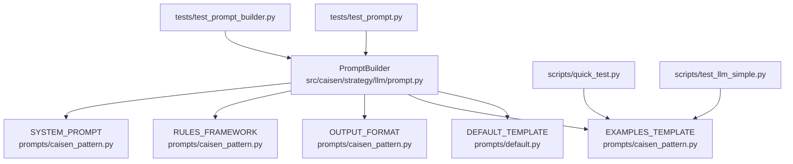
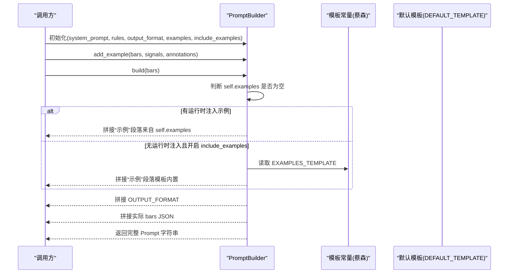
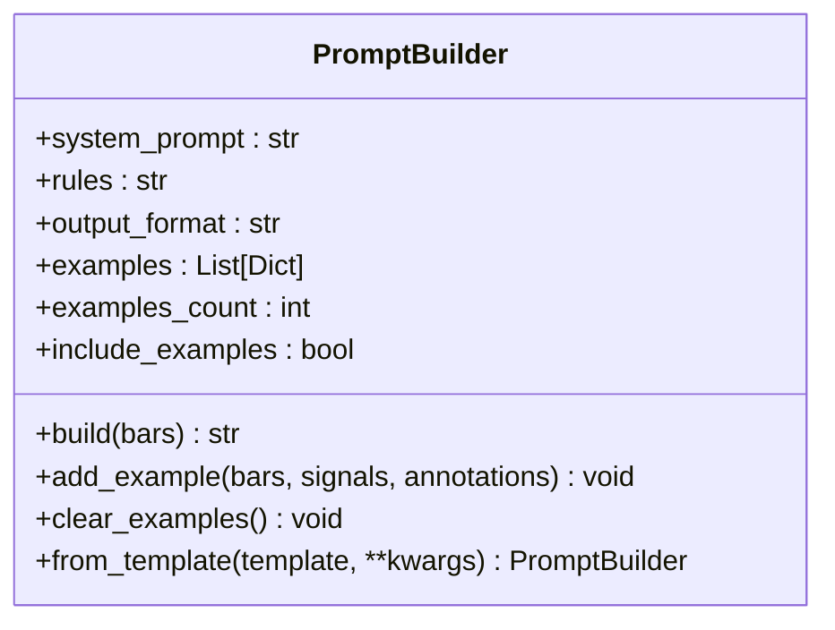
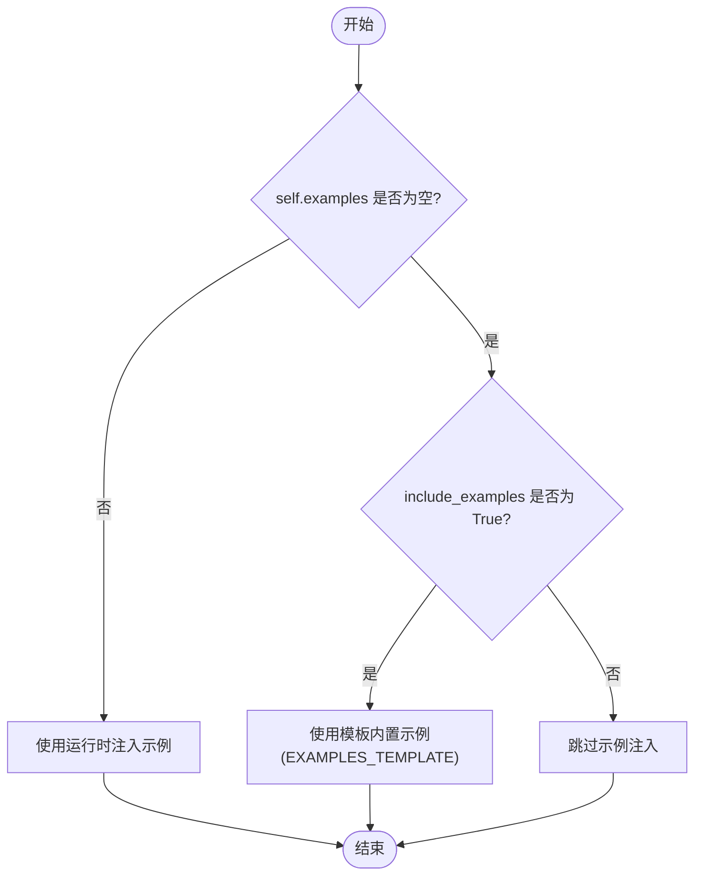
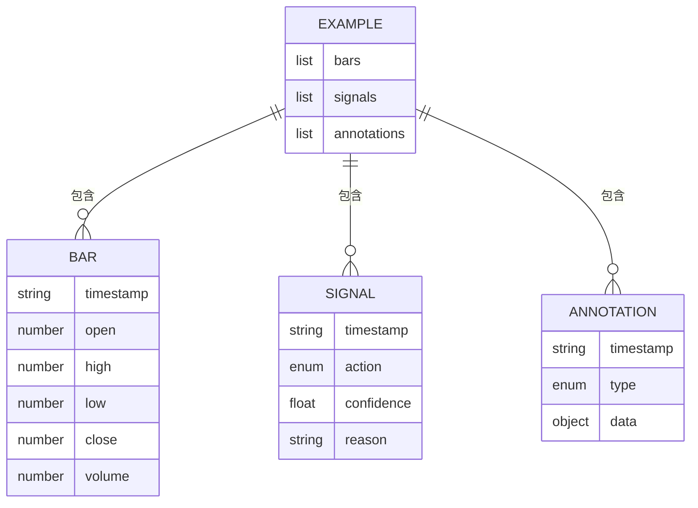
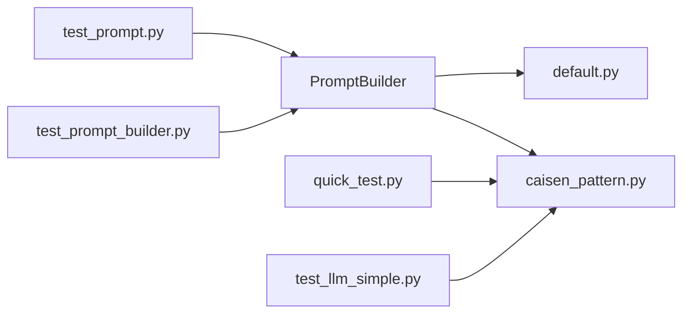

# 示例管理系统

<cite>
**本文引用的文件**
- [prompt.py](file://src/caisen/strategy/llm/prompt.py)
- [default.py](file://src/caisen/strategy/llm/prompts/default.py)
- [caisen_pattern.py](file://src/caisen/strategy/llm/prompts/caisen_pattern.py)
- [__init__.py](file://src/caisen/strategy/llm/prompts/__init__.py)
- [test_prompt_builder.py](file://tests/test_prompt_builder.py)
- [test_prompt.py](file://tests/test_prompt.py)
- [quick_test.py](file://scripts/quick_test.py)
- [test_llm_simple.py](file://scripts/test_llm_simple.py)
</cite>

## 目录
1. [简介](#简介)
2. [项目结构](#项目结构)
3. [核心组件](#核心组件)
4. [架构总览](#架构总览)
5. [详细组件分析](#详细组件分析)
6. [依赖关系分析](#依赖关系分析)
7. [性能与 Token 优化](#性能与-token-优化)
8. [示例库建设指南](#示例库建设指南)
9. [测试与验证工具](#测试与验证工具)
10. [故障排查](#故障排查)
11. [结论](#结论)

## 简介
本文件系统性地梳理 Few-shot 示例管理在 LLM 策略提示构建中的实现，覆盖以下关键主题：
- 示例的添加、存储与管理机制（含 add_example() 方法与数据结构）
- 运行时注入示例与模板内置示例的选择逻辑与优先级
- 示例格式规范（bars、signals、annotations 字段要求与校验规则）
- 示例数量控制与 token 消耗优化策略
- 示例库建设指南（高质量示例编写规范与分类管理）
- 示例测试与验证工具使用方法

## 项目结构
示例管理相关代码集中在 LLM 提示构建模块中，核心由 PromptBuilder 负责组合系统提示、规则框架、Few-shot 示例与输出格式，并在最终任务段注入待分析的 K 线数据。

图表来源
- [prompt.py:15-153](file://src/caisen/strategy/llm/prompt.py#L15-L153)
- [caisen_pattern.py:13-184](file://src/caisen/strategy/llm/prompts/caisen_pattern.py#L13-L184)
- [default.py:100-154](file://src/caisen/strategy/llm/prompts/default.py#L100-L154)
- [test_prompt_builder.py:1-129](file://tests/test_prompt_builder.py#L1-L129)
- [test_prompt.py:51-113](file://tests/test_prompt.py#L51-L113)
- [quick_test.py:44-90](file://scripts/quick_test.py#L44-L90)
- [test_llm_simple.py:41-88](file://scripts/test_llm_simple.py#L41-L88)

章节来源
- [prompt.py:15-153](file://src/caisen/strategy/llm/prompt.py#L15-L153)
- [caisen_pattern.py:13-184](file://src/caisen/strategy/llm/prompts/caisen_pattern.py#L13-L184)
- [default.py:100-154](file://src/caisen/strategy/llm/prompts/default.py#L100-L154)

## 核心组件
- PromptBuilder：负责组装系统提示、规则、示例与输出格式，并生成最终 Prompt；提供 add_example() 和 clear_examples() 管理示例集合；支持 from_template() 从模板字典创建实例。
- 模板常量：SYSTEM_PROMPT、RULES_FRAMEWORK、OUTPUT_FORMAT、EXAMPLES_TEMPLATE 定义于 prompts 子模块，默认使用蔡森专用模板。
- 默认模板类：PromptTemplate 提供可组合的模板对象与 get_prompt_template() 工厂方法。

章节来源
- [prompt.py:15-153](file://src/caisen/strategy/llm/prompt.py#L15-L153)
- [__init__.py:1-19](file://src/caisen/strategy/llm/prompts/__init__.py#L1-L19)
- [default.py:100-154](file://src/caisen/strategy/llm/prompts/default.py#L100-L154)

## 架构总览
下图展示 PromptBuilder 在构建 Prompt 时的调用流程与示例选择逻辑。

图表来源
- [prompt.py:54-116](file://src/caisen/strategy/llm/prompt.py#L54-L116)
- [caisen_pattern.py:160-184](file://src/caisen/strategy/llm/prompts/caisen_pattern.py#L160-L184)
- [default.py:100-154](file://src/caisen/strategy/llm/prompts/default.py#L100-L154)

## 详细组件分析

### PromptBuilder 类与方法
- 构造参数
  - system_prompt、rules、output_format：分别对应系统提示、规则框架、输出格式说明，默认取自蔡森专用模板。
  - examples：运行时注入的 Few-shot 示例列表，优先级最高。
  - examples_count：兼容旧接口保留参数。
  - include_examples：是否注入模板内置精简示例（默认 False，推理模型建议关闭以避免过多 thinking token）。
- 关键方法
  - build(bars)：按顺序拼接系统提示、规则、示例（优先运行时注入）、输出格式与实际 K 线数据，返回字符串。
  - add_example(bars, signals, annotations=None)：向内部示例列表追加一个示例条目。
  - clear_examples()：清空所有示例。
  - from_template(template=None, **kwargs)：从模板字典创建 PromptBuilder 实例。

图表来源
- [prompt.py:15-153](file://src/caisen/strategy/llm/prompt.py#L15-L153)

章节来源
- [prompt.py:15-153](file://src/caisen/strategy/llm/prompt.py#L15-L153)

### 示例选择与优先级策略
- 优先级顺序
  1) 若 self.examples 非空：使用运行时注入的示例。
  2) 否则，若 include_examples 为 True：使用模板内置示例（EXAMPLES_TEMPLATE）。
  3) 否则：不注入任何示例。
- 设计动机
  - 运行时注入示例具有最高优先级，便于针对具体场景动态调整。
  - 内置示例仅在非推理模型或明确开启时注入，避免推理模型因示例过多导致 thinking token 膨胀与响应截断。

图表来源
- [prompt.py:71-90](file://src/caisen/strategy/llm/prompt.py#L71-L90)
- [caisen_pattern.py:160-184](file://src/caisen/strategy/llm/prompts/caisen_pattern.py#L160-L184)

章节来源
- [prompt.py:71-90](file://src/caisen/strategy/llm/prompt.py#L71-L90)

### 示例数据结构与格式规范
- 示例条目结构
  - bars：K 线数据列表，支持对象（具备 to_dict）或字典；内部会统一转换为 dict。
  - signals：信号列表，每个信号包含时间戳、动作、置信度与理由等字段。
  - annotations：标注列表，可选，用于可视化标注（如买入/卖出信号、形态标记、水平线、趋势线等）。
- 字段要求与约束
  - bars：至少包含 timestamp、open、high、low、close、volume 等必要字段；若传入对象，将调用 to_dict()。
  - signals：action 取值通常为 buy/sell/hold；confidence 应在 0.0-1.0 之间；reason 需遵循输出格式说明中的三要素格式（趋势/形态/量能）。
  - annotations：type 取值包括 buy_signal、sell_signal、pattern_mark、horizontal_line、trend_line 等；data 中包含 price、label、description 等可视化所需信息。
- 输出格式说明
  - 严格 JSON，禁止额外文本；每根 K 线必须有一条 signal；禁止空 signals 数组；禁止跳过任何 K 线；禁止在 MA5 < MA20 时输出 buy。

图表来源
- [prompt.py:118-130](file://src/caisen/strategy/llm/prompt.py#L118-L130)
- [caisen_pattern.py:122-158](file://src/caisen/strategy/llm/prompts/caisen_pattern.py#L122-L158)

章节来源
- [prompt.py:118-130](file://src/caisen/strategy/llm/prompt.py#L118-L130)
- [caisen_pattern.py:122-158](file://src/caisen/strategy/llm/prompts/caisen_pattern.py#L122-L158)

### 示例管理与 API 使用
- 添加示例
  - 通过 PromptBuilder.add_example(bars, signals, annotations=None) 追加单个示例。
- 清空示例
  - 通过 PromptBuilder.clear_examples() 清空所有已注入示例。
- 从模板创建
  - 通过 PromptBuilder.from_template(template, **kwargs) 从模板字典快速构建实例，支持覆盖 system_prompt、rules、output_format、examples 等。

章节来源
- [prompt.py:118-153](file://src/caisen/strategy/llm/prompt.py#L118-L153)

## 依赖关系分析
- PromptBuilder 依赖 prompts 子模块提供的模板常量（SYSTEM_PROMPT、RULES_FRAMEWORK、OUTPUT_FORMAT、EXAMPLES_TEMPLATE），以及默认模板 DEFAULT_TEMPLATE。
- 测试脚本与示例脚本直接引用模板常量以拼装 Prompt，体现模板与逻辑解耦的设计。

图表来源
- [prompt.py:6-12](file://src/caisen/strategy/llm/prompt.py#L6-L12)
- [__init__.py:1-19](file://src/caisen/strategy/llm/prompts/__init__.py#L1-L19)
- [test_prompt_builder.py:1-129](file://tests/test_prompt_builder.py#L1-L129)
- [test_prompt.py:51-113](file://tests/test_prompt.py#L51-L113)
- [quick_test.py:44-90](file://scripts/quick_test.py#L44-L90)
- [test_llm_simple.py:41-88](file://scripts/test_llm_simple.py#L41-L88)

章节来源
- [prompt.py:6-12](file://src/caisen/strategy/llm/prompt.py#L6-L12)
- [__init__.py:1-19](file://src/caisen/strategy/llm/prompts/__init__.py#L1-L19)

## 性能与 Token 优化
- 示例数量控制
  - 运行时注入示例具有最高优先级，应谨慎控制数量，避免 Prompt 过长导致 token 消耗过高。
  - 模板内置示例默认不注入（include_examples=False），在推理模型上尤为关键，可减少 thinking token 占用。
- 数据量裁剪
  - 脚本示例展示了取最近 N 根 K 线的做法（例如最近 40/60 根），以降低输入长度与 token 成本。
- 输出格式约束
  - 严格 JSON 输出与明确的判定优先级有助于减少 LLM 冗余解释，降低响应长度。

章节来源
- [prompt.py:43-46](file://src/caisen/strategy/llm/prompt.py#L43-L46)
- [quick_test.py:44-66](file://scripts/quick_test.py#L44-L66)
- [test_llm_simple.py:54-72](file://scripts/test_llm_simple.py#L54-L72)

## 示例库建设指南
- 高质量示例编写规范
  - 代表性：覆盖典型形态（平台突破、W 底、三角收敛、破底翻等）与不同市场环境（上升/下降趋势）。
  - 完整性：每条示例包含 bars、signals、annotations，确保每根 K 线都有对应 signal。
  - 一致性：reason 严格遵循“趋势/形态/量能”三要素格式；confidence 在 0.0-1.0 范围内。
  - 可复现：bars 数据时间戳连续、字段齐全，便于回放与对比。
- 分类管理方法
  - 按形态类型分类（平台突破、W 底、三角收敛、破底翻等）。
  - 按市场状态分类（上升趋势、下降趋势、震荡市）。
  - 按信号强度分类（高置信度、中等、低置信度）。
  - 按交易阶段分类（入场、持仓管理、止损/止盈）。
- 示例库维护
  - 定期评审与更新，剔除过时或低质量示例。
  - 结合回测结果与用户反馈持续优化示例集。
  - 保持与输出格式说明一致，避免引入新字段导致解析失败。

章节来源
- [caisen_pattern.py:122-158](file://src/caisen/strategy/llm/prompts/caisen_pattern.py#L122-L158)
- [caisen_pattern.py:160-184](file://src/caisen/strategy/llm/prompts/caisen_pattern.py#L160-L184)

## 测试与验证工具
- 单元测试
  - test_prompt_builder.py：验证 PromptBuilder 的基本行为与示例注入效果，包括多示例、空示例、规则覆盖等。
  - test_prompt.py：演示 Few-shot 示例的使用方式与模板分离能力。
- 集成与脚本
  - quick_test.py：加载数据、裁剪样本、拼装 Prompt 并调用本地 LLM，适合快速验证。
  - test_llm_simple.py：简化版端到端测试，提取模板常量并组装 Prompt，限制数据量以避免 token 过多。

使用建议
- 新增示例后，运行 test_prompt_builder.py 的相关用例，确认示例被正确包含在 Prompt 中。
- 使用 quick_test.py 或 test_llm_simple.py 进行端到端验证，观察 LLM 输出是否符合预期格式与规则。

章节来源
- [test_prompt_builder.py:1-129](file://tests/test_prompt_builder.py#L1-L129)
- [test_prompt.py:51-113](file://tests/test_prompt.py#L51-L113)
- [quick_test.py:44-90](file://scripts/quick_test.py#L44-L90)
- [test_llm_simple.py:41-110](file://scripts/test_llm_simple.py#L41-L110)

## 故障排查
- 常见问题
  - 示例未生效：检查是否在 build() 前调用了 add_example()，并确保 self.examples 非空。
  - 内置示例未注入：确认 include_examples 设置为 True。
  - 输出格式错误：确保 reason 严格遵循三要素格式，confidence 在 0.0-1.0 之间，禁止空 signals 数组。
  - Token 超限：减少示例数量与 bars 长度，参考脚本中的数据裁剪策略。
- 定位方法
  - 打印生成的 Prompt 片段，确认示例与输出格式是否正确拼接。
  - 使用单元测试断言验证关键字段是否存在于 Prompt 中。

章节来源
- [prompt.py:71-90](file://src/caisen/strategy/llm/prompt.py#L71-L90)
- [caisen_pattern.py:122-158](file://src/caisen/strategy/llm/prompts/caisen_pattern.py#L122-L158)
- [test_prompt_builder.py:94-129](file://tests/test_prompt_builder.py#L94-L129)

## 结论
本系统通过 PromptBuilder 实现了灵活、可控的 Few-shot 示例管理：
- 运行时注入示例优先级最高，模板内置示例按需启用，兼顾效果与性能。
- 示例数据结构清晰，字段规范严格，利于 LLM 稳定输出与前端可视化渲染。
- 通过示例数量控制与数据裁剪策略，有效降低 token 消耗，提升推理效率。
- 完善的测试与脚本工具链保障示例库的质量与可维护性。