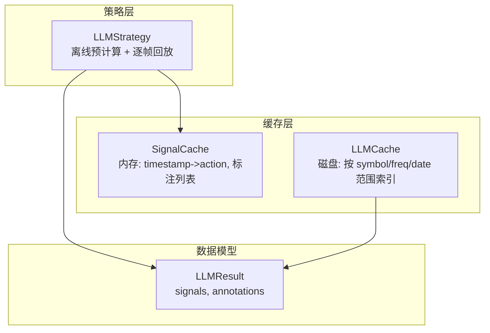
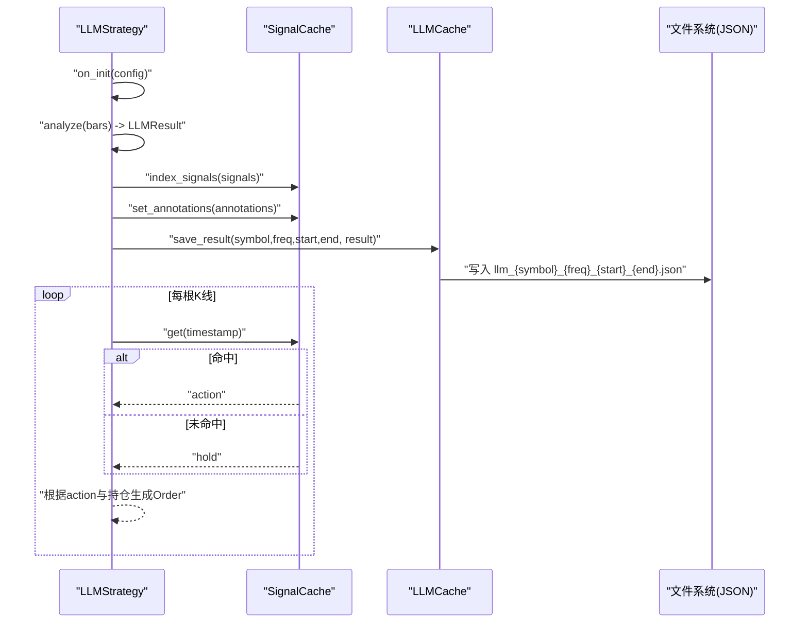
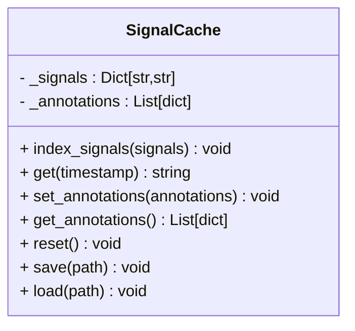
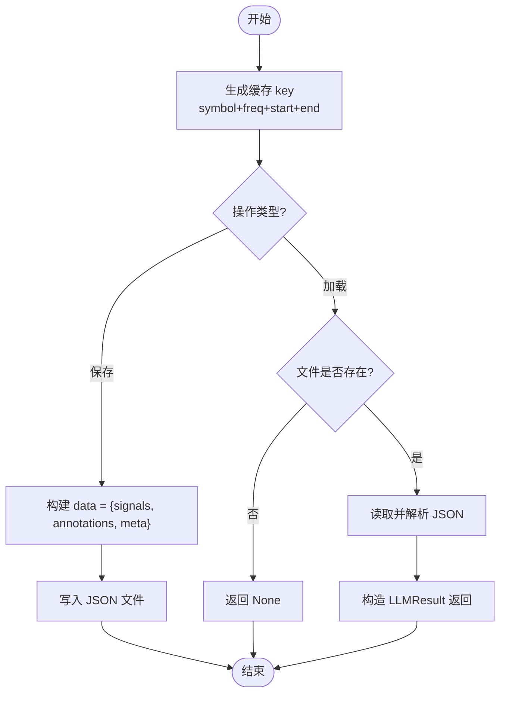
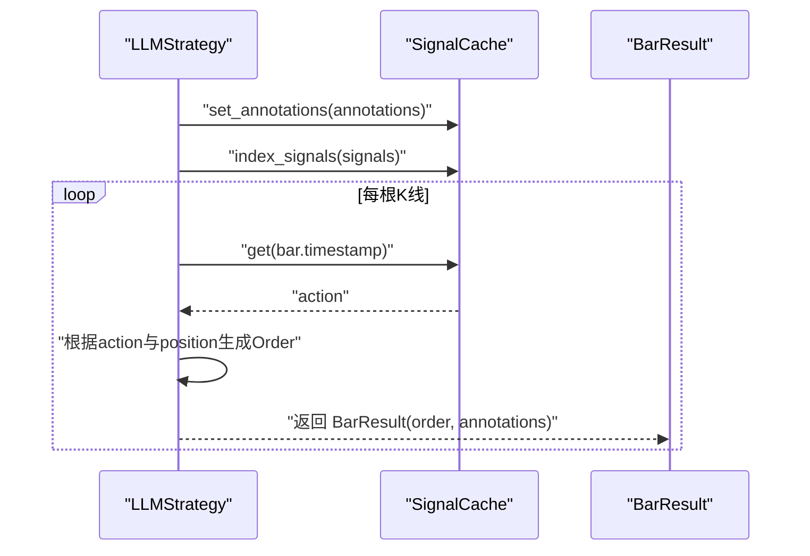
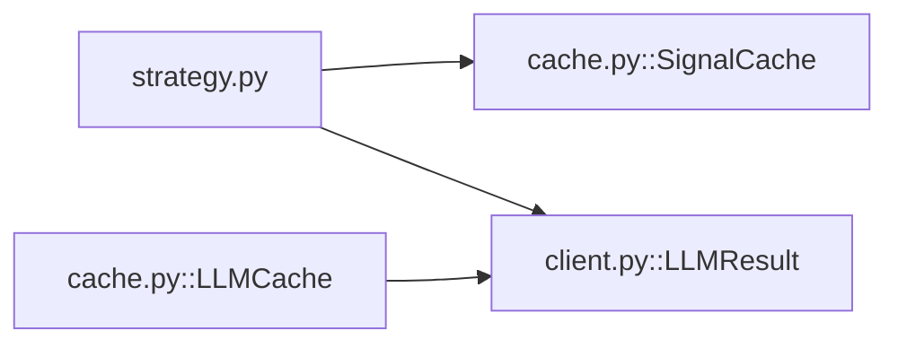

# 信号缓存机制

<cite>
**本文引用的文件**   
- [src/caisen/strategy/llm/cache.py](file://src/caisen/strategy/llm/cache.py)
- [src/caisen/strategy/llm/strategy.py](file://src/caisen/strategy/llm/strategy.py)
- [src/caisen/strategy/llm/client.py](file://src/caisen/strategy/llm/client.py)
- [tests/test_llm_cache.py](file://tests/test_llm_cache.py)
- [tests/test_llm_integration.py](file://tests/test_llm_integration.py)
</cite>

## 目录
1. [简介](#简介)
2. [项目结构](#项目结构)
3. [核心组件](#核心组件)
4. [架构总览](#架构总览)
5. [详细组件分析](#详细组件分析)
6. [依赖关系分析](#依赖关系分析)
7. [性能与内存优化](#性能与内存优化)
8. [监控与统计](#监控与统计)
9. [使用示例](#使用示例)
10. [故障排查指南](#故障排查指南)
11. [结论](#结论)

## 简介
本文件面向 Caisen 量化回测系统中的“信号缓存机制”，聚焦 SignalCache 类的内存缓存设计、生命周期管理、持久化与增量更新、多线程一致性保障、监控统计、命中率优化与内存调优，并提供完整操作示例与故障排查指南。SignalCache 用于在 LLM 离线预计算阶段将“时间戳 -> 动作”的映射以及标注列表缓存到内存，供 on_bar 回放阶段快速查询；LLMCache 则负责将完整的 LLM 结果（含 signals 与 annotations）持久化为 JSON 文件，实现跨进程/会话复用。

## 项目结构
与信号缓存相关的代码主要位于策略子模块 llm 下：
- 缓存实现：cache.py
- 策略集成：strategy.py
- 结果模型：client.py
- 测试用例：tests/test_llm_cache.py、tests/test_llm_integration.py

图表来源
- [src/caisen/strategy/llm/strategy.py:15-235](file://src/caisen/strategy/llm/strategy.py#L15-L235)
- [src/caisen/strategy/llm/cache.py:8-174](file://src/caisen/strategy/llm/cache.py#L8-L174)
- [src/caisen/strategy/llm/client.py:8-19](file://src/caisen/strategy/llm/client.py#L8-L19)

章节来源
- [src/caisen/strategy/llm/cache.py:1-174](file://src/caisen/strategy/llm/cache.py#L1-L174)
- [src/caisen/strategy/llm/strategy.py:1-235](file://src/caisen/strategy/llm/strategy.py#L1-L235)
- [src/caisen/strategy/llm/client.py:1-38](file://src/caisen/strategy/llm/client.py#L1-L38)

## 核心组件
- SignalCache
  - 内存数据结构：字典映射 timestamp -> action；列表存储 annotations。
  - 核心方法：index_signals、get、set_annotations、get_annotations、reset、save、load。
- LLMCache
  - 基于文件系统的全量结果缓存，key 由 symbol、freq、start、end 组合生成。
  - 核心方法：generate_key、get_cache_path、save_result、load_result、clear。
- LLMResult
  - 数据载体：包含 signals 与 annotations 两个列表。

章节来源
- [src/caisen/strategy/llm/cache.py:8-86](file://src/caisen/strategy/llm/cache.py#L8-L86)
- [src/caisen/strategy/llm/cache.py:88-174](file://src/caisen/strategy/llm/cache.py#L88-L174)
- [src/caisen/strategy/llm/client.py:8-19](file://src/caisen/strategy/llm/client.py#L8-L19)

## 架构总览
LLMStrategy 采用“离线预计算 + 回放”模式：
- on_init：加载历史 K 线，调用 LLM 分析，得到 signals 与 annotations，写入 SignalCache。
- on_bar：根据当前 bar 的时间戳从 SignalCache 获取 action，结合持仓状态生成订单；首次 on_bar 时一次性发出所有标注。
- LLMCache：对完整 LLM 结果进行持久化，支持后续直接 load_result 命中，避免重复推理。

图表来源
- [src/caisen/strategy/llm/strategy.py:131-225](file://src/caisen/strategy/llm/strategy.py#L131-L225)
- [src/caisen/strategy/llm/cache.py:15-36](file://src/caisen/strategy/llm/cache.py#L15-L36)
- [src/caisen/strategy/llm/cache.py:113-169](file://src/caisen/strategy/llm/cache.py#L113-L169)

## 详细组件分析

### SignalCache 类
- 内存缓存设计
  - 信号索引：内部以 Dict[str, str] 维护 timestamp -> action 的映射，O(1) 读取。
  - 时间戳映射：index_signals 遍历输入信号列表，提取 timestamp 并写入映射；缺失 action 时默认 "hold"。
  - 标注存储：List[dict] 保存原始标注，便于首次 on_bar 时统一发出。
- 生命周期管理
  - reset：清空信号映射与标注列表，适用于多轮回测或重新初始化场景。
  - save/load：JSON 序列化/反序列化，支持跨进程/会话恢复。
- 自动清理策略
  - 当前版本未内置 LRU 或过期淘汰逻辑；如需自动清理，可在上层策略或调度器中调用 reset 或外部清理脚本。
- 增量更新机制
  - index_signals 会覆盖现有映射；若需增量追加，应在上层合并后再调用 index_signals。
- 多线程同步与一致性
  - 当前实现无锁保护，非线程安全。多线程并发读写需在上层加锁或使用单线程访问。
- 监控与统计
  - 当前未暴露命中率、内存占用等统计接口；可在上层自行计数 get 命中次数与总请求数。

图表来源
- [src/caisen/strategy/llm/cache.py:8-86](file://src/caisen/strategy/llm/cache.py#L8-L86)

章节来源
- [src/caisen/strategy/llm/cache.py:15-86](file://src/caisen/strategy/llm/cache.py#L15-L86)

### LLMCache 类
- 功能定位
  - 管理完整 LLM 结果的磁盘缓存，key 由 symbol、freq、start、end 组成，文件名形如 llm_{symbol}_{freq}_{start}_{end}.json。
- 持久化与增量
  - save_result：将 LLMResult 序列化为 JSON，包含 signals、annotations 与 meta。
  - load_result：按 key 查找文件，存在则返回 LLMResult，否则返回 None。
  - clear：删除目录下所有 llm_*.json 文件。
- 自动清理策略
  - 提供 clear 方法，可按需清理全部缓存；也可在上层按日期/品种维度选择性删除。
- 多线程同步与一致性
  - 文件 I/O 为进程级共享资源，建议在上层保证同一 key 的并发写串行化，避免竞态。
- 监控与统计
  - 可统计 save/load 成功/失败次数、文件大小分布等，便于容量规划。

图表来源
- [src/caisen/strategy/llm/cache.py:95-169](file://src/caisen/strategy/llm/cache.py#L95-L169)

章节来源
- [src/caisen/strategy/llm/cache.py:88-174](file://src/caisen/strategy/llm/cache.py#L88-L174)

### LLMResult 数据模型
- 字段
  - signals：信号列表，每项至少包含 timestamp 与 action。
  - annotations：标注列表，每项包含 timestamp、type、data 等。
- 用途
  - 作为 LLM 输出载体，被 Strategy.analyze 返回，并被 LLMCache 持久化。

章节来源
- [src/caisen/strategy/llm/client.py:8-19](file://src/caisen/strategy/llm/client.py#L8-L19)

### LLMStrategy 中的缓存使用
- on_init
  - 加载 bars，调用 analyze 得到 LLMResult，随后通过 cache.index_signals 与 cache.set_annotations 填充 SignalCache。
- on_bar
  - 第一次调用时，将缓存中的 annotations 转换为 Annotation 对象并随 BarResult 发出。
  - 根据 bar.timestamp 格式化后的字符串从 SignalCache.get 获取 action，结合持仓状态生成 Order。

图表来源
- [src/caisen/strategy/llm/strategy.py:131-225](file://src/caisen/strategy/llm/strategy.py#L131-L225)
- [src/caisen/strategy/llm/cache.py:15-44](file://src/caisen/strategy/llm/cache.py#L15-L44)

章节来源
- [src/caisen/strategy/llm/strategy.py:131-225](file://src/caisen/strategy/llm/strategy.py#L131-L225)

## 依赖关系分析
- 模块内依赖
  - strategy.py 依赖 cache.py 的 SignalCache 与 client.py 的 LLMResult。
  - cache.py 的 LLMCache 在 load_result 中动态导入 client.py 的 LLMResult。
- 外部依赖
  - 标准库 json、pathlib.Path。
- 耦合与内聚
  - SignalCache 职责单一，仅负责内存映射与简单持久化；LLMCache 专注文件级缓存；两者解耦清晰。
- 潜在循环依赖
  - 通过延迟导入避免循环依赖（LLMCache.load_result 中 from .client import LLMResult）。

图表来源
- [src/caisen/strategy/llm/strategy.py:47-67](file://src/caisen/strategy/llm/strategy.py#L47-L67)
- [src/caisen/strategy/llm/cache.py:152-167](file://src/caisen/strategy/llm/cache.py#L152-L167)

章节来源
- [src/caisen/strategy/llm/strategy.py:1-235](file://src/caisen/strategy/llm/strategy.py#L1-L235)
- [src/caisen/strategy/llm/cache.py:1-174](file://src/caisen/strategy/llm/cache.py#L1-L174)
- [src/caisen/strategy/llm/client.py:1-38](file://src/caisen/strategy/llm/client.py#L1-L38)

## 性能与内存优化
- 时间复杂度
  - index_signals：O(N)，N 为信号数量。
  - get：O(1)。
  - save/load：I/O 开销为主，序列化/反序列化 O(M)，M 为数据项总数。
- 空间复杂度
  - SignalCache：O(N) 存储信号映射与标注列表。
- 命中率优化
  - 确保 on_init 阶段正确 index_signals，避免 on_bar 频繁缺省命中导致误判。
  - 合理设置批量分析 batch_size，减少 LLM 响应截断风险，提高整体稳定性。
- 内存使用调优
  - 对于超长序列，考虑在上层分批次处理并合并结果后，再调用 index_signals。
  - 定期调用 reset 释放旧缓存，避免长时间运行累积内存。
- 磁盘缓存优化
  - 使用 LLMCache 的 key 粒度控制缓存范围，避免过大文件影响 I/O。
  - 按需清理：clear 或选择性删除历史区间文件。

章节来源
- [src/caisen/strategy/llm/cache.py:15-86](file://src/caisen/strategy/llm/cache.py#L15-L86)
- [src/caisen/strategy/llm/cache.py:113-174](file://src/caisen/strategy/llm/cache.py#L113-L174)
- [src/caisen/strategy/llm/strategy.py:98-129](file://src/caisen/strategy/llm/strategy.py#L98-L129)

## 监控与统计
- 当前实现未内置监控指标（如命中率、内存占用、缓存大小）。
- 建议在 LLMStrategy 或上层调度器中增加：
  - 计数器：get 总次数、命中次数、未命中次数。
  - 统计：SignalCache 内部元素数量、LLMCache 文件数量与大小。
  - 日志：异常捕获与关键路径耗时记录。

章节来源
- [src/caisen/strategy/llm/cache.py:15-86](file://src/caisen/strategy/llm/cache.py#L15-L86)
- [src/caisen/strategy/llm/cache.py:113-174](file://src/caisen/strategy/llm/cache.py#L113-L174)

## 使用示例
以下为典型操作流程（不展示具体代码内容，仅提供路径参考）：
- 初始化与预计算
  - 在策略 on_init 中加载数据并调用 analyze，随后将结果写入 SignalCache 与 LLMCache。
  - 参考路径：[src/caisen/strategy/llm/strategy.py:131-178](file://src/caisen/strategy/llm/strategy.py#L131-L178)、[src/caisen/strategy/llm/cache.py:113-138](file://src/caisen/strategy/llm/cache.py#L113-L138)
- 回放阶段
  - 在 on_bar 中根据 bar.timestamp 查询 SignalCache 获取 action，并结合持仓生成订单。
  - 参考路径：[src/caisen/strategy/llm/strategy.py:180-225](file://src/caisen/strategy/llm/strategy.py#L180-L225)
- 持久化与恢复
  - 使用 SignalCache.save/load 或 LLMCache.save_result/load_result 完成跨会话恢复。
  - 参考路径：[src/caisen/strategy/llm/cache.py:51-85](file://src/caisen/strategy/llm/cache.py#L51-L85)、[src/caisen/strategy/llm/cache.py:140-169](file://src/caisen/strategy/llm/cache.py#L140-L169)
- 单元测试参考
  - 持久化与加载行为验证：[tests/test_llm_cache.py:15-105](file://tests/test_llm_cache.py#L15-L105)
  - 连续交易信号与默认 hold 行为：[tests/test_llm_integration.py:134-173](file://tests/test_llm_integration.py#L134-L173)

章节来源
- [src/caisen/strategy/llm/strategy.py:131-225](file://src/caisen/strategy/llm/strategy.py#L131-L225)
- [src/caisen/strategy/llm/cache.py:51-85](file://src/caisen/strategy/llm/cache.py#L51-L85)
- [src/caisen/strategy/llm/cache.py:140-169](file://src/caisen/strategy/llm/cache.py#L140-L169)
- [tests/test_llm_cache.py:15-105](file://tests/test_llm_cache.py#L15-L105)
- [tests/test_llm_integration.py:134-173](file://tests/test_llm_integration.py#L134-L173)

## 故障排查指南
- 常见问题
  - 加载不存在的缓存文件：SignalCache.load 与 LLMCache.load_result 均静默处理，返回空缓存或 None。
    - 参考路径：[src/caisen/strategy/llm/cache.py:67-85](file://src/caisen/strategy/llm/cache.py#L67-L85)、[src/caisen/strategy/llm/cache.py:140-169](file://src/caisen/strategy/llm/cache.py#L140-L169)
  - 标注类型未知：当 annotation type 不在枚举中，策略会降级为文本标签并给出警告。
    - 参考路径：[src/caisen/strategy/llm/strategy.py:198-211](file://src/caisen/strategy/llm/strategy.py#L198-L211)
  - 默认行为：未命中时间戳返回 "hold"，不会触发交易。
    - 参考路径：[src/caisen/strategy/llm/cache.py:27-36](file://src/caisen/strategy/llm/cache.py#L27-L36)
- 调试建议
  - 检查 on_init 是否正确调用 index_signals 与 set_annotations。
  - 确认 on_bar 中时间戳格式与缓存键一致（YYYY-MM-DD）。
  - 使用 LLMCache.clear 清理脏缓存后重试。
  - 在测试中复现问题，参考测试用例路径进行最小化验证。

章节来源
- [src/caisen/strategy/llm/cache.py:67-85](file://src/caisen/strategy/llm/cache.py#L67-L85)
- [src/caisen/strategy/llm/cache.py:140-169](file://src/caisen/strategy/llm/cache.py#L140-L169)
- [src/caisen/strategy/llm/strategy.py:198-211](file://src/caisen/strategy/llm/strategy.py#L198-L211)
- [src/caisen/strategy/llm/cache.py:27-36](file://src/caisen/strategy/llm/cache.py#L27-L36)

## 结论
SignalCache 提供了轻量高效的内存级信号缓存，配合 LLMCache 的文件级全量结果缓存，形成了“离线预计算 + 回放”的高性能回测范式。当前实现简洁明确，适合单线程场景；在多进程或多线程环境下，需在应用层引入同步与监控机制。未来可考虑扩展 LRU 淘汰、增量合并、统计指标与更细粒度的清理策略，以满足更大规模与更长周期的回测需求。