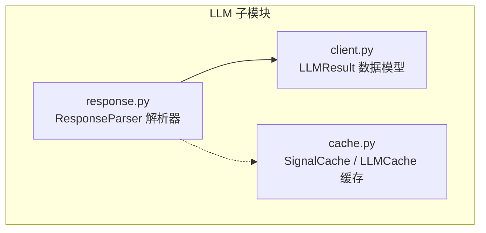
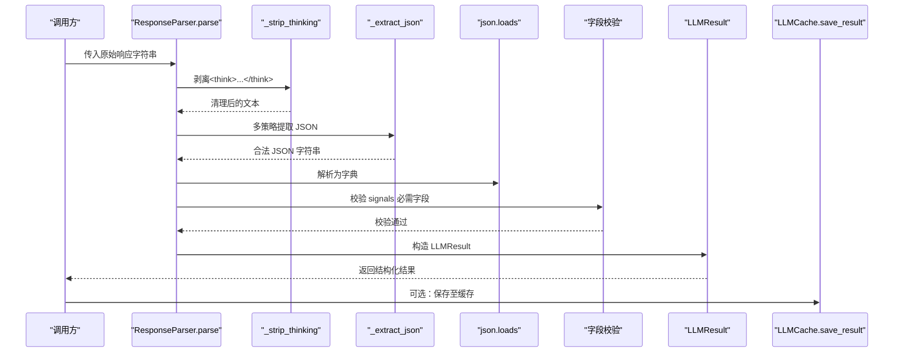
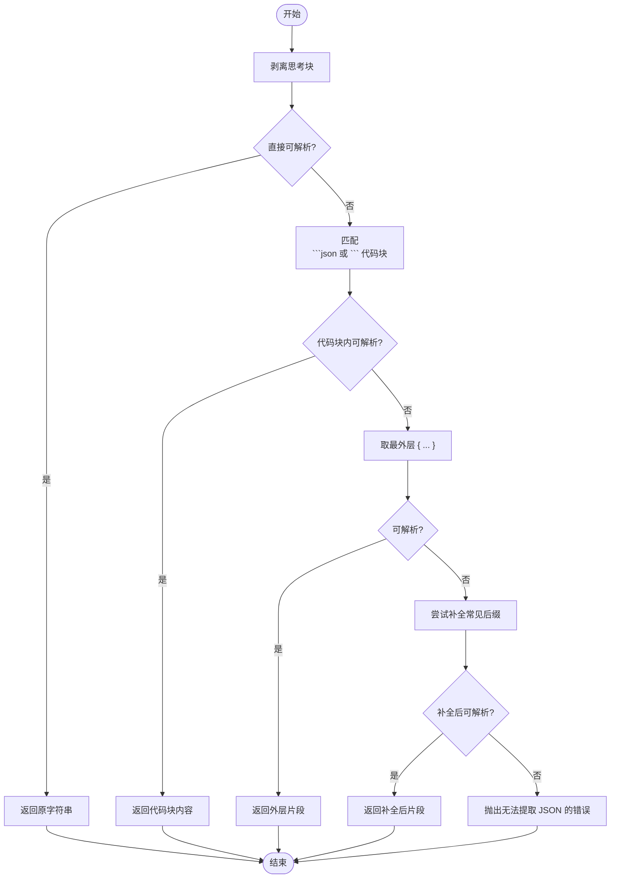
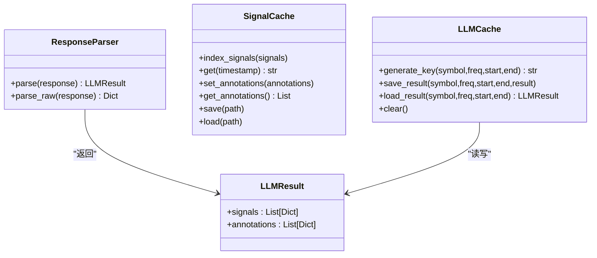

# 响应解析器

<cite>
**本文引用的文件**   
- [response.py](file://src/caisen/strategy/llm/response.py)
- [client.py](file://src/caisen/strategy/llm/client.py)
- [cache.py](file://src/caisen/strategy/llm/cache.py)
- [test_llm_client.py](file://tests/test_llm_client.py)
- [test_llm_cache.py](file://tests/test_llm_cache.py)
- [test_llm_integration.py](file://tests/test_llm_integration.py)
</cite>

## 目录
1. [简介](#简介)
2. [项目结构](#项目结构)
3. [核心组件](#核心组件)
4. [架构总览](#架构总览)
5. [详细组件分析](#详细组件分析)
6. [依赖关系分析](#依赖关系分析)
7. [性能与缓存优化](#性能与缓存优化)
8. [故障排查指南](#故障排查指南)
9. [结论](#结论)
10. [附录：扩展与调试](#附录扩展与调试)

## 简介
本文件面向 Caisen 量化回测系统中的“响应解析器”，围绕 ResponseParser 类的设计原理、解析流程、异常处理与容错机制进行系统化说明。文档覆盖 JSON 格式提取与校验、字段映射与类型转换、信号数据结构定义（含买入/卖出/持有、置信度评分、止损止盈等字段的解析规则）、自定义响应格式的扩展方法（适配器模式）、以及响应缓存与性能优化技巧，并给出完整的解析示例与调试工具使用方法。

## 项目结构
与响应解析器相关的代码主要位于 LLM 子模块中，包含客户端结果模型、响应解析器与缓存管理三类职责清晰的组件：
- 客户端结果模型：LLMResult，用于承载 signals 与 annotations
- 响应解析器：ResponseParser，负责从原始文本中提取 JSON、校验必需字段并返回结构化结果
- 缓存管理：SignalCache 与 LLMCache，提供按时间戳索引的信号缓存与完整回测结果的持久化

图表来源
- [client.py:1-38](file://src/caisen/strategy/llm/client.py#L1-L38)
- [response.py:1-128](file://src/caisen/strategy/llm/response.py#L1-L128)
- [cache.py:1-174](file://src/caisen/strategy/llm/cache.py#L1-L174)

章节来源
- [client.py:1-38](file://src/caisen/strategy/llm/client.py#L1-L38)
- [response.py:1-128](file://src/caisen/strategy/llm/response.py#L1-L128)
- [cache.py:1-174](file://src/caisen/strategy/llm/cache.py#L1-L174)

## 核心组件
- LLMResult：轻量数据容器，包含 signals 与 annotations 两个列表，默认空列表初始化，便于下游消费。
- ResponseParser：核心解析器，提供 parse 与 parse_raw 两种入口；内部通过 _strip_thinking 与 _extract_json 完成思考块剥离与多策略 JSON 提取，并对 signals 的必需字段进行校验。
- SignalCache：按时间戳索引 action，支持 save/load 到 JSON 文件，便于离线回放与断点续跑。
- LLMCache：以 symbol/freq/start/end 生成 key，对完整 LLMResult 做文件级缓存，避免重复调用。

章节来源
- [client.py:8-19](file://src/caisen/strategy/llm/client.py#L8-L19)
- [response.py:79-128](file://src/caisen/strategy/llm/response.py#L79-L128)
- [cache.py:8-86](file://src/caisen/strategy/llm/cache.py#L8-L86)
- [cache.py:88-174](file://src/caisen/strategy/llm/cache.py#L88-L174)

## 架构总览
下图展示了从原始 LLM 文本到结构化信号的端到端流程，包括思考块剥离、JSON 提取、字段校验、结果封装与缓存落盘。

图表来源
- [response.py:10-76](file://src/caisen/strategy/llm/response.py#L10-L76)
- [response.py:88-113](file://src/caisen/strategy/llm/response.py#L88-L113)
- [client.py:8-19](file://src/caisen/strategy/llm/client.py#L8-L19)
- [cache.py:113-138](file://src/caisen/strategy/llm/cache.py#L113-L138)

## 详细组件分析

### ResponseParser 设计与解析流程
- 思考块剥离：若响应包含 <think>...</think>，仅保留其后内容；若被截断在思考阶段，直接抛出明确错误提示。
- JSON 提取四步降级策略：
  1) 直接解析纯 JSON
  2) 从 markdown 代码块中提取
  3) 取最外层 { ... } 尝试修复尾部
  4) 针对未闭合 } 的情况，尝试补全常见后缀 ]}} / ]} / }
- 字段校验：signals 列表中每个元素必须包含 timestamp 与 action，否则抛出 ValueError。
- 输出封装：将 signals 与 annotations 放入 LLMResult 返回。

图表来源
- [response.py:10-76](file://src/caisen/strategy/llm/response.py#L10-L76)

章节来源
- [response.py:10-76](file://src/caisen/strategy/llm/response.py#L10-L76)
- [response.py:88-113](file://src/caisen/strategy/llm/response.py#L88-L113)

### 信号数据结构定义与解析规则
- 顶层结构：
  - signals：数组，每项代表一个时间点上的交易信号
  - annotations：数组，标注信息（如形态标记、水平线等）
- 信号项字段：
  - 必需字段：timestamp（时间戳）、action（动作：buy/sell/hold）
  - 可选字段：confidence（置信度评分，数值型）、reason（原因说明，字符串）、stop_loss/target（止损/目标价，数值型）等
- 解析规则：
  - 解析器不强制要求 confidence/stop_loss/target 存在，但会在上层逻辑中按需读取
  - 当缺少 timestamp 或 action 时，解析器会立即抛出错误，阻止后续处理

章节来源
- [response.py:103-113](file://src/caisen/strategy/llm/response.py#L103-L113)
- [test_llm_client.py:37-97](file://tests/test_llm_client.py#L37-L97)

### 异常处理与容错机制
- 思考阶段截断：检测到 <think> 开头且无闭合标签时，抛出明确的 ValueError，提示调整 max_tokens 或减少 K 线数量。
- JSON 不可提取：所有降级策略失败后，抛出 ValueError，并附带原始响应前若干字符，便于定位问题。
- 业务字段缺失：signals 中任一元素缺少 timestamp 或 action，抛出 ValueError，确保下游一致性。
- 空响应兼容：允许 signals 与 annotations 为空数组，解析器正常返回空结果。

章节来源
- [response.py:10-24](file://src/caisen/strategy/llm/response.py#L10-L24)
- [response.py:76-76](file://src/caisen/strategy/llm/response.py#L76-L76)
- [response.py:107-111](file://src/caisen/strategy/llm/response.py#L107-L111)
- [test_llm_client.py:75-112](file://tests/test_llm_client.py#L75-L112)

### 自定义响应格式扩展与适配器模式
- 适配器思路：
  - 新增一个适配器类，实现统一的 parse(response) -> LLMResult 接口
  - 在适配器内部将第三方格式转换为标准 signals/annotations 结构
  - 保持 ResponseParser 不变，通过注入不同适配器实现多格式兼容
- 建议步骤：
  - 定义适配器接口（例如 IResponseAdapter），约定 parse(raw) -> LLMResult
  - 实现具体适配器（例如 OpenAIAdapter、LocalModelAdapter）
  - 在策略层根据配置选择适配器实例，统一接入 ResponseParser 的输出

[本节为概念性设计说明，不直接分析具体文件]

## 依赖关系分析
- ResponseParser 依赖 LLMResult 作为输出载体
- SignalCache 与 LLMCache 独立于解析器，但常与解析器配合使用，形成“解析-缓存-回放”闭环
- 测试用例覆盖了有效响应、无效 JSON、缺失字段、空响应、原始解析、缓存持久化与命中等场景

图表来源
- [client.py:8-19](file://src/caisen/strategy/llm/client.py#L8-L19)
- [response.py:79-128](file://src/caisen/strategy/llm/response.py#L79-L128)
- [cache.py:8-86](file://src/caisen/strategy/llm/cache.py#L8-L86)
- [cache.py:88-174](file://src/caisen/strategy/llm/cache.py#L88-L174)

章节来源
- [client.py:8-19](file://src/caisen/strategy/llm/client.py#L8-L19)
- [response.py:79-128](file://src/caisen/strategy/llm/response.py#L79-L128)
- [cache.py:8-174](file://src/caisen/strategy/llm/cache.py#L8-L174)

## 性能与缓存优化
- 解析路径优化：
  - 优先尝试直接解析，避免正则与字符串操作开销
  - 仅在必要时执行 markdown 提取与外层括号截取
  - 对截断响应采用最小代价的后缀补全策略
- 缓存策略：
  - SignalCache：内存级按时间戳索引，O(1) 查询，适合在线回放
  - LLMCache：文件级缓存，key 由 symbol/freq/start/end 组成，避免重复调用 LLM
  - 结合测试用例验证缓存命中与持久化正确性
- 建议：
  - 在高频调用场景中启用 LLMCache，显著降低网络与模型推理成本
  - 对大响应体可考虑分块解析与流式写入，减少内存峰值

章节来源
- [response.py:37-76](file://src/caisen/strategy/llm/response.py#L37-L76)
- [cache.py:88-174](file://src/caisen/strategy/llm/cache.py#L88-L174)
- [test_llm_cache.py:112-127](file://tests/test_llm_cache.py#L112-L127)

## 故障排查指南
- 现象：抛出“无法从响应中提取合法 JSON”
  - 检查原始响应是否包含完整 JSON 或可识别的代码块
  - 确认是否存在嵌套引号、尾随逗号等非法语法
  - 查看错误消息中的原始响应片段，定位截断位置
- 现象：抛出“Signal missing 'timestamp'/'action'”
  - 检查 LLM 输出的 signals 数组每一项是否包含必需字段
  - 确认时间戳格式是否符合预期
- 现象：缓存未命中或加载失败
  - 检查缓存文件路径与权限
  - 确认 JSON 文件格式是否正确
  - 对于不存在的路径，系统应静默处理并返回默认 hold

章节来源
- [response.py:76-76](file://src/caisen/strategy/llm/response.py#L76-L76)
- [response.py:107-111](file://src/caisen/strategy/llm/response.py#L107-L111)
- [cache.py:67-85](file://src/caisen/strategy/llm/cache.py#L67-L85)
- [test_llm_cache.py:76-83](file://tests/test_llm_cache.py#L76-L83)

## 结论
ResponseParser 通过稳健的多策略 JSON 提取与严格的字段校验，确保了从非结构化 LLM 文本到结构化信号的可靠转换。配合 SignalCache 与 LLMCache，系统在性能与稳定性方面具备良好表现。通过适配器模式可扩展多种响应格式，满足多样化模型与平台需求。建议在工程实践中结合缓存与日志定位，持续提升解析成功率与运行效率。

## 附录：扩展与调试

### 解析示例（基于测试用例）
- 有效响应解析：包含 signals 与 annotations，返回 LLMResult
- 带标注的响应：annotations 中包含 type 与 data 字段
- 无效 JSON：抛出 ValueError
- 缺失字段：signals 缺少 action 时抛出 ValueError
- 空响应：signals 与 annotations 均为空数组，解析成功
- 原始解析：parse_raw 返回字典，不做业务校验

章节来源
- [test_llm_client.py:37-124](file://tests/test_llm_client.py#L37-L124)

### 调试工具使用方法
- 启用 parse_raw：在不进行业务校验的情况下，快速验证 JSON 结构与字段完整性
- 打印原始响应片段：在捕获 ValueError 时，记录错误消息中的原始响应前若干字符，辅助定位
- 缓存文件检查：查看 LLMCache 生成的 JSON 文件，确认 signals 与 annotations 的结构与元数据
- 集成测试：通过 test_llm_integration 验证 on_bar 流程中标注的发出与信号缓存的连续性

章节来源
- [response.py:115-128](file://src/caisen/strategy/llm/response.py#L115-L128)
- [test_llm_integration.py:110-128](file://tests/test_llm_integration.py#L110-L128)
- [test_llm_cache.py:15-44](file://tests/test_llm_cache.py#L15-L44)