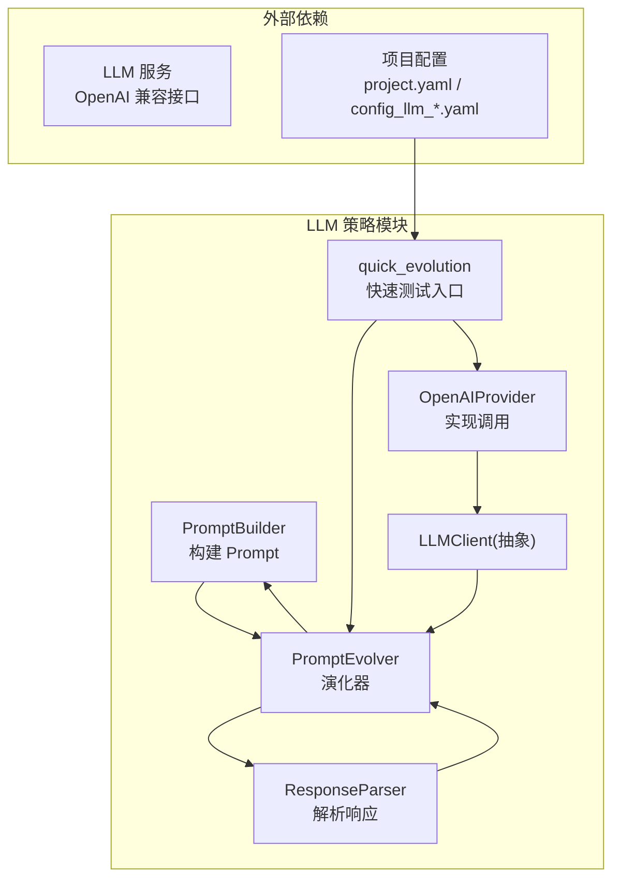
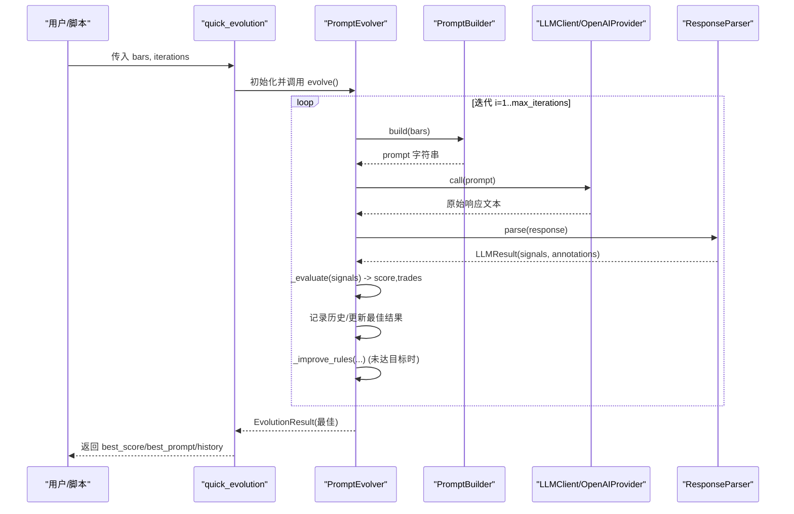
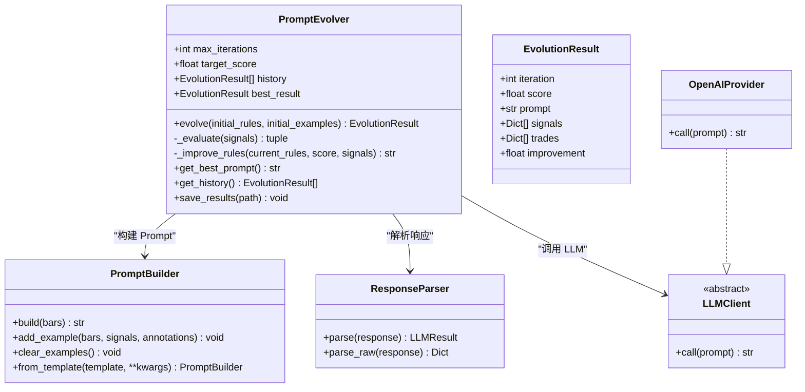
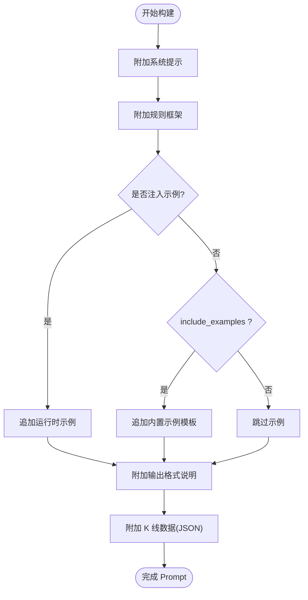
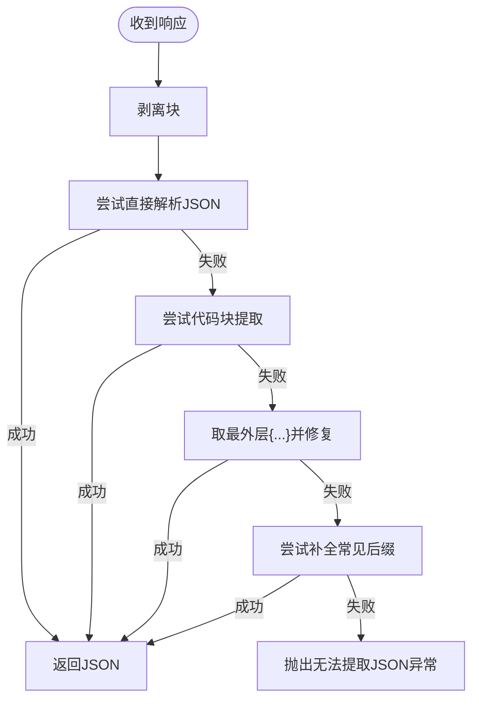
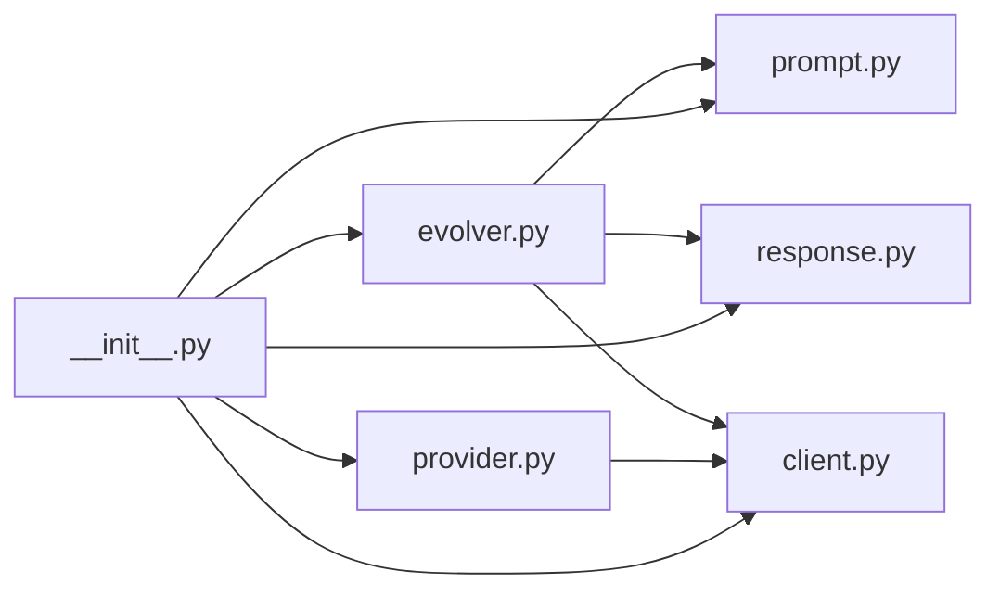

# 演化工作流

<cite>
**本文引用的文件**   
- [evolver.py](file://src/caisen/strategy/llm/evolver.py)
- [prompt.py](file://src/caisen/strategy/llm/prompt.py)
- [client.py](file://src/caisen/strategy/llm/client.py)
- [response.py](file://src/caisen/strategy/llm/response.py)
- [provider.py](file://src/caisen/strategy/llm/provider.py)
- [__init__.py](file://src/caisen/strategy/llm/__init__.py)
- [test_llm_evolve.py](file://scripts/test_llm_evolve.py)
- [quick_test.py](file://scripts/quick_test.py)
- [project.yaml](file://configs/project.yaml)
- [config_llm_example.yaml](file://configs/strategies/config_llm_example.yaml)
- [config_llm_local.yaml](file://configs/strategies/config_llm_local.yaml)
</cite>

## 目录
1. [简介](#简介)
2. [项目结构](#项目结构)
3. [核心组件](#核心组件)
4. [架构总览](#架构总览)
5. [详细组件分析](#详细组件分析)
6. [依赖关系分析](#依赖关系分析)
7. [性能与稳定性考量](#性能与稳定性考量)
8. [故障排查指南](#故障排查指南)
9. [结论](#结论)
10. [附录：配置模板与最佳实践](#附录配置模板与最佳实践)

## 简介
本文件面向“策略演化系统”的端到端工作流程，聚焦从数据准备到结果输出的完整链路，涵盖以下关键环节：
- 初始 Prompt 设置与构建
- 迭代控制（最大迭代、目标评分）
- 进度监控与历史保存
- 快速测试函数 quick_evolution 的使用
- 状态管理与错误处理机制
- 不同场景下的工作流配置模板与最佳实践
- 演化结果的可视化展示与对比分析方法
- 完整的端到端使用示例与故障排查指南

## 项目结构
围绕 LLM 策略演化的关键代码位于 strategy/llm 子模块中，配合 scripts 中的脚本进行快速验证与演示。配置文件集中在 configs 目录下，便于在不同环境（云端/本地）切换。



图表来源
- [evolver.py:1-282](file://src/caisen/strategy/llm/evolver.py#L1-L282)
- [prompt.py:1-153](file://src/caisen/strategy/llm/prompt.py#L1-L153)
- [response.py:1-128](file://src/caisen/strategy/llm/response.py#L1-L128)
- [client.py:1-38](file://src/caisen/strategy/llm/client.py#L1-L38)
- [provider.py:1-75](file://src/caisen/strategy/llm/provider.py#L1-L75)
- [__init__.py:1-19](file://src/caisen/strategy/llm/__init__.py#L1-L19)
- [project.yaml:1-13](file://configs/project.yaml#L1-L13)
- [config_llm_example.yaml:1-40](file://configs/strategies/config_llm_example.yaml#L1-L40)
- [config_llm_local.yaml:1-36](file://configs/strategies/config_llm_local.yaml#L1-L36)

章节来源
- [evolver.py:1-282](file://src/caisen/strategy/llm/evolver.py#L1-L282)
- [prompt.py:1-153](file://src/caisen/strategy/llm/prompt.py#L1-L153)
- [response.py:1-128](file://src/caisen/strategy/llm/response.py#L1-L128)
- [client.py:1-38](file://src/caisen/strategy/llm/client.py#L1-L38)
- [provider.py:1-75](file://src/caisen/strategy/llm/provider.py#L1-L75)
- [__init__.py:1-19](file://src/caisen/strategy/llm/__init__.py#L1-L19)
- [project.yaml:1-13](file://configs/project.yaml#L1-L13)
- [config_llm_example.yaml:1-40](file://configs/strategies/config_llm_example.yaml#L1-L40)
- [config_llm_local.yaml:1-36](file://configs/strategies/config_llm_local.yaml#L1-L36)

## 核心组件
- PromptBuilder：负责组装系统提示、规则框架、Few-shot 示例、输出格式说明以及 K 线数据，生成最终 Prompt 字符串。
- ResponseParser：负责从 LLM 原始响应中提取 JSON，支持思考块剥离、Markdown 代码块提取、截断降级修复等。
- LLMClient/LLMResult：定义统一客户端接口与返回数据结构。
- OpenAIProvider：基于 OpenAI SDK 的调用实现，支持自定义 base_url、温度、max_tokens、禁用推理输出等。
- PromptEvolver：驱动演化主循环，包含评估、改进规则、历史记录与最佳结果管理。
- quick_evolution：快速测试入口，封装常用参数并打印摘要。

章节来源
- [prompt.py:1-153](file://src/caisen/strategy/llm/prompt.py#L1-L153)
- [response.py:1-128](file://src/caisen/strategy/llm/response.py#L1-L128)
- [client.py:1-38](file://src/caisen/strategy/llm/client.py#L1-L38)
- [provider.py:1-75](file://src/caisen/strategy/llm/provider.py#L1-L75)
- [evolver.py:1-282](file://src/caisen/strategy/llm/evolver.py#L1-L282)

## 架构总览
下图展示了从数据准备到结果输出的端到端流程，包括 Prompt 构建、LLM 调用、响应解析、评估与规则改进、历史与最佳结果保存。



图表来源
- [evolver.py:60-119](file://src/caisen/strategy/llm/evolver.py#L60-L119)
- [prompt.py:54-116](file://src/caisen/strategy/llm/prompt.py#L54-L116)
- [response.py:88-113](file://src/caisen/strategy/llm/response.py#L88-L113)
- [provider.py:45-74](file://src/caisen/strategy/llm/provider.py#L45-L74)

## 详细组件分析

### 演化器 PromptEvolver 与快速测试 quick_evolution
- 职责
  - 维护当前规则、历史与最佳结果
  - 每轮迭代：构建 Prompt → 调用 LLM → 解析响应 → 评估信号质量 → 改进规则（可选）→ 记录历史
  - 提供 quick_evolution 快捷入口，简化常见用法
- 关键方法
  - evolve(initial_rules, initial_examples)：主循环，含目标评分早停
  - _evaluate(signals)：基于模拟交易计算评分与交易列表
  - _improve_rules(current_rules, score, signals)：根据统计特征调整规则
  - save_results(path)：将最佳结果与历史写入 JSON
  - get_best_prompt()/get_history()：访问最佳 Prompt 与历史
- 快速测试 quick_evolution
  - 参数：llm_client, bars, iterations
  - 行为：创建 PromptEvolver，执行 evolve，打印摘要并返回字典



图表来源
- [evolver.py:13-248](file://src/caisen/strategy/llm/evolver.py#L13-L248)
- [prompt.py:15-153](file://src/caisen/strategy/llm/prompt.py#L15-L153)
- [response.py:79-128](file://src/caisen/strategy/llm/response.py#L79-L128)
- [client.py:21-38](file://src/caisen/strategy/llm/client.py#L21-L38)
- [provider.py:8-75](file://src/caisen/strategy/llm/provider.py#L8-L75)

章节来源
- [evolver.py:24-248](file://src/caisen/strategy/llm/evolver.py#L24-L248)
- [evolver.py:250-282](file://src/caisen/strategy/llm/evolver.py#L250-L282)

### Prompt 构建与 Few-shot 注入
- 默认模板：蔡森专用模板（system_prompt、rules、output_format、examples）
- 运行时注入：优先使用 examples 列表；若 include_examples=True 则启用内置精简示例
- 数据注入：K 线数据以纯 JSON 形式拼接，避免 Markdown 代码块诱导 LLM 用代码块输出



图表来源
- [prompt.py:54-116](file://src/caisen/strategy/llm/prompt.py#L54-L116)

章节来源
- [prompt.py:15-153](file://src/caisen/strategy/llm/prompt.py#L15-L153)

### 响应解析与健壮性
- 思考块剥离：自动移除 <think>...</think>，并在被截断时抛出明确异常
- JSON 提取优先级：
  1) 直接解析
  2) 从 ```json 或 ``` 代码块提取
  3) 取最外层 { ... } 尝试修复尾部
  4) 针对截断补全常见后缀
- 校验：确保每个 signal 包含 timestamp 与 action



图表来源
- [response.py:10-76](file://src/caisen/strategy/llm/response.py#L10-L76)
- [response.py:88-113](file://src/caisen/strategy/llm/response.py#L88-L113)

章节来源
- [response.py:1-128](file://src/caisen/strategy/llm/response.py#L1-L128)

### LLM 客户端与 Provider
- LLMClient：抽象接口，仅暴露 call(prompt) -> str
- OpenAIProvider：
  - 支持自定义 base_url（vLLM/Ollama 等）
  - 支持 temperature、max_tokens、disable_thinking、extra_body
  - 通过 extra_body 透传 thinking 控制参数

章节来源
- [client.py:1-38](file://src/caisen/strategy/llm/client.py#L1-L38)
- [provider.py:1-75](file://src/caisen/strategy/llm/provider.py#L1-L75)

### 快速测试 quick_evolution 使用方法
- 典型步骤
  1) 准备 bars（K 线数据列表）
  2) 构造 OpenAIProvider（可指定 base_url、model、temperature、max_tokens）
  3) 调用 quick_evolution(llm_client, bars, iterations)
  4) 读取返回的 best_score、best_prompt、history
- 参考脚本
  - scripts/test_llm_evolve.py：最小化示例，演示快速进化
  - scripts/quick_test.py：离线加载数据、构建 Prompt、调用 LLM、解析并保存结果

章节来源
- [evolver.py:250-282](file://src/caisen/strategy/llm/evolver.py#L250-L282)
- [test_llm_evolve.py:1-30](file://scripts/test_llm_evolve.py#L1-L30)
- [quick_test.py:1-114](file://scripts/quick_test.py#L1-L114)

## 依赖关系分析
- 模块内耦合
  - evolver 依赖 prompt、response、client
  - provider 实现 client 接口
  - __init__.py 统一导出公共 API
- 外部依赖
  - openai SDK（由 provider 动态导入）
  - 配置文件 project.yaml 与策略配置 config_llm_*.yaml



图表来源
- [evolver.py:1-282](file://src/caisen/strategy/llm/evolver.py#L1-L282)
- [prompt.py:1-153](file://src/caisen/strategy/llm/prompt.py#L1-L153)
- [response.py:1-128](file://src/caisen/strategy/llm/response.py#L1-L128)
- [client.py:1-38](file://src/caisen/strategy/llm/client.py#L1-L38)
- [provider.py:1-75](file://src/caisen/strategy/llm/provider.py#L1-L75)
- [__init__.py:1-19](file://src/caisen/strategy/llm/__init__.py#L1-L19)

章节来源
- [__init__.py:1-19](file://src/caisen/strategy/llm/__init__.py#L1-L19)

## 性能与稳定性考量
- 响应长度与截断
  - 合理设置 max_tokens，避免 JSON 被截断
  - 减少 K 线数量或关闭内置示例以降低 token 消耗
- 频率惩罚与过拟合
  - 评估逻辑对高频交易施加惩罚，有助于抑制过度交易
- 缓存与复用
  - 可在上层引入缓存（如按 bars+prompt 指纹），避免重复调用
- 并发与重试
  - 在 Provider 层增加重试与退避策略，提升鲁棒性

[本节为通用建议，不直接分析具体文件]

## 故障排查指南
- 常见问题
  - 无法提取合法 JSON：检查模型输出是否包含完整 JSON，必要时增大 max_tokens 或减少输入规模
  - 响应在思考阶段被截断：确认 disable_thinking 或 extra_body 是否正确传递
  - 缺少必要字段：校验 response 中 signals 是否包含 timestamp 与 action
- 定位手段
  - 查看 history 中各次迭代的 score 与 trades_count，定位退化轮次
  - 打印 best_prompt 前若干字符，确认规则是否被正确累积
  - 使用 parse_raw 获取原始 JSON，辅助调试

章节来源
- [response.py:10-76](file://src/caisen/strategy/llm/response.py#L10-L76)
- [response.py:88-113](file://src/caisen/strategy/llm/response.py#L88-L113)
- [evolver.py:231-248](file://src/caisen/strategy/llm/evolver.py#L231-L248)

## 结论
本演化工作流以 PromptEvolver 为核心，串联 PromptBuilder 与 ResponseParser，结合 OpenAIProvider 完成端到端的 Prompt 优化闭环。通过 quick_evolution 可快速验证思路，配合配置文件与脚本实现多场景落地。建议在工程化过程中加入缓存、重试与更丰富的评估指标，以提升稳定性与可解释性。

[本节为总结性内容，不直接分析具体文件]

## 附录：配置模板与最佳实践

### 端到端使用示例
- 快速测试
  - 使用 scripts/test_llm_evolve.py 的最小示例，传入少量 bars 与 iterations，观察 best_score 与 best_prompt
- 离线数据验证
  - 使用 scripts/quick_test.py 加载本地数据，构建 Prompt，调用 LLM，解析并保存 last_signals.json

章节来源
- [test_llm_evolve.py:1-30](file://scripts/test_llm_evolve.py#L1-L30)
- [quick_test.py:1-114](file://scripts/quick_test.py#L1-L114)

### 工作流配置模板
- 全局项目配置
  - data_dir、output_dir、api_port 等
- LLM 策略配置（云端）
  - mode、backtest、strategy、data、llm.provider/model/temperature/rules/examples/cache/output_dir
- LLM 策略配置（本地）
  - 指定 base_url、model、disable_thinking、max_tokens 等

章节来源
- [project.yaml:1-13](file://configs/project.yaml#L1-L13)
- [config_llm_example.yaml:1-40](file://configs/strategies/config_llm_example.yaml#L1-L40)
- [config_llm_local.yaml:1-36](file://configs/strategies/config_llm_local.yaml#L1-L36)

### 最佳实践
- Prompt 设计
  - 使用蔡森专用模板作为基线，按需覆盖 rules 与 output_format
  - 谨慎开启 include_examples，避免推理模型因示例过多导致截断
- 迭代控制
  - 设置合理的 max_iterations 与 target_score，避免无效循环
- 评估与改进
  - 关注交易频率惩罚与胜率平衡，逐步细化规则
- 结果保存与对比
  - 使用 save_results 持久化历史，结合前端或脚本进行可视化对比

[本节为通用建议，不直接分析具体文件]