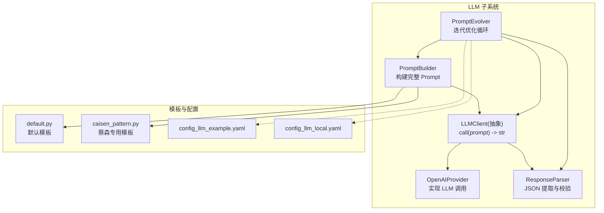
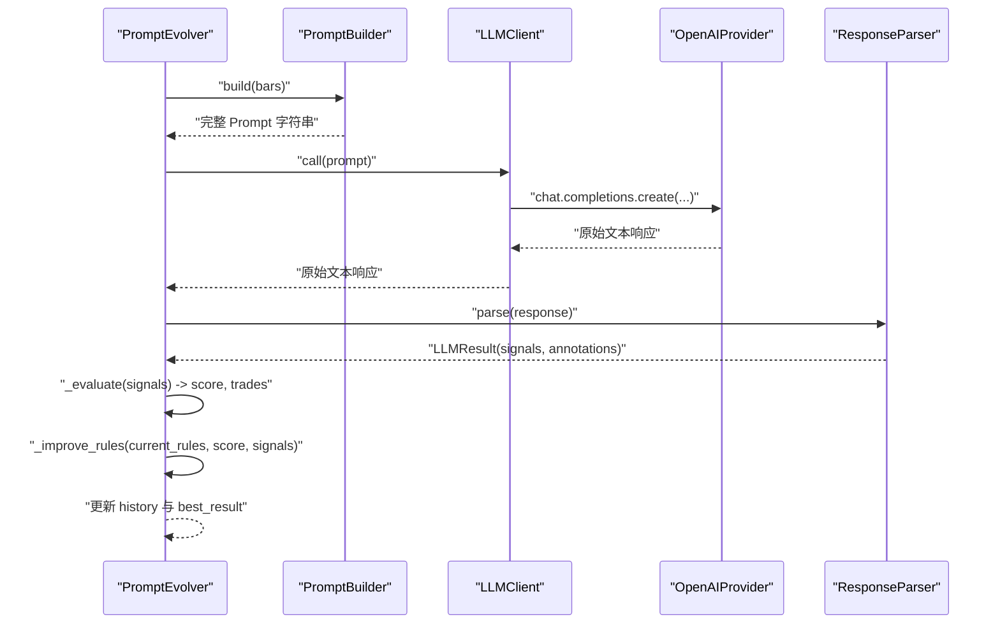
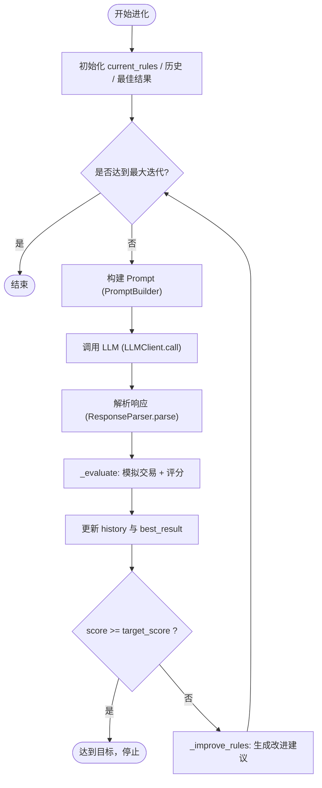
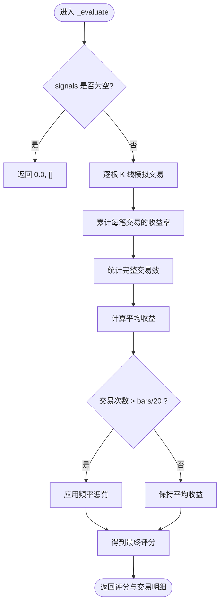
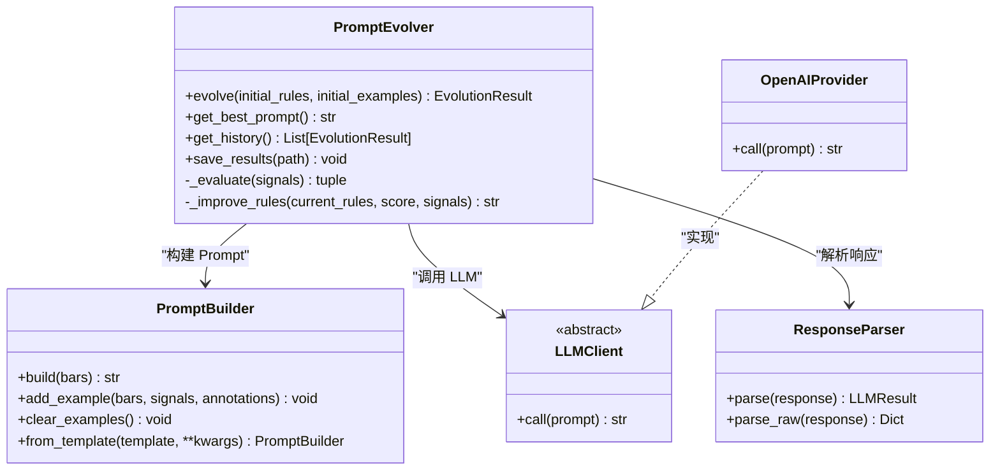

# 演化算法核心

<cite>
**本文引用的文件**   
- [evolver.py](file://src/caisen/strategy/llm/evolver.py)
- [prompt.py](file://src/caisen/strategy/llm/prompt.py)
- [client.py](file://src/caisen/strategy/llm/client.py)
- [provider.py](file://src/caisen/strategy/llm/provider.py)
- [response.py](file://src/caisen/strategy/llm/response.py)
- [default.py](file://src/caisen/strategy/llm/prompts/default.py)
- [caisen_pattern.py](file://src/caisen/strategy/llm/prompts/caisen_pattern.py)
- [config_llm_example.yaml](file://configs/strategies/config_llm_example.yaml)
- [config_llm_local.yaml](file://configs/strategies/config_llm_local.yaml)
- [test_prompt_evolver.py](file://tests/test_prompt_evolver.py)
- [test_llm_evolve.py](file://scripts/test_llm_evolve.py)
</cite>

## 目录
1. [引言](#引言)
2. [项目结构](#项目结构)
3. [核心组件](#核心组件)
4. [架构总览](#架构总览)
5. [详细组件分析](#详细组件分析)
6. [依赖关系分析](#依赖关系分析)
7. [性能与调优](#性能与调优)
8. [故障排查指南](#故障排查指南)
9. [结论](#结论)
10. [附录：使用示例与配置](#附录使用示例与配置)

## 引言
本文件聚焦策略演化系统的核心算法，围绕 PromptEvolver 类的迭代优化流程展开，系统阐述初始化配置、Prompt 构建、LLM 调用、结果评估与规则改进等关键步骤。文档同时深入解析评分机制（盈利计算、交易频率惩罚、信号质量评估）、收敛判断逻辑与目标达成条件，并提供参数调优指南、性能优化建议以及完整的代码示例路径，帮助读者快速上手并高效调参。

## 项目结构
与演化算法相关的核心模块位于 LLM 子系统中，主要包含以下职责划分：
- Prompt 构建：PromptBuilder 负责组装系统提示、规则框架、Few-shot 示例、输出格式与实际 K 线数据。
- LLM 客户端：LLMClient 抽象接口与 OpenAIProvider 实现，统一对外提供 call(prompt) -> str 的调用能力。
- 响应解析：ResponseParser 负责从原始文本中提取 JSON、剥离推理思考块、校验字段完整性。
- 演化器：PromptEvolver 驱动“构建-调用-解析-评估-改进”的闭环迭代，维护历史与最佳结果。
- 模板与配置：默认模板与蔡森专用模板定义规则与输出格式；配置文件用于外部化参数。

图表来源
- [evolver.py:24-119](file://src/caisen/strategy/llm/evolver.py#L24-L119)
- [prompt.py:15-116](file://src/caisen/strategy/llm/prompt.py#L15-L116)
- [client.py:21-38](file://src/caisen/strategy/llm/client.py#L21-L38)
- [provider.py:8-75](file://src/caisen/strategy/llm/provider.py#L8-L75)
- [response.py:79-113](file://src/caisen/strategy/llm/response.py#L79-L113)
- [default.py:10-147](file://src/caisen/strategy/llm/prompts/default.py#L10-L147)
- [caisen_pattern.py:13-184](file://src/caisen/strategy/llm/prompts/caisen_pattern.py#L13-L184)
- [config_llm_example.yaml:1-40](file://configs/strategies/config_llm_example.yaml#L1-L40)
- [config_llm_local.yaml:1-36](file://configs/strategies/config_llm_local.yaml#L1-L36)

章节来源
- [evolver.py:24-119](file://src/caisen/strategy/llm/evolver.py#L24-L119)
- [prompt.py:15-116](file://src/caisen/strategy/llm/prompt.py#L15-L116)
- [client.py:21-38](file://src/caisen/strategy/llm/client.py#L21-L38)
- [provider.py:8-75](file://src/caisen/strategy/llm/provider.py#L8-L75)
- [response.py:79-113](file://src/caisen/strategy/llm/response.py#L79-L113)
- [default.py:10-147](file://src/caisen/strategy/llm/prompts/default.py#L10-L147)
- [caisen_pattern.py:13-184](file://src/caisen/strategy/llm/prompts/caisen_pattern.py#L13-L184)
- [config_llm_example.yaml:1-40](file://configs/strategies/config_llm_example.yaml#L1-L40)
- [config_llm_local.yaml:1-36](file://configs/strategies/config_llm_local.yaml#L1-L36)

## 核心组件
- PromptEvolver：驱动迭代优化的主控制器，封装了“构建-调用-解析-评估-改进”的完整生命周期，记录历史与最佳结果，支持目标评分提前终止。
- PromptBuilder：将系统提示、规则框架、Few-shot 示例、输出格式与 K 线数据组合为最终 Prompt。
- LLMClient/OpenAIProvider：抽象与具体实现分离，便于替换不同后端或本地模型。
- ResponseParser：健壮地处理 LLM 返回的原始文本，包括剥离思考块、多策略 JSON 提取与字段校验。
- 模板与配置：通过 default.py 与 caisen_pattern.py 提供可插拔的规则与输出格式；YAML 配置用于外部化运行参数。

章节来源
- [evolver.py:24-119](file://src/caisen/strategy/llm/evolver.py#L24-L119)
- [prompt.py:15-116](file://src/caisen/strategy/llm/prompt.py#L15-L116)
- [client.py:21-38](file://src/caisen/strategy/llm/client.py#L21-L38)
- [provider.py:8-75](file://src/caisen/strategy/llm/provider.py#L8-L75)
- [response.py:79-113](file://src/caisen/strategy/llm/response.py#L79-L113)
- [default.py:10-147](file://src/caisen/strategy/llm/prompts/default.py#L10-L147)
- [caisen_pattern.py:13-184](file://src/caisen/strategy/llm/prompts/caisen_pattern.py#L13-L184)
- [config_llm_example.yaml:1-40](file://configs/strategies/config_llm_example.yaml#L1-L40)
- [config_llm_local.yaml:1-36](file://configs/strategies/config_llm_local.yaml#L1-L36)

## 架构总览
下图展示了 PromptEvolver 在一次迭代中的端到端调用序列，涵盖从 Prompt 构建到规则改进的关键环节。

图表来源
- [evolver.py:60-119](file://src/caisen/strategy/llm/evolver.py#L60-L119)
- [prompt.py:54-116](file://src/caisen/strategy/llm/prompt.py#L54-L116)
- [client.py:28-38](file://src/caisen/strategy/llm/client.py#L28-L38)
- [provider.py:45-75](file://src/caisen/strategy/llm/provider.py#L45-L75)
- [response.py:88-113](file://src/caisen/strategy/llm/response.py#L88-L113)

## 详细组件分析

### PromptEvolver 迭代优化流程
- 初始化配置
  - 输入：LLM 客户端实例、K 线数据列表、最大迭代次数、目标评分、可选响应解析器。
  - 内部状态：历史记录列表、最佳结果引用。
- 单次迭代步骤
  - 构建 Prompt：使用 PromptBuilder 将当前规则与示例注入到模板中，并附加实际 K 线数据。
  - 调用 LLM：通过 LLMClient.call 获取原始文本响应。
  - 解析响应：ResponseParser.parse 提取 JSON、校验 signals 必需字段。
  - 评估结果：_evaluate 基于信号模拟交易，计算评分与交易明细。
  - 更新历史与最佳：记录本次结果，若优于历史最佳则更新。
  - 目标检查：若达到 target_score，提前终止。
  - 规则改进：根据评分与信号统计特征生成改进建议，追加到当前规则。
- 收敛判断与目标达成
  - 达到 target_score 即停止。
  - 达到 max_iterations 亦停止。
  - 未显式实现“连续 N 次无提升”早停，可通过扩展 _improve_rules 或外层包装实现。

图表来源
- [evolver.py:60-119](file://src/caisen/strategy/llm/evolver.py#L60-L119)
- [evolver.py:121-179](file://src/caisen/strategy/llm/evolver.py#L121-L179)
- [evolver.py:181-219](file://src/caisen/strategy/llm/evolver.py#L181-L219)

章节来源
- [evolver.py:24-119](file://src/caisen/strategy/llm/evolver.py#L24-L119)
- [evolver.py:121-179](file://src/caisen/strategy/llm/evolver.py#L121-L179)
- [evolver.py:181-219](file://src/caisen/strategy/llm/evolver.py#L181-L219)

### 评分机制设计原理
- 盈利计算
  - 按时间顺序遍历 bars，匹配对应 timestamp 的信号。
  - 买入时记录入场价，卖出时以出场价计算单笔收益率并累加至总分。
- 交易频率惩罚
  - 完整交易数 = 卖出次数（等价于买入+卖出对数）。
  - 平均收益 = 总分 / 完整交易数。
  - 当交易次数超过阈值（bars 长度的 1/20）时，引入线性惩罚项，抑制过度交易。
- 信号质量评估
  - 基础评分由平均收益决定。
  - 频率惩罚作为负向调节，避免频繁低质量交易拉高得分。
- 空信号处理
  - 若无任何信号，直接返回 0 分与空交易列表。

图表来源
- [evolver.py:121-179](file://src/caisen/strategy/llm/evolver.py#L121-L179)

章节来源
- [evolver.py:121-179](file://src/caisen/strategy/llm/evolver.py#L121-L179)

### 规则改进策略
- 亏损场景：添加止损与避免追高的约束。
- 买入过频：限制仅在明确信号时操作。
- 卖出过多：强调趋势确认后再卖出。
- 观望过多：在明确机会时鼓励参与。
- 改进方式：将新增建议以换行拼接追加到当前规则字符串，供下一轮 Prompt 构建使用。

章节来源
- [evolver.py:181-219](file://src/caisen/strategy/llm/evolver.py#L181-L219)

### Prompt 构建与模板
- PromptBuilder 组装顺序：
  - 系统提示（SYSTEM_PROMPT）
  - 规则框架（RULES_FRAMEWORK）
  - Few-shot 示例（运行时注入优先，否则启用内置模板）
  - 输出格式说明（OUTPUT_FORMAT）
  - 实际 K 线数据（纯 JSON，避免诱导 LLM 使用代码块）
- 模板来源：
  - 默认模板：default.py 提供通用规则与输出格式。
  - 蔡森专用模板：caisen_pattern.py 强化量价结构与严格纪律。

章节来源
- [prompt.py:15-116](file://src/caisen/strategy/llm/prompt.py#L15-L116)
- [default.py:10-147](file://src/caisen/strategy/llm/prompts/default.py#L10-L147)
- [caisen_pattern.py:13-184](file://src/caisen/strategy/llm/prompts/caisen_pattern.py#L13-L184)

### LLM 客户端与响应解析
- LLMClient 抽象：单一职责，仅负责 call(prompt) -> str。
- OpenAIProvider 实现：
  - 支持自定义 base_url、temperature、max_tokens。
  - 自动注入 thinking 禁用参数（disable_thinking），或通过 extra_body 透传。
- ResponseParser 解析流程：
  - 剥离 <think>...</think> 思考块。
  - 多策略 JSON 提取（直接解析、markdown 代码块、最外层 { }、截断补全）。
  - 校验 signals 必需字段（timestamp、action）。

章节来源
- [client.py:21-38](file://src/caisen/strategy/llm/client.py#L21-L38)
- [provider.py:8-75](file://src/caisen/strategy/llm/provider.py#L8-L75)
- [response.py:10-24](file://src/caisen/strategy/llm/response.py#L10-L24)
- [response.py:27-76](file://src/caisen/strategy/llm/response.py#L27-L76)
- [response.py:88-113](file://src/caisen/strategy/llm/response.py#L88-L113)

## 依赖关系分析
- 耦合与内聚
  - PromptEvolver 与 PromptBuilder、LLMClient、ResponseParser 形成清晰分层，职责单一，内聚度高。
  - OpenAIProvider 仅依赖 LLMClient 接口，易于替换其他后端。
- 外部依赖
  - OpenAI SDK（openai）在 provider 中按需导入，便于本地部署或兼容 API。
- 潜在循环依赖
  - 当前模块间为单向依赖，未发现循环引用。

图表来源
- [evolver.py:24-119](file://src/caisen/strategy/llm/evolver.py#L24-L119)
- [prompt.py:15-116](file://src/caisen/strategy/llm/prompt.py#L15-L116)
- [client.py:21-38](file://src/caisen/strategy/llm/client.py#L21-L38)
- [provider.py:8-75](file://src/caisen/strategy/llm/provider.py#L8-L75)
- [response.py:79-113](file://src/caisen/strategy/llm/response.py#L79-L113)

章节来源
- [evolver.py:24-119](file://src/caisen/strategy/llm/evolver.py#L24-L119)
- [prompt.py:15-116](file://src/caisen/strategy/llm/prompt.py#L15-L116)
- [client.py:21-38](file://src/caisen/strategy/llm/client.py#L21-L38)
- [provider.py:8-75](file://src/caisen/strategy/llm/provider.py#L8-L75)
- [response.py:79-113](file://src/caisen/strategy/llm/response.py#L79-L113)

## 性能与调优
- 迭代参数调优
  - max_iterations：控制演化上限，建议从小值（如 3-5）起步，观察收敛趋势后逐步增加。
  - target_score：设置合理目标，避免过早停止或长期震荡。
  - temperature：降低随机性有助于稳定输出，提高 JSON 解析成功率。
  - max_tokens：本地推理模型需显式指定足够大值，防止 JSON 被截断。
- 评分机制调优
  - 频率惩罚系数：可根据品种波动性与样本长度调整，避免误伤稳健策略。
  - 完整交易计数：确保买卖配对正确，避免单边信号导致计数偏差。
- 性能优化建议
  - 减少 K 线数量或采用滑动窗口，降低单次 Prompt 长度与 LLM 调用成本。
  - 缓存 LLM 响应（结合 cache_enabled 与 cache_dir），避免重复计算。
  - 批量测试与并行化：在不同初始规则下并行演化，选择最优路径。
  - 模板裁剪：关闭 include_examples 或使用精简示例，减少 token 消耗。

章节来源
- [provider.py:14-43](file://src/caisen/strategy/llm/provider.py#L14-L43)
- [config_llm_local.yaml:22-36](file://configs/strategies/config_llm_local.yaml#L22-L36)
- [config_llm_example.yaml:22-40](file://configs/strategies/config_llm_example.yaml#L22-L40)
- [evolver.py:121-179](file://src/caisen/strategy/llm/evolver.py#L121-L179)

## 故障排查指南
- 常见错误与定位
  - JSON 提取失败：检查 ResponseParser 的多策略提取逻辑，确认是否存在 <think> 截断或尾部缺失。
  - 缺少必需字段：确保 LLM 输出包含 signals 数组且每个元素具备 timestamp 与 action。
  - 响应被截断：增大 max_tokens 或减少 K 线数量，必要时开启 disable_thinking。
- 调试建议
  - 打印每次迭代的 prompt 与 response 片段，定位 Prompt 构造问题。
  - 查看 _evaluate 的交易明细，验证买卖配对与收益率计算是否符合预期。
  - 使用 quick_evolution 进行快速回归测试，对比不同参数下的评分变化。

章节来源
- [response.py:10-24](file://src/caisen/strategy/llm/response.py#L10-L24)
- [response.py:27-76](file://src/caisen/strategy/llm/response.py#L27-L76)
- [response.py:88-113](file://src/caisen/strategy/llm/response.py#L88-L113)
- [evolver.py:121-179](file://src/caisen/strategy/llm/evolver.py#L121-L179)
- [test_prompt_evolver.py:110-123](file://tests/test_prompt_evolver.py#L110-L123)

## 结论
PromptEvolver 通过“构建-调用-解析-评估-改进”的闭环迭代，持续优化交易规则与 Prompt 表达。其评分机制兼顾盈利与交易频率，配合灵活的模板与配置体系，能够在不同市场环境下探索更稳健的策略表达。通过合理的参数调优与性能优化，可在保证解析成功率的同时显著降低调用成本，提升整体演化效率。

## 附录：使用示例与配置
- 快速演化脚本
  - 参考脚本：创建 OpenAIProvider 实例，传入本地或云端端点，调用 quick_evolution 完成多次迭代并输出最佳评分与 Prompt。
- 单元测试
  - 参考测试：MockLLMClient 模拟 LLM 响应，覆盖初始化、运行、评估、规则改进与空信号等场景。
- 配置文件
  - 云端示例：config_llm_example.yaml 展示 OpenAI 兼容配置与缓存开关。
  - 本地示例：config_llm_local.yaml 展示本地 vLLM/Ollama 端点、禁用思考与 max_tokens 设置。

章节来源
- [test_llm_evolve.py:1-30](file://scripts/test_llm_evolve.py#L1-L30)
- [test_prompt_evolver.py:1-156](file://tests/test_prompt_evolver.py#L1-L156)
- [config_llm_example.yaml:1-40](file://configs/strategies/config_llm_example.yaml#L1-L40)
- [config_llm_local.yaml:1-36](file://configs/strategies/config_llm_local.yaml#L1-L36)