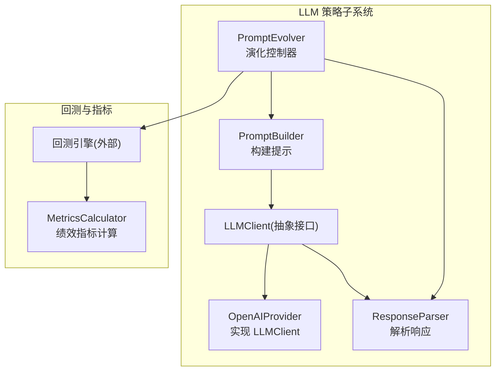
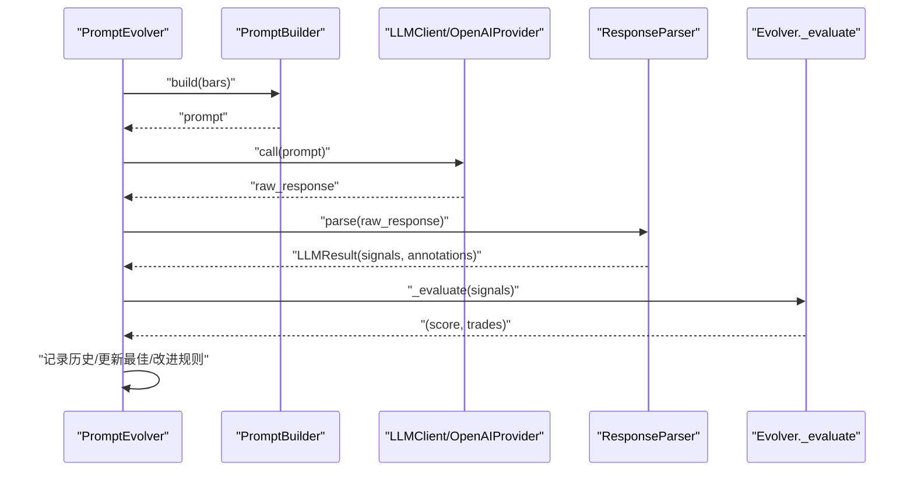
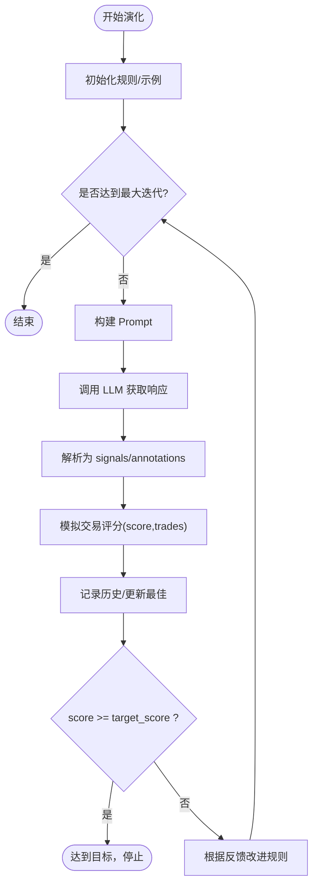
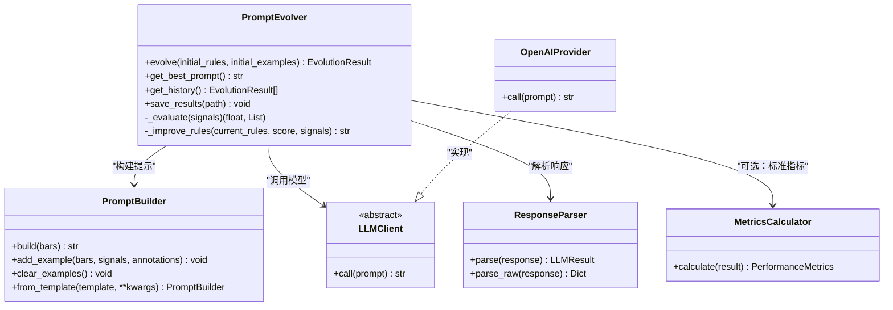

# 策略演化系统

<cite>
**本文引用的文件**   
- [evolver.py](file://src/caisen/strategy/llm/evolver.py)
- [prompt.py](file://src/caisen/strategy/llm/prompt.py)
- [client.py](file://src/caisen/strategy/llm/client.py)
- [response.py](file://src/caisen/strategy/llm/response.py)
- [provider.py](file://src/caisen/strategy/llm/provider.py)
- [default.py](file://src/caisen/strategy/llm/prompts/default.py)
- [calculator.py](file://src/caisen/result/calculator.py)
- [metrics.py](file://src/caisen/result/metrics.py)
- [config_llm_example.yaml](file://configs/strategies/config_llm_example.yaml)
- [test_llm_evolve.py](file://scripts/test_llm_evolve.py)
- [caisen_optimizer.py](file://src/caisen/strategy/algorithm/caisen_optimizer.py)
- [0019-adaptive-parameter-optimization.md](file://docs/adr/0019-adaptive-parameter-optimization.md)
</cite>

## 目录
1. [引言](#引言)
2. [项目结构](#项目结构)
3. [核心组件](#核心组件)
4. [架构总览](#架构总览)
5. [详细组件分析](#详细组件分析)
6. [依赖关系分析](#依赖关系分析)
7. [性能与并行](#性能与并行)
8. [故障排查指南](#故障排查指南)
9. [结论](#结论)
10. [附录：配置模板与最佳实践](#附录配置模板与最佳实践)

## 引言
本文件面向 Caisen 量化回测系统的“策略演化系统”，聚焦于 PromptEvolver（Prompt 进化器）的自动化优化流程，包括历史表现分析、Prompt 自动改进、参数自适应调整等核心能力。文档同时覆盖评估指标体系、优化目标设定、迭代优化算法与收敛判断机制、与回测引擎的集成方式、并行执行策略、演化配置模板与自定义评估函数开发指南，以及演化过程监控、结果对比分析与可视化展示，并提供完整工作流示例与最佳实践建议。

## 项目结构
策略演化系统位于 LLM 策略子系统中，围绕“构建提示—调用模型—解析响应—评估信号—改进规则”的闭环展开，并与回测引擎和结果指标模块解耦协作。

图表来源
- [evolver.py:1-120](file://src/caisen/strategy/llm/evolver.py#L1-L120)
- [prompt.py:1-116](file://src/caisen/strategy/llm/prompt.py#L1-L116)
- [client.py:1-38](file://src/caisen/strategy/llm/client.py#L1-L38)
- [provider.py:1-75](file://src/caisen/strategy/llm/provider.py#L1-L75)
- [response.py:1-128](file://src/caisen/strategy/llm/response.py#L1-L128)
- [calculator.py:1-185](file://src/caisen/result/calculator.py#L1-L185)

章节来源
- [evolver.py:1-120](file://src/caisen/strategy/llm/evolver.py#L1-L120)
- [prompt.py:1-116](file://src/caisen/strategy/llm/prompt.py#L1-L116)
- [client.py:1-38](file://src/caisen/strategy/llm/client.py#L1-L38)
- [provider.py:1-75](file://src/caisen/strategy/llm/provider.py#L1-L75)
- [response.py:1-128](file://src/caisen/strategy/llm/response.py#L1-L128)
- [calculator.py:1-185](file://src/caisen/result/calculator.py#L1-L185)

## 核心组件
- PromptEvolver：演化主循环，负责迭代构建 Prompt、调用 LLM、解析响应、评估信号质量、更新最佳结果并改进规则。
- PromptBuilder：将系统提示、规则框架、Few-shot 示例、输出格式与实际 K 线数据组装为最终 Prompt。
- LLMClient/LLMResult：LLM 客户端抽象与返回数据结构，屏蔽具体模型差异。
- OpenAIProvider：基于 OpenAI SDK 的具体实现，支持自定义端点、温度、最大 token 数及推理思考控制。
- ResponseParser：从原始响应中提取 JSON，兼容 markdown 代码块与截断降级，校验 signals 字段完整性。
- MetricsCalculator/PerformanceMetrics：统一绩效指标计算入口与指标容器，提供年化收益、最大回撤、夏普比率、胜率、盈亏比等。

章节来源
- [evolver.py:1-120](file://src/caisen/strategy/llm/evolver.py#L1-L120)
- [prompt.py:1-116](file://src/caisen/strategy/llm/prompt.py#L1-L116)
- [client.py:1-38](file://src/caisen/strategy/llm/client.py#L1-L38)
- [provider.py:1-75](file://src/caisen/strategy/llm/provider.py#L1-L75)
- [response.py:1-128](file://src/caisen/strategy/llm/response.py#L1-L128)
- [calculator.py:1-185](file://src/caisen/result/calculator.py#L1-L185)
- [metrics.py:1-10](file://src/caisen/result/metrics.py#L1-L10)

## 架构总览
下图展示了 PromptEvolver 在一次演化迭代中的端到端调用序列，涵盖提示构建、模型调用、响应解析、信号评估与规则改进。

图表来源
- [evolver.py:60-119](file://src/caisen/strategy/llm/evolver.py#L60-L119)
- [prompt.py:54-116](file://src/caisen/strategy/llm/prompt.py#L54-L116)
- [client.py:21-38](file://src/caisen/strategy/llm/client.py#L21-L38)
- [provider.py:45-75](file://src/caisen/strategy/llm/provider.py#L45-L75)
- [response.py:79-128](file://src/caisen/strategy/llm/response.py#L79-L128)

## 详细组件分析

### PromptEvolver 演化主循环
- 初始化：接收 LLM 客户端、K 线数据、最大迭代次数、目标评分与响应解析器；维护历史与最佳结果。
- 迭代流程：
  - 使用 PromptBuilder 构建当前规则的 Prompt。
  - 调用 LLM 获取原始响应，并通过 ResponseParser 解析为结构化信号。
  - 通过内部评估函数对信号进行简单模拟交易评分，记录历史并更新最佳结果。
  - 若达到目标评分则提前停止；否则根据信号统计特征与评分反馈改进规则。
- 终止条件：达到最大迭代或达到目标评分。
- 输出：最佳结果包含评分、最优 Prompt、信号与交易列表、相对提升。

图表来源
- [evolver.py:60-119](file://src/caisen/strategy/llm/evolver.py#L60-L119)
- [evolver.py:121-179](file://src/caisen/strategy/llm/evolver.py#L121-L179)
- [evolver.py:181-219](file://src/caisen/strategy/llm/evolver.py#L181-L219)

章节来源
- [evolver.py:1-120](file://src/caisen/strategy/llm/evolver.py#L1-L120)
- [evolver.py:121-219](file://src/caisen/strategy/llm/evolver.py#L121-L219)

### PromptBuilder 提示构建器
- 职责：组合系统提示、规则框架、Few-shot 示例、输出格式说明与真实 K 线数据，生成可直接发送给模型的 Prompt。
- 特性：
  - 支持运行时注入 Few-shot 示例，优先级高于内置模板示例。
  - 针对推理模型可关闭内置示例以减少 thinking token 消耗。
  - 将 K 线数据以纯 JSON 形式拼接，避免诱导模型用代码块输出。
- 扩展：可从模板字典创建实例，便于配置化驱动。

章节来源
- [prompt.py:1-116](file://src/caisen/strategy/llm/prompt.py#L1-L116)
- [default.py:1-154](file://src/caisen/strategy/llm/prompts/default.py#L1-L154)

### LLMClient 与 OpenAIProvider
- LLMClient：定义 call(prompt)->raw_response 的统一接口，解耦提示构建与响应解析。
- OpenAIProvider：
  - 支持自定义 base_url、temperature、max_tokens。
  - 可通过 extra_body 透传额外参数，默认在 disable_thinking=True 时注入 {"thinking":{"type":"disabled"}}。
  - 兼容本地部署或第三方兼容 OpenAI 协议的模型服务。

章节来源
- [client.py:1-38](file://src/caisen/strategy/llm/client.py#L1-L38)
- [provider.py:1-75](file://src/caisen/strategy/llm/provider.py#L1-L75)

### ResponseParser 响应解析器
- 功能：
  - 剥离推理模型的 <think>...</think> 思考块。
  - 提取 JSON：优先直接解析，其次从 markdown 代码块提取，最后尝试截断降级修复。
  - 校验 signals 必需字段（timestamp、action）。
- 异常：当无法提取合法 JSON 或缺少必需字段时抛出 ValueError，便于上层捕获与重试。

章节来源
- [response.py:1-128](file://src/caisen/strategy/llm/response.py#L1-L128)

### 评估指标体系与优化目标
- 演化内评估（轻量）：
  - 基于信号的简单模拟交易，累计盈亏并考虑交易频率惩罚，得到单轮 score。
- 回测级指标（标准）：
  - 通过 MetricsCalculator 计算 PerformanceMetrics，包括年化收益率、最大回撤、夏普比率、胜率、总交易数、盈亏比、平均盈利/亏损、总收益率。
- 优化目标设定：
  - 可在 PromptEvolver 中设置 target_score 作为早停阈值。
  - 在更复杂的场景下，可结合 Walk-Forward 验证与多目标加权（见 ADR-0019）。

章节来源
- [evolver.py:121-179](file://src/caisen/strategy/llm/evolver.py#L121-L179)
- [calculator.py:1-185](file://src/caisen/result/calculator.py#L1-L185)
- [metrics.py:1-10](file://src/caisen/result/metrics.py#L1-L10)
- [0019-adaptive-parameter-optimization.md:1-98](file://docs/adr/0019-adaptive-parameter-optimization.md#L1-L98)

### 与回测引擎的集成与并行执行
- 集成方式：
  - PromptEvolver 通过 LLM 生成信号后，可将信号交由回测引擎执行完整回测，并使用 MetricsCalculator 计算标准指标。
  - 也可在演化阶段使用轻量评估快速筛选，再对候选方案进行全量回测。
- 并行策略：
  - 网格搜索优化已提供 ThreadPoolExecutor 并行执行多个参数组合的回测，可作为参考模式用于批量演化任务。
  - 对于 LLM 调用，建议在 Provider 层增加请求限流与重试退避，避免并发过高导致服务端拒绝。

章节来源
- [caisen_optimizer.py:198-342](file://src/caisen/strategy/algorithm/caisen_optimizer.py#L198-L342)
- [provider.py:45-75](file://src/caisen/strategy/llm/provider.py#L45-L75)

### 演化过程监控、结果对比与可视化
- 监控：
  - 每次迭代打印 score 与 improvement，保存 history 与 best_result。
  - 支持 save_results 持久化为 JSON，便于后续分析。
- 对比与可视化：
  - 前端 runs-list 支持按策略分组与版本对比图，适合展示多次演化的权益曲线与关键指标变化。
  - 可将 metrics.json 与 equity_curve 导入前端进行可视化。

章节来源
- [evolver.py:231-247](file://src/caisen/strategy/llm/evolver.py#L231-L247)
- [runs-list.js:284-337](file://src/caisen/frontend/src/js/runs-list.js#L284-L337)

## 依赖关系分析

图表来源
- [evolver.py:1-120](file://src/caisen/strategy/llm/evolver.py#L1-L120)
- [prompt.py:1-116](file://src/caisen/strategy/llm/prompt.py#L1-L116)
- [client.py:1-38](file://src/caisen/strategy/llm/client.py#L1-L38)
- [provider.py:1-75](file://src/caisen/strategy/llm/provider.py#L1-L75)
- [response.py:1-128](file://src/caisen/strategy/llm/response.py#L1-L128)
- [calculator.py:1-185](file://src/caisen/result/calculator.py#L1-L185)

## 性能与并行
- 评估复杂度：
  - 轻量评估为 O(N)，N 为 K 线数量，主要开销在遍历信号与匹配时间戳。
  - 指标计算涉及权益曲线与交易配对，整体复杂度与交易次数线性相关。
- 并行优化：
  - 网格搜索采用线程池并行执行多条回测，可按 CPU 核数调整 n_workers。
  - LLM 调用受限于 API 速率限制，建议在上层做队列与退避重试。
- 内存与 I/O：
  - 大样本 K 线与长历史需关注内存占用，必要时分片处理。
  - 结果持久化建议异步落盘，避免阻塞主流程。

[本节为通用性能指导，不直接分析具体文件]

## 故障排查指南
- 常见错误与定位：
  - 响应被截断或未闭合 JSON：检查 max_tokens 与模型输出长度，确保 ResponseParser 能成功降级修复。
  - 缺失必需字段：确认 LLM 遵循输出格式要求，signals 必须包含 timestamp 与 action。
  - 过度交易扣分：若 score 偏低且交易频繁，需在规则中强调止损与入场过滤。
- 调试建议：
  - 启用 quick_evolution 脚本进行最小化复现。
  - 保存 history 与 best_prompt，逐轮比对规则与信号分布。
  - 将信号输入回测引擎，观察权益曲线与指标变化，定位问题环节。

章节来源
- [response.py:10-24](file://src/caisen/strategy/llm/response.py#L10-L24)
- [response.py:27-76](file://src/caisen/strategy/llm/response.py#L27-L76)
- [response.py:106-113](file://src/caisen/strategy/llm/response.py#L106-L113)
- [test_llm_evolve.py:1-30](file://scripts/test_llm_evolve.py#L1-L30)

## 结论
策略演化系统以 PromptEvolver 为核心，形成“构建—调用—解析—评估—改进”的闭环，配合 PromptBuilder 与 ResponseParser 实现稳定的提示工程流水线，并通过 MetricsCalculator 对接标准回测指标。系统在易用性与可扩展性之间取得平衡：既支持快速轻量评估，也支持严谨的全量回测与多目标优化。未来可引入 Walk-Forward 与自适应触发机制，进一步提升泛化与持续演进能力。

[本节为总结性内容，不直接分析具体文件]

## 附录：配置模板与最佳实践

### 演化配置模板（YAML）
- 基础字段：
  - mode: llm
  - backtest.initial_capital/commission_rate/slippage
  - strategy.name/type
  - data.symbol/freq/start/end/data_dir
  - llm.provider/api_key/model/temperature
  - llm.rules/examples
  - llm.cache_enabled/cache_dir
  - output_dir
- 示例路径：
  - [config_llm_example.yaml](file://configs/strategies/config_llm_example.yaml)

章节来源
- [config_llm_example.yaml:1-40](file://configs/strategies/config_llm_example.yaml#L1-L40)

### 自定义评估函数开发指南
- 设计原则：
  - 输入：signals 列表；输出：标量 score 与辅助信息（如 trades）。
  - 可加入滑点、手续费、仓位管理、风控约束等。
  - 建议返回可解释的中间指标，便于诊断。
- 集成方式：
  - 在 PromptEvolver 中替换 _evaluate 逻辑，或通过回调注入。
  - 与 MetricsCalculator 联动，将轻量评估与标准指标结合。
- 参考实现位置：
  - 轻量评估：_evaluate
  - 标准指标：MetricsCalculator.calculate

章节来源
- [evolver.py:121-179](file://src/caisen/strategy/llm/evolver.py#L121-L179)
- [calculator.py:45-79](file://src/caisen/result/calculator.py#L45-L79)

### 完整演化工作流示例
- 步骤：
  1) 准备 K 线数据与 LLM 客户端（OpenAIProvider）。
  2) 初始化 PromptEvolver，设置 max_iterations 与 target_score。
  3) 运行 evolve，获取最佳结果与历史。
  4) 将最佳 Prompt 与信号提交回测引擎，计算标准指标。
  5) 保存结果并可视化对比。
- 快速测试脚本：
  - [test_llm_evolve.py](file://scripts/test_llm_evolve.py)

章节来源
- [test_llm_evolve.py:1-30](file://scripts/test_llm_evolve.py#L1-L30)
- [evolver.py:250-282](file://src/caisen/strategy/llm/evolver.py#L250-L282)

### 最佳实践建议
- 提示工程：
  - 明确输出格式与字段校验，减少解析失败。
  - 合理使用 Few-shot 示例，注意推理模型的 token 成本。
- 评估与优化：
  - 先轻量评估筛选，再全量回测验证，提高迭代效率。
  - 设置合理的 target_score 与 early stop，避免无效迭代。
- 并行与稳定性：
  - 合理设置 n_workers，避免资源争用。
  - 对 LLM 调用增加重试与退避，保障鲁棒性。
- 结果管理与可视化：
  - 持久化 history 与 metrics，建立版本对比视图。
  - 定期归档最佳 Prompt 与对应回测报告。

[本节为通用实践指导，不直接分析具体文件]