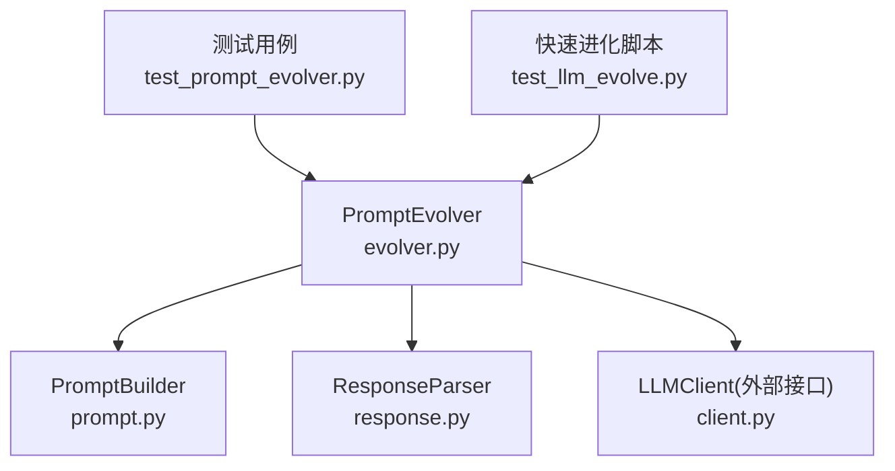
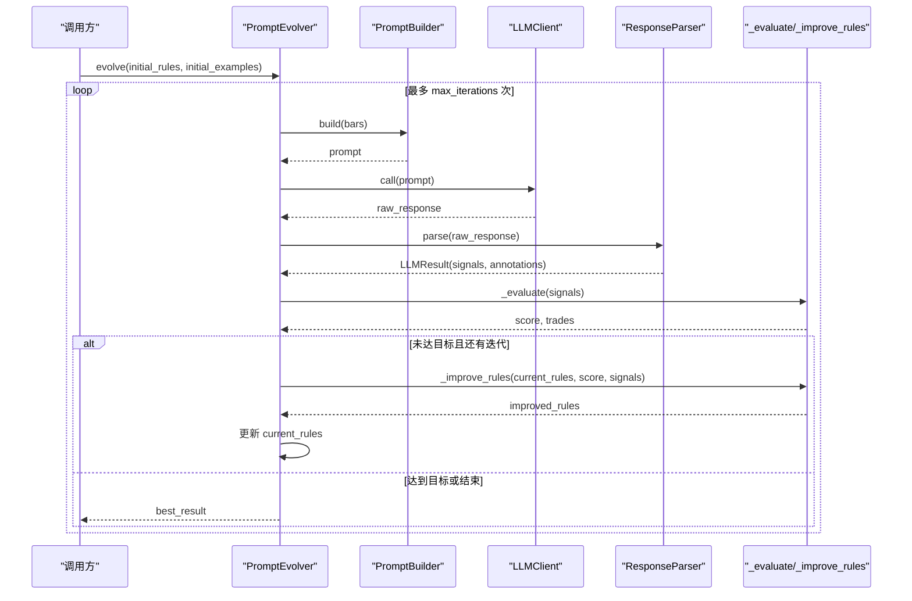
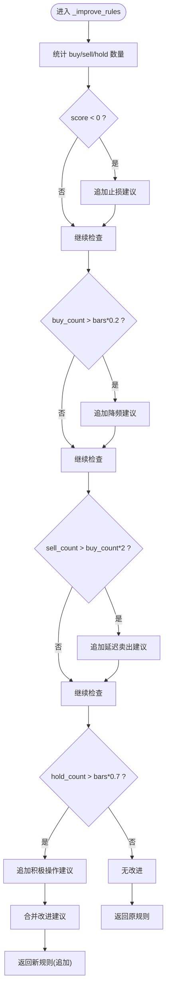
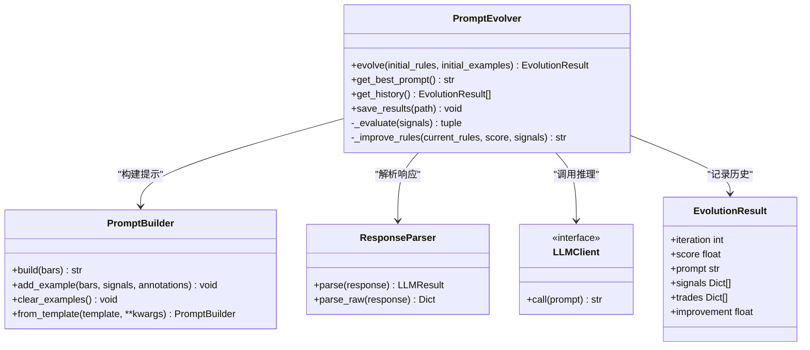

# 规则自动改进

<cite>
**本文引用的文件**
- [evolver.py](file://src/caisen/strategy/llm/evolver.py)
- [prompt.py](file://src/caisen/strategy/llm/prompt.py)
- [response.py](file://src/caisen/strategy/llm/response.py)
- [__init__.py](file://src/caisen/strategy/llm/__init__.py)
- [test_prompt_evolver.py](file://tests/test_prompt_evolver.py)
- [test_llm_evolve.py](file://scripts/test_llm_evolve.py)
</cite>

## 目录
1. [简介](#简介)
2. [项目结构](#项目结构)
3. [核心组件](#核心组件)
4. [架构总览](#架构总览)
5. [详细组件分析](#详细组件分析)
6. [依赖关系分析](#依赖关系分析)
7. [性能与可扩展性](#性能与可扩展性)
8. [故障排查指南](#故障排查指南)
9. [结论](#结论)
10. [附录：自定义扩展与监控](#附录自定义扩展与监控)

## 简介
本文件聚焦策略演化系统中的“规则自动改进”机制，围绕 PromptEvolver 的 _improve_rules 方法展开，系统阐述其智能改进逻辑、信号特征分析、问题诊断与建议生成；说明基于反馈的规则调整策略（如亏损止损增强、过度交易频率控制等）；解释改进规则的优先级与冲突解决机制；并提供自定义改进策略的开发接口与扩展方法；最后给出规则改进效果的监控与分析工具使用指南。

## 项目结构
与规则自动改进相关的代码主要位于 LLM 子模块中，关键文件如下：
- evolver.py：进化器主类与快速进化入口，包含评分评估与规则改进逻辑
- prompt.py：Prompt 构建器，负责组装系统提示、规则框架、示例与输出格式
- response.py：LLM 响应解析器，负责 JSON 提取、校验与结构化转换
- __init__.py：对外导出 PromptEvolver、quick_evolution 等能力
- tests/test_prompt_evolver.py：覆盖进化流程、评估与改进逻辑的测试
- scripts/test_llm_evolve.py：端到端快速进化脚本示例

图表来源
- [evolver.py:1-119](file://src/caisen/strategy/llm/evolver.py#L1-L119)
- [prompt.py:1-116](file://src/caisen/strategy/llm/prompt.py#L1-L116)
- [response.py:1-128](file://src/caisen/strategy/llm/response.py#L1-L128)

章节来源
- [evolver.py:1-119](file://src/caisen/strategy/llm/evolver.py#L1-L119)
- [prompt.py:1-116](file://src/caisen/strategy/llm/prompt.py#L1-L116)
- [response.py:1-128](file://src/caisen/strategy/llm/response.py#L1-L128)
- [test_prompt_evolver.py:1-156](file://tests/test_prompt_evolver.py#L1-L156)
- [test_llm_evolve.py:1-30](file://scripts/test_llm_evolve.py#L1-L30)

## 核心组件
- PromptEvolver：驱动“构建提示→调用 LLM→解析结果→评估→改进规则”的闭环迭代，维护历史与最佳结果
- PromptBuilder：将规则、示例、输出格式与 K 线数据组合为完整 Prompt
- ResponseParser：从 LLM 原始响应中提取并校验 JSON，转换为结构化 LLMResult
- EvolutionResult：记录每次迭代的评分、规则、信号与模拟交易信息

章节来源
- [evolver.py:13-119](file://src/caisen/strategy/llm/evolver.py#L13-L119)
- [prompt.py:15-116](file://src/caisen/strategy/llm/prompt.py#L15-L116)
- [response.py:79-128](file://src/caisen/strategy/llm/response.py#L79-L128)

## 架构总览
下图展示一次完整的规则自动改进循环：从初始规则出发，经 Prompt 构建、LLM 推理、响应解析、信号评估到规则改进，直至达到目标或最大迭代次数。

图表来源
- [evolver.py:60-119](file://src/caisen/strategy/llm/evolver.py#L60-L119)
- [prompt.py:54-116](file://src/caisen/strategy/llm/prompt.py#L54-L116)
- [response.py:88-113](file://src/caisen/strategy/llm/response.py#L88-L113)

## 详细组件分析

### 智能改进逻辑：_improve_rules 方法
_improve_rules 是规则自动改进的核心。它基于当前评分与信号统计进行问题诊断，并生成改进建议追加到现有规则中。

- 信号特征分析
  - 统计买入、卖出、观望三类动作的数量
  - 结合 K 线长度判断相对频率阈值
- 问题诊断与改进建议
  - 亏损场景：建议注意止损、避免追高
  - 买入过频：降低交易频率，强调只在明确信号时操作
  - 卖出过多：避免过早卖出，趋势确认后再退出
  - 观望过多：适当参与，有明确机会时果断操作
- 改进规则拼接
  - 若存在改进建议，则将其以换行分隔追加到当前规则末尾
  - 若无改进建议，保持原规则不变

图表来源
- [evolver.py:181-219](file://src/caisen/strategy/llm/evolver.py#L181-L219)

章节来源
- [evolver.py:181-219](file://src/caisen/strategy/llm/evolver.py#L181-L219)

### 评分与评估：_evaluate 方法
- 依据信号在 K 线上执行简单回测：买入建仓、卖出平仓，计算单笔收益率并累加
- 引入交易频率惩罚：当交易次数超过一定阈值（与 K 线数量相关）时，对平均收益进行扣分，抑制过度交易
- 返回综合评分与模拟交易明细，供改进逻辑与历史记录使用

章节来源
- [evolver.py:121-179](file://src/caisen/strategy/llm/evolver.py#L121-L179)

### 规则优先级与冲突解决
- 优先级
  - 亏损优先：当整体评分为负时，止损建议具有最高优先级，确保风险控制优先于收益提升
  - 频率控制：在买入过于频繁时，降频建议优先于其他优化，防止过度交易带来的滑点与成本损耗
  - 行为平衡：针对卖出过多或观望过多的情况，分别给出方向性修正建议
- 冲突解决
  - 通过条件分支顺序实现隐式优先级：先处理亏损，再处理频率与行为失衡
  - 多条建议以文本形式追加，不互相覆盖，避免破坏既有有效规则
  - 若本轮无任何触发条件，则保留原规则，保证稳定性

章节来源
- [evolver.py:181-219](file://src/caisen/strategy/llm/evolver.py#L181-L219)

### 基于反馈的规则调整策略
- 亏损时的止损增强：在评分为负时，自动加入止损与避免追高的约束
- 过度交易时的频率控制：当买入比例过高或交易次数过多时，降低交易频率
- 过早卖出抑制：当卖出远多于买入时，强调趋势确认后再退出
- 参与度不足改善：当观望占比过高时，鼓励在明确机会时积极介入

章节来源
- [evolver.py:181-219](file://src/caisen/strategy/llm/evolver.py#L181-L219)

### 快速进化与便捷入口
- quick_evolution：封装初始化、运行进化与结果汇总，便于快速验证与演示
- 适合在本地脚本中进行多轮迭代测试，观察评分变化与最优 Prompt

章节来源
- [evolver.py:250-282](file://src/caisen/strategy/llm/evolver.py#L250-L282)
- [test_llm_evolve.py:1-30](file://scripts/test_llm_evolve.py#L1-L30)

## 依赖关系分析
- PromptEvolver 依赖 PromptBuilder 构建提示，依赖 ResponseParser 解析响应，依赖 LLMClient 完成推理
- 对外通过 __init__.py 暴露 PromptEvolver、quick_evolution、EvolutionResult 等能力
- 测试用例覆盖初始化、运行、评估与改进逻辑，保障基本正确性

图表来源
- [evolver.py:24-119](file://src/caisen/strategy/llm/evolver.py#L24-L119)
- [prompt.py:15-153](file://src/caisen/strategy/llm/prompt.py#L15-L153)
- [response.py:79-128](file://src/caisen/strategy/llm/response.py#L79-L128)
- [__init__.py:1-19](file://src/caisen/strategy/llm/__init__.py#L1-L19)

章节来源
- [evolver.py:24-119](file://src/caisen/strategy/llm/evolver.py#L24-L119)
- [prompt.py:15-153](file://src/caisen/strategy/llm/prompt.py#L15-L153)
- [response.py:79-128](file://src/caisen/strategy/llm/response.py#L79-L128)
- [__init__.py:1-19](file://src/caisen/strategy/llm/__init__.py#L1-L19)

## 性能与可扩展性
- 时间复杂度
  - _evaluate：O(N)，N 为 K 线数量，逐根扫描匹配信号
  - _improve_rules：O(M)，M 为信号数量，统计三类动作计数
- 空间复杂度
  - 历史记录保存每轮的评分、规则与交易明细，随迭代线性增长
- 可扩展性建议
  - 可插拔评分函数：将 _evaluate 抽象为可配置评分策略，支持夏普比率、最大回撤等指标
  - 可插拔改进策略：将 _improve_rules 抽象为改进策略接口，支持多种启发式或基于元学习的策略
  - 并发与缓存：对相同 bars+rules 的 Prompt 构建与 LLM 调用可引入缓存，减少重复开销

[本节为通用指导，无需源码引用]

## 故障排查指南
- 响应解析失败
  - 现象：无法提取合法 JSON 或缺少必需字段
  - 原因：模型输出被截断或未遵循输出格式
  - 处理：检查模型 max_tokens 设置、减少 K 线数量、确保输出符合 schema
- 思考过程干扰
  - 现象：响应中包含 <think>...</think> 块导致解析异常
  - 处理：解析器已内置剥离逻辑，若仍失败需确认模型是否提前截断
- 空信号或无效信号
  - 现象：无信号或缺少 timestamp/action 字段
  - 处理：在 PromptBuilder 中强化输出格式约束，或在 ResponseParser 中增加更严格的校验

章节来源
- [response.py:10-24](file://src/caisen/strategy/llm/response.py#L10-L24)
- [response.py:27-76](file://src/caisen/strategy/llm/response.py#L27-L76)
- [response.py:88-113](file://src/caisen/strategy/llm/response.py#L88-L113)

## 结论
规则自动改进机制通过“评估—诊断—改进”的闭环，持续优化策略规则。_improve_rules 方法以信号特征为基础，结合评分反馈生成针对性建议，并在优先级与冲突解决上采用“风险优先、频率控制、行为平衡”的策略。配合 PromptBuilder 与 ResponseParser，形成稳定可靠的自动化演进链路。通过可插拔的评分与改进策略接口，系统具备良好的扩展性与工程化落地能力。

[本节为总结，无需源码引用]

## 附录：自定义扩展与监控

### 自定义改进策略开发接口
- 替换改进逻辑
  - 继承 PromptEvolver 并重写 _improve_rules，实现更复杂的启发式或数据驱动的改进策略
  - 参考路径：[evolver.py:181-219](file://src/caisen/strategy/llm/evolver.py#L181-L219)
- 自定义评分函数
  - 继承 PromptEvolver 并重写 _evaluate，接入更全面的绩效指标（如夏普比率、最大回撤、胜率等）
  - 参考路径：[evolver.py:121-179](file://src/caisen/strategy/llm/evolver.py#L121-L179)
- 自定义 Prompt 模板
  - 通过 PromptBuilder.from_template 注入 system_prompt、rules、output_format 与 examples
  - 参考路径：[prompt.py:136-153](file://src/caisen/strategy/llm/prompt.py#L136-L153)

章节来源
- [evolver.py:121-219](file://src/caisen/strategy/llm/evolver.py#L121-L219)
- [prompt.py:136-153](file://src/caisen/strategy/llm/prompt.py#L136-L153)

### 监控与分析工具使用指南
- 获取最佳规则与历史
  - get_best_prompt：返回最佳 Prompt
  - get_history：返回所有迭代的历史记录
  - save_results：将最佳评分、最佳规则与历史摘要保存到 JSON
  - 参考路径：[evolver.py:221-248](file://src/caisen/strategy/llm/evolver.py#L221-L248)
- 快速验证
  - quick_evolution：一键启动多轮进化并打印关键结果
  - 参考路径：[evolver.py:250-282](file://src/caisen/strategy/llm/evolver.py#L250-L282)
- 单元测试辅助
  - 使用 MockLLMClient 构造固定响应，验证评估与改进逻辑
  - 参考路径：[test_prompt_evolver.py:12-25](file://tests/test_prompt_evolver.py#L12-L25)、[test_prompt_evolver.py:94-108](file://tests/test_prompt_evolver.py#L94-L108)

章节来源
- [evolver.py:221-282](file://src/caisen/strategy/llm/evolver.py#L221-L282)
- [test_prompt_evolver.py:94-108](file://tests/test_prompt_evolver.py#L94-L108)