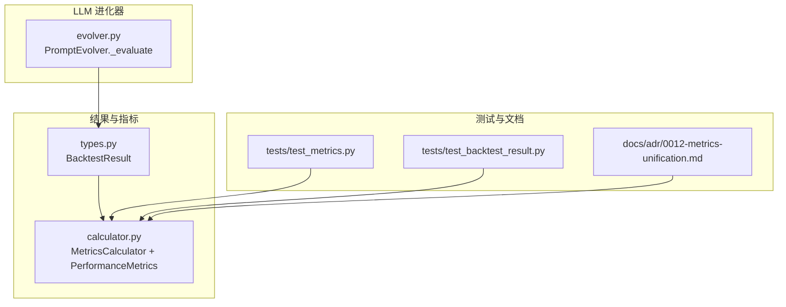
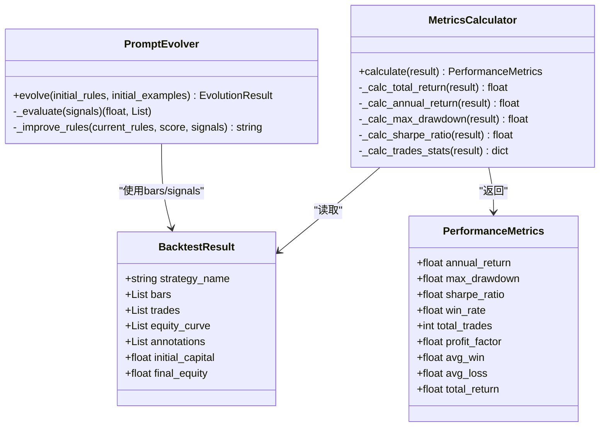
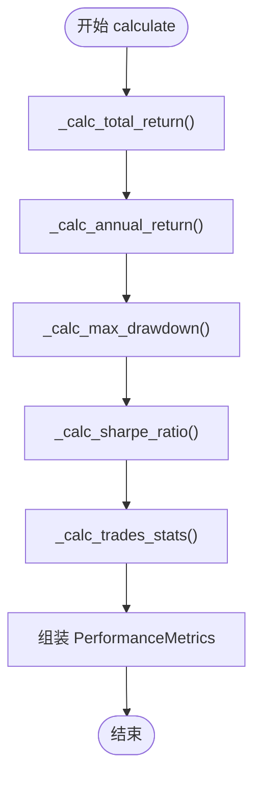
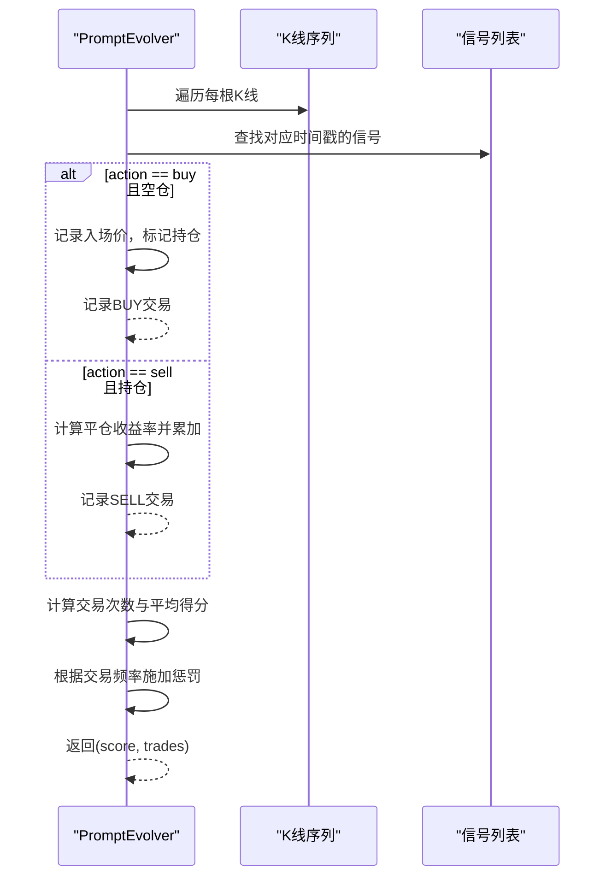
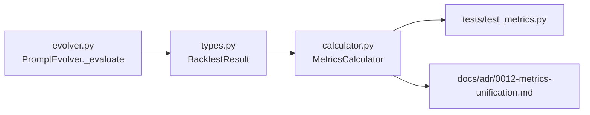

# 评估指标体系

<cite>
**本文引用的文件**   
- [src/caisen/result/calculator.py](file://src/caisen/result/calculator.py)
- [src/caisen/result/types.py](file://src/caisen/result/types.py)
- [src/caisen/strategy/llm/evolver.py](file://src/caisen/strategy/llm/evolver.py)
- [tests/test_metrics.py](file://tests/test_metrics.py)
- [tests/test_backtest_result.py](file://tests/test_backtest_result.py)
- [docs/adr/0012-metrics-unification.md](file://docs/adr/0012-metrics-unification.md)
</cite>

## 目录
1. [引言](#引言)
2. [项目结构](#项目结构)
3. [核心组件](#核心组件)
4. [架构总览](#架构总览)
5. [详细组件分析](#详细组件分析)
6. [依赖关系分析](#依赖关系分析)
7. [性能与数值特性](#性能与数值特性)
8. [故障排查指南](#故障排查指南)
9. [结论](#结论)
10. [附录：自定义评估函数开发指南](#附录自定义评估函数开发指南)

## 引言
本文件围绕策略演化系统的评估指标体系，系统性说明以下要点：
- _evaluate 方法的评分算法：模拟交易执行、盈亏计算、交易频率控制等核心逻辑
- 评估指标含义与计算方法：平均收益率、最大回撤、夏普比率、胜率、盈亏比等
- 评分权重分配与惩罚机制的设计原理
- 自定义评估函数的开发指南与最佳实践
- 不同市场环境下的指标调整建议与示例代码路径

## 项目结构
评估相关代码主要分布在结果计算与 LLM 进化器两个模块中：
- 回测结果数据模型：BacktestResult（纯数据容器）
- 绩效指标计算器：MetricsCalculator（唯一计算入口），输出 PerformanceMetrics
- LLM 提示词进化器：PromptEvolver._evaluate（基于信号进行简易回测与评分）

图表来源
- [src/caisen/result/types.py:1-32](file://src/caisen/result/types.py#L1-L32)
- [src/caisen/result/calculator.py:1-185](file://src/caisen/result/calculator.py#L1-L185)
- [src/caisen/strategy/llm/evolver.py:1-282](file://src/caisen/strategy/llm/evolver.py#L1-L282)
- [tests/test_metrics.py:1-170](file://tests/test_metrics.py#L1-L170)
- [tests/test_backtest_result.py:26-233](file://tests/test_backtest_result.py#L26-L233)
- [docs/adr/0012-metrics-unification.md:1-60](file://docs/adr/0012-metrics-unification.md#L1-L60)

章节来源
- [src/caisen/result/types.py:1-32](file://src/caisen/result/types.py#L1-L32)
- [src/caisen/result/calculator.py:1-185](file://src/caisen/result/calculator.py#L1-L185)
- [src/caisen/strategy/llm/evolver.py:1-282](file://src/caisen/strategy/llm/evolver.py#L1-L282)
- [docs/adr/0012-metrics-unification.md:1-60](file://docs/adr/0012-metrics-unification.md#L1-L60)

## 核心组件
- BacktestResult：回测结果的数据容器，包含 K 线、交易记录、净值曲线、初始/最终资金等。
- MetricsCalculator：统一的指标计算入口，负责计算年化收益、最大回撤、夏普比率、胜率、盈亏比、平均盈利/亏损、总收益等。
- PerformanceMetrics：指标数据载体，不含计算逻辑。
- PromptEvolver._evaluate：对 LLM 生成的信号进行简单回测并给出评分，用于驱动规则迭代优化。

章节来源
- [src/caisen/result/types.py:1-32](file://src/caisen/result/types.py#L1-L32)
- [src/caisen/result/calculator.py:1-185](file://src/caisen/result/calculator.py#L1-L185)
- [src/caisen/strategy/llm/evolver.py:121-179](file://src/caisen/strategy/llm/evolver.py#L121-L179)

## 架构总览
系统采用“数据与计算分离”的架构：
- 数据层：BacktestResult 仅承载原始数据
- 计算层：MetricsCalculator 提供统一计算接口
- 应用层：PromptEvolver 在进化循环中调用 _evaluate 对信号进行快速回测与评分

图表来源
- [src/caisen/result/types.py:1-32](file://src/caisen/result/types.py#L1-L32)
- [src/caisen/result/calculator.py:17-79](file://src/caisen/result/calculator.py#L17-L79)
- [src/caisen/strategy/llm/evolver.py:24-119](file://src/caisen/strategy/llm/evolver.py#L24-L119)

## 详细组件分析

### 指标计算：MetricsCalculator
- 总收益率：(最终净值 - 初始资金) / 初始资金
- 年化收益率：基于交易日长度折算为年化（按每年 250 个交易日）
- 最大回撤：净值序列相对历史峰值的最大负偏离
- 夏普比率：日收益率均值/标准差，再乘以 sqrt(250) 进行年化；无风险利率设为 0
- 交易统计：支持多头与空头配对，计算胜率、盈亏比、平均盈利/亏损、总交易数

图表来源
- [src/caisen/result/calculator.py:45-79](file://src/caisen/result/calculator.py#L45-L79)
- [src/caisen/result/calculator.py:81-185](file://src/caisen/result/calculator.py#L81-L185)

章节来源
- [src/caisen/result/calculator.py:45-185](file://src/caisen/result/calculator.py#L45-L185)
- [tests/test_metrics.py:33-147](file://tests/test_metrics.py#L33-L147)
- [tests/test_backtest_result.py:26-233](file://tests/test_backtest_result.py#L26-L233)

### 信号评估：PromptEvolver._evaluate
该方法是策略演化系统中的关键评分入口，流程如下：
- 输入：K 线序列 self.bars 与 LLM 输出的信号列表 signals
- 逐根 K 线匹配信号，执行简单模拟交易：
  - 当出现 buy 且空仓时开多仓，记录入场价
  - 当出现 sell 且持有多仓时平仓，计算单笔收益率并累加到总分
- 交易频率控制：
  - 以完整交易次数（买入+卖出=1笔）计算平均得分
  - 若交易过于频繁，则施加频率惩罚，降低总分
- 输出：综合评分与模拟交易明细

图表来源
- [src/caisen/strategy/llm/evolver.py:121-179](file://src/caisen/strategy/llm/evolver.py#L121-L179)

章节来源
- [src/caisen/strategy/llm/evolver.py:121-179](file://src/caisen/strategy/llm/evolver.py#L121-L179)
- [tests/test_prompt_evolver.py:89-156](file://tests/test_prompt_evolver.py#L89-L156)

### 指标含义与计算方法
- 总收益率：衡量整体资金增长比例
- 年化收益率：将总收益折算为年度化水平，便于跨周期比较
- 最大回撤：衡量极端下行风险，负值表示从峰值回落幅度
- 夏普比率：单位波动所获得的超额收益（此处无风险利率为 0）
- 胜率：完成交易的盈利占比
- 盈亏比：总盈利金额与总亏损金额的比值
- 平均盈利/亏损：分别对盈利与亏损交易取均值
- 总交易数：所有开仓与平仓订单总数

章节来源
- [src/caisen/result/calculator.py:17-79](file://src/caisen/result/calculator.py#L17-L79)
- [src/caisen/result/calculator.py:81-185](file://src/caisen/result/calculator.py#L81-L185)
- [tests/test_metrics.py:33-147](file://tests/test_metrics.py#L33-L147)

### 评分权重分配与惩罚机制
- 基础评分：累计每笔完整交易的收益率
- 平均化：用完整交易次数对总分做平均，避免样本量差异带来的偏差
- 频率惩罚：当交易次数超过阈值（与 K 线数量成比例）时，线性扣分，抑制过度交易
- 改进反馈：在进化循环中，依据评分与信号分布特征动态追加规则文本，引导下一轮生成更稳健的信号

章节来源
- [src/caisen/strategy/llm/evolver.py:170-179](file://src/caisen/strategy/llm/evolver.py#L170-L179)
- [src/caisen/strategy/llm/evolver.py:181-219](file://src/caisen/strategy/llm/evolver.py#L181-L219)

## 依赖关系分析
- 计算层依赖数据层：MetricsCalculator 读取 BacktestResult 中的净值曲线与交易记录
- 应用层依赖计算层：PromptEvolver 通过 _evaluate 对信号进行快速回测，作为进化目标函数
- 测试与文档验证：单元测试覆盖指标计算与边界条件，ADR 明确“单一真相源”的计算入口

图表来源
- [src/caisen/result/types.py:1-32](file://src/caisen/result/types.py#L1-L32)
- [src/caisen/result/calculator.py:1-185](file://src/caisen/result/calculator.py#L1-L185)
- [src/caisen/strategy/llm/evolver.py:121-179](file://src/caisen/strategy/llm/evolver.py#L121-L179)
- [tests/test_metrics.py:1-170](file://tests/test_metrics.py#L1-L170)
- [docs/adr/0012-metrics-unification.md:1-60](file://docs/adr/0012-metrics-unification.md#L1-L60)

章节来源
- [docs/adr/0012-metrics-unification.md:1-60](file://docs/adr/0012-metrics-unification.md#L1-L60)

## 性能与数值特性
- 复杂度
  - 指标计算：O(N) 扫描净值曲线与交易记录
  - 信号评估：O(N*M) 逐根 K 线匹配信号（N 为 K 线数，M 为信号数）
- 数值稳定性
  - 夏普比率在收益率标准差接近 0 时返回 0，避免除零异常
  - 最大回撤在空净值曲线时返回 0
  - 交易统计在无交易或无法配对时返回安全默认值
- 可观测性
  - 进化过程打印每次迭代的评分与提升幅度，便于监控收敛

章节来源
- [src/caisen/result/calculator.py:111-122](file://src/caisen/result/calculator.py#L111-L122)
- [src/caisen/result/calculator.py:101-109](file://src/caisen/result/calculator.py#L101-L109)
- [src/caisen/result/calculator.py:124-185](file://src/caisen/result/calculator.py#L124-L185)
- [src/caisen/strategy/llm/evolver.py:107-118](file://src/caisen/strategy/llm/evolver.py#L107-L118)

## 故障排查指南
- 指标全为零
  - 检查是否传入空净值曲线或初始资金为 0
  - 确认交易记录是否为空或未形成配对
- 夏普比率未变化
  - 检查收益率序列是否存在方差为 0 的情况
- 最大回撤异常
  - 确认净值曲线是否单调递增（此时回撤应为 0）
- 信号评估分数不升反降
  - 检查交易频率惩罚是否过强，适当调整阈值系数
  - 观察信号分布（buy/sell/hold 比例）是否失衡

章节来源
- [tests/test_backtest_result.py:26-84](file://tests/test_backtest_result.py#L26-L84)
- [tests/test_backtest_result.py:87-104](file://tests/test_backtest_result.py#L87-L104)
- [src/caisen/strategy/llm/evolver.py:170-179](file://src/caisen/strategy/llm/evolver.py#L170-L179)

## 结论
本评估体系将“数据与计算解耦”，通过 MetricsCalculator 提供统一、可测试的指标计算能力；同时，PromptEvolver._evaluate 为策略演化提供了轻量、可解释的目标函数，结合频率惩罚与规则改进反馈，实现自驱动的评估与优化闭环。

## 附录：自定义评估函数开发指南

### 设计原则
- 单一职责：评估函数只关注评分逻辑，不耦合数据加载与持久化
- 可组合：将收益、风险、频率等维度拆分为子项，便于加权组合
- 可测试：为每个维度编写单元测试，覆盖边界与异常场景
- 可扩展：通过配置参数调节权重与阈值，适应不同市场风格

### 推荐步骤
- 定义输入输出契约
  - 输入：K 线序列、信号列表（或交易记录）、可选环境参数（如手续费、滑点）
  - 输出：综合评分、分项得分、诊断信息
- 选择核心维度
  - 收益类：总收益、年化收益、平均单笔收益
  - 风险类：最大回撤、波动率、尾部风险
  - 效率类：交易频率、换手率、持有期
  - 质量类：胜率、盈亏比、平均盈利/亏损
- 确定权重与惩罚
  - 权重：根据策略风格（趋势/均值回归/高频）设定各维度权重
  - 惩罚：对过度交易、高回撤、低胜率等进行非线性惩罚
- 实现与测试
  - 参考现有 MetricsCalculator 的模块化设计，逐项实现并单元测试
  - 参考 _evaluate 的频率惩罚思路，加入自适应阈值

### 在不同市场环境下的调整建议
- 趋势市
  - 提高年化收益与盈亏比的权重
  - 适度放宽交易频率限制，允许更多波段参与
- 震荡市
  - 提高胜率与最大回撤控制的权重
  - 收紧交易频率惩罚，避免频繁止损
- 高波动市
  - 引入波动率归一化（例如将收益除以波动率）
  - 强化尾部风险控制，增加对极端回撤的惩罚

### 示例代码路径（参考）
- 指标计算参考
  - [src/caisen/result/calculator.py:45-185](file://src/caisen/result/calculator.py#L45-L185)
- 信号评估与频率惩罚参考
  - [src/caisen/strategy/llm/evolver.py:121-179](file://src/caisen/strategy/llm/evolver.py#L121-L179)
- 指标测试用例参考
  - [tests/test_metrics.py:33-147](file://tests/test_metrics.py#L33-L147)
  - [tests/test_backtest_result.py:26-233](file://tests/test_backtest_result.py#L26-L233)