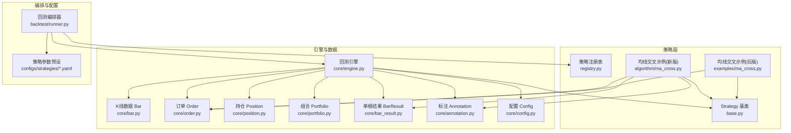
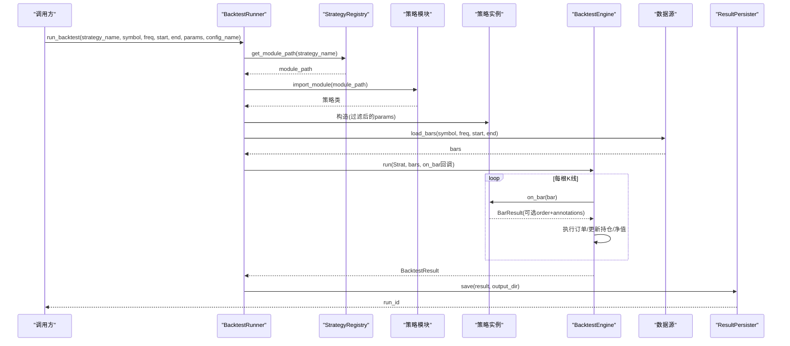
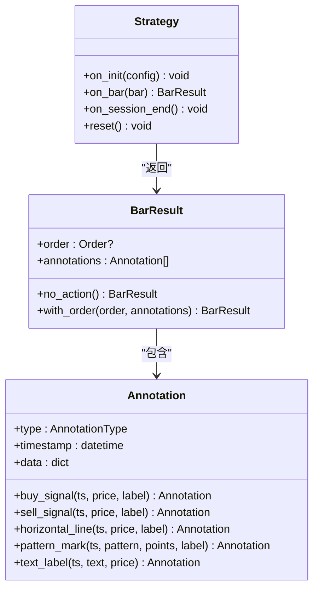
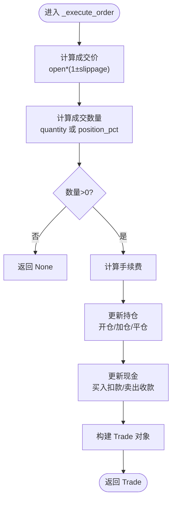
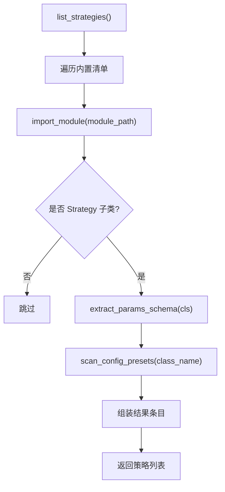
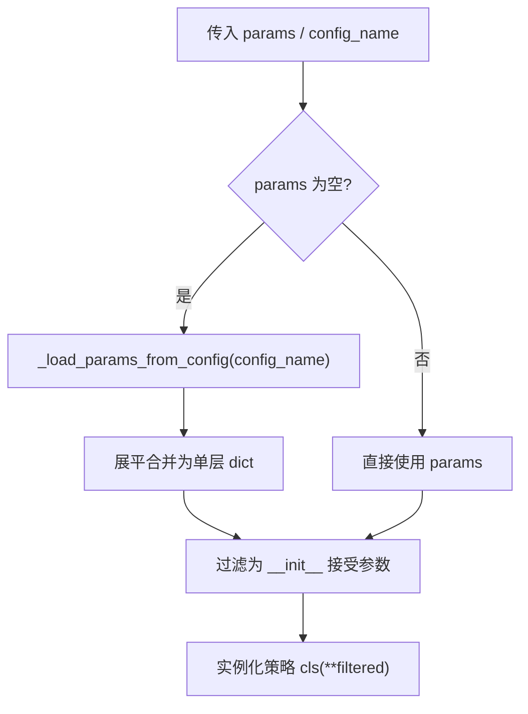
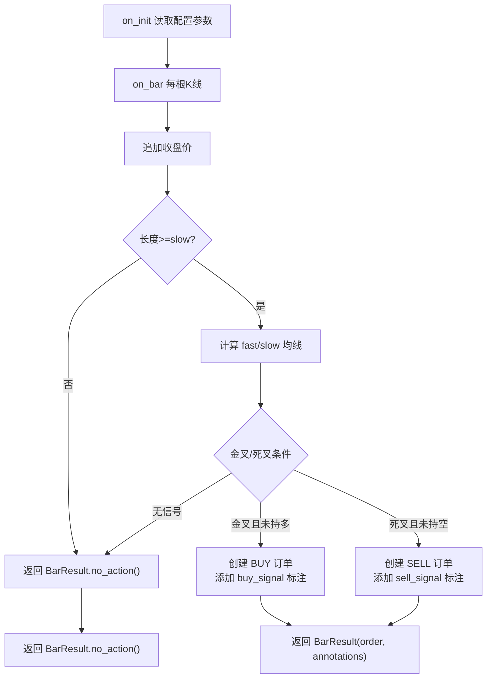
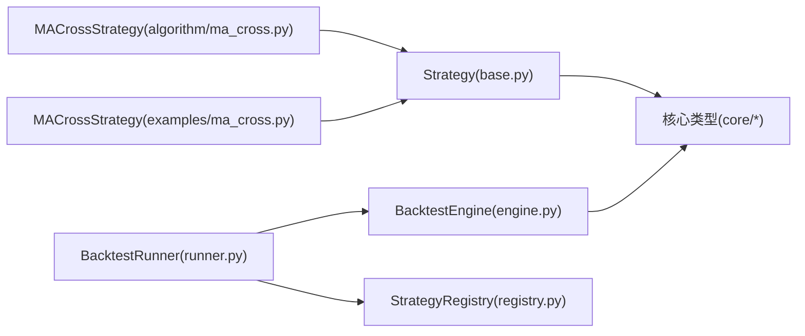

# 代码策略框架

<cite>
**本文引用的文件**   
- [src/caisen/strategy/base.py](file://src/caisen/strategy/base.py)
- [src/caisen/strategy/registry.py](file://src/caisen/strategy/registry.py)
- [src/caisen/core/engine.py](file://src/caisen/core/engine.py)
- [src/caisen/backtest/runner.py](file://src/caisen/backtest/runner.py)
- [src/caisen/core/bar.py](file://src/caisen/core/bar.py)
- [src/caisen/core/order.py](file://src/caisen/core/order.py)
- [src/caisen/core/position.py](file://src/caisen/core/position.py)
- [src/caisen/core/portfolio.py](file://src/caisen/core/portfolio.py)
- [src/caisen/core/bar_result.py](file://src/caisen/core/bar_result.py)
- [src/caisen/core/annotation.py](file://src/caisen/core/annotation.py)
- [src/caisen/core/config.py](file://src/caisen/core/config.py)
- [examples/ma_cross.py](file://examples/ma_cross.py)
- [src/caisen/strategy/algorithm/ma_cross.py](file://src/caisen/strategy/algorithm/ma_cross.py)
- [configs/strategies/caisen_default.yaml](file://configs/strategies/caisen_default.yaml)
</cite>

## 目录
1. [简介](#简介)
2. [项目结构](#项目结构)
3. [核心组件](#核心组件)
4. [架构总览](#架构总览)
5. [详细组件分析](#详细组件分析)
6. [依赖关系分析](#依赖关系分析)
7. [性能考虑](#性能考虑)
8. [故障排查指南](#故障排查指南)
9. [结论](#结论)
10. [附录：策略开发指南与最佳实践](#附录策略开发指南与最佳实践)

## 简介
本文件面向 Caisen 量化回测系统的“代码策略框架”，系统性阐述 Strategy 基类的设计与生命周期、订单执行与持仓管理、策略注册与动态加载机制，以及参数配置传递与校验。文档同时提供均线交叉策略的完整实现示例，覆盖技术指标计算、买卖信号判断与仓位管理，并给出最佳实践与常见陷阱规避建议。

## 项目结构
围绕策略框架的关键目录与职责如下：
- strategy/base.py：Strategy 抽象基类与导出契约（含 BarResult、Annotation）
- strategy/registry.py：内置策略清单、参数 schema 提取、配置预设扫描与注册表
- core/engine.py：BacktestEngine 回测引擎，驱动 on_bar 循环、订单执行、净值更新
- backtest/runner.py：BacktestRunner 封装端到端流程（加载数据→实例化策略→运行→持久化）
- core/*：Bar、Order、Position、Portfolio、BarResult、Annotation、Config 等核心数据类型
- examples/ma_cross.py 与 src/caisen/strategy/algorithm/ma_cross.py：均线交叉策略示例（旧版与新式返回类型）
- configs/strategies/*.yaml：策略参数预设文件

图表来源
- [src/caisen/strategy/base.py:19-37](file://src/caisen/strategy/base.py#L19-L37)
- [src/caisen/strategy/registry.py:108-143](file://src/caisen/strategy/registry.py#L108-L143)
- [src/caisen/core/engine.py:19-91](file://src/caisen/core/engine.py#L19-L91)
- [src/caisen/backtest/runner.py:26-94](file://src/caisen/backtest/runner.py#L26-L94)
- [src/caisen/core/bar.py:8-38](file://src/caisen/core/bar.py#L8-L38)
- [src/caisen/core/order.py:16-44](file://src/caisen/core/order.py#L16-L44)
- [src/caisen/core/position.py:6-33](file://src/caisen/core/position.py#L6-L33)
- [src/caisen/core/portfolio.py:7-46](file://src/caisen/core/portfolio.py#L7-L46)
- [src/caisen/core/bar_result.py:21-41](file://src/caisen/core/bar_result.py#L21-L41)
- [src/caisen/core/annotation.py:39-139](file://src/caisen/core/annotation.py#L39-L139)
- [src/caisen/core/config.py:9-94](file://src/caisen/core/config.py#L9-L94)
- [examples/ma_cross.py:10-45](file://examples/ma_cross.py#L10-L45)
- [src/caisen/strategy/algorithm/ma_cross.py:10-62](file://src/caisen/strategy/algorithm/ma_cross.py#L10-L62)
- [configs/strategies/caisen_default.yaml:1-50](file://configs/strategies/caisen_default.yaml#L1-L50)

章节来源
- [src/caisen/strategy/base.py:19-37](file://src/caisen/strategy/base.py#L19-L37)
- [src/caisen/strategy/registry.py:108-143](file://src/caisen/strategy/registry.py#L108-L143)
- [src/caisen/core/engine.py:19-91](file://src/caisen/core/engine.py#L19-L91)
- [src/caisen/backtest/runner.py:26-94](file://src/caisen/backtest/runner.py#L26-L94)
- [src/caisen/core/bar.py:8-38](file://src/caisen/core/bar.py#L8-L38)
- [src/caisen/core/order.py:16-44](file://src/caisen/core/order.py#L16-L44)
- [src/caisen/core/position.py:6-33](file://src/caisen/core/position.py#L6-L33)
- [src/caisen/core/portfolio.py:7-46](file://src/caisen/core/portfolio.py#L7-L46)
- [src/caisen/core/bar_result.py:21-41](file://src/caisen/core/bar_result.py#L21-L41)
- [src/caisen/core/annotation.py:39-139](file://src/caisen/core/annotation.py#L39-L139)
- [src/caisen/core/config.py:9-94](file://src/caisen/core/config.py#L9-L94)
- [examples/ma_cross.py:10-45](file://examples/ma_cross.py#L10-L45)
- [src/caisen/strategy/algorithm/ma_cross.py:10-62](file://src/caisen/strategy/algorithm/ma_cross.py#L10-L62)
- [configs/strategies/caisen_default.yaml:1-50](file://configs/strategies/caisen_default.yaml#L1-L50)

## 核心组件
- Strategy 基类
  - 生命周期钩子：on_init(config)、on_bar(bar)、on_session_end()、reset()
  - 约定：on_bar 应返回 BarResult（兼容旧版返回 Order/None）
- BacktestEngine 回测引擎
  - 主循环：逐 bar 调用策略 on_bar，处理订单执行、持仓与现金更新、净值曲线记录
  - 订单执行：滑点、手续费、数量计算（支持按固定数量或仓位比例）、开平仓逻辑
- StrategyRegistry 策略注册表
  - 内置策略清单、动态导入、参数 schema 提取、配置预设扫描
- BacktestRunner 编排器
  - 从 YAML 合并参数、实例化策略、加载数据、运行引擎、持久化结果
- 核心数据类型
  - Bar、Order、Position、Portfolio、BarResult、Annotation、Config

章节来源
- [src/caisen/strategy/base.py:19-37](file://src/caisen/strategy/base.py#L19-L37)
- [src/caisen/core/engine.py:19-91](file://src/caisen/core/engine.py#L19-L91)
- [src/caisen/strategy/registry.py:108-143](file://src/caisen/strategy/registry.py#L108-L143)
- [src/caisen/backtest/runner.py:26-94](file://src/caisen/backtest/runner.py#L26-L94)
- [src/caisen/core/bar.py:8-38](file://src/caisen/core/bar.py#L8-L38)
- [src/caisen/core/order.py:16-44](file://src/caisen/core/order.py#L16-L44)
- [src/caisen/core/position.py:6-33](file://src/caisen/core/position.py#L6-L33)
- [src/caisen/core/portfolio.py:7-46](file://src/caisen/core/portfolio.py#L7-L46)
- [src/caisen/core/bar_result.py:21-41](file://src/caisen/core/bar_result.py#L21-L41)
- [src/caisen/core/annotation.py:39-139](file://src/caisen/core/annotation.py#L39-L139)
- [src/caisen/core/config.py:9-94](file://src/caisen/core/config.py#L9-L94)

## 架构总览
下图展示从编排到执行的端到端流程，包括参数加载、策略实例化、引擎驱动与结果持久化。

图表来源
- [src/caisen/backtest/runner.py:26-94](file://src/caisen/backtest/runner.py#L26-L94)
- [src/caisen/strategy/registry.py:136-143](file://src/caisen/strategy/registry.py#L136-L143)
- [src/caisen/core/engine.py:33-91](file://src/caisen/core/engine.py#L33-L91)

## 详细组件分析

### Strategy 基类与生命周期
- on_init(config)：在回测开始前调用，适合读取配置、初始化状态变量
- on_bar(bar)：每根 K 线触发，必须返回 BarResult；兼容旧版返回 Order/None
- on_session_end()：回测结束后清理资源
- reset()：重置策略内部状态，便于多次运行复用

图表来源
- [src/caisen/strategy/base.py:19-37](file://src/caisen/strategy/base.py#L19-L37)
- [src/caisen/core/bar_result.py:21-41](file://src/caisen/core/bar_result.py#L21-L41)
- [src/caisen/core/annotation.py:39-139](file://src/caisen/core/annotation.py#L39-L139)

章节来源
- [src/caisen/strategy/base.py:19-37](file://src/caisen/strategy/base.py#L19-L37)
- [src/caisen/core/bar_result.py:21-41](file://src/caisen/core/bar_result.py#L21-L41)
- [src/caisen/core/annotation.py:39-139](file://src/caisen/core/annotation.py#L39-L139)

### 回测引擎与订单执行
- 主循环：遍历 bars[:-1]，调用策略 on_bar，解析 BarResult，执行订单，更新净值，进度回调
- 订单执行：
  - 成交价：next_bar.open 乘以滑点因子（买入加、卖出减）
  - 数量计算：优先使用 order.quantity；否则根据可用资金与 position_pct 计算
  - 手续费：price * quantity * commission_rate
  - 持仓更新：多头追加/平空、空头追加/平多，均价加权平均
  - 现金更新：买入扣款（含手续费），卖出收款（扣除手续费）
- 净值更新：基于当前价格计算权益，记录 equity_curve

图表来源
- [src/caisen/core/engine.py:93-128](file://src/caisen/core/engine.py#L93-L128)
- [src/caisen/core/engine.py:130-156](file://src/caisen/core/engine.py#L130-L156)
- [src/caisen/core/engine.py:158-201](file://src/caisen/core/engine.py#L158-L201)
- [src/caisen/core/engine.py:202-210](file://src/caisen/core/engine.py#L202-L210)

章节来源
- [src/caisen/core/engine.py:33-91](file://src/caisen/core/engine.py#L33-L91)
- [src/caisen/core/engine.py:93-210](file://src/caisen/core/engine.py#L93-L210)

### 策略注册与动态加载
- 内置策略清单：定义模块路径、类名、显示名、类型与备注
- list_strategies：动态导入并校验是否为 Strategy 子类，提取参数 schema 与配置预设
- get_module_path：根据策略类名反查模块路径
- 配置预设扫描：根据策略类名前缀匹配 configs/strategies/*.yaml，返回可用预设列表

图表来源
- [src/caisen/strategy/registry.py:108-134](file://src/caisen/strategy/registry.py#L108-L134)
- [src/caisen/strategy/registry.py:50-68](file://src/caisen/strategy/registry.py#L50-L68)
- [src/caisen/strategy/registry.py:71-105](file://src/caisen/strategy/registry.py#L71-L105)

章节来源
- [src/caisen/strategy/registry.py:108-143](file://src/caisen/strategy/registry.py#L108-L143)

### 参数配置传递与验证
- 配置文件位置：configs/strategies/*.yaml
- 参数优先级：直接传入 params > 指定 config_name 的 YAML > 策略 __init__ 默认值
- 参数展平：将 YAML 中所有顶层字典的值合并为单层 dict
- 参数过滤：仅传递策略 __init__ 接受的带默认值的参数
- 策略内读取：on_init 可从 config.params 获取参数（如均线示例）

图表来源
- [src/caisen/backtest/runner.py:97-121](file://src/caisen/backtest/runner.py#L97-L121)
- [src/caisen/backtest/runner.py:124-143](file://src/caisen/backtest/runner.py#L124-L143)
- [src/caisen/strategy/algorithm/ma_cross.py:21-26](file://src/caisen/strategy/algorithm/ma_cross.py#L21-L26)

章节来源
- [src/caisen/backtest/runner.py:97-143](file://src/caisen/backtest/runner.py#L97-L143)
- [src/caisen/strategy/algorithm/ma_cross.py:21-26](file://src/caisen/strategy/algorithm/ma_cross.py#L21-L26)
- [configs/strategies/caisen_default.yaml:1-50](file://configs/strategies/caisen_default.yaml#L1-L50)

### 均线交叉策略示例（完整实现）
- 指标计算：维护收盘价序列，滚动计算快慢均线
- 信号判断：金叉做多、死叉做空；通过 position 状态避免重复信号
- 订单生成：返回 Order（quantity=0 表示全仓或按仓位比例）
- 标注输出：使用 Annotation.buy_signal/sell_signal 生成可视化标注
- 状态重置：reset 清空历史数据与状态

图表来源
- [src/caisen/strategy/algorithm/ma_cross.py:10-62](file://src/caisen/strategy/algorithm/ma_cross.py#L10-L62)
- [src/caisen/core/annotation.py:84-99](file://src/caisen/core/annotation.py#L84-L99)
- [src/caisen/core/bar_result.py:32-41](file://src/caisen/core/bar_result.py#L32-L41)

章节来源
- [src/caisen/strategy/algorithm/ma_cross.py:10-62](file://src/caisen/strategy/algorithm/ma_cross.py#L10-L62)
- [examples/ma_cross.py:10-45](file://examples/ma_cross.py#L10-L45)

## 依赖关系分析
- 低耦合设计：Strategy 仅依赖核心数据类型与 BarResult/Annotation 契约
- 引擎集中执行：BacktestEngine 负责订单执行与账户状态变更，策略专注决策
- 注册表解耦：BacktestRunner 通过 StrategyRegistry 定位策略模块，避免硬编码
- 配置与数据分离：YAML 参数与数据加载各自独立，便于扩展与测试

图表来源
- [src/caisen/strategy/base.py:19-37](file://src/caisen/strategy/base.py#L19-L37)
- [src/caisen/core/engine.py:19-91](file://src/caisen/core/engine.py#L19-L91)
- [src/caisen/backtest/runner.py:26-94](file://src/caisen/backtest/runner.py#L26-L94)
- [src/caisen/strategy/registry.py:108-143](file://src/caisen/strategy/registry.py#L108-L143)
- [src/caisen/strategy/algorithm/ma_cross.py:10-62](file://src/caisen/strategy/algorithm/ma_cross.py#L10-L62)
- [examples/ma_cross.py:10-45](file://examples/ma_cross.py#L10-L45)

章节来源
- [src/caisen/strategy/base.py:19-37](file://src/caisen/strategy/base.py#L19-L37)
- [src/caisen/core/engine.py:19-91](file://src/caisen/core/engine.py#L19-L91)
- [src/caisen/backtest/runner.py:26-94](file://src/caisen/backtest/runner.py#L26-L94)
- [src/caisen/strategy/registry.py:108-143](file://src/caisen/strategy/registry.py#L108-L143)
- [src/caisen/strategy/algorithm/ma_cross.py:10-62](file://src/caisen/strategy/algorithm/ma_cross.py#L10-L62)
- [examples/ma_cross.py:10-45](file://examples/ma_cross.py#L10-L45)

## 性能考虑
- 指标计算优化：避免在 on_bar 中进行高复杂度运算，建议使用滑动窗口或增量计算
- 订单频率控制：减少不必要的交易信号，避免频繁开平仓导致手续费与滑点损耗
- 内存占用：合理管理历史数据缓存，及时释放不再使用的中间变量
- 批量处理：对长周期回测可分片加载数据，降低峰值内存压力

[本节为通用指导，不直接分析具体文件]

## 故障排查指南
- 策略未注册或加载失败
  - 现象：抛出“策略模块未注册”或“策略加载失败”
  - 排查：确认 StrategyRegistry 内置清单包含目标策略；检查模块路径与类名是否正确
- 数据为空
  - 现象：抛出“数据为空”错误
  - 排查：确认 symbol/freq/start/end 与数据目录一致；检查数据源配置
- 订单未成交
  - 现象：无成交记录
  - 排查：检查数量计算逻辑（quantity 与 position_pct）、可用资金与持仓方向
- 净值异常
  - 现象：净值曲线波动异常
  - 排查：核对滑点与手续费设置；确认价格输入与持仓均价更新逻辑

章节来源
- [src/caisen/backtest/runner.py:77-78](file://src/caisen/backtest/runner.py#L77-L78)
- [src/caisen/backtest/runner.py:126-134](file://src/caisen/backtest/runner.py#L126-L134)
- [src/caisen/core/engine.py:130-156](file://src/caisen/core/engine.py#L130-L156)
- [src/caisen/core/engine.py:202-210](file://src/caisen/core/engine.py#L202-L210)

## 结论
Caisen 的策略框架以清晰的契约与分层设计为核心：Strategy 聚焦交易逻辑，BacktestEngine 负责执行与账户管理，StrategyRegistry 与 BacktestRunner 完成动态加载与编排。配合 BarResult/Annotation 的统一输出，策略开发与可视化无缝衔接。通过 YAML 参数预设与灵活的参数注入机制，策略迭代与对比实验更加高效。

[本节为总结性内容，不直接分析具体文件]

## 附录：策略开发指南与最佳实践

### 开发步骤
- 继承 Strategy 基类，实现 on_bar 返回 BarResult
- 在 on_init 中读取配置参数（config.params）
- 维护必要的状态变量（如价格序列、均线值、持仓状态）
- 在 on_bar 中计算指标、判断信号、生成 Order 与 Annotation
- 实现 reset 以支持多次运行

章节来源
- [src/caisen/strategy/base.py:19-37](file://src/caisen/strategy/base.py#L19-L37)
- [src/caisen/strategy/algorithm/ma_cross.py:21-26](file://src/caisen/strategy/algorithm/ma_cross.py#L21-L26)
- [src/caisen/core/bar_result.py:21-41](file://src/caisen/core/bar_result.py#L21-L41)
- [src/caisen/core/annotation.py:84-99](file://src/caisen/core/annotation.py#L84-L99)

### 订单与仓位管理要点
- 订单数量：quantity 与 position_pct 二选一；quantity=0 时按全仓或比例下单
- 滑点与手续费：买入价上浮、卖出价下浮；手续费按成交价×数量×费率
- 持仓均价：多头加仓加权平均，空头追加同理；平仓不更新均价
- 可用资金：考虑空头释放的资金，用于计算可买数量

章节来源
- [src/caisen/core/order.py:16-44](file://src/caisen/core/order.py#L16-L44)
- [src/caisen/core/engine.py:93-156](file://src/caisen/core/engine.py#L93-L156)
- [src/caisen/core/engine.py:158-201](file://src/caisen/core/engine.py#L158-L201)
- [src/caisen/core/portfolio.py:33-39](file://src/caisen/core/portfolio.py#L33-L39)

### 配置与验证
- 参数来源优先级：直接 params > YAML 预设 > 默认值
- 参数展平与过滤：仅传递策略 __init__ 接受的参数
- 策略内读取：on_init 中从 config.params 获取参数

章节来源
- [src/caisen/backtest/runner.py:97-143](file://src/caisen/backtest/runner.py#L97-L143)
- [src/caisen/strategy/algorithm/ma_cross.py:21-26](file://src/caisen/strategy/algorithm/ma_cross.py#L21-L26)
- [configs/strategies/caisen_default.yaml:1-50](file://configs/strategies/caisen_default.yaml#L1-L50)

### 最佳实践
- 使用 BarResult.with_order/no_action 简化返回
- 用 Annotation 丰富可视化信息（买卖信号、形态标记、文本标签）
- 控制交易频率，避免过度交易
- 合理设置滑点与手续费，贴近真实市场摩擦成本
- 在 on_init 中统一读取配置，保持 on_bar 简洁

章节来源
- [src/caisen/core/bar_result.py:32-41](file://src/caisen/core/bar_result.py#L32-L41)
- [src/caisen/core/annotation.py:84-139](file://src/caisen/core/annotation.py#L84-L139)
- [src/caisen/core/engine.py:93-128](file://src/caisen/core/engine.py#L93-L128)

### 常见陷阱
- 忘记实现 reset，导致多次运行状态污染
- 在 on_bar 中做重计算，影响性能
- 忽略滑点与手续费，导致回测过于乐观
- 订单数量计算错误（未考虑可用资金或仓位比例）
- 未正确区分金叉/死叉与现有持仓状态，产生重复信号

章节来源
- [src/caisen/strategy/base.py:35-37](file://src/caisen/strategy/base.py#L35-L37)
- [src/caisen/core/engine.py:130-156](file://src/caisen/core/engine.py#L130-L156)
- [src/caisen/strategy/algorithm/ma_cross.py:41-55](file://src/caisen/strategy/algorithm/ma_cross.py#L41-L55)