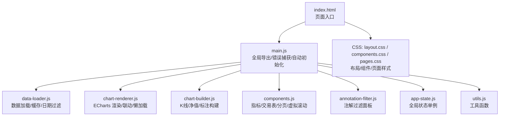
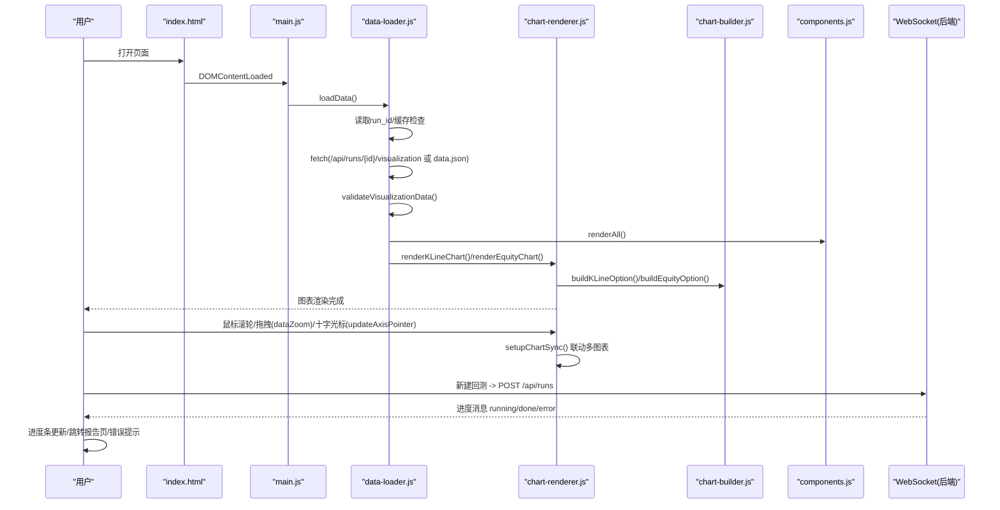
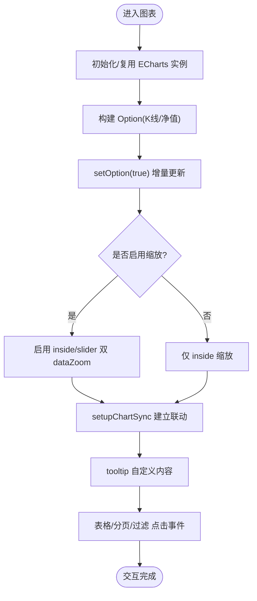
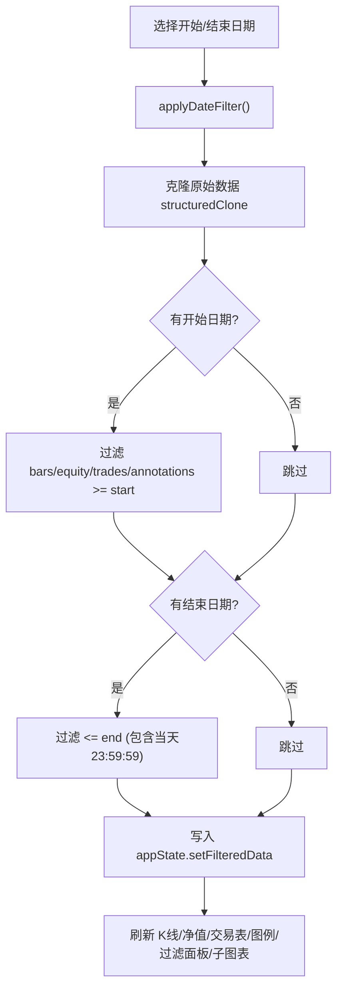
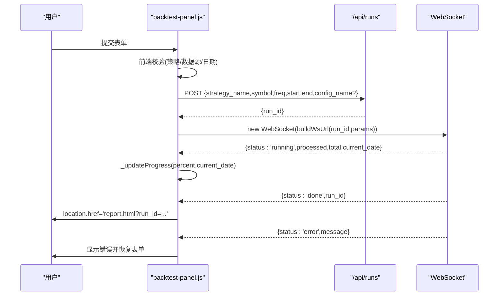
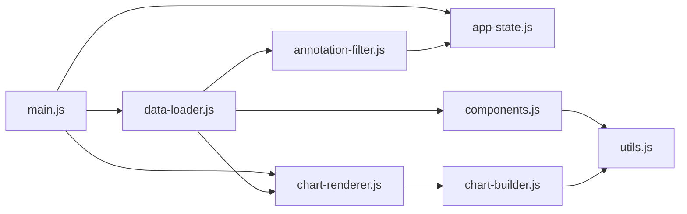

# 交互功能实现

<cite>
**本文引用的文件**   
- [main.js](file://src/caisen/frontend/src/js/main.js)
- [chart-renderer.js](file://src/caisen/frontend/src/js/chart-renderer.js)
- [backtest-panel.js](file://src/caisen/frontend/src/js/backtest-panel.js)
- [app-state.js](file://src/caisen/frontend/src/js/app-state.js)
- [data-loader.js](file://src/caisen/frontend/src/js/data-loader.js)
- [chart-builder.js](file://src/caisen/frontend/src/js/chart-builder.js)
- [components.js](file://src/caisen/frontend/src/js/components.js)
- [annotation-filter.js](file://src/caisen/frontend/src/js/annotation-filter.js)
- [utils.js](file://src/caisen/frontend/src/js/utils.js)
- [index.html](file://src/caisen/frontend/index.html)
- [layout.css](file://src/caisen/frontend/src/css/layout.css)
- [components.css](file://src/caisen/frontend/src/css/components.css)
- [pages.css](file://src/caisen/frontend/src/css/pages.css)
</cite>

## 目录
1. [简介](#简介)
2. [项目结构](#项目结构)
3. [核心组件](#核心组件)
4. [架构总览](#架构总览)
5. [详细组件分析](#详细组件分析)
6. [依赖关系分析](#依赖关系分析)
7. [性能考量](#性能考量)
8. [故障排查指南](#故障排查指南)
9. [结论](#结论)
10. [附录](#附录)

## 简介
本文件聚焦 Caisen 量化回测系统的“交互式功能”，围绕用户界面交互逻辑、数据筛选与搜索、进度条与状态指示器、表单验证与输入处理、响应式布局与移动端支持，以及无障碍访问（Accessibility）进行系统化说明。文档以代码级事实为依据，结合可视化图示帮助读者快速理解前端模块的职责边界与协作方式。

## 项目结构
前端采用模块化组织：入口聚合导出全局函数；图表渲染与构建分离；应用状态集中管理；数据加载与缓存独立；UI 组件与样式分层清晰。

**图示来源** 
- [index.html:1-135](file://src/caisen/frontend/index.html#L1-L135)
- [main.js:1-96](file://src/caisen/frontend/src/js/main.js#L1-L96)
- [data-loader.js:1-290](file://src/caisen/frontend/src/js/data-loader.js#L1-L290)
- [chart-renderer.js:1-333](file://src/caisen/frontend/src/js/chart-renderer.js#L1-L333)
- [chart-builder.js:1-800](file://src/caisen/frontend/src/js/chart-builder.js#L1-L800)
- [components.js:1-717](file://src/caisen/frontend/src/js/components.js#L1-L717)
- [annotation-filter.js:1-176](file://src/caisen/frontend/src/js/annotation-filter.js#L1-L176)
- [app-state.js:1-79](file://src/caisen/frontend/src/js/app-state.js#L1-L79)
- [utils.js:1-182](file://src/caisen/frontend/src/js/utils.js#L1-L182)
- [layout.css:1-374](file://src/caisen/frontend/src/css/layout.css#L1-L374)
- [components.css:1-800](file://src/caisen/frontend/src/css/components.css#L1-L800)
- [pages.css:1-348](file://src/caisen/frontend/src/css/pages.css#L1-L348)

**章节来源**
- [index.html:1-135](file://src/caisen/frontend/index.html#L1-L135)
- [main.js:1-96](file://src/caisen/frontend/src/js/main.js#L1-L96)

## 核心组件
- 应用状态 appState：集中持有图表实例、原始/过滤数据、缩放/均线/权益图可见性、注解过滤等状态，并提供 getter/setter/toggle/reset。
- 数据加载 data-loader：负责从 API 或本地文件拉取数据、校验格式、设置缓存、触发全量渲染与子图表懒加载，并维护日期过滤。
- 图表渲染 chart-renderer：封装 K 线与净值图渲染、缩放开关、重置缩放、均线叠加切换、跨图表联动（dataZoom + axisPointer）、窗口 resize 防抖与 IntersectionObserver 懒加载。
- 图表构建 chart-builder：生成 ECharts option，包括 K 线 OHLCV、成交量、MA 叠加、标注（买卖信号/水平线/形态标记）、回撤区域与新高点标记，并对大数据集做采样与裁剪优化。
- UI 组件 components：渲染头部信息、指标卡片（含迷你趋势图）、交易明细表（排序/分页/虚拟滚动）、模式图例、日期输入初始化、错误/空态/加载态展示。
- 注解过滤 annotation-filter：按形态/信号/线条类型动态生成过滤面板，维护 Map 状态，控制 K 线图重绘。
- 工具 utils：HTML 转义、数值/时间格式化、年化收益计算、坐标有效性校验、时间戳模糊匹配、日期过滤纯函数。
- 新建回测面板 backtest-panel：策略/数据源下拉、配置预设、表单校验、POST 提交、WebSocket 进度监听、超时与错误处理、进度条更新与跳转报告页。

**章节来源**
- [app-state.js:1-79](file://src/caisen/frontend/src/js/app-state.js#L1-L79)
- [data-loader.js:1-290](file://src/caisen/frontend/src/js/data-loader.js#L1-L290)
- [chart-renderer.js:1-333](file://src/caisen/frontend/src/js/chart-renderer.js#L1-L333)
- [chart-builder.js:1-800](file://src/caisen/frontend/src/js/chart-builder.js#L1-L800)
- [components.js:1-717](file://src/caisen/frontend/src/js/components.js#L1-L717)
- [annotation-filter.js:1-176](file://src/caisen/frontend/src/js/annotation-filter.js#L1-L176)
- [utils.js:1-182](file://src/caisen/frontend/src/js/utils.js#L1-L182)
- [backtest-panel.js:1-363](file://src/caisen/frontend/src/js/backtest-panel.js#L1-L363)

## 架构总览
下图展示了关键交互流程：从页面加载到数据获取、图表渲染、用户交互（缩放/平移/悬停提示/点击），再到 WebSocket 实时进度反馈与错误处理。

**图示来源** 
- [index.html:120-132](file://src/caisen/frontend/index.html#L120-L132)
- [main.js:52-59](file://src/caisen/frontend/src/js/main.js#L52-L59)
- [data-loader.js:179-249](file://src/caisen/frontend/src/js/data-loader.js#L179-L249)
- [chart-renderer.js:95-174](file://src/caisen/frontend/src/js/chart-renderer.js#L95-L174)
- [chart-builder.js:115-170](file://src/caisen/frontend/src/js/chart-builder.js#L115-L170)
- [components.js:708-717](file://src/caisen/frontend/src/js/components.js#L708-L717)
- [backtest-panel.js:203-328](file://src/caisen/frontend/src/js/backtest-panel.js#L203-L328)

## 详细组件分析

### 图表交互：缩放、平移、悬停提示、点击事件
- 缩放与平移
  - 通过 ECharts 的 dataZoom 实现内部缩放与滑块缩放；提供 toggleZoom 开关与 resetZoom 一键复位。
  - 使用 WeakSet 避免重复绑定，确保多次渲染安全。
- 跨图表联动
  - setupChartSync 将 K 线、净值、回撤三张图的 dataZoom 与 updateAxisPointer 同步，支持 batch 事件兼容。
- 悬停提示
  - K 线 tooltip 自定义 formatter，显示 OHLCV、涨跌幅、MA 值及同时间点的注解标签。
  - 净值图 tooltip 同时显示净值与回撤百分比，并按正负着色。
- 点击事件
  - 交易列表行高亮、排序按钮点击、分页按钮点击均通过事件委托或内联 handler 触发。
  - 注解过滤面板的 checkbox 变更直接驱动 K 线图重绘。

**图示来源** 
- [chart-renderer.js:202-224](file://src/caisen/frontend/src/js/chart-renderer.js#L202-L224)
- [chart-renderer.js:254-332](file://src/caisen/frontend/src/js/chart-renderer.js#L254-L332)
- [chart-builder.js:175-192](file://src/caisen/frontend/src/js/chart-builder.js#L175-L192)
- [chart-builder.js:440-460](file://src/caisen/frontend/src/js/chart-builder.js#L440-L460)
- [components.js:390-408](file://src/caisen/frontend/src/js/components.js#L390-L408)
- [annotation-filter.js:135-141](file://src/caisen/frontend/src/js/annotation-filter.js#L135-L141)

**章节来源**
- [chart-renderer.js:1-333](file://src/caisen/frontend/src/js/chart-renderer.js#L1-L333)
- [chart-builder.js:115-170](file://src/caisen/frontend/src/js/chart-builder.js#L115-L170)
- [components.js:390-408](file://src/caisen/frontend/src/js/components.js#L390-L408)
- [annotation-filter.js:135-141](file://src/caisen/frontend/src/js/annotation-filter.js#L135-L141)

### 数据筛选与搜索
- 日期范围筛选
  - applyDateFilter 基于 start-date/end-date 对 bars/equity_curve/trades/annotations 进行时间区间过滤，并刷新所有相关视图。
  - 工具函数 applyDateFilterToData 提供纯函数版本供测试或复用。
- 运行记录搜索
  - index.html 提供搜索框（当前用于策略名称搜索占位），runs-list 模块负责列表渲染与交互（参考 runs-list.js 在 index.html 中的导入）。
- 结果高亮与筛选条件管理
  - 当前仓库未实现文本搜索结果高亮；筛选条件集中在 appState 的注解过滤 Map 中，由 annotation-filter 管理全选/全不选/折叠。

**图示来源** 
- [data-loader.js:254-290](file://src/caisen/frontend/src/js/data-loader.js#L254-L290)
- [utils.js:161-182](file://src/caisen/frontend/src/js/utils.js#L161-L182)
- [annotation-filter.js:60-130](file://src/caisen/frontend/src/js/annotation-filter.js#L60-L130)

**章节来源**
- [data-loader.js:254-290](file://src/caisen/frontend/src/js/data-loader.js#L254-L290)
- [utils.js:161-182](file://src/caisen/frontend/src/js/utils.js#L161-L182)
- [annotation-filter.js:60-130](file://src/caisen/frontend/src/js/annotation-filter.js#L60-L130)
- [index.html:26-40](file://src/caisen/frontend/index.html#L26-L40)

### 进度条与状态指示器：WebSocket 实时更新、错误处理与用户反馈
- 新建回测流程
  - 表单提交前进行必填与日期合法性校验；成功后 POST /api/runs 获取 run_id。
  - 根据 run_id 与请求参数拼接 ws URL，建立 WebSocket 连接。
- 进度与状态
  - onmessage 解析 JSON，统一交由 handleWsMessage 转换为 action（progress/redirect/error），再更新进度条或跳转报告页。
  - 连接超时与空闲超时保护，异常时关闭连接并提示错误。
- 用户反馈
  - 进度条宽度与文案随 processed/total/current_date 更新；错误信息在表单下方展示，并恢复表单可见性以便重试。

**图示来源** 
- [backtest-panel.js:18-37](file://src/caisen/frontend/src/js/backtest-panel.js#L18-L37)
- [backtest-panel.js:203-246](file://src/caisen/frontend/src/js/backtest-panel.js#L203-L246)
- [backtest-panel.js:248-328](file://src/caisen/frontend/src/js/backtest-panel.js#L248-L328)
- [backtest-panel.js:330-362](file://src/caisen/frontend/src/js/backtest-panel.js#L330-L362)

**章节来源**
- [backtest-panel.js:1-363](file://src/caisen/frontend/src/js/backtest-panel.js#L1-L363)

### 表单验证与用户输入处理
- 新建回测表单
  - 必填项：策略、数据源、开始/结束日期；日期先后顺序校验。
  - 错误提示：统一在 #bp-error 区域显示，失败时隐藏进度区并恢复表单。
- 日期输入
  - 报告页日期筛选通过原生 date 输入控件，initDateInputs 自动填充 meta.start/meta.end 的日期部分。
- 其他输入
  - 策略与数据源来自 /api/strategies 与 /api/data-sources 的动态下拉；LLM 策略会显示 note 提示。

**章节来源**
- [backtest-panel.js:184-246](file://src/caisen/frontend/src/js/backtest-panel.js#L184-L246)
- [components.js:636-646](file://src/caisen/frontend/src/js/components.js#L636-L646)
- [index.html:46-96](file://src/caisen/frontend/index.html#L46-L96)

### 响应式布局与移动端触摸支持
- 断点与网格
  - 768px 以下：卡片网格改为单列；指标网格自适应列数；图表容器高度与间距缩小。
  - 使用 CSS Grid 的 auto-fit/minmax 实现自适应网格系统。
- 触控友好
  - 按钮与输入框具备 :focus-visible 样式，便于键盘导航与触屏焦点反馈。
  - 图表 dataZoom 支持 inside 手势缩放，配合 slider 可拖动。
- 动画与动效
  - 提供 fade-in/slide-up 动画类，并在 prefers-reduced-motion 下禁用动画以提升可访问性体验。

**章节来源**
- [layout.css:346-374](file://src/caisen/frontend/src/css/layout.css#L346-L374)
- [components.css:386-400](file://src/caisen/frontend/src/css/components.css#L386-L400)
- [pages.css:305-348](file://src/caisen/frontend/src/css/pages.css#L305-L348)

### 无障碍访问（Accessibility）实践与建议
- 现状
  - 按钮与输入框已定义 :focus-visible 样式，提升键盘可达性。
  - 部分元素使用 aria-label（如分页按钮）增强语义。
- 建议改进
  - 为关键交互元素补充 role 与 aria-* 属性（例如：进度条使用 role="progressbar" 并设置 aria-valuenow/max/valueText）。
  - 为图表区域添加 aria-live 或标题描述，辅助屏幕阅读器理解上下文。
  - 确保颜色对比度满足 WCAG 标准，并为重要状态提供非颜色提示（如图标+文字）。
  - 为搜索框增加 autocomplete 与 aria-autocomplete 属性，必要时提供待办列表（combobox）行为。

[本节为通用指导，不直接分析具体文件]

## 依赖关系分析
- 模块耦合
  - main.js 作为聚合层，导出全局函数供 HTML 内联脚本调用，降低耦合度。
  - chart-renderer 依赖 app-state 与 chart-builder；data-loader 依赖 components 与 chart-renderer；annotation-filter 依赖 app-state 与 chart-renderer。
- 外部依赖
  - ECharts 通过 CDN 引入，用于 K 线、净值、热力图、回撤与分布图。
- 潜在循环依赖
  - 当前未见显式循环引用；各模块职责清晰，单向依赖为主。

**图示来源** 
- [main.js:1-96](file://src/caisen/frontend/src/js/main.js#L1-L96)
- [chart-renderer.js:1-30](file://src/caisen/frontend/src/js/chart-renderer.js#L1-L30)
- [data-loader.js:1-16](file://src/caisen/frontend/src/js/data-loader.js#L1-L16)
- [components.js:1-12](file://src/caisen/frontend/src/js/components.js#L1-L12)
- [chart-builder.js:1-8](file://src/caisen/frontend/src/js/chart-builder.js#L1-L8)
- [annotation-filter.js:1-9](file://src/caisen/frontend/src/js/annotation-filter.js#L1-L9)
- [utils.js:1-16](file://src/caisen/frontend/src/js/utils.js#L1-L16)

**章节来源**
- [main.js:1-96](file://src/caisen/frontend/src/js/main.js#L1-L96)
- [chart-renderer.js:1-30](file://src/caisen/frontend/src/js/chart-renderer.js#L1-L30)
- [data-loader.js:1-16](file://src/caisen/frontend/src/js/data-loader.js#L1-L16)
- [components.js:1-12](file://src/caisen/frontend/src/js/components.js#L1-L12)
- [chart-builder.js:1-8](file://src/caisen/frontend/src/js/chart-builder.js#L1-L8)
- [annotation-filter.js:1-9](file://src/caisen/frontend/src/js/annotation-filter.js#L1-L9)
- [utils.js:1-16](file://src/caisen/frontend/src/js/utils.js#L1-L16)

## 性能考量
- 大数据集优化
  - K 线与净值图在 >5000 条数据时启用 large/sampling(lttb)，>10000 条时关闭动画并限制 markPoint 数量。
- 懒加载
  - 使用 IntersectionObserver 延迟初始化非首屏图表（回撤、热力图、分布图），减少首屏开销。
- 防抖与批量更新
  - 窗口 resize 统一防抖，避免频繁 setOption；dataZoom 联动使用批处理兼容。
- 虚拟滚动
  - 交易明细表超过阈值时启用虚拟滚动，仅渲染可视区域行，显著提升长列表性能。

**章节来源**
- [chart-builder.js:142-170](file://src/caisen/frontend/src/js/chart-builder.js#L142-L170)
- [chart-builder.js:380-428](file://src/caisen/frontend/src/js/chart-builder.js#L380-L428)
- [chart-renderer.js:59-90](file://src/caisen/frontend/src/js/chart-renderer.js#L59-L90)
- [chart-renderer.js:29-46](file://src/caisen/frontend/src/js/chart-renderer.js#L29-L46)
- [components.js:516-593](file://src/caisen/frontend/src/js/components.js#L516-L593)

## 故障排查指南
- 全局错误捕获
  - window.onerror 与 window.onunhandledrejection 统一记录错误与堆栈，便于定位问题。
- 图表渲染容错
  - setOption 失败时降级为简化配置（移除复杂 markPoint/markLine），保证基础图表可用。
- 数据加载错误
  - 数据不可用时显示友好的“数据不可用”提示，并隐藏图表与周边面板，提供返回列表入口。
- WebSocket 异常
  - 连接超时与空闲超时分别处理；onerror/onclose 清理定时器并提示错误。

**章节来源**
- [main.js:37-47](file://src/caisen/frontend/src/js/main.js#L37-L47)
- [chart-renderer.js:179-197](file://src/caisen/frontend/src/js/chart-renderer.js#L179-L197)
- [data-loader.js:141-174](file://src/caisen/frontend/src/js/data-loader.js#L141-L174)
- [backtest-panel.js:262-328](file://src/caisen/frontend/src/js/backtest-panel.js#L262-L328)

## 结论
Caisen 前端交互体系以“状态集中、渲染解耦、按需加载、健壮容错”为核心设计原则。图表交互流畅且具备跨图表联动能力；数据筛选与过滤机制完善；WebSocket 进度反馈与错误处理覆盖全面；响应式布局适配多端；在无障碍方面已有基础，仍可进一步扩展语义化与可访问性增强。

[本节为总结性内容，不直接分析具体文件]

## 附录
- 关键交互入口
  - 新建回测：index.html 中的表单与按钮，backtest-panel.js 处理提交与 WS 进度。
  - 报告页：main.js 自动检测 run_id 并加载数据，随后渲染图表与组件。
- 常用全局函数
  - 通过 main.js 暴露至 window，供 HTML 内联脚本调用，如 loadRun、toggleZoom、resetZoom、applyDateFilter 等。

**章节来源**
- [index.html:120-132](file://src/caisen/frontend/index.html#L120-L132)
- [main.js:22-34](file://src/caisen/frontend/src/js/main.js#L22-L34)