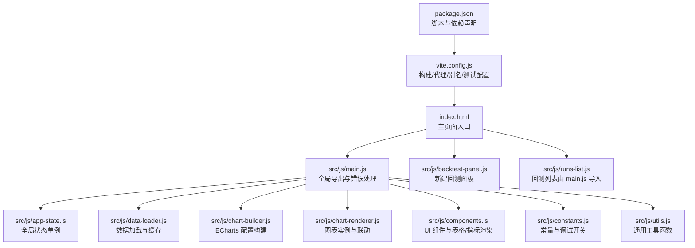
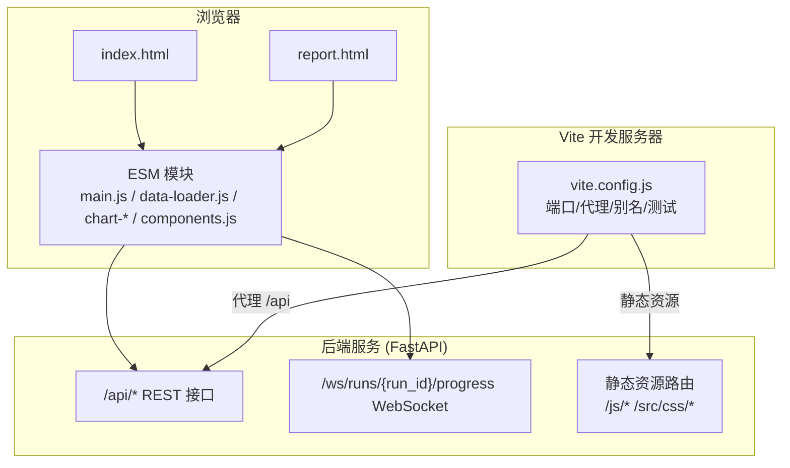
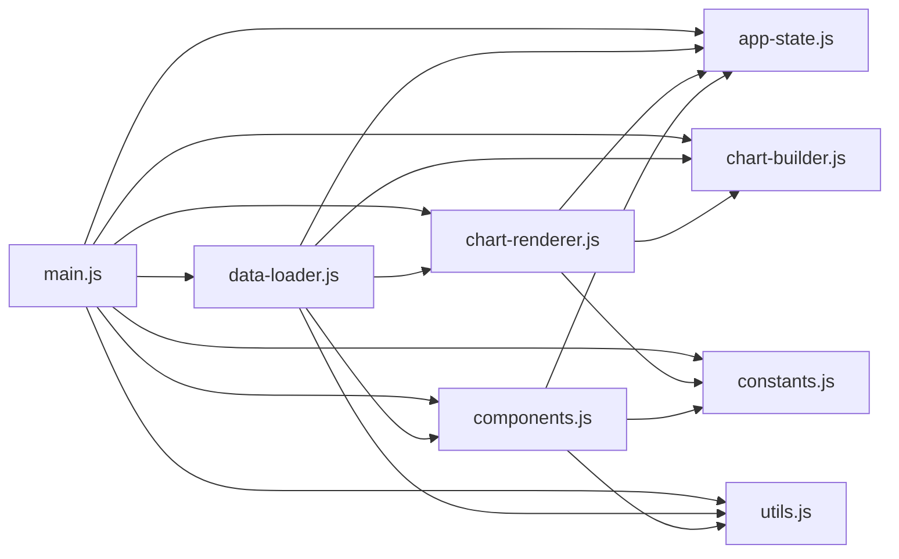
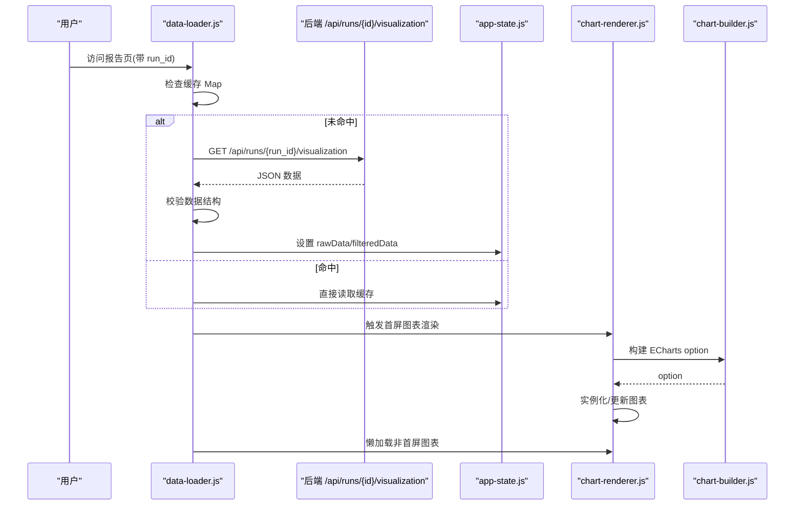
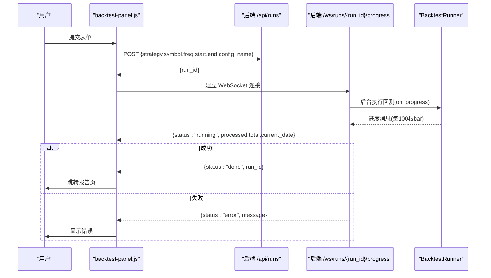
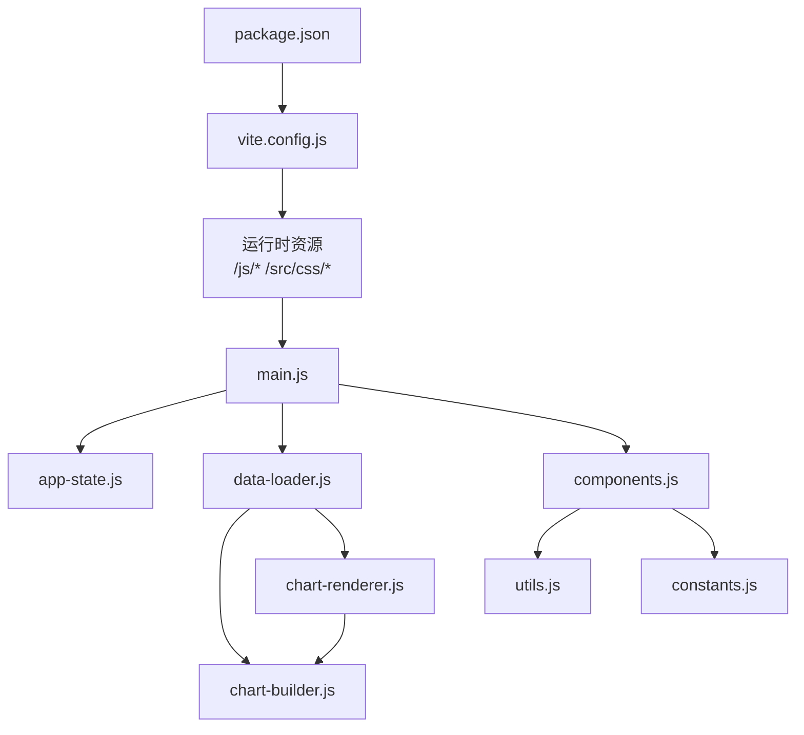

# 前端架构设计

<cite>
**本文引用的文件**
- [package.json](file://src/caisen/frontend/package.json)
- [vite.config.js](file://src/caisen/frontend/vite.config.js)
- [index.html](file://src/caisen/frontend/index.html)
- [main.py](file://src/caisen/web/main.py)
- [main.css](file://src/caisen/frontend/src/css/main.css)
- [variables.css](file://src/caisen/frontend/src/css/variables.css)
- [main.js](file://src/caisen/frontend/src/js/main.js)
- [app-state.js](file://src/caisen/frontend/src/js/app-state.js)
- [data-loader.js](file://src/caisen/frontend/src/js/data-loader.js)
- [chart-builder.js](file://src/caisen/frontend/src/js/chart-builder.js)
- [chart-renderer.js](file://src/caisen/frontend/src/js/chart-renderer.js)
- [components.js](file://src/caisen/frontend/src/js/components.js)
- [constants.js](file://src/caisen/frontend/src/js/constants.js)
- [utils.js](file://src/caisen/frontend/src/js/utils.js)
- [backtest-panel.js](file://src/caisen/frontend/src/js/backtest-panel.js)
</cite>

## 目录
1. [引言](#引言)
2. [项目结构](#项目结构)
3. [核心组件](#核心组件)
4. [架构总览](#架构总览)
5. [详细组件分析](#详细组件分析)
6. [依赖关系分析](#依赖关系分析)
7. [性能考虑](#性能考虑)
8. [故障排查指南](#故障排查指南)
9. [结论](#结论)
10. [附录](#附录)

## 引言
本文件面向 Caisen 量化回测系统的前端架构，聚焦于基于 Vite + ECharts 的技术选型与模块化设计。文档从整体架构、模块划分、状态管理、构建与开发环境、前后端通信协议、性能优化策略、浏览器兼容性与移动端适配等维度进行系统化说明，帮助读者快速理解并高效扩展前端能力。

## 项目结构
前端位于 src/caisen/frontend 目录下，采用“入口 HTML + 多页应用（主页面 index.html 与报告页 report.html）+ ES Module 模块化”的组织方式：
- 构建与脚本：通过 package.json 定义 dev/build/preview/test/e2e 命令；Vite 作为开发与构建工具。
- 资源组织：CSS 以变量与主题拆分，JS 按职责拆分为数据加载、图表构建、渲染、组件、常量与工具等模块。
- 双入口：index.html 为主应用入口，report.html 为回测详情报告页入口。

图示来源
- [index.html:1-135](file://src/caisen/frontend/index.html#L1-L135)
- [main.js:1-96](file://src/caisen/frontend/src/js/main.js#L1-L96)
- [vite.config.js:1-43](file://src/caisen/frontend/vite.config.js#L1-L43)
- [package.json:1-26](file://src/caisen/frontend/package.json#L1-L26)

章节来源
- [package.json:1-26](file://src/caisen/frontend/package.json#L1-L26)
- [vite.config.js:1-43](file://src/caisen/frontend/vite.config.js#L1-L43)
- [index.html:1-135](file://src/caisen/frontend/index.html#L1-L135)

## 核心组件
- 应用入口与全局导出：main.js 负责将关键方法暴露到 window，统一错误捕获，并在报告页自动加载数据。
- 状态管理：app-state.js 提供单例状态对象，集中持有图表实例、原始/过滤数据、交互开关等。
- 数据加载：data-loader.js 负责从后端 API 或本地 data.json 获取可视化数据，执行校验、缓存与懒加载。
- 图表构建：chart-builder.js 封装 ECharts option 的生成逻辑，包括 K 线、净值曲线、回撤区域、标注与交易标记等。
- 图表渲染：chart-renderer.js 负责实例化/更新图表、响应式 resize、跨图表联动（缩放与十字光标）。
- UI 组件：components.js 实现头部信息、指标卡片、交易表（含排序/分页/虚拟滚动）、图例与日期筛选初始化。
- 常量与工具：constants.js 提供主题色、布局常量、调试开关；utils.js 提供格式化、XSS 防护、坐标校验等纯函数。
- 新建回测面板：backtest-panel.js 负责策略/数据源下拉、表单提交、WebSocket 进度推送与跳转报告页。

章节来源
- [main.js:1-96](file://src/caisen/frontend/src/js/main.js#L1-L96)
- [app-state.js:1-79](file://src/caisen/frontend/src/js/app-state.js#L1-L79)
- [data-loader.js:1-290](file://src/caisen/frontend/src/js/data-loader.js#L1-L290)
- [chart-builder.js:1-800](file://src/caisen/frontend/src/js/chart-builder.js#L1-L800)
- [chart-renderer.js:1-333](file://src/caisen/frontend/src/js/chart-renderer.js#L1-L333)
- [components.js:1-717](file://src/caisen/frontend/src/js/components.js#L1-L717)
- [constants.js:1-109](file://src/caisen/frontend/src/js/constants.js#L1-L109)
- [utils.js:1-182](file://src/caisen/frontend/src/js/utils.js#L1-L182)
- [backtest-panel.js:1-363](file://src/caisen/frontend/src/js/backtest-panel.js#L1-L363)

## 架构总览
前端采用“轻量 SPA + 多页入口”的模式：主页面用于创建回测与浏览记录，报告页用于展示具体回测结果。前后端通过 RESTful API 与 WebSocket 协同工作，Vite 提供开发代理与热重载。

图示来源
- [vite.config.js:1-43](file://src/caisen/frontend/vite.config.js#L1-L43)
- [main.py:1-319](file://src/caisen/web/main.py#L1-L319)
- [index.html:1-135](file://src/caisen/frontend/index.html#L1-L135)

## 详细组件分析

### 技术栈与设计决策
- 构建工具：Vite 提供极速开发体验、按需热重载、多入口构建与测试集成。
- 图表库：ECharts 5.x 提供丰富的金融图表能力与大数据量优化选项。
- 样式系统：CSS 变量驱动的主题体系，模块化 CSS 文件组合，便于维护与扩展。
- 模块化：ESM 模块划分清晰，纯函数与副作用分离，利于测试与复用。

章节来源
- [package.json:1-26](file://src/caisen/frontend/package.json#L1-L26)
- [vite.config.js:1-43](file://src/caisen/frontend/vite.config.js#L1-L43)
- [main.css:1-7](file://src/caisen/frontend/src/css/main.css#L1-L7)
- [variables.css:1-106](file://src/caisen/frontend/src/css/variables.css#L1-L106)

### 模块化架构与依赖管理
- 模块边界
  - app-state.js：全局状态单例，避免散落的 DOM 查询与隐式耦合。
  - data-loader.js：数据层，负责请求、缓存、校验与懒加载触发。
  - chart-builder.js：配置层，纯函数生成 ECharts option。
  - chart-renderer.js：渲染层，管理实例生命周期与联动。
  - components.js：视图层，DOM 操作与用户交互。
  - constants.js / utils.js：横切关注点，常量与工具。
  - backtest-panel.js：业务域模块，封装新建回测流程。
- 依赖方向
  - main.js 聚合导出，供 HTML 内联脚本使用。
  - data-loader.js 依赖 app-state、components、chart-renderer、chart-builder、annotation-filter、utils。
  - chart-renderer.js 依赖 app-state、chart-builder、constants。
  - components.js 依赖 app-state、constants、utils。
  - backtest-panel.js 独立，仅依赖 fetch/WebSocket 与 DOM。

图示来源
- [main.js:1-96](file://src/caisen/frontend/src/js/main.js#L1-L96)
- [data-loader.js:1-290](file://src/caisen/frontend/src/js/data-loader.js#L1-L290)
- [chart-renderer.js:1-333](file://src/caisen/frontend/src/js/chart-renderer.js#L1-L333)
- [chart-builder.js:1-800](file://src/caisen/frontend/src/js/chart-builder.js#L1-L800)
- [components.js:1-717](file://src/caisen/frontend/src/js/components.js#L1-L717)
- [constants.js:1-109](file://src/caisen/frontend/src/js/constants.js#L1-L109)
- [utils.js:1-182](file://src/caisen/frontend/src/js/utils.js#L1-L182)

### 状态管理机制
- 单例模式：appState 在模块间共享，避免重复实例化与状态不一致。
- 数据流：rawData 与 filteredData 分离，确保筛选不破坏原始数据。
- 交互开关：缩放、MA 显示、权益曲线可见性等通过布尔状态控制，配合 setOption(true) 增量更新。
- 生命周期：reset 方法用于清理图表实例与数据引用，防止内存泄漏。

章节来源
- [app-state.js:1-79](file://src/caisen/frontend/src/js/app-state.js#L1-L79)

### 数据加载与缓存
- 数据来源：优先根据 URL 参数 run_id 调用后端可视化接口，否则回退至本地 data.json。
- 缓存策略：Map 缓存 run_id → rawData，避免重复请求。
- 数据校验：validateVisualizationData 检查 bars 字段完整性，失败时友好提示并隐藏无关面板。
- 懒加载：非首屏图表（回撤、热力图、分布）通过 IntersectionObserver 延迟初始化。

图示来源
- [data-loader.js:1-290](file://src/caisen/frontend/src/js/data-loader.js#L1-L290)
- [chart-renderer.js:1-333](file://src/caisen/frontend/src/js/chart-renderer.js#L1-L333)
- [chart-builder.js:1-800](file://src/caisen/frontend/src/js/chart-builder.js#L1-L800)
- [app-state.js:1-79](file://src/caisen/frontend/src/js/app-state.js#L1-L79)

### 图表构建与渲染
- K 线图：支持 OHLCV、MA 叠加、标注与交易标记、大数据模式 large/largeThreshold、tooltip 自定义。
- 净值曲线：计算回撤、新高标记、回撤区间 markArea，双轴展示净值与回撤百分比。
- 联动机制：dataZoom 与 updateAxisPointer 事件在多图表间同步，WeakSet 避免重复绑定。
- 降级策略：setOption 异常时尝试简化配置（移除复杂 markPoint/markLine），保障基础图表可用。

章节来源
- [chart-builder.js:1-800](file://src/caisen/frontend/src/js/chart-builder.js#L1-L800)
- [chart-renderer.js:1-333](file://src/caisen/frontend/src/js/chart-renderer.js#L1-L333)

### UI 组件与交互
- 指标卡片：年化收益、最大回撤、夏普比率、胜率、盈亏比、总成交数，附带趋势箭头与迷你净值图。
- 交易表：FIFO 匹配计算每笔卖出 PnL，支持列排序、分页与虚拟滚动（>100 行）。
- 图例与筛选：根据 annotations 动态生成图例，支持按类型筛选。
- 日期筛选：基于 meta.start/end 初始化输入框，applyDateFilter 对 bars/trades/annotations 同步裁剪。

章节来源
- [components.js:1-717](file://src/caisen/frontend/src/js/components.js#L1-L717)
- [utils.js:1-182](file://src/caisen/frontend/src/js/utils.js#L1-L182)

### 新建回测面板与 WebSocket 进度
- 表单交互：选择策略与数据源，填写起止日期，可选配置预设名。
- 异步流程：POST /api/runs 返回占位 run_id，随后建立 WebSocket 连接接收进度消息。
- 进度反馈：running/done/error 三种状态，完成自动跳转到报告页。
- 超时保护：连接超时与空闲超时双重保护，提升健壮性。

图示来源
- [backtest-panel.js:1-363](file://src/caisen/frontend/src/js/backtest-panel.js#L1-L363)
- [main.py:1-319](file://src/caisen/web/main.py#L1-L319)

### 开发环境与构建流程
- 开发服务器：默认端口 8000，/api 路径代理到后端地址（环境变量 VITE_API_PROXY）。
- 多入口构建：同时构建 index.html 与 report.html，输出到 dist。
- 别名与解析：/js 与 /src 指向源码目录，便于模块引用。
- 测试集成：Vitest 单元测试（jsdom 环境），Playwright 端到端测试。

章节来源
- [vite.config.js:1-43](file://src/caisen/frontend/vite.config.js#L1-L43)
- [package.json:1-26](file://src/caisen/frontend/package.json#L1-L26)

### 前后端通信协议与数据格式
- REST 接口
  - GET /api/strategies：返回策略列表（名称、显示名、是否 LLM、预设等）。
  - GET /api/data-sources：返回本地数据源扫描结果（symbol/freq/date_range）。
  - POST /api/runs：触发回测，返回占位 run_id。
  - GET /api/runs：列出有效回测记录（包含 metrics）。
  - GET /api/runs/{run_id}：获取回测元数据。
  - GET /api/runs/{run_id}/visualization：获取可视化数据（bars/equity_curve/trades/annotations/metrics/meta）。
  - GET /api/runs/{run_id}/data.json：直接下载 data.json。
  - GET /js/* 与 GET /src/css/*：提供前端资源。
- WebSocket 协议
  - 端点：/ws/runs/{run_id}/progress?strategy_name&symbol&freq&start&end[&config_name]
  - 消息体：
    - running：{ status:"running", processed, total, current_date }
    - done：{ status:"done", run_id }
    - error：{ status:"error", message }

章节来源
- [main.py:1-319](file://src/caisen/web/main.py#L1-L319)
- [backtest-panel.js:1-363](file://src/caisen/frontend/src/js/backtest-panel.js#L1-L363)

### 样式系统与响应式设计
- 变量体系：colors、spacing、radius、shadow、typography、glassmorphism 等通过 :root 变量统一管理。
- 模块化 CSS：main.css 聚合 variables/reset/layout/components/pages，便于分层维护。
- 响应式：容器 max-width、flex 布局、grid 间距与字体/间距变量共同支撑不同屏幕尺寸。

章节来源
- [main.css:1-7](file://src/caisen/frontend/src/css/main.css#L1-L7)
- [variables.css:1-106](file://src/caisen/frontend/src/css/variables.css#L1-L106)

## 依赖关系分析
- 内部依赖
  - main.js 作为聚合器，导出全局方法与事件处理器。
  - data-loader.js 是数据中枢，串联状态、渲染与组件。
  - chart-builder.js 与 chart-renderer.js 解耦配置与实例管理。
  - components.js 专注视图层，保持与数据/图表层的低耦合。
- 外部依赖
  - ECharts：通过 CDN 引入，生产构建可替换为本地打包以提升稳定性。
  - Vite/Vitest/Playwright：开发与测试工具链。

图示来源
- [package.json:1-26](file://src/caisen/frontend/package.json#L1-L26)
- [vite.config.js:1-43](file://src/caisen/frontend/vite.config.js#L1-L43)
- [main.js:1-96](file://src/caisen/frontend/src/js/main.js#L1-L96)
- [data-loader.js:1-290](file://src/caisen/frontend/src/js/data-loader.js#L1-L290)
- [chart-renderer.js:1-333](file://src/caisen/frontend/src/js/chart-renderer.js#L1-L333)
- [chart-builder.js:1-800](file://src/caisen/frontend/src/js/chart-builder.js#L1-L800)
- [components.js:1-717](file://src/caisen/frontend/src/js/components.js#L1-L717)
- [utils.js:1-182](file://src/caisen/frontend/src/js/utils.js#L1-L182)
- [constants.js:1-109](file://src/caisen/frontend/src/js/constants.js#L1-L109)

## 性能考虑
- 大数据优化
  - K 线与成交量启用 large/largeThreshold，减少渲染压力。
  - 均线与净值曲线在大数据场景下使用采样策略（如 lttb）降低点数。
  - 标注点数量限制（例如 >10000 条数据时截断至前 100 个新高）。
- 懒加载与视口检测
  - 非首屏图表通过 IntersectionObserver 延迟初始化，减少首屏开销。
- 防抖与批量更新
  - 窗口 resize 统一防抖，避免频繁重绘。
  - setOption 使用合并模式，增量更新而非全量重建。
- 缓存与去重
  - 数据缓存 Map 避免重复请求；图表联动 WeakSet 避免重复绑定事件。
- 构建优化建议
  - 将 ECharts 纳入构建产物，启用压缩与代码分割，减少网络体积。
  - 图片与字体预加载与缓存策略优化。

章节来源
- [chart-builder.js:1-800](file://src/caisen/frontend/src/js/chart-builder.js#L1-L800)
- [chart-renderer.js:1-333](file://src/caisen/frontend/src/js/chart-renderer.js#L1-L333)
- [data-loader.js:1-290](file://src/caisen/frontend/src/js/data-loader.js#L1-L290)

## 故障排查指南
- 常见问题定位
  - 数据不可用：data-loader.js 的数据校验失败会显示友好提示并隐藏相关面板。
  - 图表渲染异常：chart-renderer.js 的 handleChartError 会尝试降级配置，保留基础图表。
  - 全局错误捕获：main.js 注册 onerror/onunhandledrejection，便于定位运行时问题。
- 日志与调试
  - DEBUG_CONFIG 在开发模式下启用，生产构建自动关闭，避免泄露敏感信息。
  - 各模块内置结构化日志，便于追踪数据加载、渲染与联动过程。
- 网络与代理
  - 确认 vite.config.js 的代理目标与后端端口一致。
  - 检查 CORS 配置与后端健康检查 /health 是否可达。

章节来源
- [data-loader.js:1-290](file://src/caisen/frontend/src/js/data-loader.js#L1-L290)
- [chart-renderer.js:1-333](file://src/caisen/frontend/src/js/chart-renderer.js#L1-L333)
- [main.js:1-96](file://src/caisen/frontend/src/js/main.js#L1-L96)
- [constants.js:1-109](file://src/caisen/frontend/src/js/constants.js#L1-L109)
- [vite.config.js:1-43](file://src/caisen/frontend/vite.config.js#L1-L43)
- [main.py:1-319](file://src/caisen/web/main.py#L1-L319)

## 结论
Caisen 前端以 Vite 为核心构建与开发工具，结合 ECharts 强大的可视化能力，采用清晰的模块化架构与单例状态管理，实现了高内聚、低耦合的可维护前端系统。通过完善的性能优化策略与健壮的容错机制，系统在大数据量与复杂交互场景下仍能提供流畅体验。后续可在资源打包、CDN 缓存与更细粒度的代码分割方面持续优化。

## 附录
- 浏览器兼容性
  - 使用现代 ES Module 与 Fetch/WebSocket API，需较新浏览器支持。
  - IntersectionObserver 降级为立即初始化，保证旧环境可用性。
- 移动端适配
  - 使用 CSS 变量与弹性布局，适配不同屏幕尺寸。
  - 图表 tooltip 与交互控件在小屏上需进一步微调触控体验。
- 安全与 XSS 防护
  - 所有插入 innerHTML 的内容均经过 escapeHtml 转义，避免注入风险。