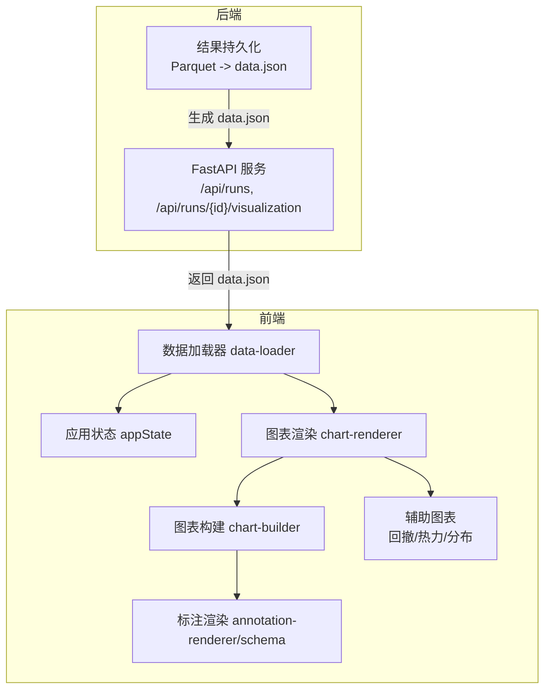
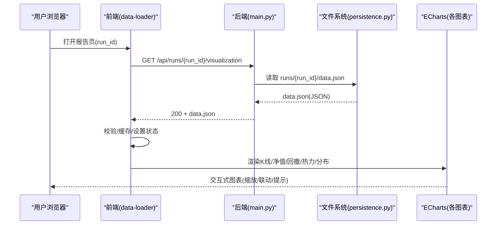
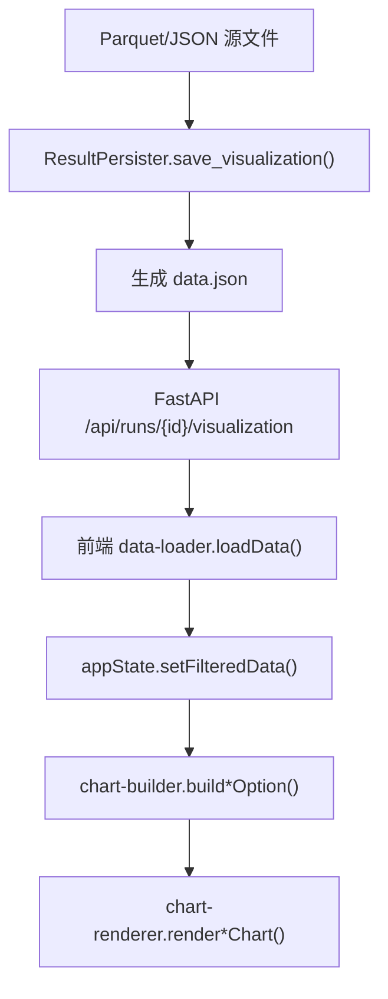
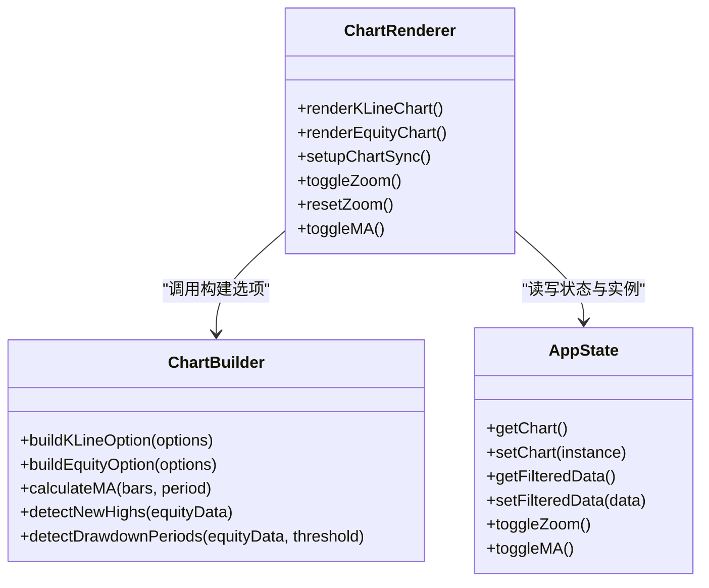
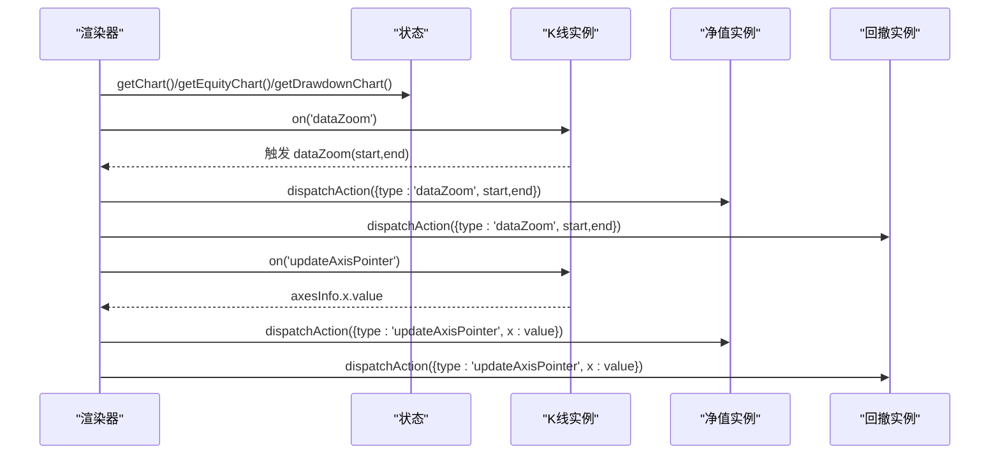
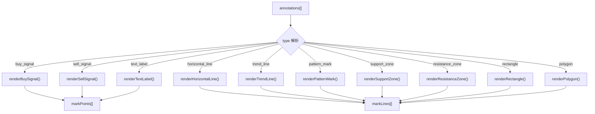
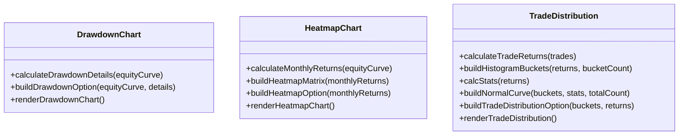
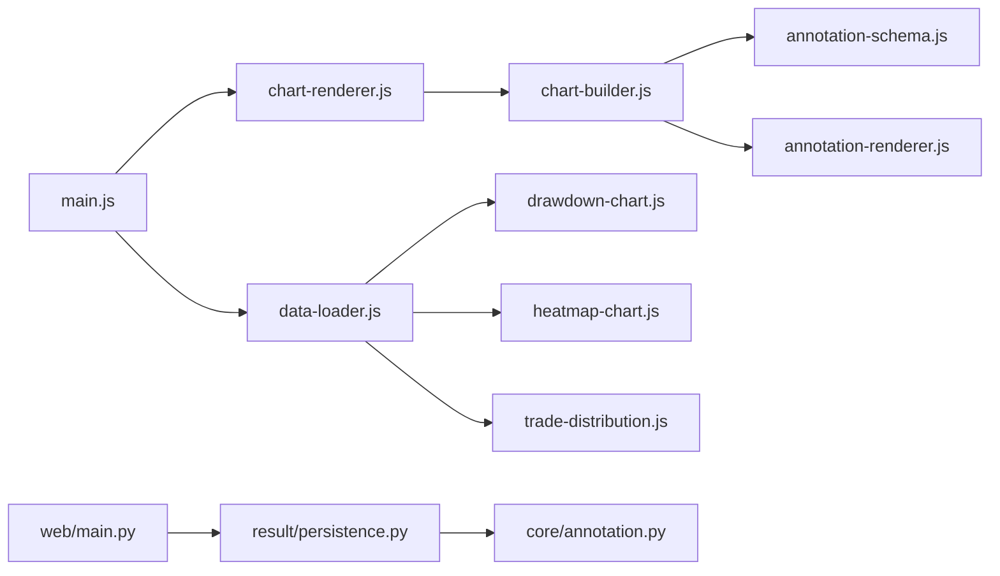

# 可视化报告系统

<cite>
**本文引用的文件**   
- [main.js](file://src/caisen/frontend/src/js/main.js)
- [chart-renderer.js](file://src/caisen/frontend/src/js/chart-renderer.js)
- [data-loader.js](file://src/caisen/frontend/src/js/data-loader.js)
- [annotation-renderer.js](file://src/caisen/frontend/src/js/annotation-renderer.js)
- [chart-builder.js](file://src/caisen/frontend/src/js/chart-builder.js)
- [drawdown-chart.js](file://src/caisen/frontend/src/js/drawdown-chart.js)
- [trade-distribution.js](file://src/caisen/frontend/src/js/trade-distribution.js)
- [heatmap-chart.js](file://src/caisen/frontend/src/js/heatmap-chart.js)
- [app-state.js](file://src/caisen/frontend/src/js/app-state.js)
- [annotation-schema.js](file://src/caisen/frontend/src/js/annotation-schema.js)
- [main.py](file://src/caisen/web/main.py)
- [persistence.py](file://src/caisen/result/persistence.py)
- [types.py](file://src/caisen/result/types.py)
- [annotation.py](file://src/caisen/core/annotation.py)
- [0005-visualization-annotations.md](file://docs/adr/0005-visualization-annotations.md)
- [0013-annotation-in-core.md](file://docs/adr/0013-annotation-in-core.md)
</cite>

## 目录
1. [简介](#简介)
2. [项目结构](#项目结构)
3. [核心组件](#核心组件)
4. [架构总览](#架构总览)
5. [详细组件分析](#详细组件分析)
6. [依赖关系分析](#依赖关系分析)
7. [性能考虑](#性能考虑)
8. [故障排查指南](#故障排查指南)
9. [结论](#结论)
10. [附录](#附录)

## 简介
本文件面向 Caisen 量化回测系统的可视化报告功能，系统性说明基于 ECharts 的前端图表渲染引擎与数据链路。内容覆盖：
- K线图、净值曲线、交易分布图、回撤分析图等核心图表的实现要点
- 后端 Parquet 数据到前端 JSON 的转换机制与字段映射
- 交互能力（缩放、平移、联动、工具提示、图例筛选）
- 可视化标注体系（买卖信号、形态识别、趋势线等）
- 自定义图表组件开发指南与样式定制方法
- 响应式布局与移动端适配方案
- 大数据量处理策略与性能优化技巧

## 项目结构
可视化模块采用前后端分离设计：
- 后端 FastAPI 提供运行列表、可视化数据接口，并负责将 Parquet 转换为 data.json
- 前端以模块化 JS 组织，按职责拆分为状态管理、数据加载、图表构建与渲染、标注渲染、辅助图表等

**图示来源** 
- [main.py:194-201](file://src/caisen/web/main.py#L194-L201)
- [persistence.py:136-201](file://src/caisen/result/persistence.py#L136-L201)
- [data-loader.js:179-249](file://src/caisen/frontend/src/js/data-loader.js#L179-L249)
- [chart-renderer.js:95-174](file://src/caisen/frontend/src/js/chart-renderer.js#L95-L174)
- [chart-builder.js:115-170](file://src/caisen/frontend/src/js/chart-builder.js#L115-L170)
- [annotation-renderer.js:15-36](file://src/caisen/frontend/src/js/annotation-renderer.js#L15-L36)

**章节来源**
- [main.py:86-245](file://src/caisen/web/main.py#L86-L245)
- [persistence.py:59-201](file://src/caisen/result/persistence.py#L59-L201)
- [main.js:1-96](file://src/caisen/frontend/src/js/main.js#L1-L96)

## 核心组件
- 应用状态管理：集中持有所有 ECharts 实例、原始/过滤数据、交互开关（缩放、均线显示、净值可见性）
- 数据加载器：从 API 或本地 data.json 获取数据，校验格式，缓存，驱动渲染管线
- 图表构建器：组装 ECharts option（K线、成交量、MA、净值、回撤、热力、分布）
- 图表渲染器：初始化/更新 ECharts 实例，统一 resize 与跨图表联动
- 标注渲染器：将标注数据转为 markPoints/markLines，支持多种类型
- 辅助图表：独立回撤区域图、月度收益热力图、交易盈亏分布直方图

**章节来源**
- [app-state.js:1-79](file://src/caisen/frontend/src/js/app-state.js#L1-L79)
- [data-loader.js:179-249](file://src/caisen/frontend/src/js/data-loader.js#L179-L249)
- [chart-builder.js:115-170](file://src/caisen/frontend/src/js/chart-builder.js#L115-L170)
- [chart-renderer.js:95-174](file://src/caisen/frontend/src/js/chart-renderer.js#L95-L174)
- [annotation-renderer.js:15-36](file://src/caisen/frontend/src/js/annotation-renderer.js#L15-L36)

## 架构总览
下图展示一次“查看回测报告”的端到端流程：后端读取 Parquet 生成 data.json，前端拉取后构建并渲染多类图表，同时建立跨图表联动。

**图示来源** 
- [main.py:194-201](file://src/caisen/web/main.py#L194-L201)
- [persistence.py:136-201](file://src/caisen/result/persistence.py#L136-L201)
- [data-loader.js:179-249](file://src/caisen/frontend/src/js/data-loader.js#L179-L249)
- [chart-renderer.js:254-332](file://src/caisen/frontend/src/js/chart-renderer.js#L254-L332)

## 详细组件分析

### 数据模型与数据流
- 后端存储：bars.parquet、equity.parquet、trades.parquet、annotations.json、metrics.json
- 前端消费：data.json 包含 meta/metrics/bars/equity_curve/trades/annotations
- 字段映射要点：
  - bars: 时间戳、OHLCV 字段
  - equity_curve: 时间戳、净值
  - trades: 时间戳、方向、价格、数量
  - annotations: type/timestamp/data（含 label/color/price/points 等）

**图示来源** 
- [persistence.py:136-201](file://src/caisen/result/persistence.py#L136-L201)
- [main.py:194-201](file://src/caisen/web/main.py#L194-L201)
- [data-loader.js:179-249](file://src/caisen/frontend/src/js/data-loader.js#L179-L249)
- [chart-builder.js:115-170](file://src/caisen/frontend/src/js/chart-builder.js#L115-L170)
- [chart-renderer.js:95-174](file://src/caisen/frontend/src/js/chart-renderer.js#L95-L174)

**章节来源**
- [persistence.py:136-201](file://src/caisen/result/persistence.py#L136-L201)
- [main.py:194-201](file://src/caisen/web/main.py#L194-L201)
- [data-loader.js:179-249](file://src/caisen/frontend/src/js/data-loader.js#L179-L249)

### 图表构建与渲染（K线、净值）
- K线图：构建 OHLC 数据、成交量柱状、可选 MA 叠加；根据数据规模启用 large/sampling；整合标注为 markPoints/markLines
- 净值曲线：计算回撤序列、新高点标记、回撤区间高亮；双轴（左净值、右回撤%）
- 渲染器：首次 init 实例，后续 setOption(true) 增量更新；统一窗口 resize 防抖；错误降级（移除复杂标注）

**图示来源** 
- [chart-builder.js:115-170](file://src/caisen/frontend/src/js/chart-builder.js#L115-L170)
- [chart-builder.js:367-428](file://src/caisen/frontend/src/js/chart-builder.js#L367-L428)
- [chart-renderer.js:95-174](file://src/caisen/frontend/src/js/chart-renderer.js#L95-L174)
- [app-state.js:1-79](file://src/caisen/frontend/src/js/app-state.js#L1-L79)

**章节来源**
- [chart-builder.js:115-170](file://src/caisen/frontend/src/js/chart-builder.js#L115-L170)
- [chart-builder.js:367-428](file://src/caisen/frontend/src/js/chart-builder.js#L367-L428)
- [chart-renderer.js:95-174](file://src/caisen/frontend/src/js/chart-renderer.js#L95-L174)

### 交互特性（缩放、平移、联动、提示、图例）
- 缩放与平移：inside dataZoom + 可选 slider；重置缩放通过 dispatchAction 同步至所有图表
- 跨图表联动：监听 dataZoom/updateAxisPointer，使用 WeakSet 避免重复绑定
- 工具提示：K线 tooltip 卡片式展示 OHLCV 与涨跌幅、MA 值、关联标注文本
- 图例筛选：K线 legend 控制 MA5/MA20 显示；净值图 legend 控制净值/回撤

**图示来源** 
- [chart-renderer.js:254-332](file://src/caisen/frontend/src/js/chart-renderer.js#L254-L332)
- [chart-builder.js:175-192](file://src/caisen/frontend/src/js/chart-builder.js#L175-L192)
- [chart-builder.js:440-460](file://src/caisen/frontend/src/js/chart-builder.js#L440-L460)

**章节来源**
- [chart-renderer.js:254-332](file://src/caisen/frontend/src/js/chart-renderer.js#L254-L332)
- [chart-builder.js:175-192](file://src/caisen/frontend/src/js/chart-builder.js#L175-L192)
- [chart-builder.js:440-460](file://src/caisen/frontend/src/js/chart-builder.js#L440-L460)

### 可视化标注系统
- 标注类型：买卖信号、中性信号、水平线、趋势线、支撑/阻力区、成交量异常、文本标签、形态标记、矩形、多边形
- 渲染逻辑：遍历 annotations，按 type 分发到对应渲染函数，输出 markPoints/markLines
- 坐标匹配：通过 timestamp 查找 bars 索引，容错模糊匹配（小时级）
- 配置中心：annotation-schema.js 定义类型与默认样式，便于扩展

**图示来源** 
- [annotation-renderer.js:15-36](file://src/caisen/frontend/src/js/annotation-renderer.js#L15-L36)
- [annotation-renderer.js:77-144](file://src/caisen/frontend/src/js/annotation-renderer.js#L77-L144)
- [annotation-renderer.js:152-206](file://src/caisen/frontend/src/js/annotation-renderer.js#L152-L206)
- [annotation-renderer.js:214-285](file://src/caisen/frontend/src/js/annotation-renderer.js#L214-L285)
- [annotation-schema.js:8-102](file://src/caisen/frontend/src/js/annotation-schema.js#L8-L102)

**章节来源**
- [annotation-renderer.js:15-36](file://src/caisen/frontend/src/js/annotation-renderer.js#L15-L36)
- [annotation-schema.js:8-102](file://src/caisen/frontend/src/js/annotation-schema.js#L8-L102)
- [annotation.py:13-36](file://src/caisen/core/annotation.py#L13-L36)

### 辅助图表（回撤、热力、交易分布）
- 回撤区域图：计算最大回撤区间、恢复点、持续天数；markArea 高亮、markPoint 标注底部与恢复
- 月度收益热力图：聚合年度×月度收益，附加年均列与月均行；visualMap 三段渐变
- 交易盈亏分布：配对买卖计算收益率，分桶统计，叠加正态拟合曲线，均值/中位标线

**图示来源** 
- [drawdown-chart.js:12-72](file://src/caisen/frontend/src/js/drawdown-chart.js#L12-L72)
- [drawdown-chart.js:91-228](file://src/caisen/frontend/src/js/drawdown-chart.js#L91-L228)
- [heatmap-chart.js:15-54](file://src/caisen/frontend/src/js/heatmap-chart.js#L15-L54)
- [heatmap-chart.js:63-105](file://src/caisen/frontend/src/js/heatmap-chart.js#L63-L105)
- [trade-distribution.js:11-34](file://src/caisen/frontend/src/js/trade-distribution.js#L11-L34)
- [trade-distribution.js:39-71](file://src/caisen/frontend/src/js/trade-distribution.js#L39-L71)
- [trade-distribution.js:76-88](file://src/caisen/frontend/src/js/trade-distribution.js#L76-L88)
- [trade-distribution.js:94-102](file://src/caisen/frontend/src/js/trade-distribution.js#L94-L102)

**章节来源**
- [drawdown-chart.js:91-228](file://src/caisen/frontend/src/js/drawdown-chart.js#L91-L228)
- [heatmap-chart.js:110-229](file://src/caisen/frontend/src/js/heatmap-chart.js#L110-L229)
- [trade-distribution.js:107-246](file://src/caisen/frontend/src/js/trade-distribution.js#L107-L246)

### 自定义图表组件开发指南
- 新增图表步骤
  1) 在 app-state.js 增加实例 getter/setter
  2) 新建 xxx-chart.js，实现 buildXxxOption 与 renderXxxChart
  3) 在 main.js 导出新函数，供 HTML 或入口调用
  4) 在 data-loader.js 中按需 lazyInitChart 懒加载
- 样式定制
  - 颜色常量集中在 constants.js（如 CHART_COLORS），修改即可全局生效
  - 图表主题可通过 ECharts theme 或 option 中的 backgroundColor/grid/axisLabel 等属性调整
- 扩展标注类型
  - 在 annotation-schema.js 添加类型与默认样式
  - 在 annotation-renderer.js 新增渲染函数，并在 getAnnotationRenderer 注册

**章节来源**
- [app-state.js:1-79](file://src/caisen/frontend/src/js/app-state.js#L1-L79)
- [main.js:61-95](file://src/caisen/frontend/src/js/main.js#L61-L95)
- [data-loader.js:237-244](file://src/caisen/frontend/src/js/data-loader.js#L237-L244)
- [annotation-schema.js:8-102](file://src/caisen/frontend/src/js/annotation-schema.js#L8-L102)
- [annotation-renderer.js:43-59](file://src/caisen/frontend/src/js/annotation-renderer.js#L43-L59)

### 响应式布局与移动端适配
- 统一 resize 防抖：window.resize 事件触发所有图表实例 resize
- 懒加载非首屏图表：IntersectionObserver 延迟初始化，减少首屏开销
- 建议
  - 在小屏上隐藏次要网格或简化 tooltip
  - 适当增大 touch 目标尺寸，提升可点击性

**章节来源**
- [chart-renderer.js:30-46](file://src/caisen/frontend/src/js/chart-renderer.js#L30-L46)
- [chart-renderer.js:59-90](file://src/caisen/frontend/src/js/chart-renderer.js#L59-L90)

## 依赖关系分析
- 前端模块耦合
  - main.js 作为入口，集中导出全局函数，降低 HTML 内联脚本复杂度
  - chart-renderer 依赖 chart-builder 与 app-state
  - data-loader 协调渲染管线与懒加载
  - 辅助图表各自独立，仅依赖 app-state 与 echarts
- 后端依赖
  - web/main.py 暴露 REST/WebSocket 接口
  - result/persistence.py 负责 Parquet→JSON 的拼装与 data.json 生成
  - core/annotation.py 与前端 annotation-schema.js 保持类型一致

**图示来源** 
- [main.js:1-96](file://src/caisen/frontend/src/js/main.js#L1-L96)
- [chart-renderer.js:1-46](file://src/caisen/frontend/src/js/chart-renderer.js#L1-L46)
- [chart-builder.js:1-10](file://src/caisen/frontend/src/js/chart-builder.js#L1-L10)
- [annotation-renderer.js:1-8](file://src/caisen/frontend/src/js/annotation-renderer.js#L1-L8)
- [main.py:194-201](file://src/caisen/web/main.py#L194-L201)
- [persistence.py:136-201](file://src/caisen/result/persistence.py#L136-L201)
- [annotation.py:13-36](file://src/caisen/core/annotation.py#L13-L36)

**章节来源**
- [main.js:1-96](file://src/caisen/frontend/src/js/main.js#L1-L96)
- [chart-renderer.js:1-46](file://src/caisen/frontend/src/js/chart-renderer.js#L1-L46)
- [chart-builder.js:1-10](file://src/caisen/frontend/src/js/chart-builder.js#L1-L10)
- [annotation-renderer.js:1-8](file://src/caisen/frontend/src/js/annotation-renderer.js#L1-L8)
- [main.py:194-201](file://src/caisen/web/main.py#L194-L201)
- [persistence.py:136-201](file://src/caisen/result/persistence.py#L136-L201)
- [annotation.py:13-36](file://src/caisen/core/annotation.py#L13-L36)

## 性能考虑
- 大数据模式
  - K线与成交量启用 large/largeThreshold，超万根时关闭动画
  - 均线采样 lttb，减少绘制点数
  - 限制 markPoints 数量（例如前 100）
- 懒加载与防抖
  - IntersectionObserver 延迟初始化非首屏图表
  - 统一 resize 防抖，避免频繁重绘
- 数据校验与降级
  - 前端对 data.json 进行必要字段校验，失败则友好提示
  - 渲染异常时回退到简化配置（移除复杂标注）

**章节来源**
- [chart-builder.js:142-170](file://src/caisen/frontend/src/js/chart-builder.js#L142-L170)
- [chart-builder.js:272-334](file://src/caisen/frontend/src/js/chart-builder.js#L272-L334)
- [chart-renderer.js:30-46](file://src/caisen/frontend/src/js/chart-renderer.js#L30-L46)
- [chart-renderer.js:59-90](file://src/caisen/frontend/src/js/chart-renderer.js#L59-L90)
- [chart-renderer.js:179-197](file://src/caisen/frontend/src/js/chart-renderer.js#L179-L197)
- [data-loader.js:123-174](file://src/caisen/frontend/src/js/data-loader.js#L123-L174)

## 故障排查指南
- 常见问题定位
  - 页面空白：检查 data.json 是否存在且 bars 字段完整
  - 图表不联动：确认 setupChartSync 已执行且至少两个图表实例存在
  - 标注未显示：核对 annotation.type 是否在 schema 中注册，timestamp 是否能匹配到 bars
- 日志与调试
  - 全局错误捕获：onerror/onunhandledrejection 记录堆栈
  - DEBUG_CONFIG 日志：关键路径打印进入/退出信息
- 快速修复
  - 重置缩放：dispatchAction 统一复位
  - 降级渲染：移除 markPoint/markLine 后重试

**章节来源**
- [main.js:37-47](file://src/caisen/frontend/src/js/main.js#L37-L47)
- [chart-renderer.js:179-197](file://src/caisen/frontend/src/js/chart-renderer.js#L179-L197)
- [chart-renderer.js:214-224](file://src/caisen/frontend/src/js/chart-renderer.js#L214-L224)
- [data-loader.js:123-174](file://src/caisen/frontend/src/js/data-loader.js#L123-L174)

## 结论
本可视化报告系统以后端 Parquet 为数据源，经 persistence 层生成 data.json，前端基于 ECharts 实现高性能、可交互的多维图表。通过统一的标注体系与灵活的构建/渲染分离，既保证了可扩展性，也兼顾了大数据场景下的性能表现。配合懒加载、防抖与降级策略，可在桌面与移动端获得一致的体验。

## 附录

### 数据格式规范（data.json）
- meta：策略名、标的、起止时间、频率
- metrics：绩效指标字典
- bars：K线数组（timestamp/open/high/low/close/volume）
- equity_curve：净值数组（timestamp/equity）
- trades：交易数组（timestamp/side/price/quantity 等）
- annotations：标注数组（type/timestamp/data）

**章节来源**
- [persistence.py:154-201](file://src/caisen/result/persistence.py#L154-L201)
- [types.py:9-32](file://src/caisen/result/types.py#L9-L32)
- [annotation.py:39-81](file://src/caisen/core/annotation.py#L39-L81)
- [0005-visualization-annotations.md:1-23](file://docs/adr/0005-visualization-annotations.md#L1-L23)
- [0013-annotation-in-core.md:1-47](file://docs/adr/0013-annotation-in-core.md#L1-L47)