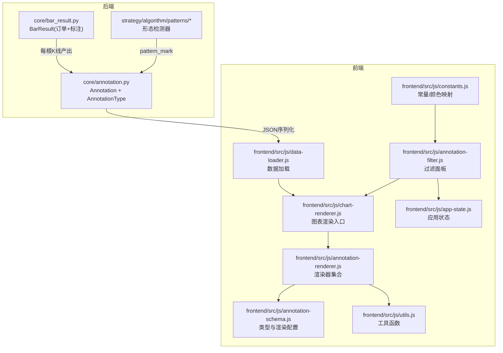
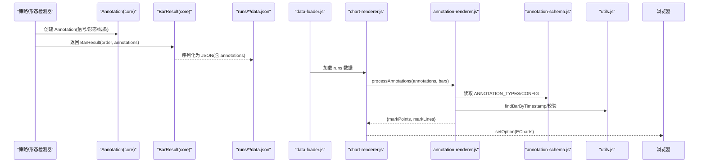
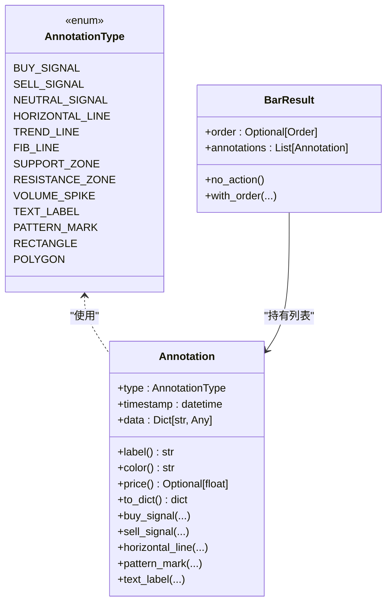
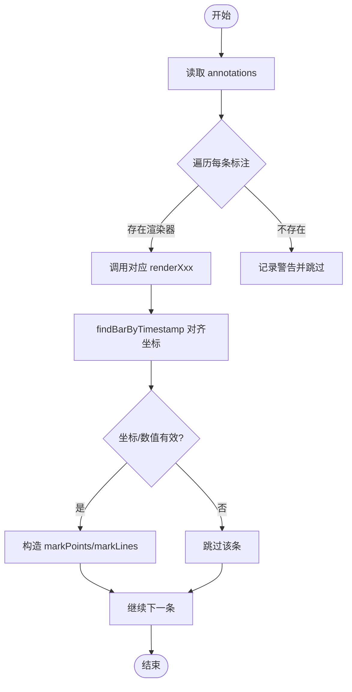
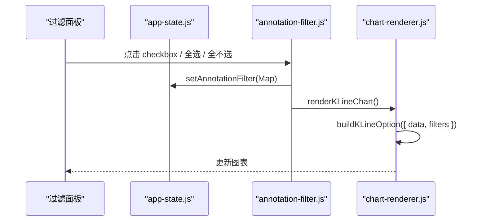
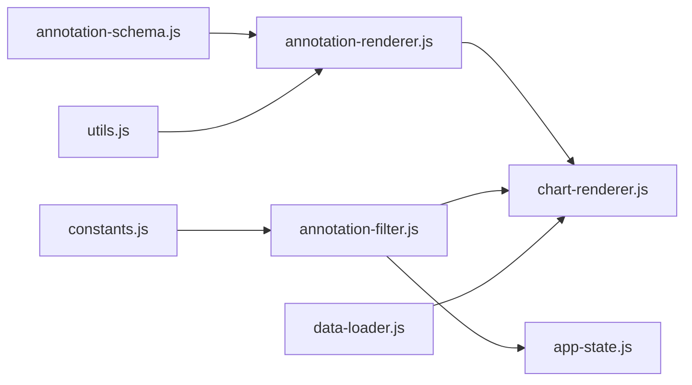

# 可视化标注系统

<cite>
**本文引用的文件**   
- [annotation.py](file://src/caisen/core/annotation.py)
- [bar_result.py](file://src/caisen/core/bar_result.py)
- [annotation-schema.js](file://src/caisen/frontend/src/js/annotation-schema.js)
- [annotation-renderer.js](file://src/caisen/frontend/src/js/annotation-renderer.js)
- [annotation-filter.js](file://src/caisen/frontend/src/js/annotation-filter.js)
- [constants.js](file://src/caisen/frontend/src/js/constants.js)
- [app-state.js](file://src/caisen/frontend/src/js/app-state.js)
- [utils.js](file://src/caisen/frontend/src/js/utils.js)
- [chart-renderer.js](file://src/caisen/frontend/src/js/chart-renderer.js)
- [data-loader.js](file://src/caisen/frontend/src/js/data-loader.js)
- [0005-visualization-annotations.md](file://docs/adr/0005-visualization-annotations.md)
- [0013-annotation-in-core.md](file://docs/adr/0013-annotation-in-core.md)
- [w_bottom.py](file://src/caisen/strategy/algorithm/patterns/w_bottom.py)
- [m_top.py](file://src/caisen/strategy/algorithm/patterns/m_top.py)
- [head_shoulders.py](file://src/caisen/strategy/algorithm/patterns/head_shoulders.py)
- [__init__.py](file://src/caisen/strategy/algorithm/patterns/__init__.py)
- [annotation_renderer.test.js](file://tests/js/annotation_renderer.test.js)
</cite>

## 目录
1. [简介](#简介)
2. [项目结构](#项目结构)
3. [核心组件](#核心组件)
4. [架构总览](#架构总览)
5. [详细组件分析](#详细组件分析)
6. [依赖关系分析](#依赖关系分析)
7. [性能考虑](#性能考虑)
8. [故障排查指南](#故障排查指南)
9. [结论](#结论)
10. [附录](#附录)

## 简介
本文件面向 Caisen 量化回测系统的“可视化标注系统”，系统性阐述从策略侧生成标注、到结果持久化、再到前端渲染与交互的完整链路。重点覆盖：
- 交易信号标注（买入/卖出/中性）、止损止盈线、趋势线与形态标记（W底、M头、头肩顶/底等）的渲染逻辑
- 标注数据 Schema 设计与校验机制
- 过滤与显示控制（按类型筛选、透明度与图层管理）
- 交互操作（编辑、删除、批量操作）
- 自定义标注类型的扩展指南
- 导入导出与版本兼容性处理

## 项目结构
可视化标注系统由后端核心类型定义与前端渲染模块组成，前后端通过 JSON 数据契约进行解耦。

图示来源
- [annotation.py:1-139](file://src/caisen/core/annotation.py#L1-L139)
- [bar_result.py:1-41](file://src/caisen/core/bar_result.py#L1-L41)
- [annotation-schema.js:1-128](file://src/caisen/frontend/src/js/annotation-schema.js#L1-L128)
- [annotation-renderer.js:1-437](file://src/caisen/frontend/src/js/annotation-renderer.js#L1-L437)
- [annotation-filter.js:1-176](file://src/caisen/frontend/src/js/annotation-filter.js#L1-L176)
- [utils.js:1-182](file://src/caisen/frontend/src/js/utils.js#L1-L182)
- [chart-renderer.js:1-200](file://src/caisen/frontend/src/js/chart-renderer.js#L1-L200)
- [data-loader.js:1-37](file://src/caisen/frontend/src/js/data-loader.js#L1-L37)
- [constants.js:1-109](file://src/caisen/frontend/src/js/constants.js#L1-L109)
- [app-state.js:1-79](file://src/caisen/frontend/src/js/app-state.js#L1-L79)

章节来源
- [0005-visualization-annotations.md:1-23](file://docs/adr/0005-visualization-annotations.md#L1-L23)
- [0013-annotation-in-core.md:1-47](file://docs/adr/0013-annotation-in-core.md#L1-L47)

## 核心组件
- 标注核心类型（后端）
  - 统一标注类型枚举与数据结构，提供便捷工厂方法，支持序列化到 JSON。
- 单根 K 线结果（后端）
  - 将订单与新增标注聚合在 BarResult 中，引擎逐 bar 累积。
- 标注 Schema 与渲染配置（前端）
  - 单一真相源：标注类型与默认样式、符号、线条风格等集中管理。
- 渲染器（前端）
  - 根据 type 分发到具体渲染函数，输出 ECharts markPoints/markLines。
- 过滤面板（前端）
  - 按类型/形态分组展示开关，联动重绘。
- 工具与状态（前端）
  - 时间戳匹配、坐标校验、日期过滤；全局状态统一管理。
- 图表渲染入口（前端）
  - 构建 option 并驱动 ECharts 实例更新，含懒加载与防抖优化。

章节来源
- [annotation.py:1-139](file://src/caisen/core/annotation.py#L1-L139)
- [bar_result.py:1-41](file://src/caisen/core/bar_result.py#L1-L41)
- [annotation-schema.js:1-128](file://src/caisen/frontend/src/js/annotation-schema.js#L1-L128)
- [annotation-renderer.js:1-437](file://src/caisen/frontend/src/js/annotation-renderer.js#L1-L437)
- [annotation-filter.js:1-176](file://src/caisen/frontend/src/js/annotation-filter.js#L1-L176)
- [utils.js:1-182](file://src/caisen/frontend/src/js/utils.js#L1-L182)
- [chart-renderer.js:1-200](file://src/caisen/frontend/src/js/chart-renderer.js#L1-L200)

## 架构总览
后端以 Annotation 为共享契约，策略或形态检测器产生标注；前端基于 annotation-schema 与 renderer 将标注转换为 ECharts 图形元素，并通过 filter 面板实现显示控制。

图示来源
- [annotation.py:1-139](file://src/caisen/core/annotation.py#L1-L139)
- [bar_result.py:1-41](file://src/caisen/core/bar_result.py#L1-L41)
- [annotation-renderer.js:1-437](file://src/caisen/frontend/src/js/annotation-renderer.js#L1-L437)
- [annotation-schema.js:1-128](file://src/caisen/frontend/src/js/annotation-schema.js#L1-L128)
- [utils.js:1-182](file://src/caisen/frontend/src/js/utils.js#L1-L182)
- [chart-renderer.js:1-200](file://src/caisen/frontend/src/js/chart-renderer.js#L1-L200)
- [data-loader.js:1-37](file://src/caisen/frontend/src/js/data-loader.js#L1-L37)

## 详细组件分析

### 标注数据模型与验证（后端）
- 类型体系
  - 点位标注：buy_signal、sell_signal、neutral_signal
  - 线条标注：horizontal_line、trend_line、fib_line
  - 区域标注：support_zone、resistance_zone、volume_spike
  - 文本标注：text_label、pattern_mark
  - 图形标注：rectangle、polygon
- 数据结构
  - 字段：type、timestamp、data（字典，可包含 price、label、color、points、neckline 等）
  - 工厂方法：buy_signal/sell_signal/horizontal_line/pattern_mark/text_label 等
- 序列化
  - to_dict 递归处理 datetime，确保 JSON 兼容
- 验证要点
  - 数值有效性：价格、坐标需为有限数
  - 时间匹配：findBarByTimestamp 支持精确与近似匹配（日内容差）
  - 必填字段：如 horizontal_line 需要 price；trend_line 需要 start/end；pattern_mark 需要 points 且长度≥2

图示来源
- [annotation.py:1-139](file://src/caisen/core/annotation.py#L1-L139)
- [bar_result.py:1-41](file://src/caisen/core/bar_result.py#L1-L41)

章节来源
- [annotation.py:1-139](file://src/caisen/core/annotation.py#L1-L139)
- [bar_result.py:1-41](file://src/caisen/core/bar_result.py#L1-L41)

### 前端 Schema 与渲染配置
- 单一真相源
  - ANNOTATION_TYPES：与后端保持同步
  - ANNOTATION_CONFIG：每种类型的默认颜色、符号、线型、字号等
- 辅助函数
  - getSupportedAnnotationTypes/isAnnotationTypeSupported/getAnnotationConfig

章节来源
- [annotation-schema.js:1-128](file://src/caisen/frontend/src/js/annotation-schema.js#L1-L128)

### 渲染器与数据处理
- 主流程
  - processAnnotations：遍历 annotations，按 type 分发给对应 renderXxx
  - 每个渲染器负责将 annotation 转为 ECharts markPoints/markLines
- 关键渲染器
  - 点位：renderBuySignal/renderSellSignal/renderNeutralSignal
  - 线条：renderHorizontalLine/renderTrendLine
  - 形态：renderPatternMark（支持多点连线、可选颈线、点标记）
  - 区域：renderSupportZone/renderResistanceZone
  - 文本：renderTextLabel
  - 图形：renderRectangle/renderPolygon
  - 成交量异常：renderVolumeSpike（占位，交由成交量系列处理）
- 数据对齐与校验
  - findBarByTimestamp：按 timestamp 定位 bars 索引
  - isFiniteNum/isValidCoord：数值与坐标合法性检查
  - filterValidMarkPoints/filterValidMarkLines：最终过滤无效项

图示来源
- [annotation-renderer.js:1-437](file://src/caisen/frontend/src/js/annotation-renderer.js#L1-L437)
- [utils.js:1-182](file://src/caisen/frontend/src/js/utils.js#L1-L182)

章节来源
- [annotation-renderer.js:1-437](file://src/caisen/frontend/src/js/annotation-renderer.js#L1-L437)
- [utils.js:1-182](file://src/caisen/frontend/src/js/utils.js#L1-L182)

### 形态识别结果的可视化
- 支持的经典形态
  - W底、M头、头肩顶/底、三角形、旗形、矩形、圆弧底、杯柄、过前高、破底翻、假突破等
- 颜色编码
  - constants.js 中 PATTERN_COLORS 为各形态分配固定色板
- 渲染细节
  - pattern_mark：绘制关键点连线、可选颈线（虚线），并在关键点处绘制圆点标记
  - 标签：优先使用 data.label，否则回退到 pattern 名称

章节来源
- [constants.js:1-109](file://src/caisen/frontend/src/js/constants.js#L1-L109)
- [annotation-renderer.js:1-437](file://src/caisen/frontend/src/js/annotation-renderer.js#L1-L437)

### 标注过滤与显示控制
- 过滤面板
  - 自动扫描 annotations，提取所有 pattern 类型，并与信号/线条类型分组展示
  - 支持全选/全不选/收起展开
- 过滤逻辑
  - filterAnnotations：依据 appState 中的 Map<string, boolean> 决定是否保留某条标注
- 联动重绘
  - 切换后触发 renderKLineChart 刷新图表

图示来源
- [annotation-filter.js:1-176](file://src/caisen/frontend/src/js/annotation-filter.js#L1-L176)
- [app-state.js:1-79](file://src/caisen/frontend/src/js/app-state.js#L1-L79)
- [chart-renderer.js:1-200](file://src/caisen/frontend/src/js/chart-renderer.js#L1-L200)

章节来源
- [annotation-filter.js:1-176](file://src/caisen/frontend/src/js/annotation-filter.js#L1-L176)
- [app-state.js:1-79](file://src/caisen/frontend/src/js/app-state.js#L1-L79)
- [chart-renderer.js:1-200](file://src/caisen/frontend/src/js/chart-renderer.js#L1-L200)

### 交互操作（编辑、删除、批量操作）
- 当前能力
  - 显示控制：按类型/形态筛选、全选/全不选、折叠面板
  - 数据范围：按起止日期过滤（影响 bars/trades/annotations）
- 可扩展方向
  - 编辑：在渲染层增加选中态与属性面板，修改 label/color/可见性
  - 删除：对 annotations 数组执行移除并重新渲染
  - 批量：基于过滤条件批量修改属性或隐藏
- 建议实现位置
  - 在 annotation-filter.js 中扩展批量操作按钮
  - 在 chart-renderer.js 中监听用户交互事件，调用 processAnnotations 重绘

章节来源
- [annotation-filter.js:1-176](file://src/caisen/frontend/src/js/annotation-filter.js#L1-L176)
- [utils.js:1-182](file://src/caisen/frontend/src/js/utils.js#L1-L182)
- [chart-renderer.js:1-200](file://src/caisen/frontend/src/js/chart-renderer.js#L1-L200)

### 自定义标注类型开发指南
- 后端
  - 在 AnnotationType 中添加新类型值
  - 在 Annotation 中补充便捷工厂方法（可选）
- 前端
  - 在 annotation-schema.js 的 ANNOTATION_TYPES 与 ANNOTATION_CONFIG 中注册
  - 在 annotation-renderer.js 的 getAnnotationRenderer 中映射新渲染函数
  - 如需参与过滤面板，可在 annotation-filter.js 中扩展分组与标签
- 测试
  - 参考 tests/js/annotation_renderer.test.js 的模式为新类型编写用例

章节来源
- [annotation.py:1-139](file://src/caisen/core/annotation.py#L1-L139)
- [annotation-schema.js:1-128](file://src/caisen/frontend/src/js/annotation-schema.js#L1-L128)
- [annotation-renderer.js:1-437](file://src/caisen/frontend/src/js/annotation-renderer.js#L1-L437)
- [annotation-filter.js:1-176](file://src/caisen/frontend/src/js/annotation-filter.js#L1-L176)
- [annotation_renderer.test.js:1-418](file://tests/js/annotation_renderer.test.js#L1-L418)

### 导入导出与版本兼容性
- 存储格式
  - runs/{run_id}/data.json 包含 bars、trades、equity_curve、annotations 等
- 导入
  - data-loader.js 支持从本地 data.json 或 API 路径加载
- 导出
  - 可在前端新增导出功能，基于 appState.getFilteredData() 生成 JSON
- 版本兼容
  - 渲染器对缺失字段做防御性处理（如空 points、NaN 价格）
  - utils.js 提供日期过滤，便于跨版本数据切片

章节来源
- [0005-visualization-annotations.md:1-23](file://docs/adr/0005-visualization-annotations.md#L1-L23)
- [data-loader.js:1-37](file://src/caisen/frontend/src/js/data-loader.js#L1-L37)
- [utils.js:1-182](file://src/caisen/frontend/src/js/utils.js#L1-L182)

## 依赖关系分析
- 模块耦合
  - annotation-renderer.js 强依赖 annotation-schema.js 与 utils.js
  - annotation-filter.js 依赖 app-state.js 与 chart-renderer.js
  - chart-renderer.js 作为渲染入口，协调数据与渲染器
- 外部依赖
  - ECharts（图表库）
  - IntersectionObserver（懒加载）
- 潜在循环
  - 当前无直接循环依赖；filter 与 chart-renderer 通过函数调用而非互相 import

图示来源
- [annotation-schema.js:1-128](file://src/caisen/frontend/src/js/annotation-schema.js#L1-L128)
- [annotation-renderer.js:1-437](file://src/caisen/frontend/src/js/annotation-renderer.js#L1-L437)
- [utils.js:1-182](file://src/caisen/frontend/src/js/utils.js#L1-L182)
- [chart-renderer.js:1-200](file://src/caisen/frontend/src/js/chart-renderer.js#L1-L200)
- [annotation-filter.js:1-176](file://src/caisen/frontend/src/js/annotation-filter.js#L1-L176)
- [app-state.js:1-79](file://src/caisen/frontend/src/js/app-state.js#L1-L79)
- [constants.js:1-109](file://src/caisen/frontend/src/js/constants.js#L1-L109)
- [data-loader.js:1-37](file://src/caisen/frontend/src/js/data-loader.js#L1-L37)

章节来源
- [annotation-renderer.js:1-437](file://src/caisen/frontend/src/js/annotation-renderer.js#L1-L437)
- [annotation-filter.js:1-176](file://src/caisen/frontend/src/js/annotation-filter.js#L1-L176)
- [chart-renderer.js:1-200](file://src/caisen/frontend/src/js/chart-renderer.js#L1-L200)

## 性能考虑
- 懒加载：chart-renderer.js 使用 IntersectionObserver 延迟初始化图表
- 防抖：窗口 resize 事件统一防抖，避免频繁重绘
- 数据过滤：utils.js 提供高效的时间范围过滤，减少渲染数据量
- 错误降级：handleChartError 在配置异常时回退到简化 option，保证页面可用

章节来源
- [chart-renderer.js:1-200](file://src/caisen/frontend/src/js/chart-renderer.js#L1-L200)
- [utils.js:1-182](file://src/caisen/frontend/src/js/utils.js#L1-L182)

## 故障排查指南
- 常见渲染问题
  - 无标注显示：检查 annotations 是否为空、timestamp 是否与 bars 匹配
  - 线条未出现：确认 price/start/end 是否有效且有限
  - 形态未连线：确保 points 数量≥2 且坐标有效
- 日志与调试
  - 渲染器内部对未知类型与异常进行 warn/error 提示
  - DEBUG_CONFIG 在开发环境输出关键步骤日志
- 快速定位
  - 使用过滤面板逐项关闭类型，观察是否恢复
  - 在浏览器控制台查看渲染错误信息

章节来源
- [annotation-renderer.js:1-437](file://src/caisen/frontend/src/js/annotation-renderer.js#L1-L437)
- [constants.js:1-109](file://src/caisen/frontend/src/js/constants.js#L1-L109)

## 结论
Caisen 的可视化标注系统以后端 Annotation 为核心契约，前端通过 schema 与渲染器实现灵活、可扩展的可视化呈现。系统已覆盖主流交易信号与经典形态，具备完善的过滤与显示控制能力，并提供清晰的扩展接口与测试范式，便于持续演进。

## 附录

### 形态检测器与标注生成示例
- W底检测器
  - 检测双底与颈线突破，生成 pattern_mark 标注，包含关键点与颈线信息
- M头检测器
  - 检测双顶与颈线跌破，生成空头方向的 pattern_mark 标注
- 头肩顶/底检测器
  - 检测左肩-头-右肩结构与颈线，生成带颈线的 pattern_mark 标注

章节来源
- [w_bottom.py:1-285](file://src/caisen/strategy/algorithm/patterns/w_bottom.py#L1-L285)
- [m_top.py:1-227](file://src/caisen/strategy/algorithm/patterns/m_top.py#L1-L227)
- [head_shoulders.py:1-41](file://src/caisen/strategy/algorithm/patterns/head_shoulders.py#L1-L41)
- [__init__.py:1-27](file://src/caisen/strategy/algorithm/patterns/__init__.py#L1-L27)