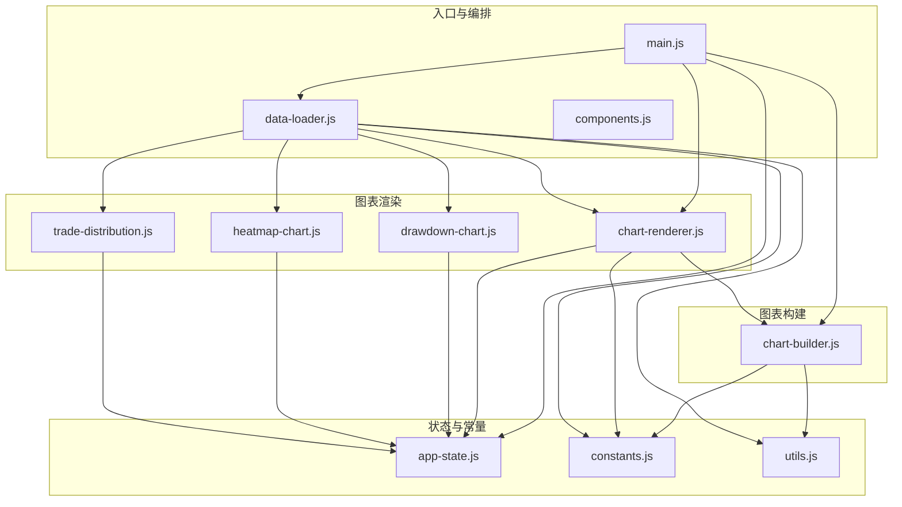
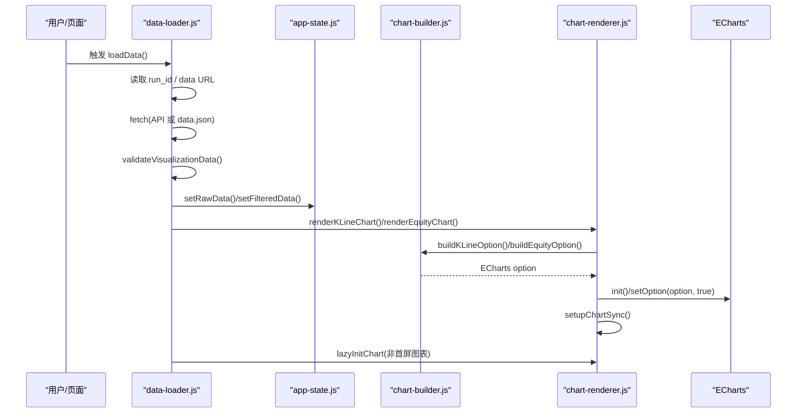
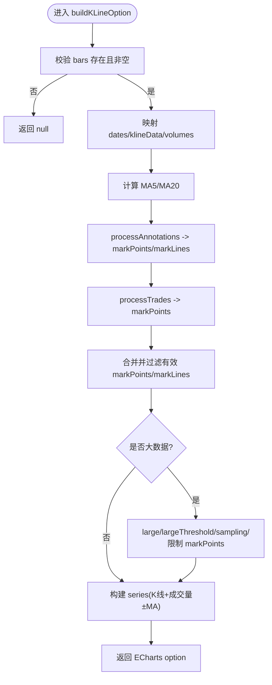
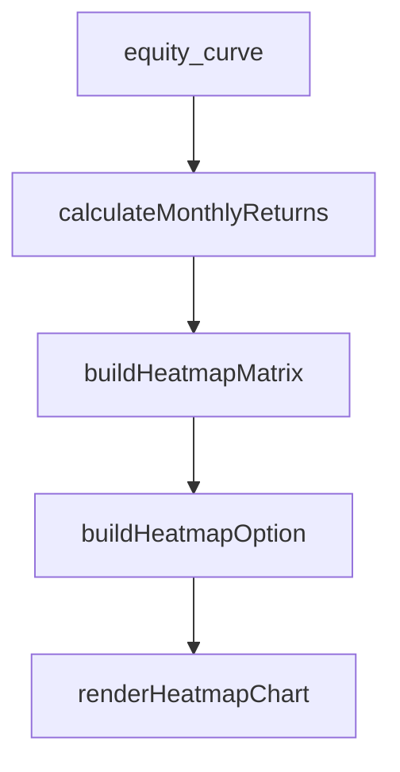
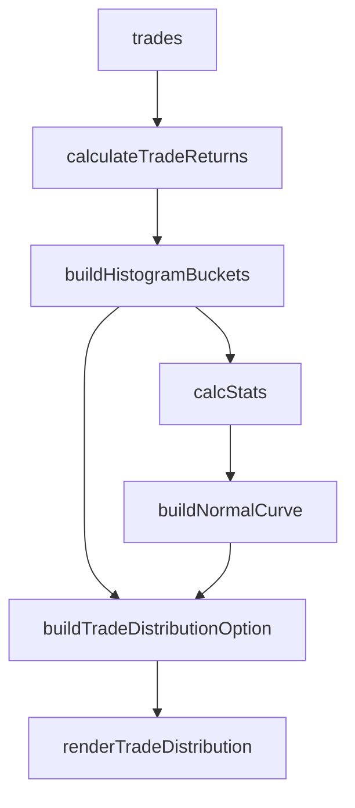
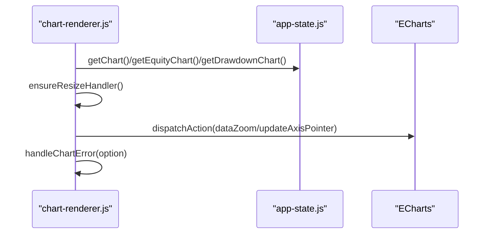
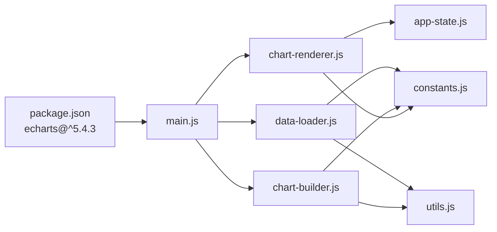

# 图表渲染引擎

<cite>
**本文引用的文件**
- [chart-renderer.js](file://src/caisen/frontend/src/js/chart-renderer.js)
- [chart-builder.js](file://src/caisen/frontend/src/js/chart-builder.js)
- [app-state.js](file://src/caisen/frontend/src/js/app-state.js)
- [drawdown-chart.js](file://src/caisen/frontend/src/js/drawdown-chart.js)
- [heatmap-chart.js](file://src/caisen/frontend/src/js/heatmap-chart.js)
- [trade-distribution.js](file://src/caisen/frontend/src/js/trade-distribution.js)
- [constants.js](file://src/caisen/frontend/src/js/constants.js)
- [utils.js](file://src/caisen/frontend/src/js/utils.js)
- [main.js](file://src/caisen/frontend/src/js/main.js)
- [data-loader.js](file://src/caisen/frontend/src/js/data-loader.js)
- [components.js](file://src/caisen/frontend/src/js/components.js)
- [package.json](file://src/caisen/frontend/package.json)
</cite>

## 目录
1. [简介](#简介)
2. [项目结构](#项目结构)
3. [核心组件](#核心组件)
4. [架构总览](#架构总览)
5. [详细组件分析](#详细组件分析)
6. [依赖关系分析](#依赖关系分析)
7. [性能考量](#性能考量)
8. [故障排查指南](#故障排查指南)
9. [结论](#结论)
10. [附录](#附录)

## 简介
本文件面向 Caisen 量化回测系统的图表渲染引擎，聚焦基于 ECharts 的前端可视化实现。文档覆盖以下主题：
- 图表实例管理、配置对象生成与渲染生命周期控制
- K线图（OHLC）数据映射、技术指标叠加、成交量柱状图绘制
- 净值曲线、回撤区域图、月度收益热力图、交易盈亏分布直方图
- 图表配置系统：默认配置、动态更新与主题色机制
- 性能优化策略：大数据量处理、采样与增量渲染、懒加载
- 导出能力：图片导出与报告页面集成
- 扩展接口：自定义标注类型与可扩展的渲染器注册表

## 项目结构
前端采用模块化组织，围绕“状态—构建—渲染”的职责分离展开：
- 应用状态：集中管理所有图表实例与过滤后的数据
- 配置构建：将业务数据转换为 ECharts option 对象
- 渲染器：负责实例初始化、setOption、联动与懒加载
- 辅助模块：常量、工具函数、数据加载与 UI 组件



图示来源
- [main.js:1-96](file://src/caisen/frontend/src/js/main.js#L1-L96)
- [data-loader.js:1-290](file://src/caisen/frontend/src/js/data-loader.js#L1-L290)
- [chart-renderer.js:1-333](file://src/caisen/frontend/src/js/chart-renderer.js#L1-L333)
- [chart-builder.js:1-977](file://src/caisen/frontend/src/js/chart-builder.js#L1-L977)
- [app-state.js:1-79](file://src/caisen/frontend/src/js/app-state.js#L1-L79)
- [drawdown-chart.js:1-255](file://src/caisen/frontend/src/js/drawdown-chart.js#L1-L255)
- [heatmap-chart.js:1-253](file://src/caisen/frontend/src/js/heatmap-chart.js#L1-L253)
- [trade-distribution.js:1-273](file://src/caisen/frontend/src/js/trade-distribution.js#L1-L273)
- [constants.js:1-109](file://src/caisen/frontend/src/js/constants.js#L1-L109)
- [utils.js:1-182](file://src/caisen/frontend/src/js/utils.js#L1-L182)

章节来源
- [main.js:1-96](file://src/caisen/frontend/src/js/main.js#L1-L96)
- [data-loader.js:1-290](file://src/caisen/frontend/src/js/data-loader.js#L1-L290)
- [chart-renderer.js:1-333](file://src/caisen/frontend/src/js/chart-renderer.js#L1-L333)
- [chart-builder.js:1-977](file://src/caisen/frontend/src/js/chart-builder.js#L1-L977)
- [app-state.js:1-79](file://src/caisen/frontend/src/js/app-state.js#L1-L79)
- [drawdown-chart.js:1-255](file://src/caisen/frontend/src/js/drawdown-chart.js#L1-L255)
- [heatmap-chart.js:1-253](file://src/caisen/frontend/src/js/heatmap-chart.js#L1-L253)
- [trade-distribution.js:1-273](file://src/caisen/frontend/src/js/trade-distribution.js#L1-L273)
- [constants.js:1-109](file://src/caisen/frontend/src/js/constants.js#L1-L109)
- [utils.js:1-182](file://src/caisen/frontend/src/js/utils.js#L1-L182)

## 核心组件
- 应用状态 appState：集中持有各图表实例、原始/过滤数据、交互开关（缩放、均线显示、权益面板可见性），并提供重置方法。
- 配置构建 chart-builder：将 bars/equity_curve/trades/annotations 等数据转换为 ECharts option；内置 MA 计算、新高检测、回撤区间检测、标注与交易点映射。
- 渲染器 chart-renderer：负责 ECharts 实例创建、setOption、resize 防抖、懒加载、跨图表联动（dataZoom + axisPointer）。
- 专项图表：
  - drawdown-chart：独立回撤区域图，含最大回撤区间高亮与恢复点标记。
  - heatmap-chart：月度收益热力图，附加年度均值列与月均行。
  - trade-distribution：交易盈亏分布直方图，叠加正态拟合曲线与均值/中位数标线。
- 常量与工具：主题色、布局常量、标注类型注册、HTML 转义、数值格式化、坐标有效性校验、时间戳格式、日期范围过滤等。

章节来源
- [app-state.js:1-79](file://src/caisen/frontend/src/js/app-state.js#L1-L79)
- [chart-builder.js:1-977](file://src/caisen/frontend/src/js/chart-builder.js#L1-L977)
- [chart-renderer.js:1-333](file://src/caisen/frontend/src/js/chart-renderer.js#L1-L333)
- [drawdown-chart.js:1-255](file://src/caisen/frontend/src/js/drawdown-chart.js#L1-L255)
- [heatmap-chart.js:1-253](file://src/caisen/frontend/src/js/heatmap-chart.js#L1-L253)
- [trade-distribution.js:1-273](file://src/caisen/frontend/src/js/trade-distribution.js#L1-L273)
- [constants.js:1-109](file://src/caisen/frontend/src/js/constants.js#L1-L109)
- [utils.js:1-182](file://src/caisen/frontend/src/js/utils.js#L1-L182)

## 架构总览
整体遵循“数据驱动 + 配置生成 + 渲染执行”的分层设计：
- 数据层：从 API 或本地 data.json 获取并缓存，经校验后写入 appState。
- 构建层：按图表类型生成 ECharts option，包含 series、axis、tooltip、toolbox、dataZoom、markPoint/markLine/markArea 等。
- 渲染层：按需初始化 ECharts 实例，调用 setOption(true) 进行增量更新；建立跨图表联动；提供懒加载与 resize 防抖。



图示来源
- [data-loader.js:179-249](file://src/caisen/frontend/src/js/data-loader.js#L179-L249)
- [chart-renderer.js:95-174](file://src/caisen/frontend/src/js/chart-renderer.js#L95-L174)
- [chart-builder.js:115-170](file://src/caisen/frontend/src/js/chart-builder.js#L115-L170)
- [app-state.js:6-79](file://src/caisen/frontend/src/js/app-state.js#L6-L79)

## 详细组件分析

### K线图（OHLC）与成交量
- 数据映射：
  - 时间轴：bars.timestamp 转为本地化字符串
  - OHLC：[open, close, low, high]
  - 成交量：bar.volume，涨跌颜色由 close>=open 决定
- 指标叠加：
  - MA5/MA20 通过 calculateMA 计算，showMA 控制是否加入 series
- 标注与交易点：
  - annotations 经 processAnnotations 转为 markPoints/markLines
  - trades 经 processTrades 以 O(1) 查找映射为 markPoints
- 大数据模式：
  - >5000 条启用 large/largeThreshold
  - >10000 条关闭动画、限制 markPoints 数量、line 使用 lttb 采样



图示来源
- [chart-builder.js:115-170](file://src/caisen/frontend/src/js/chart-builder.js#L115-L170)
- [chart-builder.js:272-334](file://src/caisen/frontend/src/js/chart-builder.js#L272-L334)
- [chart-builder.js:644-712](file://src/caisen/frontend/src/js/chart-builder.js#L644-L712)
- [utils.js:105-129](file://src/caisen/frontend/src/js/utils.js#L105-L129)

章节来源
- [chart-builder.js:115-170](file://src/caisen/frontend/src/js/chart-builder.js#L115-L170)
- [chart-builder.js:272-334](file://src/caisen/frontend/src/js/chart-builder.js#L272-L334)
- [chart-builder.js:644-712](file://src/caisen/frontend/src/js/chart-builder.js#L644-L712)
- [utils.js:105-129](file://src/caisen/frontend/src/js/utils.js#L105-L129)

### 净值曲线与回撤区域
- 净值曲线：
  - 新增高点检测 detectNewHighs，作为 markPoint
  - 基准线 markLine 展示初始净值
  - 大数优化：>5000 启用 lttb 采样
- 回撤区域：
  - detectDrawdownPeriods 识别深度超过阈值的回撤区间，使用 markArea 高亮并标注百分比
  - 独立回撤图 calculateDrawdownDetails 计算最大回撤起止、恢复点与持续天数，并在 tooltip 中展示

```mermaid
classDiagram
class EquityBuilder {
+calculateDrawdown(equityData) number[]
+detectNewHighs(equityData) number[]
+detectDrawdownPeriods(equityData, threshold) Period[]
+buildEquityOption({data}) Object
}
class DrawdownChart {
+calculateDrawdownDetails(equityCurve) Details
+buildDrawdownOption(equityCurve, details) Object
+renderDrawdownChart() void
}
EquityBuilder --> DrawdownChart : "共享回撤计算逻辑"
```

图示来源
- [chart-builder.js:367-428](file://src/caisen/frontend/src/js/chart-builder.js#L367-L428)
- [chart-builder.js:430-559](file://src/caisen/frontend/src/js/chart-builder.js#L430-L559)
- [drawdown-chart.js:12-86](file://src/caisen/frontend/src/js/drawdown-chart.js#L12-L86)
- [drawdown-chart.js:91-228](file://src/caisen/frontend/src/js/drawdown-chart.js#L91-L228)

章节来源
- [chart-builder.js:367-428](file://src/caisen/frontend/src/js/chart-builder.js#L367-L428)
- [chart-builder.js:430-559](file://src/caisen/frontend/src/js/chart-builder.js#L430-L559)
- [drawdown-chart.js:12-86](file://src/caisen/frontend/src/js/drawdown-chart.js#L12-L86)
- [drawdown-chart.js:91-228](file://src/caisen/frontend/src/js/drawdown-chart.js#L91-L228)

### 月度收益热力图
- 计算月度收益率：取每年末值与前一年末值计算环比
- 矩阵构建：主体为年×月，附加“年均”列与“月均”行，右下角为总体平均
- visualMap 对称配色，标签显示百分比



图示来源
- [heatmap-chart.js:15-54](file://src/caisen/frontend/src/js/heatmap-chart.js#L15-L54)
- [heatmap-chart.js:63-105](file://src/caisen/frontend/src/js/heatmap-chart.js#L63-L105)
- [heatmap-chart.js:110-229](file://src/caisen/frontend/src/js/heatmap-chart.js#L110-L229)
- [heatmap-chart.js:234-253](file://src/caisen/frontend/src/js/heatmap-chart.js#L234-L253)

章节来源
- [heatmap-chart.js:15-54](file://src/caisen/frontend/src/js/heatmap-chart.js#L15-L54)
- [heatmap-chart.js:63-105](file://src/caisen/frontend/src/js/heatmap-chart.js#L63-L105)
- [heatmap-chart.js:110-229](file://src/caisen/frontend/src/js/heatmap-chart.js#L110-L229)
- [heatmap-chart.js:234-253](file://src/caisen/frontend/src/js/heatmap-chart.js#L234-L253)

### 交易盈亏分布直方图
- 配对买卖：按时间排序，BUY 与 SELL 配对计算收益率
- 分桶统计：固定桶数，计算每桶计数
- 正态拟合：在桶中点处计算期望计数，叠加为 line 系列
- 标线：均值与中位数位置标注



图示来源
- [trade-distribution.js:11-34](file://src/caisen/frontend/src/js/trade-distribution.js#L11-L34)
- [trade-distribution.js:39-71](file://src/caisen/frontend/src/js/trade-distribution.js#L39-L71)
- [trade-distribution.js:76-88](file://src/caisen/frontend/src/js/trade-distribution.js#L76-L88)
- [trade-distribution.js:94-102](file://src/caisen/frontend/src/js/trade-distribution.js#L94-L102)
- [trade-distribution.js:107-246](file://src/caisen/frontend/src/js/trade-distribution.js#L107-L246)
- [trade-distribution.js:251-273](file://src/caisen/frontend/src/js/trade-distribution.js#L251-L273)

章节来源
- [trade-distribution.js:11-34](file://src/caisen/frontend/src/js/trade-distribution.js#L11-L34)
- [trade-distribution.js:39-71](file://src/caisen/frontend/src/js/trade-distribution.js#L39-L71)
- [trade-distribution.js:76-88](file://src/caisen/frontend/src/js/trade-distribution.js#L76-L88)
- [trade-distribution.js:94-102](file://src/caisen/frontend/src/js/trade-distribution.js#L94-L102)
- [trade-distribution.js:107-246](file://src/caisen/frontend/src/js/trade-distribution.js#L107-L246)
- [trade-distribution.js:251-273](file://src/caisen/frontend/src/js/trade-distribution.js#L251-L273)

### 图表实例管理与联动
- 实例管理：appState 保存各图表实例，避免重复初始化
- 懒加载：IntersectionObserver 延迟初始化非首屏图表
- 联动：
  - dataZoom：同步 start/end，支持 batch 事件
  - axisPointer：同步 x 轴指针，忽略不兼容图表
- 错误降级：handleChartError 移除复杂 markPoint/markLine 后重试渲染



图示来源
- [chart-renderer.js:254-332](file://src/caisen/frontend/src/js/chart-renderer.js#L254-L332)
- [chart-renderer.js:179-197](file://src/caisen/frontend/src/js/chart-renderer.js#L179-L197)
- [app-state.js:6-79](file://src/caisen/frontend/src/js/app-state.js#L6-L79)

章节来源
- [chart-renderer.js:254-332](file://src/caisen/frontend/src/js/chart-renderer.js#L254-L332)
- [chart-renderer.js:179-197](file://src/caisen/frontend/src/js/chart-renderer.js#L179-L197)
- [app-state.js:6-79](file://src/caisen/frontend/src/js/app-state.js#L6-L79)

### 配置系统与主题切换
- 默认配置：各图表 builder 内部定义 grid、axis、tooltip、toolbox、dataZoom、series 等默认项
- 动态更新：toggleZoom/toggleMA/toggleEquity 修改 appState 后重新构建 option 并 setOption(true)
- 主题色：CHART_COLORS 集中管理涨跌色、背景、边框、文本等，便于统一替换

章节来源
- [chart-builder.js:152-170](file://src/caisen/frontend/src/js/chart-builder.js#L152-L170)
- [chart-builder.js:211-270](file://src/caisen/frontend/src/js/chart-builder.js#L211-L270)
- [chart-renderer.js:202-247](file://src/caisen/frontend/src/js/chart-renderer.js#L202-L247)
- [constants.js:54-64](file://src/caisen/frontend/src/js/constants.js#L54-L64)

### 导出功能
- 图片导出：K线图 toolbox 内置 saveAsImage，支持像素比与背景设置
- PDF 报告：当前未实现服务端 PDF 生成；可通过浏览器打印或截图方式导出

章节来源
- [chart-builder.js:211-227](file://src/caisen/frontend/src/js/chart-builder.js#L211-L227)

### 扩展接口与自定义图表类型
- 标注渲染器注册表：getAnnotationRenderer(type) 根据 type 分发到具体渲染函数，支持新增类型
- 交易点映射：processTrades 支持精确与模糊匹配，便于接入外部信号
- 建议扩展点：
  - 新增 annotation.type 并在 getAnnotationRenderer 中注册对应渲染函数
  - 在 buildSeriesConfig 中增加新的 indicator 系列
  - 在 chart-renderer 中扩展联动事件或新增图表类型

章节来源
- [chart-builder.js:717-733](file://src/caisen/frontend/src/js/chart-builder.js#L717-L733)
- [chart-builder.js:669-712](file://src/caisen/frontend/src/js/chart-builder.js#L669-L712)

## 依赖关系分析
- 外部依赖：ECharts 5.x（见 package.json）
- 模块耦合：
  - main.js 聚合导入并暴露全局函数，供 HTML 内联脚本调用
  - data-loader.js 协调数据加载、验证与渲染流程
  - chart-renderer.js 依赖 app-state 与 chart-builder
  - 各专项图表依赖 app-state 与各自 builder



图示来源
- [package.json:1-26](file://src/caisen/frontend/package.json#L1-L26)
- [main.js:1-96](file://src/caisen/frontend/src/js/main.js#L1-L96)
- [data-loader.js:1-290](file://src/caisen/frontend/src/js/data-loader.js#L1-L290)
- [chart-renderer.js:1-333](file://src/caisen/frontend/src/js/chart-renderer.js#L1-L333)
- [chart-builder.js:1-977](file://src/caisen/frontend/src/js/chart-builder.js#L1-L977)
- [app-state.js:1-79](file://src/caisen/frontend/src/js/app-state.js#L1-L79)
- [constants.js:1-109](file://src/caisen/frontend/src/js/constants.js#L1-L109)
- [utils.js:1-182](file://src/caisen/frontend/src/js/utils.js#L1-L182)

章节来源
- [package.json:1-26](file://src/caisen/frontend/package.json#L1-L26)
- [main.js:1-96](file://src/caisen/frontend/src/js/main.js#L1-L96)
- [data-loader.js:1-290](file://src/caisen/frontend/src/js/data-loader.js#L1-L290)
- [chart-renderer.js:1-333](file://src/caisen/frontend/src/js/chart-renderer.js#L1-L333)
- [chart-builder.js:1-977](file://src/caisen/frontend/src/js/chart-builder.js#L1-L977)
- [app-state.js:1-79](file://src/caisen/frontend/src/js/app-state.js#L1-L79)
- [constants.js:1-109](file://src/caisen/frontend/src/js/constants.js#L1-L109)
- [utils.js:1-182](file://src/caisen/frontend/src/js/utils.js#L1-L182)

## 性能考量
- 大数据量处理
  - K线图：>5000 启用 large/largeThreshold；>10000 关闭动画、限制 markPoints、line 使用 lttb 采样
  - 净值曲线：>5000 启用 lttb 采样
- 懒加载：非首屏图表（回撤、热力、分布）通过 IntersectionObserver 延迟初始化
- 增量渲染：setOption(option, true) 仅更新差异部分
- 防抖 resize：统一窗口 resize 事件，减少频繁重绘
- 数据缓存：dataCache 避免重复请求同一 run_id 的数据
- 虚拟滚动：交易列表分页与虚拟行高（components.js 中定义常量），降低 DOM 压力

章节来源
- [chart-builder.js:142-170](file://src/caisen/frontend/src/js/chart-builder.js#L142-L170)
- [chart-builder.js:380-428](file://src/caisen/frontend/src/js/chart-builder.js#L380-L428)
- [chart-renderer.js:29-46](file://src/caisen/frontend/src/js/chart-renderer.js#L29-L46)
- [chart-renderer.js:59-90](file://src/caisen/frontend/src/js/chart-renderer.js#L59-L90)
- [data-loader.js:17-214](file://src/caisen/frontend/src/js/data-loader.js#L17-L214)
- [components.js:15-18](file://src/caisen/frontend/src/js/components.js#L15-L18)

## 故障排查指南
- 常见错误与降级
  - ECharts 初始化失败：捕获异常并记录日志，必要时降级简化配置
  - setOption 失败：handleChartError 移除复杂 markPoint/markLine 后重试
  - 数据不可用：validateVisualizationData 检查 bars 必填字段，失败时展示友好提示并隐藏图表区
- 调试输出
  - DEBUG_CONFIG 仅在开发环境启用，记录关键步骤与错误堆栈
- 全局错误捕获
  - window.onerror 与 onunhandledrejection 统一上报错误信息

章节来源
- [chart-renderer.js:115-133](file://src/caisen/frontend/src/js/chart-renderer.js#L115-L133)
- [chart-renderer.js:179-197](file://src/caisen/frontend/src/js/chart-renderer.js#L179-L197)
- [data-loader.js:123-174](file://src/caisen/frontend/src/js/data-loader.js#L123-L174)
- [main.js:37-47](file://src/caisen/frontend/src/js/main.js#L37-L47)
- [constants.js:98-109](file://src/caisen/frontend/src/js/constants.js#L98-L109)

## 结论
该渲染引擎以清晰的分层与职责划分实现了高性能、可维护的金融图表体系。通过配置构建与渲染解耦、大数据优化与懒加载、跨图表联动与错误降级，既保证了交互体验，也兼顾了稳定性与可扩展性。未来可在主题系统、PDF 导出与更多指标叠加方面继续增强。

## 附录
- 依赖版本：ECharts ^5.4.3（参见 package.json）
- 入口与全局函数：main.js 暴露常用函数供 HTML 内联脚本调用
- 工具函数：utils.js 提供 HTML 转义、数值格式化、坐标校验、日期过滤等

章节来源
- [package.json:1-26](file://src/caisen/frontend/package.json#L1-L26)
- [main.js:22-34](file://src/caisen/frontend/src/js/main.js#L22-L34)
- [utils.js:11-51](file://src/caisen/frontend/src/js/utils.js#L11-L51)
- [utils.js:161-182](file://src/caisen/frontend/src/js/utils.js#L161-L182)