# 数据可视化组件

<cite>
**本文引用的文件**   
- [backtest-panel.js](file://src/caisen/frontend/src/js/backtest-panel.js)
- [runs-list.js](file://src/caisen/frontend/src/js/runs-list.js)
- [drawdown-chart.js](file://src/caisen/frontend/src/js/drawdown-chart.js)
- [heatmap-chart.js](file://src/caisen/frontend/src/js/heatmap-chart.js)
- [trade-distribution.js](file://src/caisen/frontend/src/js/trade-distribution.js)
- [app-state.js](file://src/caisen/frontend/src/js/app-state.js)
- [chart-renderer.js](file://src/caisen/frontend/src/js/chart-renderer.js)
- [data-loader.js](file://src/caisen/frontend/src/js/data-loader.js)
- [components.js](file://src/caisen/frontend/src/js/components.js)
- [main.js](file://src/caisen/frontend/src/js/main.js)
- [variables.css](file://src/caisen/frontend/src/css/variables.css)
- [components.css](file://src/caisen/frontend/src/css/components.css)
- [package.json](file://src/caisen/frontend/package.json)
- [backtest-panel.test.js](file://src/caisen/frontend/tests/js/backtest-panel.test.js)
</cite>

## 目录
1. [简介](#简介)
2. [项目结构](#项目结构)
3. [核心组件](#核心组件)
4. [架构总览](#架构总览)
5. [详细组件分析](#详细组件分析)
6. [依赖关系分析](#依赖关系分析)
7. [性能考量](#性能考量)
8. [故障排查指南](#故障排查指南)
9. [结论](#结论)
10. [附录](#附录)

## 简介
本文件面向 Caisen 量化回测系统的前端数据可视化组件，聚焦以下目标：
- 深入解析“新建回测面板”“回测记录列表”“回撤图”“月度收益热力图”“交易分布直方图”等关键组件的实现与交互。
- 说明组件间的数据传递、状态同步机制（应用状态单例、图表联动）。
- 阐述组件生命周期管理与资源清理策略。
- 提供复用与组合的最佳实践、测试方法与调试技巧。
- 给出样式定制与主题适配方案。

## 项目结构
前端采用模块化组织方式，按职责划分：
- 入口与全局初始化：main.js
- 应用状态管理：app-state.js
- 数据加载与校验：data-loader.js
- UI 渲染与表格分页：components.js
- 图表渲染与联动：chart-renderer.js
- 专用图表：drawdown-chart.js、heatmap-chart.js、trade-distribution.js
- 页面级组件：backtest-panel.js（新建回测）、runs-list.js（回测记录列表）
- 样式变量与组件样式：variables.css、components.css
- 构建与测试配置：package.json、tests/js/*

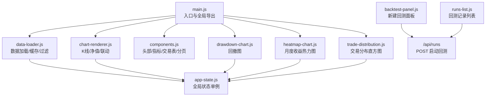

图示来源
- [main.js:1-96](file://src/caisen/frontend/src/js/main.js#L1-L96)
- [data-loader.js:1-290](file://src/caisen/frontend/src/js/data-loader.js#L1-L290)
- [chart-renderer.js:1-333](file://src/caisen/frontend/src/js/chart-renderer.js#L1-L333)
- [components.js:1-717](file://src/caisen/frontend/src/js/components.js#L1-L717)
- [drawdown-chart.js:1-255](file://src/caisen/frontend/src/js/drawdown-chart.js#L1-L255)
- [heatmap-chart.js:1-253](file://src/caisen/frontend/src/js/heatmap-chart.js#L1-L253)
- [trade-distribution.js:1-273](file://src/caisen/frontend/src/js/trade-distribution.js#L1-L273)
- [app-state.js:1-79](file://src/caisen/frontend/src/js/app-state.js#L1-L79)
- [backtest-panel.js:1-363](file://src/caisen/frontend/src/js/backtest-panel.js#L1-L363)
- [runs-list.js:1-618](file://src/caisen/frontend/src/js/runs-list.js#L1-L618)

章节来源
- [main.js:1-96](file://src/caisen/frontend/src/js/main.js#L1-L96)
- [package.json:1-26](file://src/caisen/frontend/package.json#L1-L26)

## 核心组件
本节概述各组件的职责与对外接口，便于快速定位实现位置。

- 新建回测面板（backtest-panel.js）
  - 功能：选择策略与数据源、填写时间范围、提交回测任务、WebSocket 进度监听与错误提示。
  - 关键函数：buildWsUrl、buildRunRequest、handleWsMessage、initBacktestPanel。
- 回测记录列表（runs-list.js）
  - 功能：拉取并分组展示历史回测、搜索筛选、迷你净值曲线懒加载、版本对比图展开/收起。
  - 关键函数：loadRunsList、renderStrategySection、toggleVersionCompare、setupSearch。
- 回撤分析图（drawdown-chart.js）
  - 功能：计算最大回撤区间与恢复点，绘制带标注的回撤面积图。
  - 关键函数：calculateDrawdownDetails、buildDrawdownOption、renderDrawdownChart。
- 月度收益热力图（heatmap-chart.js）
  - 功能：从净值序列聚合月度收益，附加年度均值列与月均行，生成 ECharts 热力图。
  - 关键函数：calculateMonthlyReturns、buildHeatmapMatrix、buildHeatmapOption、renderHeatmapChart。
- 交易分布直方图（trade-distribution.js）
  - 功能：配对买卖计算收益率，分桶统计并叠加正态拟合曲线，标注均值/中位数。
  - 关键函数：calculateTradeReturns、buildHistogramBuckets、calcStats、buildNormalCurve、buildTradeDistributionOption、renderTradeDistribution。
- 应用状态（app-state.js）
  - 功能：集中管理图表实例、原始/过滤数据、开关状态；提供 getter/setter/toggle/reset。
- 图表渲染与联动（chart-renderer.js）
  - 功能：K线与净值图渲染、懒加载、窗口 resize 去抖、跨图表 dataZoom/十字光标联动。
- 数据加载（data-loader.js）
  - 功能：根据 run_id 或本地 data.json 获取数据、缓存、验证、日期过滤、触发全量渲染与懒加载。
- UI 组件（components.js）
  - 功能：头部信息、指标卡片、交易表（排序/分页/虚拟滚动）、空/错误状态、日期输入初始化。
- 入口（main.js）
  - 功能：暴露全局函数供 HTML 内联调用、注册全局错误处理、DOMContentLoaded 自动加载报告页。

章节来源
- [backtest-panel.js:1-363](file://src/caisen/frontend/src/js/backtest-panel.js#L1-L363)
- [runs-list.js:1-618](file://src/caisen/frontend/src/js/runs-list.js#L1-L618)
- [drawdown-chart.js:1-255](file://src/caisen/frontend/src/js/drawdown-chart.js#L1-L255)
- [heatmap-chart.js:1-253](file://src/caisen/frontend/src/js/heatmap-chart.js#L1-L253)
- [trade-distribution.js:1-273](file://src/caisen/frontend/src/js/trade-distribution.js#L1-L273)
- [app-state.js:1-79](file://src/caisen/frontend/src/js/app-state.js#L1-L79)
- [chart-renderer.js:1-333](file://src/caisen/frontend/src/js/chart-renderer.js#L1-L333)
- [data-loader.js:1-290](file://src/caisen/frontend/src/js/data-loader.js#L1-L290)
- [components.js:1-717](file://src/caisen/frontend/src/js/components.js#L1-L717)
- [main.js:1-96](file://src/caisen/frontend/src/js/main.js#L1-L96)

## 架构总览
整体采用“单例状态 + 模块渲染 + 事件驱动”的轻量架构：
- 数据流：后端 API → data-loader 缓存/校验 → app-state 存储 → 各渲染器消费 filteredData。
- 控制流：用户交互（表单/按钮/搜索）→ 更新 app-state → 触发对应 render* → 更新 DOM/ECharts。
- 联动机制：通过 WeakSet 跟踪已绑定实例，避免重复绑定；使用 dispatchAction 同步 dataZoom 与 axisPointer。

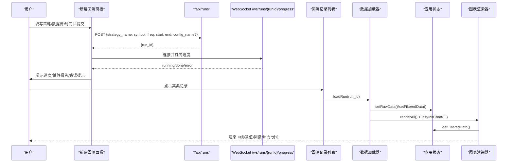

图示来源
- [backtest-panel.js:18-363](file://src/caisen/frontend/src/js/backtest-panel.js#L18-L363)
- [runs-list.js:569-618](file://src/caisen/frontend/src/js/runs-list.js#L569-L618)
- [data-loader.js:179-249](file://src/caisen/frontend/src/js/data-loader.js#L179-L249)
- [chart-renderer.js:254-333](file://src/caisen/frontend/src/js/chart-renderer.js#L254-L333)

## 详细组件分析

### 新建回测面板（backtest-panel.js）
- 策略与数据源加载
  - 并行请求 /api/strategies 与 /api/data-sources，填充下拉框与预设参数区。
- 表单提交与 WebSocket 进度
  - buildRunRequest 构造请求体；POST /api/runs 成功后建立 WebSocket 连接。
  - handleWsMessage 将消息转换为 action/payload，统一处理 progress/redirect/error。
  - 连接超时与空闲超时保护，异常时降级为错误提示。
- 可测试性
  - 纯函数：buildWsUrl、buildRunRequest、handleWsMessage 无副作用，便于单元测试。

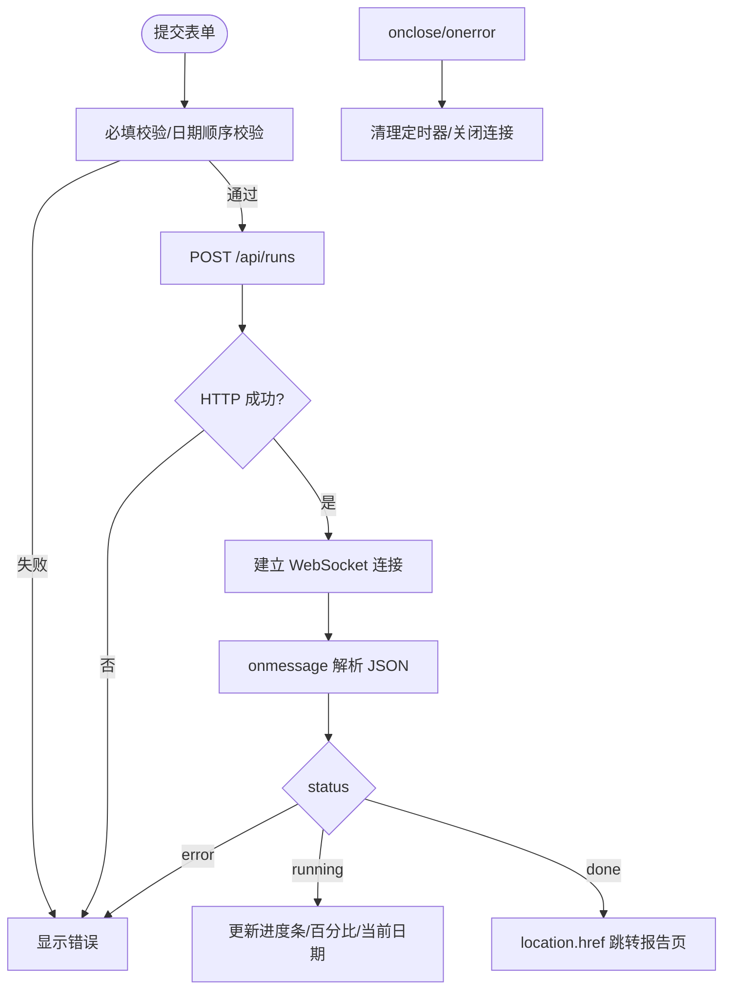

图示来源
- [backtest-panel.js:203-328](file://src/caisen/frontend/src/js/backtest-panel.js#L203-L328)
- [backtest-panel.js:44-69](file://src/caisen/frontend/src/js/backtest-panel.js#L44-L69)

章节来源
- [backtest-panel.js:82-145](file://src/caisen/frontend/src/js/backtest-panel.js#L82-L145)
- [backtest-panel.js:184-201](file://src/caisen/frontend/src/js/backtest-panel.js#L184-L201)
- [backtest-panel.js:203-328](file://src/caisen/frontend/src/js/backtest-panel.js#L203-L328)
- [backtest-panel.js:330-363](file://src/caisen/frontend/src/js/backtest-panel.js#L330-L363)

### 回测记录列表（runs-list.js）
- 数据加载与分组
  - 拉取 /api/runs，按 strategy_name 分组并按最新创建时间倒序排列。
- 搜索与筛选
  - 防抖输入，支持策略名与标的符号模糊匹配。
- 迷你净值曲线
  - 对前 N 条记录异步拉取 /api/runs/{id}/visualization，采样后绘制迷你折线图。
- 版本对比
  - 同一策略下至少两个版本时可展开对比图，内部维护 _compareCharts 并在切换时 dispose。
- 版本号稳定
  - 基于完整列表重建 _versionIndex，保证过滤不改变版本编号。

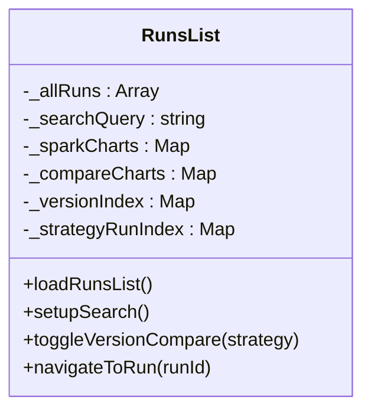

图示来源
- [runs-list.js:12-21](file://src/caisen/frontend/src/js/runs-list.js#L12-L21)
- [runs-list.js:576-618](file://src/caisen/frontend/src/js/runs-list.js#L576-L618)
- [runs-list.js:494-532](file://src/caisen/frontend/src/js/runs-list.js#L494-L532)

章节来源
- [runs-list.js:25-43](file://src/caisen/frontend/src/js/runs-list.js#L25-L43)
- [runs-list.js:432-456](file://src/caisen/frontend/src/js/runs-list.js#L432-L456)
- [runs-list.js:537-564](file://src/caisen/frontend/src/js/runs-list.js#L537-L564)
- [runs-list.js:576-618](file://src/caisen/frontend/src/js/runs-list.js#L576-L618)

### 回撤分析图（drawdown-chart.js）
- 算法要点
  - 遍历净值序列计算峰值与回撤序列，定位最大回撤起止索引与恢复点。
  - 计算最大回撤持续天数与恢复天数（优先用 timestamp，否则以索引差近似）。
- 可视化
  - 使用 markArea 高亮最大回撤区间，markPoint 标注底部与恢复点。
  - tooltip 动态显示回撤百分比与持续时间。
- 集成
  - 读取 appState.getFilteredData().equity_curve，惰性初始化 echarts 实例并加入联动组。

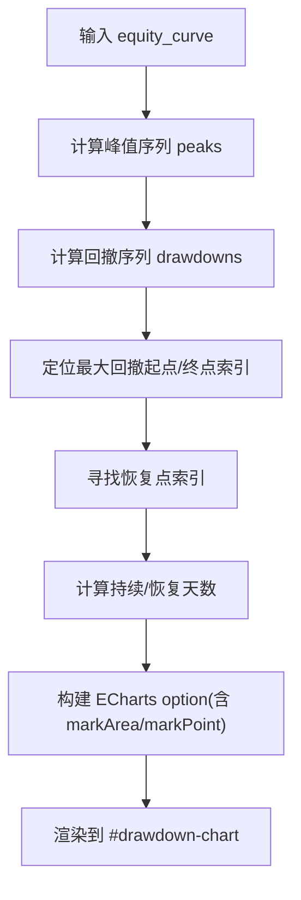

图示来源
- [drawdown-chart.js:12-86](file://src/caisen/frontend/src/js/drawdown-chart.js#L12-L86)
- [drawdown-chart.js:91-228](file://src/caisen/frontend/src/js/drawdown-chart.js#L91-L228)
- [drawdown-chart.js:233-255](file://src/caisen/frontend/src/js/drawdown-chart.js#L233-L255)

章节来源
- [drawdown-chart.js:12-86](file://src/caisen/frontend/src/js/drawdown-chart.js#L12-L86)
- [drawdown-chart.js:91-228](file://src/caisen/frontend/src/js/drawdown-chart.js#L91-L228)
- [drawdown-chart.js:233-255](file://src/caisen/frontend/src/js/drawdown-chart.js#L233-L255)

### 月度收益热力图（heatmap-chart.js）
- 数据聚合
  - 从 equity_curve 提取每月末净值，计算环比收益率。
  - 构建矩阵：主体为每年每月，附加“年均”列与“月均”行，以及右下角总体平均。
- 可视化
  - visualMap 对称色阶，标签显示百分比，tooltip 区分普通单元格与汇总单元格。
- 集成
  - 读取 appState.getFilteredData().equity_curve，惰性初始化并渲染。

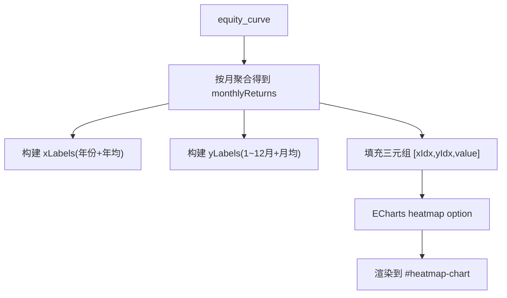

图示来源
- [heatmap-chart.js:15-54](file://src/caisen/frontend/src/js/heatmap-chart.js#L15-L54)
- [heatmap-chart.js:63-105](file://src/caisen/frontend/src/js/heatmap-chart.js#L63-L105)
- [heatmap-chart.js:110-229](file://src/caisen/frontend/src/js/heatmap-chart.js#L110-L229)
- [heatmap-chart.js:234-253](file://src/caisen/frontend/src/js/heatmap-chart.js#L234-L253)

章节来源
- [heatmap-chart.js:15-54](file://src/caisen/frontend/src/js/heatmap-chart.js#L15-L54)
- [heatmap-chart.js:63-105](file://src/caisen/frontend/src/js/heatmap-chart.js#L63-L105)
- [heatmap-chart.js:110-229](file://src/caisen/frontend/src/js/heatmap-chart.js#L110-L229)
- [heatmap-chart.js:234-253](file://src/caisen/frontend/src/js/heatmap-chart.js#L234-L253)

### 交易分布直方图（trade-distribution.js）
- 配对与统计
  - 按时间排序，FIFO 配对 BUY/SELL 计算每笔交易收益率。
  - 分桶统计（默认 20 桶），计算样本均值/中位数/标准差。
  - 基于正态 PDF 计算期望计数，叠加拟合曲线。
- 可视化
  - 柱状图按盈亏着色，markLine 标注均值/中位数，tooltip 显示区间与拟合值。
- 集成
  - 读取 appState.getFilteredData().trades，惰性初始化并渲染。

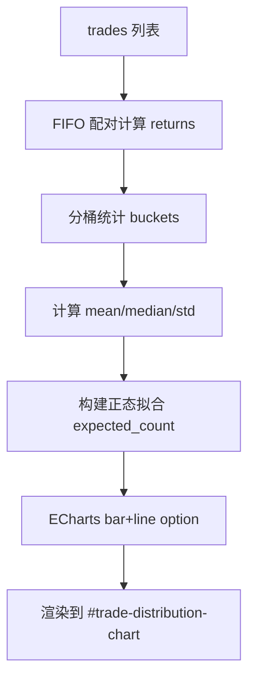

图示来源
- [trade-distribution.js:11-34](file://src/caisen/frontend/src/js/trade-distribution.js#L11-L34)
- [trade-distribution.js:39-71](file://src/caisen/frontend/src/js/trade-distribution.js#L39-L71)
- [trade-distribution.js:76-102](file://src/caisen/frontend/src/js/trade-distribution.js#L76-L102)
- [trade-distribution.js:107-246](file://src/caisen/frontend/src/js/trade-distribution.js#L107-L246)
- [trade-distribution.js:251-273](file://src/caisen/frontend/src/js/trade-distribution.js#L251-L273)

章节来源
- [trade-distribution.js:11-34](file://src/caisen/frontend/src/js/trade-distribution.js#L11-L34)
- [trade-distribution.js:39-71](file://src/caisen/frontend/src/js/trade-distribution.js#L39-L71)
- [trade-distribution.js:76-102](file://src/caisen/frontend/src/js/trade-distribution.js#L76-L102)
- [trade-distribution.js:107-246](file://src/caisen/frontend/src/js/trade-distribution.js#L107-L246)
- [trade-distribution.js:251-273](file://src/caisen/frontend/src/js/trade-distribution.js#L251-L273)

### 应用状态（app-state.js）
- 设计模式：工厂函数返回对象，包含 getters/setters/toggle/reset。
- 职责：统一管理图表实例、原始/过滤数据、视图开关（缩放、均线、权益可见性）、注释过滤。
- 线程安全：单例在浏览器主线程使用，无需额外锁。

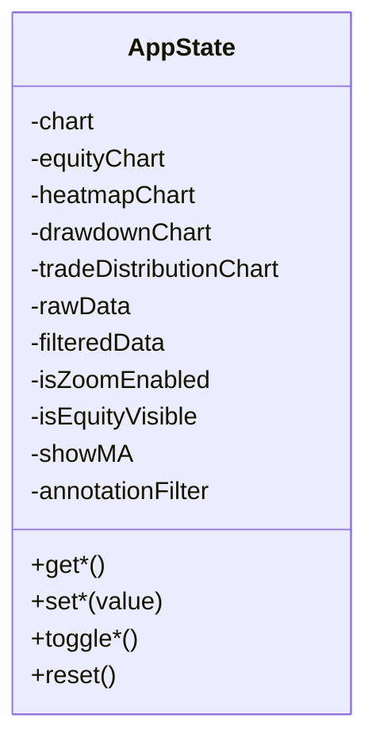

图示来源
- [app-state.js:6-76](file://src/caisen/frontend/src/js/app-state.js#L6-L76)

章节来源
- [app-state.js:6-76](file://src/caisen/frontend/src/js/app-state.js#L6-L76)

### 图表渲染与联动（chart-renderer.js）
- 懒加载：IntersectionObserver 延迟初始化非首屏图表，降低首屏开销。
- 去抖 resize：统一收集所有图表实例，window.resize 时批量 resize。
- 联动：WeakSet 跟踪已绑定实例，避免重复绑定；dataZoom 与 updateAxisPointer 双向同步。
- 容错：setOption 失败时尝试简化配置（移除 markPoint/markLine）进行降级渲染。

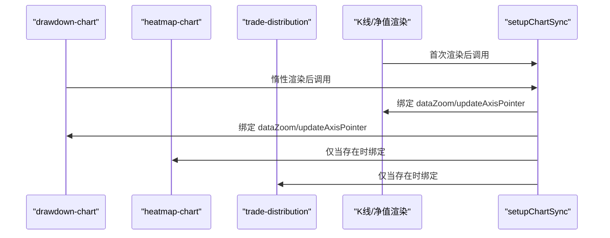

图示来源
- [chart-renderer.js:59-90](file://src/caisen/frontend/src/js/chart-renderer.js#L59-L90)
- [chart-renderer.js:254-333](file://src/caisen/frontend/src/js/chart-renderer.js#L254-L333)
- [drawdown-chart.js:233-255](file://src/caisen/frontend/src/js/drawdown-chart.js#L233-L255)

章节来源
- [chart-renderer.js:15-46](file://src/caisen/frontend/src/js/chart-renderer.js#L15-L46)
- [chart-renderer.js:95-174](file://src/caisen/frontend/src/js/chart-renderer.js#L95-L174)
- [chart-renderer.js:254-333](file://src/caisen/frontend/src/js/chart-renderer.js#L254-L333)

### 数据加载（data-loader.js）
- 数据来源：优先根据 URL 中的 run_id 访问 /api/runs/{runId}/visualization，否则回退到本地 data.json。
- 缓存：内存 Map 缓存 runId -> rawData，避免重复请求。
- 校验：validateVisualizationData 检查 bars 字段及必要字段完整性，失败则友好提示并隐藏图表区域。
- 过滤：applyDateFilter 克隆原始数据，按 start/end 过滤 bars/equity_curve/trades/annotations，再触发全量渲染。
- 懒加载：lazyInitChart 用于回撤/热力/分布图，进入视口后再渲染。

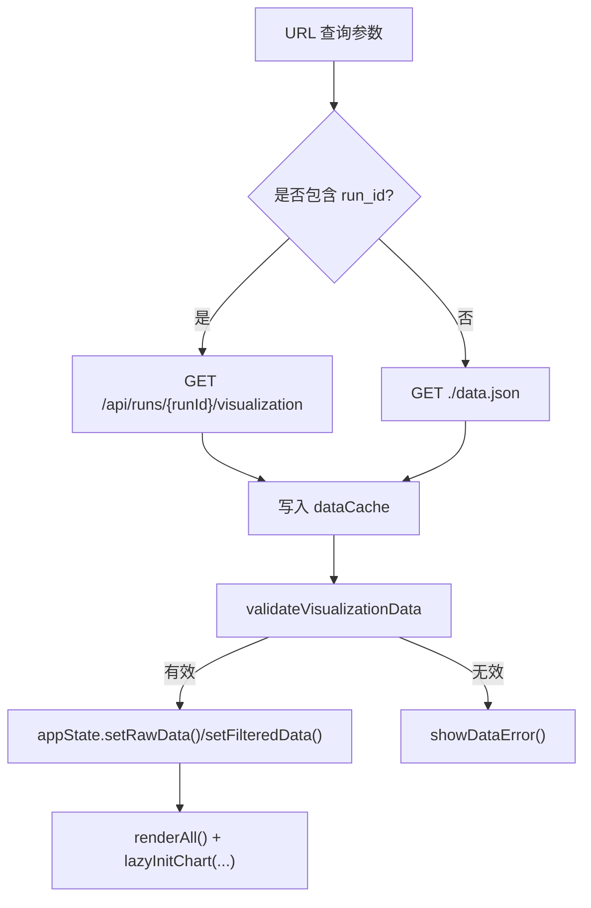

图示来源
- [data-loader.js:179-249](file://src/caisen/frontend/src/js/data-loader.js#L179-L249)
- [data-loader.js:123-174](file://src/caisen/frontend/src/js/data-loader.js#L123-L174)
- [data-loader.js:254-290](file://src/caisen/frontend/src/js/data-loader.js#L254-L290)

章节来源
- [data-loader.js:179-249](file://src/caisen/frontend/src/js/data-loader.js#L179-L249)
- [data-loader.js:123-174](file://src/caisen/frontend/src/js/data-loader.js#L123-L174)
- [data-loader.js:254-290](file://src/caisen/frontend/src/js/data-loader.js#L254-L290)

### UI 组件（components.js）
- 指标与趋势箭头：trendArrow 辅助函数，统一数值方向指示。
- 交易表：
  - FIFO 配对计算每笔卖出交易的 PnL。
  - 支持多字段排序与升/降序切换，图标随当前排序状态变化。
  - 小数据集分页，大数据集启用虚拟滚动（阈值 100 行）。
- 空/错误状态：非破坏性覆盖层，便于重试恢复。
- 日期输入：根据 meta.start/end 初始化。

章节来源
- [components.js:28-34](file://src/caisen/frontend/src/js/components.js#L28-L34)
- [components.js:212-245](file://src/caisen/frontend/src/js/components.js#L212-L245)
- [components.js:250-265](file://src/caisen/frontend/src/js/components.js#L250-L265)
- [components.js:443-484](file://src/caisen/frontend/src/js/components.js#L443-L484)
- [components.js:516-593](file://src/caisen/frontend/src/js/components.js#L516-L593)
- [components.js:636-646](file://src/caisen/frontend/src/js/components.js#L636-L646)
- [components.js:652-703](file://src/caisen/frontend/src/js/components.js#L652-L703)

### 入口（main.js）
- 全局导出：将常用函数挂载到 window，供 HTML 内联脚本调用。
- 全局错误捕获：onerror 与 onunhandledrejection 统一输出日志。
- 自动初始化：DOMContentLoaded 且存在 run_id 时自动 loadData。

章节来源
- [main.js:22-59](file://src/caisen/frontend/src/js/main.js#L22-L59)

## 依赖关系分析
- 模块耦合
  - 图表类组件（drawdown/heatmap/trade-distribution）仅依赖 app-state 与 echarts，低耦合。
  - chart-renderer 依赖 app-state 与 chart-builder（构建 K线/净值 option），并通过 WeakSet 解耦绑定逻辑。
  - data-loader 依赖 app-state、components、chart-renderer 与各专用图表渲染器，作为编排中心。
- 外部依赖
  - echarts：图表渲染库。
  - vite/vitest/playwright：构建与测试工具链。

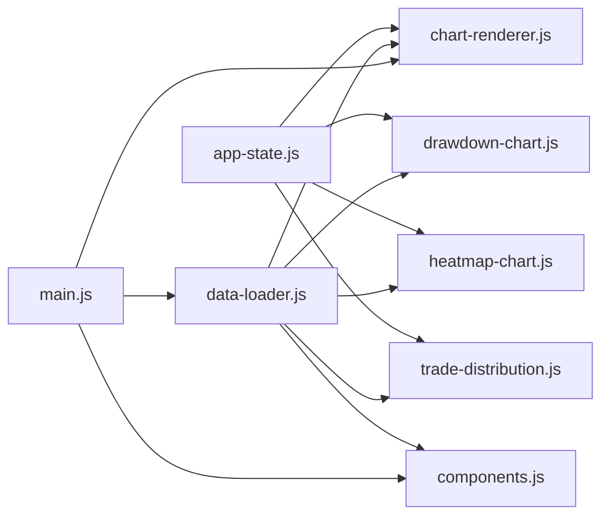

图示来源
- [app-state.js:1-79](file://src/caisen/frontend/src/js/app-state.js#L1-L79)
- [chart-renderer.js:1-333](file://src/caisen/frontend/src/js/chart-renderer.js#L1-L333)
- [data-loader.js:1-290](file://src/caisen/frontend/src/js/data-loader.js#L1-L290)
- [components.js:1-717](file://src/caisen/frontend/src/js/components.js#L1-L717)
- [main.js:1-96](file://src/caisen/frontend/src/js/main.js#L1-L96)

章节来源
- [package.json:1-26](file://src/caisen/frontend/package.json#L1-L26)

## 性能考量
- 懒加载：非首屏图表使用 IntersectionObserver 延迟初始化，减少首屏渲染压力。
- 去抖 resize：统一收集图表实例，避免频繁重绘。
- 数据采样：迷你净值曲线对长序列进行采样，提升渲染速度。
- 虚拟滚动：交易表超过阈值时使用虚拟滚动，避免大量 DOM 节点。
- 弱引用跟踪：WeakSet 避免重复绑定与内存泄漏。

[本节为通用指导，不直接分析具体文件]

## 故障排查指南
- 新建回测面板
  - WebSocket 连接超时/无响应：检查后端服务与代理配置；确认 ws/wss 协议与 host。
  - 表单校验失败：确认策略、数据源、开始/结束日期必填与顺序正确。
- 数据加载
  - 数据不可用：查看 validateVisualizationData 的错误信息，确认 bars 字段与必要字段完整。
  - 网络错误：检查 /api/runs/{runId}/visualization 或 data.json 可达性。
- 图表渲染
  - setOption 失败：chart-renderer 会尝试简化配置；若仍失败，检查 series/markPoint/markLine 配置。
  - 联动失效：确认 setupChartSync 已被调用，且图表实例均已初始化。
- 列表页
  - 迷你曲线不显示：检查 /api/runs/{id}/visualization 返回 equity_curve 长度与采样逻辑。
  - 版本对比无法展开：确保同策略至少有两条记录。

章节来源
- [backtest-panel.js:248-328](file://src/caisen/frontend/src/js/backtest-panel.js#L248-L328)
- [data-loader.js:123-174](file://src/caisen/frontend/src/js/data-loader.js#L123-L174)
- [chart-renderer.js:179-197](file://src/caisen/frontend/src/js/chart-renderer.js#L179-L197)
- [runs-list.js:432-456](file://src/caisen/frontend/src/js/runs-list.js#L432-L456)

## 结论
Caisen 前端可视化组件采用清晰的分层与职责分离：
- 单例状态集中管理，避免分散状态导致的不一致。
- 专用图表组件独立、可测试，通过 app-state 与渲染器协作。
- 懒加载与去抖优化了首屏与交互性能。
- 完善的错误处理与降级策略提升了鲁棒性。
建议后续扩展时遵循现有模式，保持纯函数与副作用分离，强化测试覆盖率与可观测性。

[本节为总结，不直接分析具体文件]

## 附录

### 组件间通信与状态同步机制
- 状态同步
  - 通过 app-state 单例共享 raw/filtered 数据与视图开关。
  - 数据变更路径：data-loader → app-state → 各渲染器。
- 事件总线模式
  - 未引入显式事件总线，采用函数调用与回调（如 onmessage、DOM 事件）完成通信。
  - 如需扩展，可在 app-state 基础上增加发布/订阅方法。
- 组件通信协议
  - 表单提交协议：POST /api/runs 的请求体字段见 buildRunRequest。
  - WebSocket 协议：/ws/runs/{runId}/progress 的消息结构由 handleWsMessage 定义。

章节来源
- [backtest-panel.js:32-37](file://src/caisen/frontend/src/js/backtest-panel.js#L32-L37)
- [backtest-panel.js:44-69](file://src/caisen/frontend/src/js/backtest-panel.js#L44-L69)
- [app-state.js:6-76](file://src/caisen/frontend/src/js/app-state.js#L6-L76)

### 生命周期管理与资源清理
- 图表实例
  - 惰性初始化，销毁时调用 dispose（如迷你曲线、对比图）。
- 观察者与监听器
  - IntersectionObserver 在初始化后 disconnect；resize 监听只绑定一次。
- WebSocket
  - onclose/onerror 清理连接超时与空闲超时定时器。

章节来源
- [chart-renderer.js:59-90](file://src/caisen/frontend/src/js/chart-renderer.js#L59-L90)
- [runs-list.js:432-456](file://src/caisen/frontend/src/js/runs-list.js#L432-L456)
- [backtest-panel.js:248-328](file://src/caisen/frontend/src/js/backtest-panel.js#L248-L328)

### 组件复用与组合最佳实践
- 将数据处理逻辑抽象为纯函数（如 calculateDrawdownDetails、calculateMonthlyReturns、calculateTradeReturns），便于复用与测试。
- 渲染器仅负责 DOM/ECharts 操作，数据来自 app-state，降低耦合。
- 通过 lazyInitChart 组合多个图表，按需渲染。

章节来源
- [drawdown-chart.js:12-86](file://src/caisen/frontend/src/js/drawdown-chart.js#L12-L86)
- [heatmap-chart.js:15-54](file://src/caisen/frontend/src/js/heatmap-chart.js#L15-L54)
- [trade-distribution.js:11-34](file://src/caisen/frontend/src/js/trade-distribution.js#L11-L34)
- [chart-renderer.js:59-90](file://src/caisen/frontend/src/js/chart-renderer.js#L59-L90)

### 测试方法与调试技巧
- 单元测试
  - Vitest 框架，针对纯函数编写用例（如 buildWsUrl、handleWsMessage）。
  - 参考：backtest-panel.test.js。
- 端到端测试
  - Playwright 配置位于 playwright.config.js，可用于页面流程断言。
- 调试技巧
  - 使用 DEBUG_CONFIG.log/error 输出关键路径日志。
  - 全局错误捕获：onerror/unhandledrejection 统一打印堆栈。

章节来源
- [backtest-panel.test.js:1-111](file://src/caisen/frontend/tests/js/backtest-panel.test.js#L1-L111)
- [main.js:37-47](file://src/caisen/frontend/src/js/main.js#L37-L47)
- [chart-renderer.js:8-9](file://src/caisen/frontend/src/js/chart-renderer.js#L8-L9)

### 样式定制与主题适配
- 主题变量
  - variables.css 定义背景、边框、文本、语义色、渐变、玻璃拟态、排版、间距、圆角、阴影、过渡、层级等 CSS 变量。
- 组件样式
  - components.css 定义卡片、按钮、表格、过滤器、回测面板等样式，广泛使用 CSS 变量以实现主题化。
- 定制建议
  - 修改 :root 变量即可全局换肤。
  - 新增组件样式尽量复用已有变量与类名约定，保持一致性与可维护性。

章节来源
- [variables.css:1-106](file://src/caisen/frontend/src/css/variables.css#L1-L106)
- [components.css:1-800](file://src/caisen/frontend/src/css/components.css#L1-L800)