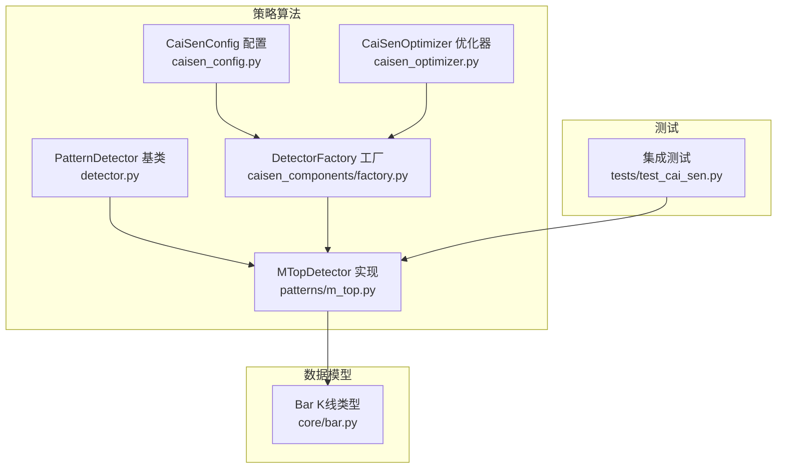
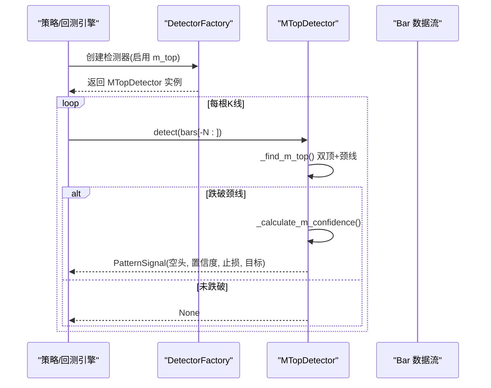
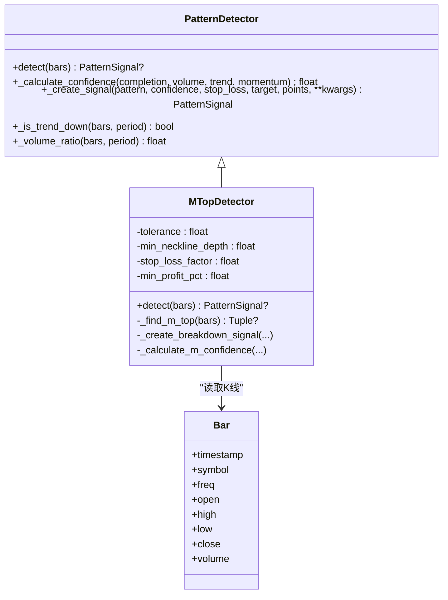
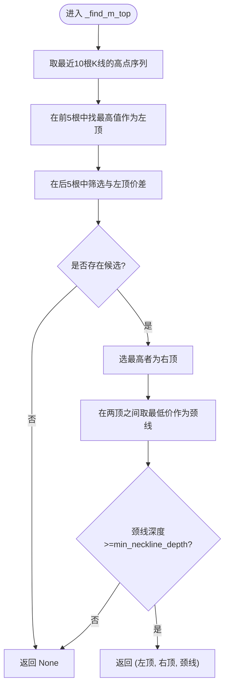
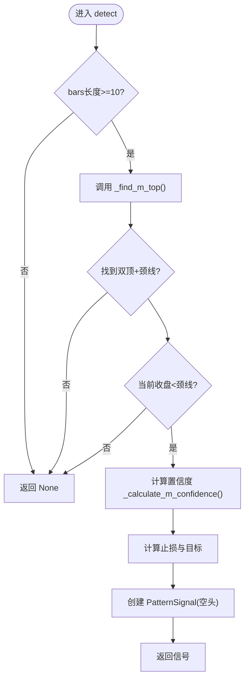
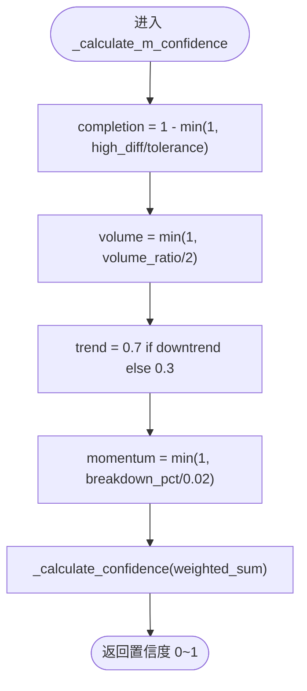
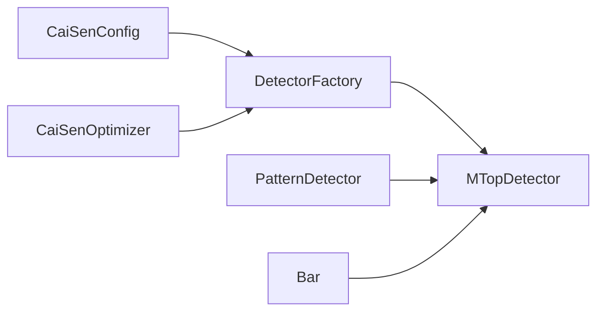

# M头形态识别

<cite>
**本文引用的文件列表**
- [m_top.py](file://src/caisen/strategy/algorithm/patterns/m_top.py)
- [detector.py](file://src/caisen/strategy/algorithm/detector.py)
- [bar.py](file://src/caisen/core/bar.py)
- [factory.py](file://src/caisen/strategy/algorithm/caisen_components/factory.py)
- [caisen_config.py](file://src/caisen/strategy/algorithm/caisen_config.py)
- [caisen_optimizer.py](file://src/caisen/strategy/algorithm/caisen_optimizer.py)
- [test_cai_sen.py](file://tests/test_cai_sen.py)
</cite>

## 目录
1. [简介](#简介)
2. [项目结构](#项目结构)
3. [核心组件](#核心组件)
4. [架构总览](#架构总览)
5. [详细组件分析](#详细组件分析)
6. [依赖关系分析](#依赖关系分析)
7. [性能与复杂度](#性能与复杂度)
8. [参数配置与优化建议](#参数配置与优化建议)
9. [置信度评估体系](#置信度评估体系)
10. [做空交易信号与风控策略](#做空交易信号与风控策略)
11. [故障排查指南](#故障排查指南)
12. [结论](#结论)

## 简介
本文件面向Caisen量化回测系统的M头（双顶）反转形态识别功能，提供从技术分析理论到代码实现、参数调优、置信度评估与风控策略的完整说明。重点覆盖：
- 双顶结构与颈线支撑位的技术含义
- MTopDetector类的算法流程：双高点检测、颈线计算、跌破确认
- 关键参数：tolerance、min_neckline_depth、stop_loss_factor、min_profit_pct的设置原则与优化方法
- 置信度评估：完成度、成交量配合、趋势共振、动量强度
- 做空信号生成规则、止损止盈策略与风险控制建议
- 结合测试用例的使用效果评估要点

## 项目结构
M头形态识别位于策略算法模块的“形态检测器”子系统中，采用纯函数接口设计，便于回测与并行测试。

图表来源
- [detector.py:80-150](file://src/caisen/strategy/algorithm/detector.py#L80-L150)
- [m_top.py:11-78](file://src/caisen/strategy/algorithm/patterns/m_top.py#L11-L78)
- [factory.py:22-51](file://src/caisen/strategy/algorithm/caisen_components/factory.py#L22-L51)
- [caisen_config.py:11-41](file://src/caisen/strategy/algorithm/caisen_config.py#L11-L41)
- [caisen_optimizer.py:69-150](file://src/caisen/strategy/algorithm/caisen_optimizer.py#L69-L150)
- [bar.py:8-38](file://src/caisen/core/bar.py#L8-L38)
- [test_cai_sen.py:91-122](file://tests/test_cai_sen.py#L91-L122)

章节来源
- [m_top.py:11-78](file://src/caisen/strategy/algorithm/patterns/m_top.py#L11-L78)
- [detector.py:80-150](file://src/caisen/strategy/algorithm/detector.py#L80-L150)
- [factory.py:22-51](file://src/caisen/strategy/algorithm/caisen_components/factory.py#L22-L51)
- [caisen_config.py:11-41](file://src/caisen/strategy/algorithm/caisen_config.py#L11-L41)
- [caisen_optimizer.py:69-150](file://src/caisen/strategy/algorithm/caisen_optimizer.py#L69-L150)
- [bar.py:8-38](file://src/caisen/core/bar.py#L8-L38)
- [test_cai_sen.py:91-122](file://tests/test_cai_sen.py#L91-L122)

## 核心组件
- PatternDetector 基类：定义纯函数接口 detect(bars)，并提供通用工具方法（趋势判断、成交量放大倍数、置信度加权求和、信号创建等）。
- MTopDetector：继承自 PatternDetector，实现M头形态的双顶检测、颈线计算、跌破确认与做空信号生成。
- DetectorFactory：根据配置动态创建检测器实例，并注入默认或用户自定义参数。
- CaiSenConfig/CaiSenOptimizer：提供全局策略参数与网格搜索组合，包含对 m_top 开关及风控参数的支持。
- Bar：K线数据结构，作为检测器的输入单元。

章节来源
- [detector.py:80-150](file://src/caisen/strategy/algorithm/detector.py#L80-L150)
- [m_top.py:11-78](file://src/caisen/strategy/algorithm/patterns/m_top.py#L11-L78)
- [factory.py:139-167](file://src/caisen/strategy/algorithm/caisen_components/factory.py#L139-L167)
- [caisen_config.py:11-41](file://src/caisen/strategy/algorithm/caisen_config.py#L11-L41)
- [caisen_optimizer.py:69-150](file://src/caisen/strategy/algorithm/caisen_optimizer.py#L69-L150)
- [bar.py:8-38](file://src/caisen/core/bar.py#L8-L38)

## 架构总览
M头检测在策略运行时的调用链如下：

图表来源
- [factory.py:81-111](file://src/caisen/strategy/algorithm/caisen_components/factory.py#L81-L111)
- [m_top.py:49-78](file://src/caisen/strategy/algorithm/patterns/m_top.py#L49-L78)
- [m_top.py:80-126](file://src/caisen/strategy/algorithm/patterns/m_top.py#L80-L126)
- [m_top.py:179-226](file://src/caisen/strategy/algorithm/patterns/m_top.py#L179-L226)

## 详细组件分析

### MTopDetector 类分析
MTopDetector 负责检测两个相近高点后的颈线跌破形态，并在跌破时生成空头信号。其核心流程包括：
- 最近窗口筛选（至少10根K线）
- 左顶与右顶定位（容差过滤）
- 颈线计算（两顶之间的最低点）
- 跌破确认（当前收盘价低于颈线）
- 置信度计算（完成度、成交量、趋势、动量）
- 止损与目标价计算（振幅反推目标，止损高于最高点）

图表来源
- [detector.py:80-150](file://src/caisen/strategy/algorithm/detector.py#L80-L150)
- [m_top.py:11-78](file://src/caisen/strategy/algorithm/patterns/m_top.py#L11-L78)
- [bar.py:8-38](file://src/caisen/core/bar.py#L8-L38)

#### 双顶检测逻辑
- 窗口选择：取最近10根K线的高点序列。
- 左顶定位：前5根中的最高点对应左顶。
- 右顶候选：后5根中满足与左顶价格差异小于 tolerance 的K线，选其中最高者作为右顶。
- 颈线计算：两顶之间所有K线的最低价即为颈线。
- 颈线深度验证：(左顶 - 颈线)/左顶 >= min_neckline_depth。

图表来源
- [m_top.py:80-126](file://src/caisen/strategy/algorithm/patterns/m_top.py#L80-L126)

#### 跌破确认与信号生成
- 跌破条件：当前K线收盘价低于颈线。
- 振幅计算：max(左顶, 右顶) - 颈线。
- 目标价：颈线 - 振幅（向下等幅目标）。
- 止损价：max(左顶, 右顶) × stop_loss_factor（高于最高点）。
- 信号字段：pattern="m_top"，direction="short"，points包含左顶、右顶、跌破颈线位置。

图表来源
- [m_top.py:49-78](file://src/caisen/strategy/algorithm/patterns/m_top.py#L49-L78)
- [m_top.py:128-177](file://src/caisen/strategy/algorithm/patterns/m_top.py#L128-L177)

#### 置信度评估体系
置信度由四个因子加权求和得到：
- 完成度 completion：左右顶越接近，completion越高；基于 high_diff/tolerance 归一化。
- 成交量 volume：近期成交量相对历史均值的放大倍数，映射为0~1。
- 趋势 trend：若处于下降趋势则赋予较高权重，否则较低。
- 动量 momentum：跌破力度（颈线与收盘价的跌幅比例），限制上限。

图表来源
- [m_top.py:179-226](file://src/caisen/strategy/algorithm/patterns/m_top.py#L179-L226)
- [detector.py:125-149](file://src/caisen/strategy/algorithm/detector.py#L125-L149)

章节来源
- [m_top.py:49-78](file://src/caisen/strategy/algorithm/patterns/m_top.py#L49-L78)
- [m_top.py:80-126](file://src/caisen/strategy/algorithm/patterns/m_top.py#L80-L126)
- [m_top.py:128-177](file://src/caisen/strategy/algorithm/patterns/m_top.py#L128-L177)
- [m_top.py:179-226](file://src/caisen/strategy/algorithm/patterns/m_top.py#L179-L226)
- [detector.py:125-149](file://src/caisen/strategy/algorithm/detector.py#L125-L149)

## 依赖关系分析
- MTopDetector 依赖 PatternDetector 提供的通用方法与工具。
- DetectorFactory 将 m_top 映射到 MTopDetector，并注入默认参数（如 tolerance、stop_loss_factor、min_profit_pct）。
- CaiSenConfig 提供全局参数（含 min_neckline_height 等），用于策略层统一配置。
- CaiSenOptimizer 支持对 m_top 开关与风控参数进行网格搜索组合。
- Bar 作为基础数据单元被检测器读取。

图表来源
- [factory.py:22-51](file://src/caisen/strategy/algorithm/caisen_components/factory.py#L22-L51)
- [caisen_config.py:11-41](file://src/caisen/strategy/algorithm/caisen_config.py#L11-L41)
- [caisen_optimizer.py:69-150](file://src/caisen/strategy/algorithm/caisen_optimizer.py#L69-L150)
- [detector.py:80-150](file://src/caisen/strategy/algorithm/detector.py#L80-L150)
- [bar.py:8-38](file://src/caisen/core/bar.py#L8-L38)

章节来源
- [factory.py:22-51](file://src/caisen/strategy/algorithm/caisen_components/factory.py#L22-L51)
- [caisen_config.py:11-41](file://src/caisen/strategy/algorithm/caisen_config.py#L11-L41)
- [caisen_optimizer.py:69-150](file://src/caisen/strategy/algorithm/caisen_optimizer.py#L69-L150)
- [detector.py:80-150](file://src/caisen/strategy/algorithm/detector.py#L80-L150)
- [bar.py:8-38](file://src/caisen/core/bar.py#L8-L38)

## 性能与复杂度
- 时间复杂度：每次 detect 仅扫描最近固定窗口（约10根K线），双顶查找与颈线计算均为线性操作，整体 O(N) 且 N 很小，适合高频回测。
- 空间复杂度：仅维护少量局部变量与最近窗口切片，O(N)。
- 潜在优化：
  - 使用滑动窗口增量统计减少重复计算（例如滚动最大值/最小值）。
  - 对成交量比率可引入指数移动平均以降低噪声。
  - 趋势判断可使用更稳健的均线斜率或ATR通道替代简单首尾比较。

[本节为一般性讨论，不直接分析具体文件]

## 参数配置与优化建议
- tolerance（双顶容差）
  - 作用：控制左右顶价格的允许差异范围。
  - 设置原则：波动较大的品种可适当放宽（如0.05~0.08），稳定品种收紧（如0.03~0.05）。
  - 优化方法：通过网格搜索对比不同 tolerance 下的胜率与盈亏比。
- min_neckline_depth（颈线最小深度）
  - 作用：确保双顶间存在明显回调，避免浅回调导致的假形态。
  - 设置原则：通常0.02~0.04；震荡市可略高以过滤噪音。
  - 优化方法：结合历史回撤幅度分布调整，观察信号数量与质量变化。
- stop_loss_factor（止损系数）
  - 作用：止损=最高点×factor；对于空头信号，止损位于最高点上方。
  - 设置原则：1.01~1.03常见；需考虑波动率与滑点成本。
  - 优化方法：与 min_profit_pct 联动优化，追求正期望收益。
- min_profit_pct（最小盈利目标）
  - 作用：决定目标价与风险回报比。
  - 设置原则：与止损距离匹配，保持合理的风险回报比（如≥1.5）。
  - 优化方法：在回测中扫描多组参数，选择夏普比率或最大回撤最优的组合。

章节来源
- [m_top.py:28-47](file://src/caisen/strategy/algorithm/patterns/m_top.py#L28-L47)
- [factory.py:40-51](file://src/caisen/strategy/algorithm/caisen_components/factory.py#L40-L51)
- [caisen_config.py:30-41](file://src/caisen/strategy/algorithm/caisen_config.py#L30-L41)
- [caisen_optimizer.py:115-150](file://src/caisen/strategy/algorithm/caisen_optimizer.py#L115-L150)

## 置信度评估体系
- 完成度（对称性）：左右顶价差越小，completion越高；反映形态结构的完整性。
- 成交量配合：跌破阶段放量提升可信度；通过 _volume_ratio 计算近期与历史均值比值。
- 趋势共振：若处于下降趋势，trend赋更高权重；增强信号有效性。
- 动量强度：跌破力度越大（收盘价远低于颈线），momentum越高。

综合置信度由基类 _calculate_confidence 加权求和，默认权重：
- completion: 0.4
- volume: 0.3
- trend: 0.2
- momentum: 0.1

章节来源
- [m_top.py:179-226](file://src/caisen/strategy/algorithm/patterns/m_top.py#L179-L226)
- [detector.py:125-149](file://src/caisen/strategy/algorithm/detector.py#L125-L149)

## 做空交易信号与风控策略
- 信号生成规则：
  - 当检测到双顶且颈线跌破时，生成方向为 short 的 PatternSignal。
  - 信号包含置信度、止损价、目标价以及关键点（左顶、右顶、跌破颈线）。
- 止损止盈策略：
  - 止损：max(左顶, 右顶) × stop_loss_factor（空头止损位于最高点上方）。
  - 目标：颈线 - 振幅（等幅向下目标）。
- 风险控制建议：
  - 结合置信度阈值过滤低质量信号（如置信度<0.5不交易）。
  - 在强下降趋势中提高仓位权重，震荡市中降低或暂停做空。
  - 使用移动止损保护利润，尤其在大幅下跌行情中。
  - 注意流动性与滑点，合理设置止损间距。

章节来源
- [m_top.py:128-177](file://src/caisen/strategy/algorithm/patterns/m_top.py#L128-L177)
- [detector.py:151-180](file://src/caisen/strategy/algorithm/detector.py#L151-L180)

## 故障排查指南
- 无信号输出
  - 检查 bars 长度是否不足10根。
  - 确认左右顶候选是否存在（tolerance 过严可能导致无候选）。
  - 颈线深度是否满足 min_neckline_depth。
  - 当前收盘是否跌破颈线。
- 信号过多或过少
  - 调整 tolerance 与 min_neckline_depth 以平衡灵敏度与稳定性。
  - 调整置信度权重或增加额外过滤条件（如成交量阈值）。
- 止损/目标不合理
  - 检查 stop_loss_factor 与 min_profit_pct 的组合是否导致负期望。
  - 结合品种波动率重新校准参数。

章节来源
- [m_top.py:49-78](file://src/caisen/strategy/algorithm/patterns/m_top.py#L49-L78)
- [m_top.py:80-126](file://src/caisen/strategy/algorithm/patterns/m_top.py#L80-L126)
- [m_top.py:128-177](file://src/caisen/strategy/algorithm/patterns/m_top.py#L128-L177)

## 结论
M头形态识别在Caisen系统中实现了清晰、可扩展的纯函数接口，具备完善的置信度评估与风控参数。通过合理配置 tolerance、min_neckline_depth、stop_loss_factor、min_profit_pct，并结合成交量、趋势与动量因子，可有效提升双顶反转信号的可靠性与交易期望。建议在实盘前进行充分的参数网格搜索与样本外验证，并根据市场风格动态调整权重与阈值。

[本节为总结性内容，不直接分析具体文件]