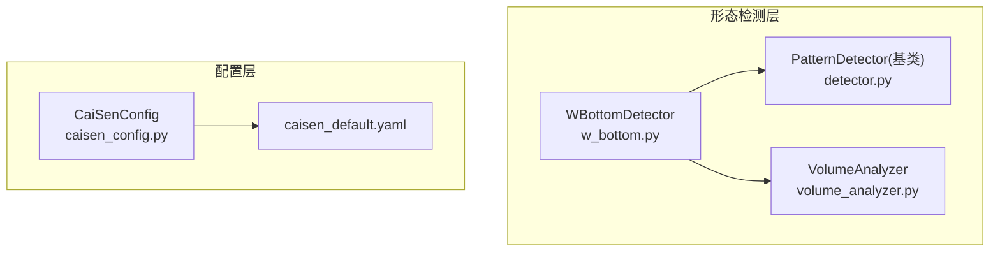
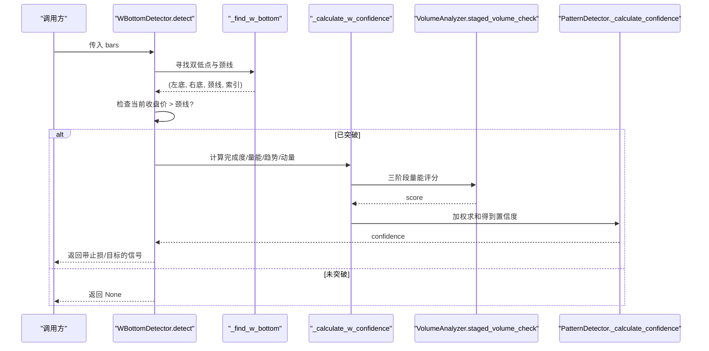
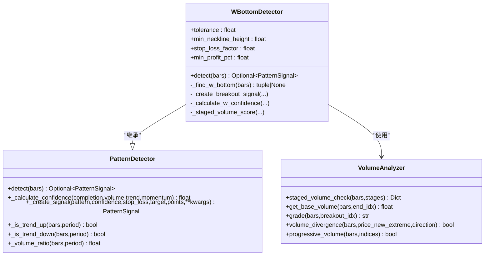
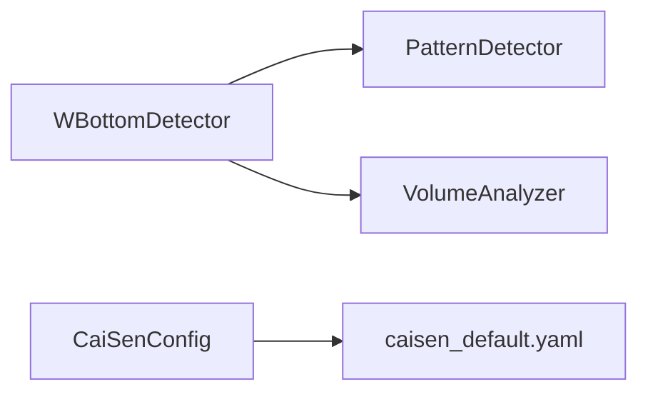

# W底形态识别

<cite>
**本文引用的文件列表**
- [w_bottom.py](file://src/caisen/strategy/algorithm/patterns/w_bottom.py)
- [detector.py](file://src/caisen/strategy/algorithm/detector.py)
- [volume_analyzer.py](file://src/caisen/strategy/algorithm/caisen_components/volume_analyzer.py)
- [caisen_config.py](file://src/caisen/strategy/algorithm/caisen_config.py)
- [caisen_default.yaml](file://configs/strategies/caisen_default.yaml)
</cite>

## 目录
1. [引言](#引言)
2. [项目结构](#项目结构)
3. [核心组件](#核心组件)
4. [架构总览](#架构总览)
5. [详细组件分析](#详细组件分析)
6. [依赖关系分析](#依赖关系分析)
7. [性能与复杂度](#性能与复杂度)
8. [参数配置与调优建议](#参数配置与调优建议)
9. [交易信号与风险管理](#交易信号与风险管理)
10. [故障排查指南](#故障排查指南)
11. [结论](#结论)

## 引言
本文件面向 Caisen 量化回测系统中的“W底反转形态识别”功能，系统性阐述其理论基础、几何特征、实现原理、置信度模型、参数机制与风控规则。读者无需深入源码即可理解该功能的业务逻辑与使用方式；同时为开发者提供代码级参考路径以便二次开发与优化。

## 项目结构
W底检测位于策略算法的形态模块中，采用纯函数接口设计：检测器仅负责“看”，不持有内部状态，便于并行测试与回测集成。

图表来源
- [w_bottom.py:1-285](file://src/caisen/strategy/algorithm/patterns/w_bottom.py#L1-L285)
- [detector.py:1-244](file://src/caisen/strategy/algorithm/detector.py#L1-L244)
- [volume_analyzer.py:1-287](file://src/caisen/strategy/algorithm/caisen_components/volume_analyzer.py#L1-L287)
- [caisen_config.py:1-145](file://src/caisen/strategy/algorithm/caisen_config.py#L1-L145)
- [caisen_default.yaml:1-50](file://configs/strategies/caisen_default.yaml#L1-L50)

章节来源
- [w_bottom.py:1-285](file://src/caisen/strategy/algorithm/patterns/w_bottom.py#L1-L285)
- [detector.py:1-244](file://src/caisen/strategy/algorithm/detector.py#L1-L244)
- [volume_analyzer.py:1-287](file://src/caisen/strategy/algorithm/caisen_components/volume_analyzer.py#L1-L287)
- [caisen_config.py:1-145](file://src/caisen/strategy/algorithm/caisen_config.py#L1-L145)
- [caisen_default.yaml:1-50](file://configs/strategies/caisen_default.yaml#L1-L50)

## 核心组件
- WBottomDetector：实现W底双低点查找、颈线定义与突破确认、置信度计算、止损与目标价生成。
- PatternDetector（基类）：提供统一的纯函数接口 detect(bars)、通用置信度加权、趋势与量比工具方法。
- VolumeAnalyzer：分阶段量能评估（形成期缩量、突破期放量、确认期），支撑三阶段量能评分。
- CaiSenConfig/YAML：集中管理策略开关与关键参数，包括W底相关参数与全局风控参数。

章节来源
- [w_bottom.py:11-48](file://src/caisen/strategy/algorithm/patterns/w_bottom.py#L11-L48)
- [detector.py:80-150](file://src/caisen/strategy/algorithm/detector.py#L80-L150)
- [volume_analyzer.py:15-126](file://src/caisen/strategy/algorithm/caisen_components/volume_analyzer.py#L15-L126)
- [caisen_config.py:11-68](file://src/caisen/strategy/algorithm/caisen_config.py#L11-L68)
- [caisen_default.yaml:26-50](file://configs/strategies/caisen_default.yaml#L26-L50)

## 架构总览
W底检测流程从输入K线序列开始，先定位双低点与颈线，再判断是否发生颈线突破，随后进行多维度置信度评估并输出包含止损和目标价的信号。

图表来源
- [w_bottom.py:49-80](file://src/caisen/strategy/algorithm/patterns/w_bottom.py#L49-L80)
- [w_bottom.py:82-133](file://src/caisen/strategy/algorithm/patterns/w_bottom.py#L82-L133)
- [w_bottom.py:191-241](file://src/caisen/strategy/algorithm/patterns/w_bottom.py#L191-L241)
- [volume_analyzer.py:55-125](file://src/caisen/strategy/algorithm/caisen_components/volume_analyzer.py#L55-L125)
- [detector.py:125-149](file://src/caisen/strategy/algorithm/detector.py#L125-L149)

## 详细组件分析

### WBottomDetector 类与核心逻辑
- 初始化参数
  - tolerance：双底容差，控制左右低点价格差异允许范围。
  - min_neckline_height：颈线最小高度要求，过滤弱形态。
  - stop_loss_factor：止损系数，用于以最低点乘以系数确定止损位。
  - min_profit_pct：最小盈利目标百分比，作为目标价的下限约束。
- 检测入口 detect(bars)
  - 数据长度校验后，调用内部查找逻辑定位双低点与颈线。
  - 若当前收盘价高于颈线，则进入信号创建流程。
- 双低点与颈线查找 _find_w_bottom
  - 在最近的固定窗口内扫描，先在前半段找第一个低点，再在后半段筛选与第一低点相近的低点作为第二个低点。
  - 两低点之间的高点定义为颈线，并校验颈线相对低点的高度是否满足阈值。
  - 记录绝对索引以便后续量能分段计算。
- 信号创建 _create_breakout_signal
  - 基于振幅（颈线与双低点的价差）计算目标价，并与最小盈利目标取较大值。
  - 止损价为双低点中的较低者乘以止损系数。
  - 附带关键点坐标用于可视化。
- 置信度计算 _calculate_w_confidence
  - 完成度：依据两个低点的价格对称性打分。
  - 量能：通过三阶段量能评分（形成期缩量、突破期放量、确认期）。
  - 趋势：结合近期涨跌方向给出趋势共振因子。
  - 动量：根据突破幅度归一化到[0,1]区间。
  - 最终由基类的加权求和得到综合置信度。
- 三阶段量能评分 _staged_volume_score
  - 当具备左右低点索引时，构造阶段列表交由 VolumeAnalyzer 评估。
  - 若无索引信息，退化为简单量比评分。

图表来源
- [detector.py:80-150](file://src/caisen/strategy/algorithm/detector.py#L80-L150)
- [w_bottom.py:11-48](file://src/caisen/strategy/algorithm/patterns/w_bottom.py#L11-L48)
- [w_bottom.py:82-133](file://src/caisen/strategy/algorithm/patterns/w_bottom.py#L82-L133)
- [w_bottom.py:191-241](file://src/caisen/strategy/algorithm/patterns/w_bottom.py#L191-L241)
- [volume_analyzer.py:15-126](file://src/caisen/strategy/algorithm/caisen_components/volume_analyzer.py#L15-L126)

章节来源
- [w_bottom.py:28-48](file://src/caisen/strategy/algorithm/patterns/w_bottom.py#L28-L48)
- [w_bottom.py:49-80](file://src/caisen/strategy/algorithm/patterns/w_bottom.py#L49-L80)
- [w_bottom.py:82-133](file://src/caisen/strategy/algorithm/patterns/w_bottom.py#L82-L133)
- [w_bottom.py:135-189](file://src/caisen/strategy/algorithm/patterns/w_bottom.py#L135-L189)
- [w_bottom.py:191-241](file://src/caisen/strategy/algorithm/patterns/w_bottom.py#L191-L241)
- [w_bottom.py:243-285](file://src/caisen/strategy/algorithm/patterns/w_bottom.py#L243-L285)
- [detector.py:80-150](file://src/caisen/strategy/algorithm/detector.py#L80-L150)
- [volume_analyzer.py:55-126](file://src/caisen/strategy/algorithm/caisen_components/volume_analyzer.py#L55-L126)

### 置信度计算模型
- 完成度评分：左右低点越接近，完成度越高；超出容差范围会线性衰减。
- 三阶段量能分析：
  - 形成期（两低点之间）：期望缩量，得分随 ratio 降低而提高。
  - 突破期（第二低点到突破K线）：期望放量达到阈值倍数，得分随 ratio 提升而提高。
  - 确认期（可选）：可要求持续放量或缩量回踩，按递增或稳定模式评分。
- 趋势共振因子：基于最近周期收盘价比较判断上升/下降趋势，向上赋予更高权重。
- 动量强度评估：以突破幅度相对颈线的百分比归一化，超过一定阈值即视为强突破。
- 加权求和：由基类提供默认权重（完成度最高、成交量次之、趋势与动量依次递减），也可外部覆盖。

章节来源
- [w_bottom.py:191-241](file://src/caisen/strategy/algorithm/patterns/w_bottom.py#L191-L241)
- [detector.py:125-149](file://src/caisen/strategy/algorithm/detector.py#L125-L149)
- [volume_analyzer.py:225-286](file://src/caisen/strategy/algorithm/caisen_components/volume_analyzer.py#L225-L286)

### 几何特征与理论要点
- 双底结构：两个相近低点，位置对称性影响完成度评分。
- 颈线定义：两低点之间的高点连线，需满足最小高度阈值以过滤弱形态。
- 突破确认条件：当前收盘价高于颈线，触发信号生成。
- 时间窗口约束：检测窗口固定为最近若干根K线，确保时效性与稳定性平衡。

章节来源
- [w_bottom.py:11-26](file://src/caisen/strategy/algorithm/patterns/w_bottom.py#L11-L26)
- [w_bottom.py:82-133](file://src/caisen/strategy/algorithm/patterns/w_bottom.py#L82-L133)

## 依赖关系分析
- WBottomDetector 依赖 PatternDetector 提供的通用方法与置信度加权。
- 量能评分依赖 VolumeAnalyzer 的分阶段评估能力。
- 配置项来自 CaiSenConfig 与 YAML，支持运行时覆盖。

图表来源
- [w_bottom.py:1-48](file://src/caisen/strategy/algorithm/patterns/w_bottom.py#L1-L48)
- [detector.py:80-150](file://src/caisen/strategy/algorithm/detector.py#L80-L150)
- [volume_analyzer.py:15-126](file://src/caisen/strategy/algorithm/caisen_components/volume_analyzer.py#L15-L126)
- [caisen_config.py:11-68](file://src/caisen/strategy/algorithm/caisen_config.py#L11-L68)
- [caisen_default.yaml:26-50](file://configs/strategies/caisen_default.yaml#L26-L50)

章节来源
- [w_bottom.py:1-48](file://src/caisen/strategy/algorithm/patterns/w_bottom.py#L1-L48)
- [detector.py:80-150](file://src/caisen/strategy/algorithm/detector.py#L80-L150)
- [volume_analyzer.py:15-126](file://src/caisen/strategy/algorithm/caisen_components/volume_analyzer.py#L15-L126)
- [caisen_config.py:11-68](file://src/caisen/strategy/algorithm/caisen_config.py#L11-L68)
- [caisen_default.yaml:26-50](file://configs/strategies/caisen_default.yaml#L26-L50)

## 性能与复杂度
- 时间复杂度
  - 双低点查找：在固定窗口内线性扫描，O(n)。
  - 颈线计算：对两低点之间的子段取最大值，O(k)，k≤n。
  - 量能评分：分阶段统计平均量与比值，总体 O(n)。
  - 整体单次 detect 为 O(n)。
- 空间复杂度
  - 主要存储最近窗口切片与阶段信息，O(n)。
- 优化建议
  - 若历史数据较长，可在上层缓存最近窗口以减少重复计算。
  - 对量能阶段边界进行预计算，避免重复切片。

章节来源
- [w_bottom.py:82-133](file://src/caisen/strategy/algorithm/patterns/w_bottom.py#L82-L133)
- [w_bottom.py:243-285](file://src/caisen/strategy/algorithm/patterns/w_bottom.py#L243-L285)
- [volume_analyzer.py:55-126](file://src/caisen/strategy/algorithm/caisen_components/volume_analyzer.py#L55-L126)

## 参数配置与调优建议
- 双底容差 tolerance
  - 作用：控制左右低点价格差异容忍范围，过大易误报，过小漏报。
  - 调优：波动较大的品种可适当放宽；震荡市收紧以提升质量。
- 颈线最小高度 min_neckline_height
  - 作用：过滤弱形态，确保形态具有足够的上下空间。
  - 调优：趋势行情可提高阈值；横盘行情适当降低以避免过度过滤。
- 止损系数 stop_loss_factor
  - 作用：以双低点中的较低者乘以系数设定止损位，小于1表示设在低点下方。
  - 调优：高波动品种可降低系数以扩大止损缓冲；低波动品种可提高系数收紧止损。
- 最小盈利目标 min_profit_pct
  - 作用：目标价至少为入场价乘以(1+该比例)，保证盈亏比下限。
  - 调优：与止损系数配合，确保期望收益为正；结合品种波动率调整。
- 其他关联参数
  - 趋势周期 period：影响趋势共振因子，常用20根K线。
  - 量能基础周期 base_period 与放量倍数 breakout_multiplier：影响量能评分严格程度。
  - 形态开关 w_bottom_enabled：在策略配置中启用/禁用W底检测。

章节来源
- [w_bottom.py:28-48](file://src/caisen/strategy/algorithm/patterns/w_bottom.py#L28-L48)
- [detector.py:194-243](file://src/caisen/strategy/algorithm/detector.py#L194-L243)
- [volume_analyzer.py:24-32](file://src/caisen/strategy/algorithm/caisen_components/volume_analyzer.py#L24-L32)
- [caisen_config.py:30-38](file://src/caisen/strategy/algorithm/caisen_config.py#L30-L38)
- [caisen_default.yaml:20-25](file://configs/strategies/caisen_default.yaml#L20-L25)

## 交易信号与风险管理
- 信号生成规则
  - 触发条件：检测到双低点与颈线且当前收盘价高于颈线。
  - 输出字段：pattern、confidence、stop_loss、target、points、data（含颈线与振幅等）。
- 止损设置
  - 止损价 = min(左底, 右底) × stop_loss_factor。
  - 建议在实盘中结合ATR或前低支撑位微调。
- 目标价位计算
  - 目标价 = max(颈线 + 振幅, 入场价 × (1 + min_profit_pct))。
  - 振幅 = 颈线 - min(左底, 右底)。
- 风险管理策略
  - 盈亏比：目标价与止损价之差应大于等于入场价 × min_profit_pct。
  - 仓位管理：可结合策略配置的 first_position_pct 与 second_position_pct 分批建仓。
  - 移动止损：可根据 trailing_stop_enabled 与 trailing_stop_pct 动态上移止损。

章节来源
- [w_bottom.py:135-189](file://src/caisen/strategy/algorithm/patterns/w_bottom.py#L135-L189)
- [caisen_config.py:26-38](file://src/caisen/strategy/algorithm/caisen_config.py#L26-L38)
- [caisen_default.yaml:16-25](file://configs/strategies/caisen_default.yaml#L16-L25)

## 故障排查指南
- 无信号输出
  - 检查 bars 长度是否满足最小要求。
  - 确认当前收盘价是否突破颈线。
  - 核对 min_neckline_height 是否过高导致过滤。
- 置信度偏低
  - 观察三阶段量能评分细节，确认形成期是否缩量、突破期是否放量。
  - 检查趋势因子是否为上升趋势。
  - 调整 breakout_multiplier 或 base_period 以适配品种特性。
- 止损/目标不合理
  - 复核 stop_loss_factor 与 min_profit_pct 的组合是否满足期望盈亏比。
  - 对比振幅大小，若振幅过小可能导致目标价受限。

章节来源
- [w_bottom.py:49-80](file://src/caisen/strategy/algorithm/patterns/w_bottom.py#L49-L80)
- [w_bottom.py:191-241](file://src/caisen/strategy/algorithm/patterns/w_bottom.py#L191-L241)
- [volume_analyzer.py:55-126](file://src/caisen/strategy/algorithm/caisen_components/volume_analyzer.py#L55-L126)

## 结论
W底检测器通过严格的几何条件与多维置信度模型，在回测环境中提供了稳健的反转形态识别能力。合理配置容差、颈线高度、止损与目标参数，并结合量能、趋势与动量因子，可有效提升信号质量与风险控制水平。建议在不同品种与周期上进行参数迭代，以获得更稳定的实战表现。