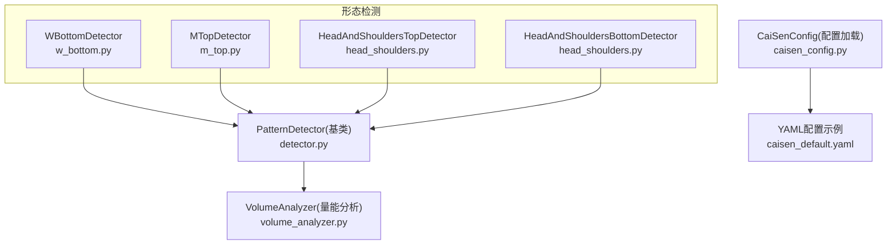
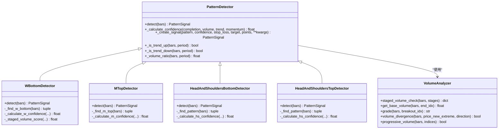
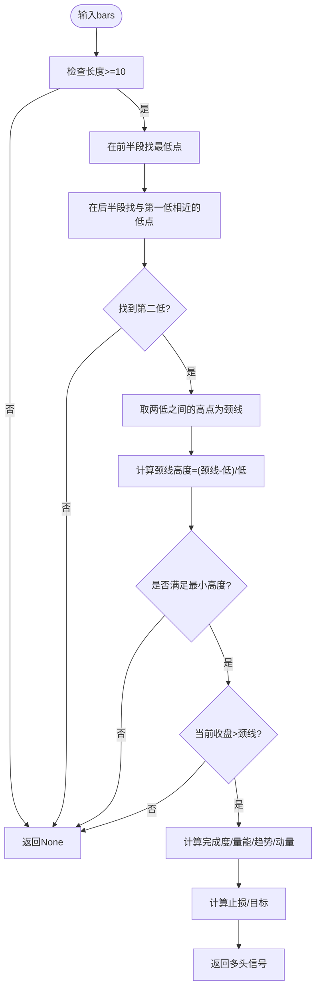
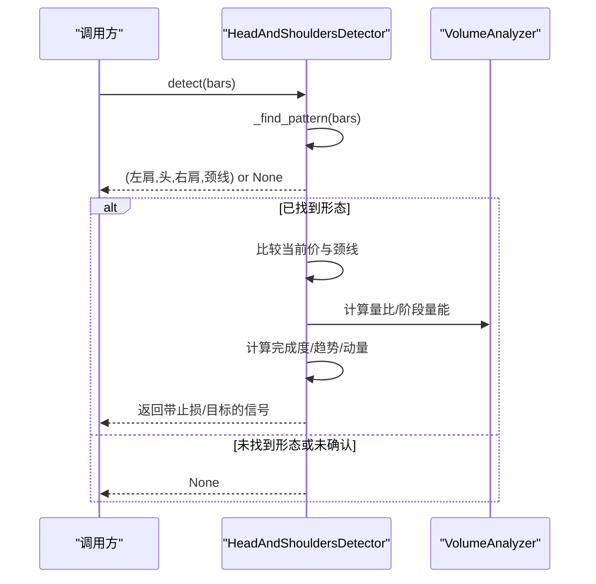
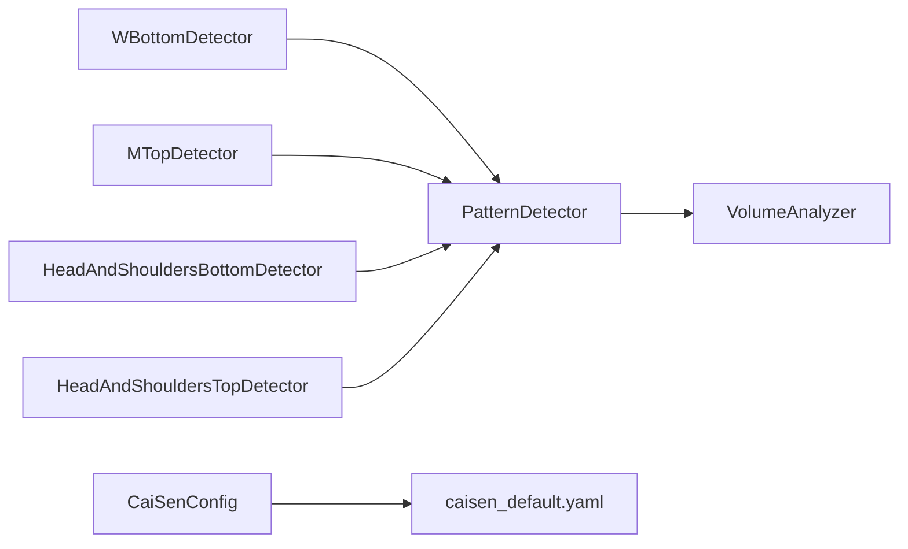

# 反转形态识别

<cite>
**本文引用的文件**   
- [src/caisen/strategy/algorithm/patterns/w_bottom.py](file://src/caisen/strategy/algorithm/patterns/w_bottom.py)
- [src/caisen/strategy/algorithm/patterns/m_top.py](file://src/caisen/strategy/algorithm/patterns/m_top.py)
- [src/caisen/strategy/algorithm/patterns/head_shoulders.py](file://src/caisen/strategy/algorithm/patterns/head_shoulders.py)
- [src/caisen/strategy/algorithm/detector.py](file://src/caisen/strategy/algorithm/detector.py)
- [src/caisen/strategy/algorithm/caisen_components/volume_analyzer.py](file://src/caisen/strategy/algorithm/caisen_components/volume_analyzer.py)
- [src/caisen/strategy/algorithm/caisen_config.py](file://src/caisen/strategy/algorithm/caisen_config.py)
- [configs/strategies/caisen_default.yaml](file://configs/strategies/caisen_default.yaml)
- [tests/test_cai_sen.py](file://tests/test_cai_sen.py)
</cite>

## 目录
1. [引言](#引言)
2. [项目结构](#项目结构)
3. [核心组件](#核心组件)
4. [架构总览](#架构总览)
5. [详细组件分析](#详细组件分析)
6. [依赖关系分析](#依赖关系分析)
7. [性能与复杂度](#性能与复杂度)
8. [参数配置与调优指南](#参数配置与调优指南)
9. [交易信号与风险管理](#交易信号与风险管理)
10. [故障排查](#故障排查)
11. [结论](#结论)

## 引言
本文件面向 Caisen 量化回测系统中的“反转形态识别”能力，聚焦于 W底、M头、头肩顶/底等经典反转形态的识别算法与实现细节。文档从几何特征定义、关键点位识别逻辑、确认条件验证规则入手，深入解释时间窗口约束、价格波动幅度阈值、成交量配合要求等技术要点，并提供形态参数的配置选项与调优建议、交易信号生成规则与风险管理建议，以及基于测试用例的使用效果评估方法。

## 项目结构
与反转形态识别直接相关的代码主要位于策略算法模块的 patterns 子包中，并通过统一的检测器基类提供纯函数接口；量能分析由专用组件完成；策略配置通过 YAML 加载并映射到运行时参数。

图表来源
- [src/caisen/strategy/algorithm/patterns/w_bottom.py:1-285](file://src/caisen/strategy/algorithm/patterns/w_bottom.py#L1-L285)
- [src/caisen/strategy/algorithm/patterns/m_top.py:1-227](file://src/caisen/strategy/algorithm/patterns/m_top.py#L1-L227)
- [src/caisen/strategy/algorithm/patterns/head_shoulders.py:1-323](file://src/caisen/strategy/algorithm/patterns/head_shoulders.py#L1-L323)
- [src/caisen/strategy/algorithm/detector.py:1-244](file://src/caisen/strategy/algorithm/detector.py#L1-L244)
- [src/caisen/strategy/algorithm/caisen_components/volume_analyzer.py:1-287](file://src/caisen/strategy/algorithm/caisen_components/volume_analyzer.py#L1-L287)
- [src/caisen/strategy/algorithm/caisen_config.py:1-145](file://src/caisen/strategy/algorithm/caisen_config.py#L1-L145)
- [configs/strategies/caisen_default.yaml:1-50](file://configs/strategies/caisen_default.yaml#L1-L50)

章节来源
- [src/caisen/strategy/algorithm/patterns/w_bottom.py:1-285](file://src/caisen/strategy/algorithm/patterns/w_bottom.py#L1-L285)
- [src/caisen/strategy/algorithm/patterns/m_top.py:1-227](file://src/caisen/strategy/algorithm/patterns/m_top.py#L1-L227)
- [src/caisen/strategy/algorithm/patterns/head_shoulders.py:1-323](file://src/caisen/strategy/algorithm/patterns/head_shoulders.py#L1-L323)
- [src/caisen/strategy/algorithm/detector.py:1-244](file://src/caisen/strategy/algorithm/detector.py#L1-L244)
- [src/caisen/strategy/algorithm/caisen_components/volume_analyzer.py:1-287](file://src/caisen/strategy/algorithm/caisen_components/volume_analyzer.py#L1-L287)
- [src/caisen/strategy/algorithm/caisen_config.py:1-145](file://src/caisen/strategy/algorithm/caisen_config.py#L1-L145)
- [configs/strategies/caisen_default.yaml:1-50](file://configs/strategies/caisen_default.yaml#L1-L50)

## 核心组件
- 形态检测器基类 PatternDetector：提供纯函数接口 detect(bars)，统一计算置信度、趋势判断、量比计算与信号创建工具方法。
- 具体形态检测器：
  - WBottomDetector：识别双底后颈线突破（做多）。
  - MTopDetector：识别双顶后颈线跌破（做空）。
  - HeadAndShouldersBottomDetector / HeadAndShouldersTopDetector：识别头肩底/顶后的颈线突破/跌破。
- 量能分析器 VolumeAnalyzer：按阶段评估缩量/放量/递增等量能行为，为置信度提供量化因子。
- 配置加载 CaiSenConfig：从 YAML 加载平台参数、形态开关与权重等，供上层策略使用。

章节来源
- [src/caisen/strategy/algorithm/detector.py:1-244](file://src/caisen/strategy/algorithm/detector.py#L1-L244)
- [src/caisen/strategy/algorithm/patterns/w_bottom.py:1-285](file://src/caisen/strategy/algorithm/patterns/w_bottom.py#L1-L285)
- [src/caisen/strategy/algorithm/patterns/m_top.py:1-227](file://src/caisen/strategy/algorithm/patterns/m_top.py#L1-L227)
- [src/caisen/strategy/algorithm/patterns/head_shoulders.py:1-323](file://src/caisen/strategy/algorithm/patterns/head_shoulders.py#L1-L323)
- [src/caisen/strategy/algorithm/caisen_components/volume_analyzer.py:1-287](file://src/caisen/strategy/algorithm/caisen_components/volume_analyzer.py#L1-L287)
- [src/caisen/strategy/algorithm/caisen_config.py:1-145](file://src/caisen/strategy/algorithm/caisen_config.py#L1-L145)

## 架构总览
各形态检测器均继承自 PatternDetector，采用纯函数式设计：每次调用 detect(bars) 仅依赖传入的 K 线序列，不维护内部状态，便于并行与回测。置信度由完成度、成交量、趋势共振、动量四因子加权合成；止损与目标价依据形态振幅与参数系数计算。

图表来源
- [src/caisen/strategy/algorithm/detector.py:1-244](file://src/caisen/strategy/algorithm/detector.py#L1-L244)
- [src/caisen/strategy/algorithm/patterns/w_bottom.py:1-285](file://src/caisen/strategy/algorithm/patterns/w_bottom.py#L1-L285)
- [src/caisen/strategy/algorithm/patterns/m_top.py:1-227](file://src/caisen/strategy/algorithm/patterns/m_top.py#L1-L227)
- [src/caisen/strategy/algorithm/patterns/head_shoulders.py:1-323](file://src/caisen/strategy/algorithm/patterns/head_shoulders.py#L1-L323)
- [src/caisen/strategy/algorithm/caisen_components/volume_analyzer.py:1-287](file://src/caisen/strategy/algorithm/caisen_components/volume_analyzer.py#L1-L287)

## 详细组件分析

### W底（双底）反转形态
- 几何特征
  - 两个低点位置接近（容差控制），两低之间形成颈线（区间内高点）。
  - 当前收盘价突破颈线时确认形态。
- 关键点位识别逻辑
  - 在固定时间窗口内寻找第一个低点（前段）、第二个低点（后段且与第一低相近），再取两低之间的最高价作为颈线。
  - 对颈线高度设置最小阈值，避免过浅的“假W”。
- 确认条件与置信度
  - 完成度：两低越对称越高。
  - 成交量：三阶段评分（形成期缩量、突破期放量、确认期持续或回踩缩量），若无法定位索引则退化为简单量比。
  - 趋势：上升趋势增强信号。
  - 动量：突破力度越大置信度越高。
- 风控参数
  - 止损 = 最低点 × 止损系数。
  - 目标 = max(颈线 + 振幅, 当前价 × (1 + 最小盈利百分比))。
- 时间窗口与阈值
  - 默认使用最近10根K线进行扫描；可通过外部配置调整。
  - 容差与颈线最小高度可调节。

图表来源
- [src/caisen/strategy/algorithm/patterns/w_bottom.py:1-285](file://src/caisen/strategy/algorithm/patterns/w_bottom.py#L1-L285)
- [src/caisen/strategy/algorithm/caisen_components/volume_analyzer.py:1-287](file://src/caisen/strategy/algorithm/caisen_components/volume_analyzer.py#L1-L287)

章节来源
- [src/caisen/strategy/algorithm/patterns/w_bottom.py:1-285](file://src/caisen/strategy/algorithm/patterns/w_bottom.py#L1-L285)
- [src/caisen/strategy/algorithm/caisen_components/volume_analyzer.py:1-287](file://src/caisen/strategy/algorithm/caisen_components/volume_analyzer.py#L1-L287)

### M头（双顶）反转形态
- 几何特征
  - 两个高点位置接近（容差控制），两高之间形成颈线（区间内低点）。
  - 当前收盘价跌破颈线时确认形态。
- 关键点位识别逻辑
  - 在固定时间窗口内寻找第一个高点（前段）、第二个高点（后段且与第一高相近），再取两高之间的最低价作为颈线。
  - 对颈线深度设置最小阈值，避免过浅的“假M”。
- 确认条件与置信度
  - 完成度：两高越对称越高。
  - 成交量：跌破时放量提升置信度。
  - 趋势：下降趋势增强信号。
  - 动量：跌破力度越大置信度越高。
- 风控参数
  - 止损 = 最高点 × 止损系数。
  - 目标 = 颈线 - 振幅。
- 时间窗口与阈值
  - 默认使用最近10根K线进行扫描；可通过外部配置调整。
  - 容差与颈线最小深度可调节。

图表来源
- [src/caisen/strategy/algorithm/patterns/m_top.py:1-227](file://src/caisen/strategy/algorithm/patterns/m_top.py#L1-L227)

章节来源
- [src/caisen/strategy/algorithm/patterns/m_top.py:1-227](file://src/caisen/strategy/algorithm/patterns/m_top.py#L1-L227)

### 头肩顶/底反转形态
- 几何特征
  - 头肩底：左肩、头部（最低点）、右肩依次出现，头部低于两肩；颈线为左右肩之间的高点连线区域；价格向上突破颈线确认。
  - 头肩顶：左肩、头部（最高点）、右肩依次出现，头部高于两肩；颈线为左右肩之间的低点连线区域；价格向下跌破颈线确认。
- 关键点位识别逻辑
  - 在固定时间窗口内先定位中间区域的头（最低/最高），再在两侧分别筛选符合高度区间的肩候选，最后以两肩之间的高/低点确定颈线。
- 确认条件与置信度
  - 完成度：两肩对称性越好越高。
  - 成交量：突破/跌破时放量提升置信度。
  - 趋势：与方向一致的趋势增强信号。
  - 动量：突破/跌破力度越大置信度越高。
- 风控参数
  - 头肩底：止损 = 头部低点 × 止损系数；目标 = 颈线 + 振幅（或按最小盈利比例）。
  - 头肩顶：止损 = 头部高点 × 止损系数；目标 = 颈线 - 振幅。
- 时间窗口与阈值
  - 默认使用最近12根K线进行扫描；可通过外部配置调整。
  - 肩部容差与肩部相对头部的高度范围可调节。

图表来源
- [src/caisen/strategy/algorithm/patterns/head_shoulders.py:1-323](file://src/caisen/strategy/algorithm/patterns/head_shoulders.py#L1-L323)
- [src/caisen/strategy/algorithm/caisen_components/volume_analyzer.py:1-287](file://src/caisen/strategy/algorithm/caisen_components/volume_analyzer.py#L1-L287)

章节来源
- [src/caisen/strategy/algorithm/patterns/head_shoulders.py:1-323](file://src/caisen/strategy/algorithm/patterns/head_shoulders.py#L1-L323)

## 依赖关系分析
- 形态检测器依赖基类提供的通用方法：
  - 趋势判断：基于近期首尾收盘价对比。
  - 量比计算：近期均量与历史均量的比值。
  - 置信度合成：完成度、成交量、趋势、动量四因子加权。
- 量能分析器提供分阶段量能评估、等级划分、背离检测与递增检查，被 W底 的三阶段量能评分所使用。
- 配置加载器将 YAML 中的开关与权重映射到运行时对象属性，供策略层启用/禁用特定形态及质量评分。

图表来源
- [src/caisen/strategy/algorithm/detector.py:1-244](file://src/caisen/strategy/algorithm/detector.py#L1-L244)
- [src/caisen/strategy/algorithm/caisen_components/volume_analyzer.py:1-287](file://src/caisen/strategy/algorithm/caisen_components/volume_analyzer.py#L1-L287)
- [src/caisen/strategy/algorithm/caisen_config.py:1-145](file://src/caisen/strategy/algorithm/caisen_config.py#L1-L145)
- [configs/strategies/caisen_default.yaml:1-50](file://configs/strategies/caisen_default.yaml#L1-L50)

章节来源
- [src/caisen/strategy/algorithm/detector.py:1-244](file://src/caisen/strategy/algorithm/detector.py#L1-L244)
- [src/caisen/strategy/algorithm/caisen_components/volume_analyzer.py:1-287](file://src/caisen/strategy/algorithm/caisen_components/volume_analyzer.py#L1-L287)
- [src/caisen/strategy/algorithm/caisen_config.py:1-145](file://src/caisen/strategy/algorithm/caisen_config.py#L1-L145)
- [configs/strategies/caisen_default.yaml:1-50](file://configs/strategies/caisen_default.yaml#L1-L50)

## 性能与复杂度
- 时间复杂度
  - 每个检测器在固定窗口内扫描极值与区间统计，近似 O(W)，其中 W 为窗口大小（如 10 或 12）。
  - 量能分析器的分阶段检查涉及若干区间求和与均值计算，整体仍线性于参与计算的 K 线数量。
- 空间复杂度
  - 主要为局部切片与临时列表，O(W)。
- 优化建议
  - 对于高频数据，可考虑滑动窗口增量更新极值与区间统计，降低重复计算。
  - 对量能指标可采用指数移动平均替代全区间均值，减少计算开销。

[本节为通用性能讨论，不直接分析具体文件]

## 参数配置与调优指南
- 通用参数
  - 平台参数：最少K线数、最大振幅、量能退潮要求等，用于过滤震荡与无效形态。
  - 风险控制：止损系数、最小盈利目标、移动止损回撤百分比与开关。
  - 形态开关：按形态名称启用/禁用。
  - 形态权重：用于多形态综合质量评分。
- 形态专属参数
  - W底：双底容差、颈线最小高度、止损系数、最小盈利百分比。
  - M头：双顶容差、颈线最小深度、止损系数、最小盈利百分比。
  - 头肩顶/底：肩部容差、肩部相对头部高度范围、止损系数、最小盈利百分比。
- 调优建议
  - 容差与颈线阈值：在趋势明显品种上可适当放宽，在震荡品种上收紧以避免假突破。
  - 量能阈值：根据标的流动性与历史量级调整放量倍数，避免过度敏感或迟钝。
  - 趋势周期：趋势判断周期与动量阈值需与交易周期匹配，日线级别常用 20 日。
  - 止损与目标：结合波动率与盈亏比设定，确保期望值为正。

章节来源
- [src/caisen/strategy/algorithm/caisen_config.py:1-145](file://src/caisen/strategy/algorithm/caisen_config.py#L1-L145)
- [configs/strategies/caisen_default.yaml:1-50](file://configs/strategies/caisen_default.yaml#L1-L50)
- [src/caisen/strategy/algorithm/patterns/w_bottom.py:1-285](file://src/caisen/strategy/algorithm/patterns/w_bottom.py#L1-L285)
- [src/caisen/strategy/algorithm/patterns/m_top.py:1-227](file://src/caisen/strategy/algorithm/patterns/m_top.py#L1-L227)
- [src/caisen/strategy/algorithm/patterns/head_shoulders.py:1-323](file://src/caisen/strategy/algorithm/patterns/head_shoulders.py#L1-L323)

## 交易信号与风险管理
- 信号生成规则
  - W底：当收盘价突破颈线时产生多头信号，附带止损与目标价。
  - M头：当收盘价跌破颈线时产生空头信号，附带止损与目标价。
  - 头肩底：颈线向上突破时产生多头信号；头肩顶：颈线向下跌破时产生空头信号。
- 风控建议
  - 止损：基于形态关键点（低点/高点）乘以系数，防止反向大幅波动。
  - 目标：按形态振幅或最小盈利比例动态设定，兼顾风险回报比。
  - 仓位管理：结合形态质量评分与账户风险预算分批建仓。
  - 移动止损：在趋势延续时逐步上移止损，锁定利润。
- 实战提示
  - 优先选择与更大周期趋势共振的形态。
  - 关注突破时的量能配合，放量突破/跌破更可靠。
  - 在重要支撑/阻力位附近的形态成功率更高。

章节来源
- [src/caisen/strategy/algorithm/patterns/w_bottom.py:1-285](file://src/caisen/strategy/algorithm/patterns/w_bottom.py#L1-L285)
- [src/caisen/strategy/algorithm/patterns/m_top.py:1-227](file://src/caisen/strategy/algorithm/patterns/m_top.py#L1-L227)
- [src/caisen/strategy/algorithm/patterns/head_shoulders.py:1-323](file://src/caisen/strategy/algorithm/patterns/head_shoulders.py#L1-L323)

## 故障排查
- 常见问题
  - 不足最小K线数：检测器直接返回 None，需增加历史数据或调整最小K线要求。
  - 颈线过浅/过深：调整颈线最小高度/深度阈值，避免误判。
  - 量能异常：检查基础均量计算周期与放量倍数阈值，必要时切换为简单量比模式。
  - 趋势误判：调整趋势判断周期，或在震荡市中降低趋势权重。
- 调试手段
  - 打印信号的关键点与置信度因子，观察完成度、量能、趋势、动量贡献。
  - 使用单元测试构造典型形态场景，验证边界条件与参数敏感性。

章节来源
- [tests/test_cai_sen.py:1-200](file://tests/test_cai_sen.py#L1-L200)

## 结论
Caisen 的反转形态识别模块以纯函数式检测器为核心，围绕 W底、M头、头肩顶/底三大经典形态提供了稳健的几何识别、量能配合与趋势共振机制。通过可配置的容差、颈线阈值、止损与目标参数，系统能够在不同市场环境下灵活适配。建议在实盘前结合历史数据进行参数寻优与压力测试，并结合仓位管理与移动止损完善风险控制体系。