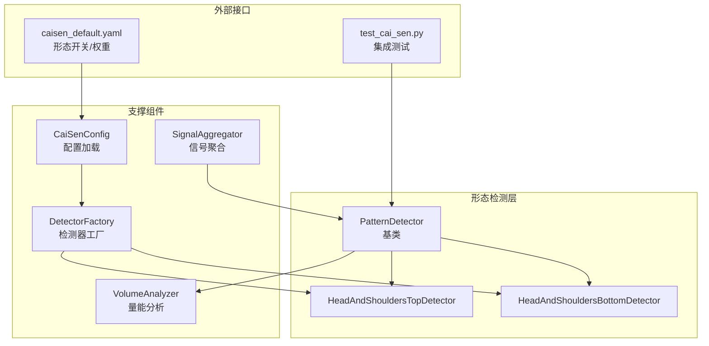
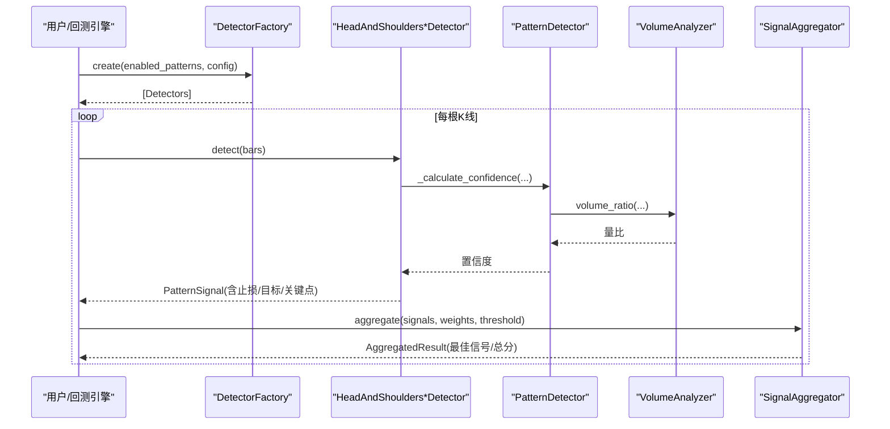
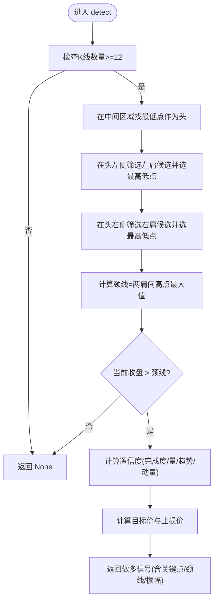
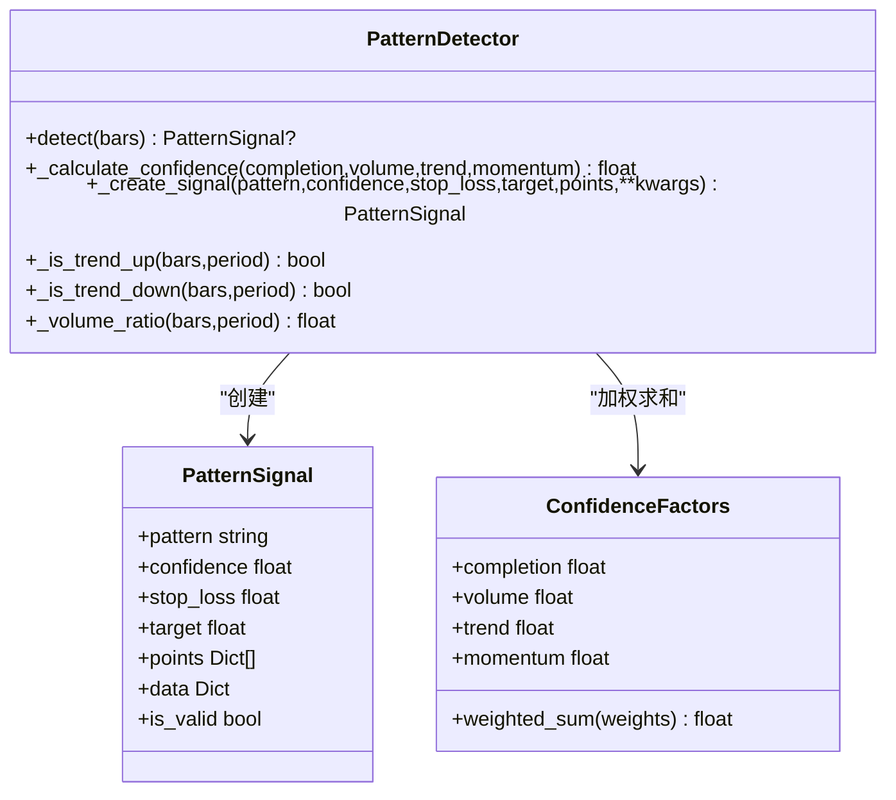
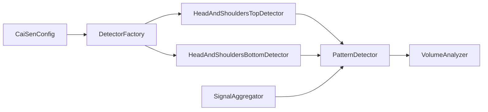

# 头肩顶/底形态识别

<cite>
**本文引用的文件**   
- [head_shoulders.py](file://src/caisen/strategy/algorithm/patterns/head_shoulders.py)
- [detector.py](file://src/caisen/strategy/algorithm/detector.py)
- [volume_analyzer.py](file://src/caisen/strategy/algorithm/caisen_components/volume_analyzer.py)
- [aggregator.py](file://src/caisen/strategy/algorithm/caisen_components/aggregator.py)
- [factory.py](file://src/caisen/strategy/algorithm/caisen_components/factory.py)
- [caisen_config.py](file://src/caisen/strategy/algorithm/caisen_config.py)
- [caisen_default.yaml](file://configs/strategies/caisen_default.yaml)
- [test_cai_sen.py](file://tests/test_cai_sen.py)
</cite>

## 目录
1. [引言](#引言)
2. [项目结构](#项目结构)
3. [核心组件](#核心组件)
4. [架构总览](#架构总览)
5. [详细组件分析](#详细组件分析)
6. [依赖关系分析](#依赖关系分析)
7. [性能与复杂度](#性能与复杂度)
8. [参数系统与调优策略](#参数系统与调优策略)
9. [置信度模型详解](#置信度模型详解)
10. [交易策略与风控](#交易策略与风控)
11. [故障排查指南](#故障排查指南)
12. [结论](#结论)

## 引言
本文件面向 Caisen 量化回测系统中的“头肩顶/底”形态识别模块，系统性阐述经典技术分析理论在该模块中的落地实现，包括几何关系、颈线确定、完成确认条件；深入解析 HeadAndShouldersTopDetector 与 HeadAndShouldersBottomDetector 的算法流程、关键数据结构与依赖链；全面介绍复杂参数体系（肩部容差、头部高度比例、颈线斜率限制、时间对称性等）及其调优方法；解释高级置信度计算模型（形态比例、成交量分布验证、时间周期匹配、趋势环境评估）；并提供头肩顶做空与头肩底做多的入场点、止损、目标价及失败应对方案。

## 项目结构
围绕头肩形态的核心代码位于 strategy/algorithm 子系统中：
- 形态检测器基类与信号定义：detector.py
- 头肩顶/底检测器实现：patterns/head_shoulders.py
- 量能分析器：caisen_components/volume_analyzer.py
- 信号聚合器：caisen_components/aggregator.py
- 检测器工厂与默认配置映射：caisen_components/factory.py
- 策略配置加载器与开关/权重：caisen_config.py
- 示例配置：configs/strategies/caisen_default.yaml
- 集成测试用例：tests/test_cai_sen.py

图表来源
- [detector.py:80-180](file://src/caisen/strategy/algorithm/detector.py#L80-L180)
- [head_shoulders.py:11-172](file://src/caisen/strategy/algorithm/patterns/head_shoulders.py#L11-L172)
- [volume_analyzer.py:15-126](file://src/caisen/strategy/algorithm/caisen_components/volume_analyzer.py#L15-L126)
- [aggregator.py:42-137](file://src/caisen/strategy/algorithm/caisen_components/aggregator.py#L42-L137)
- [factory.py:54-173](file://src/caisen/strategy/algorithm/caisen_components/factory.py#L54-L173)
- [caisen_config.py:11-145](file://src/caisen/strategy/algorithm/caisen_config.py#L11-L145)
- [caisen_default.yaml:26-50](file://configs/strategies/caisen_default.yaml#L26-L50)
- [test_cai_sen.py:168-184](file://tests/test_cai_sen.py#L168-L184)

章节来源
- [detector.py:80-180](file://src/caisen/strategy/algorithm/detector.py#L80-L180)
- [head_shoulders.py:11-172](file://src/caisen/strategy/algorithm/patterns/head_shoulders.py#L11-L172)
- [volume_analyzer.py:15-126](file://src/caisen/strategy/algorithm/caisen_components/volume_analyzer.py#L15-L126)
- [aggregator.py:42-137](file://src/caisen/strategy/algorithm/caisen_components/aggregator.py#L42-L137)
- [factory.py:54-173](file://src/caisen/strategy/algorithm/caisen_components/factory.py#L54-L173)
- [caisen_config.py:11-145](file://src/caisen/strategy/algorithm/caisen_config.py#L11-L145)
- [caisen_default.yaml:26-50](file://configs/strategies/caisen_default.yaml#L26-L50)
- [test_cai_sen.py:168-184](file://tests/test_cai_sen.py#L168-L184)

## 核心组件
- PatternDetector 抽象基类：提供纯函数式 detect(bars) 接口、置信度加权计算、趋势判断、量比估算与信号创建等通用能力。
- HeadAndShouldersTopDetector / HeadAndShouldersBottomDetector：分别实现头肩顶/底的局部极值搜索、颈线定位、突破/跌破确认、目标价与止损计算、置信度评分。
- VolumeAnalyzer：按阶段评估量能（形成期缩量、突破放量、确认期持续），支持分级与背离检测。
- SignalAggregator：对多检测器输出进行过滤、加权与择优。
- DetectorFactory：根据启用列表与配置合并默认值，实例化具体检测器。
- CaiSenConfig：从 YAML 加载全局参数、形态开关与权重。

章节来源
- [detector.py:80-180](file://src/caisen/strategy/algorithm/detector.py#L80-L180)
- [head_shoulders.py:11-172](file://src/caisen/strategy/algorithm/patterns/head_shoulders.py#L11-L172)
- [volume_analyzer.py:15-126](file://src/caisen/strategy/algorithm/caisen_components/volume_analyzer.py#L15-L126)
- [aggregator.py:42-137](file://src/caisen/strategy/algorithm/caisen_components/aggregator.py#L42-L137)
- [factory.py:54-173](file://src/caisen/strategy/algorithm/caisen_components/factory.py#L54-L173)
- [caisen_config.py:11-145](file://src/caisen/strategy/algorithm/caisen_config.py#L11-L145)

## 架构总览
下图展示从配置到检测、再到信号聚合的端到端流程。

图表来源
- [factory.py:81-173](file://src/caisen/strategy/algorithm/caisen_components/factory.py#L81-L173)
- [head_shoulders.py:43-91](file://src/caisen/strategy/algorithm/patterns/head_shoulders.py#L43-L91)
- [detector.py:125-180](file://src/caisen/strategy/algorithm/detector.py#L125-L180)
- [volume_analyzer.py:224-243](file://src/caisen/strategy/algorithm/detector.py#L224-L243)
- [aggregator.py:59-137](file://src/caisen/strategy/algorithm/caisen_components/aggregator.py#L59-L137)

## 详细组件分析

### 头肩底检测器（HeadAndShouldersBottomDetector）
- 形态几何要求
  - 头部为中间区域最低点；左肩与右肩低点相近（相对容差）。
  - 颈线由左右肩之间的高点集合决定（取最高阻力位）。
  - 当前收盘价高于颈线时确认形态完成。
- 关键流程
  - 在近期窗口内寻找候选头部、左肩、右肩。
  - 计算颈线与振幅，生成做多信号，设置止损与目标价。
  - 基于完成度、成交量、趋势、动量计算综合置信度。
- 重要细节
  - 左肩高度需落在相对头部的合理区间内，避免过浅或过高。
  - 右肩与左肩的高度差异受 shoulder_tolerance 控制。
  - 目标价 = 颈线 + 振幅，且不低于最小盈利百分比约束。
  - 止损价 = 头部低点 × stop_loss_factor。

图表来源
- [head_shoulders.py:43-91](file://src/caisen/strategy/algorithm/patterns/head_shoulders.py#L43-L91)
- [head_shoulders.py:93-136](file://src/caisen/strategy/algorithm/patterns/head_shoulders.py#L93-L136)
- [head_shoulders.py:137-170](file://src/caisen/strategy/algorithm/patterns/head_shoulders.py#L137-L170)

章节来源
- [head_shoulders.py:11-172](file://src/caisen/strategy/algorithm/patterns/head_shoulders.py#L11-L172)

### 头肩顶检测器（HeadAndShouldersTopDetector）
- 形态几何要求
  - 头部为中间区域最高点；左肩与右肩高点相近（相对容差）。
  - 颈线由左右肩之间的低点集合决定（取最低支撑位）。
  - 当前收盘价低于颈线时确认形态完成。
- 关键流程
  - 在近期窗口内寻找候选头部、左肩、右肩。
  - 计算颈线与振幅，生成做空信号，设置止损与目标价。
  - 基于完成度、成交量、趋势、动量计算综合置信度。
- 重要细节
  - 左肩高度需落在相对头部的合理区间内。
  - 右肩与左肩的高度差异受 shoulder_tolerance 控制。
  - 目标价 = 颈线 - 振幅。
  - 止损价 = 头部高点 × stop_loss_factor。

图表来源
- [head_shoulders.py:199-247](file://src/caisen/strategy/algorithm/patterns/head_shoulders.py#L199-L247)
- [head_shoulders.py:249-291](file://src/caisen/strategy/algorithm/patterns/head_shoulders.py#L249-L291)
- [head_shoulders.py:293-322](file://src/caisen/strategy/algorithm/patterns/head_shoulders.py#L293-L322)

章节来源
- [head_shoulders.py:173-323](file://src/caisen/strategy/algorithm/patterns/head_shoulders.py#L173-L323)

### 基类与工具（PatternDetector）
- 提供统一的信号结构 PatternSignal 与置信度因子 ConfidenceFactors。
- 内置趋势判断（短期首尾收盘价比较）、量比估算（近期均量对比历史均量）、加权置信度计算。
- 统一信号创建入口，便于扩展其他形态检测器。

图表来源
- [detector.py:18-78](file://src/caisen/strategy/algorithm/detector.py#L18-L78)
- [detector.py:80-180](file://src/caisen/strategy/algorithm/detector.py#L80-L180)

章节来源
- [detector.py:18-78](file://src/caisen/strategy/algorithm/detector.py#L18-L78)
- [detector.py:80-180](file://src/caisen/strategy/algorithm/detector.py#L80-L180)

### 量能分析器（VolumeAnalyzer）
- 分阶段量能评估：形成期应缩量、突破期应放量、确认期可继续放量或缩量回踩。
- 提供基础均量计算、阶段通过判定与得分、突破等级划分、量价背离检测、多点递增校验。
- 被 PatternDetector 的 _volume_ratio 间接使用，也可在更复杂的置信度模型中直接调用。

章节来源
- [volume_analyzer.py:15-126](file://src/caisen/strategy/algorithm/caisen_components/volume_analyzer.py#L15-L126)
- [volume_analyzer.py:127-196](file://src/caisen/strategy/algorithm/caisen_components/volume_analyzer.py#L127-L196)
- [volume_analyzer.py:197-287](file://src/caisen/strategy/algorithm/caisen_components/volume_analyzer.py#L197-L287)
- [detector.py:224-243](file://src/caisen/strategy/algorithm/detector.py#L224-L243)

### 信号聚合器（SignalAggregator）
- 收集多个检测器的输出，按阈值过滤无效信号，依据形态权重计算总分，选择最佳信号。
- 提供便捷方法一步完成“检测+聚合”。

章节来源
- [aggregator.py:42-137](file://src/caisen/strategy/algorithm/caisen_components/aggregator.py#L42-L137)

### 检测器工厂与配置（DetectorFactory & CaiSenConfig）
- DetectorFactory 根据 enabled_patterns 与 detector_config 合并默认配置，实例化对应检测器。
- CaiSenConfig 从 YAML 加载全局参数、形态开关与权重，供上层策略使用。

章节来源
- [factory.py:54-173](file://src/caisen/strategy/algorithm/caisen_components/factory.py#L54-L173)
- [caisen_config.py:11-145](file://src/caisen/strategy/algorithm/caisen_config.py#L11-L145)
- [caisen_default.yaml:26-50](file://configs/strategies/caisen_default.yaml#L26-L50)

## 依赖关系分析
- 头肩检测器依赖基类的趋势判断与量比估算，以及自身实现的几何筛选逻辑。
- 量能分析器独立于检测器，但被基类与更高级置信度模型复用。
- 工厂负责将配置注入检测器构造参数，确保可配置性与可扩展性。
- 聚合器解耦了“检测”与“决策”，便于组合多种形态。

图表来源
- [head_shoulders.py:11-172](file://src/caisen/strategy/algorithm/patterns/head_shoulders.py#L11-L172)
- [detector.py:80-180](file://src/caisen/strategy/algorithm/detector.py#L80-L180)
- [volume_analyzer.py:15-126](file://src/caisen/strategy/algorithm/caisen_components/volume_analyzer.py#L15-L126)
- [factory.py:54-173](file://src/caisen/strategy/algorithm/caisen_components/factory.py#L54-L173)
- [caisen_config.py:11-145](file://src/caisen/strategy/algorithm/caisen_config.py#L11-L145)
- [aggregator.py:42-137](file://src/caisen/strategy/algorithm/caisen_components/aggregator.py#L42-L137)

## 性能与复杂度
- 时间复杂度
  - 单步 detect：在固定窗口（如最近12根）内进行常数级扫描与比较，整体 O(N) 其中 N 为窗口大小（常数）。
  - 置信度计算：趋势判断与量比均为线性扫描固定周期，O(P)，P 为周期长度（如20）。
- 空间复杂度
  - 仅维护少量局部变量与切片引用，O(1) 额外空间。
- 优化建议
  - 若需扩展到更长历史窗口，可对滑动窗口统计（均值、极值）进行增量更新以降低重复计算。
  - 批量回测时可缓存趋势方向与量比结果，避免重复计算。

[本节为通用性能讨论，不直接分析具体文件]

## 参数系统与调优策略
- 已实现的关键参数
  - shoulder_tolerance：两肩高度相对容差，影响左右肩对称性判定与完成度评分。
  - shoulder_height_min / shoulder_height_max：左肩相对头部的高度区间，用于排除过浅或过高的肩部。
  - stop_loss_factor：止损系数（多头乘以低点、空头乘以高点）。
  - min_profit_pct：最小盈利目标，用于保底目标价。
- 尚未在当前实现中显式暴露的参数（可在后续扩展）
  - head_height_ratio：头部高度比例（可用于头部显著性检验）。
  - neckline_slope：颈线斜率限制（当前实现采用水平颈线，可通过两点连线斜率扩展）。
  - time_symmetry：时间对称性（左右肩到头的时长比值，可作为完成度增强因子）。
- 调优建议
  - 波动较大的品种可提高 shoulder_tolerance，降低误报；趋势明确的品种可降低容差以提升质量。
  - 在震荡市中适当提高 min_profit_pct 以过滤弱信号；在强趋势中可适当降低以捕捉早期机会。
  - 结合成交量放大倍数阈值与趋势共振权重，动态调整置信度门槛。

章节来源
- [head_shoulders.py:28-41](file://src/caisen/strategy/algorithm/patterns/head_shoulders.py#L28-L41)
- [head_shoulders.py:184-197](file://src/caisen/strategy/algorithm/patterns/head_shoulders.py#L184-L197)
- [factory.py:168-173](file://src/caisen/strategy/algorithm/caisen_components/factory.py#L168-L173)
- [caisen_config.py:30-37](file://src/caisen/strategy/algorithm/caisen_config.py#L30-37)

## 置信度模型详解
- 构成维度
  - 完成度 completion：两肩对称性越接近，分数越高；由 shoulder_tolerance 归一化。
  - 成交量 volume：基于近期均量与历史均量的比值，体现突破时的量能配合。
  - 趋势 trend：多头形态倾向上升趋势，空头形态倾向下降趋势，使用短期首尾收盘价比较。
  - 动量 momentum：突破幅度相对于阈值的缩放，体现突破力度。
- 加权方式
  - 基类提供默认权重（完成度更高权重），子类可按场景调整。
- 扩展建议
  - 引入 neck_slope 与 time_symmetry 作为新增因子，提升形态质量判别。
  - 结合 VolumeAnalyzer 的阶段评分与背离检测，细化 volume 因子。

章节来源
- [detector.py:125-180](file://src/caisen/strategy/algorithm/detector.py#L125-L180)
- [head_shoulders.py:137-170](file://src/caisen/strategy/algorithm/patterns/head_shoulders.py#L137-L170)
- [head_shoulders.py:293-322](file://src/caisen/strategy/algorithm/patterns/head_shoulders.py#L293-L322)

## 交易策略与风控
- 头肩底做多
  - 入场点：收盘价有效突破颈线时入场。
  - 止损：头部低点 × stop_loss_factor。
  - 目标价：颈线 + 振幅，且不低于当前价 × (1 + min_profit_pct)。
  - 失败应对：若价格回落至颈线以下并跌破止损，及时退出；若出现假突破（量能不配合），可提前减仓或收紧止损。
- 头肩顶做空
  - 入场点：收盘价有效跌破颈线时入场。
  - 止损：头部高点 × stop_loss_factor。
  - 目标价：颈线 - 振幅。
  - 失败应对：若反弹收复颈线并突破止损，立即平仓；若伴随缩量假跌破，可缩短持仓或反向对冲。
- 仓位与权重
  - 通过 SignalAggregator 的 weights 对不同形态赋予不同权重，结合阈值过滤低质量信号。
  - 结合 CaiSenConfig 的 pattern_weights 进行全局质量评分与排序。

章节来源
- [head_shoulders.py:64-91](file://src/caisen/strategy/algorithm/patterns/head_shoulders.py#L64-L91)
- [head_shoulders.py:220-247](file://src/caisen/strategy/algorithm/patterns/head_shoulders.py#L220-L247)
- [aggregator.py:59-137](file://src/caisen/strategy/algorithm/caisen_components/aggregator.py#L59-L137)
- [caisen_config.py:55-68](file://src/caisen/strategy/algorithm/caisen_config.py#L55-68)

## 故障排查指南
- 常见问题
  - 未检测到形态：检查 bars 长度是否满足最小窗口；确认左右肩候选是否存在；核对 shoulder_tolerance 与 shoulder_height_* 是否过于严格。
  - 频繁假突破：提高成交量阈值或趋势共振权重；引入颈线斜率与时间对称性因子；提高置信度阈值。
  - 目标价过低：检查 min_profit_pct 与振幅计算是否正确；确保颈线位置合理。
- 调试建议
  - 打印 PatternSignal.points 与 neckline/amplitude 以可视化形态关键点。
  - 使用 SignalAggregator 的 best_confidence 与 total_score 观察信号质量。
  - 利用 VolumeAnalyzer 的 grade 与 staged_volume_check 诊断量能是否符合预期。

章节来源
- [detector.py:151-180](file://src/caisen/strategy/algorithm/detector.py#L151-L180)
- [aggregator.py:59-137](file://src/caisen/strategy/algorithm/caisen_components/aggregator.py#L59-L137)
- [volume_analyzer.py:127-196](file://src/caisen/strategy/algorithm/caisen_components/volume_analyzer.py#L127-L196)

## 结论
本模块将经典头肩形态理论与工程实现紧密结合，通过清晰的几何筛选、严格的颈线确认与多维置信度模型，提供了稳健的形态识别能力。未来可在现有基础上进一步引入颈线斜率、时间对称性与更精细的量能阶段评分，以提升形态质量判别与实战胜率。同时，结合工厂与配置系统，可实现灵活的可观测、可迭代与可优化的策略演进路径。