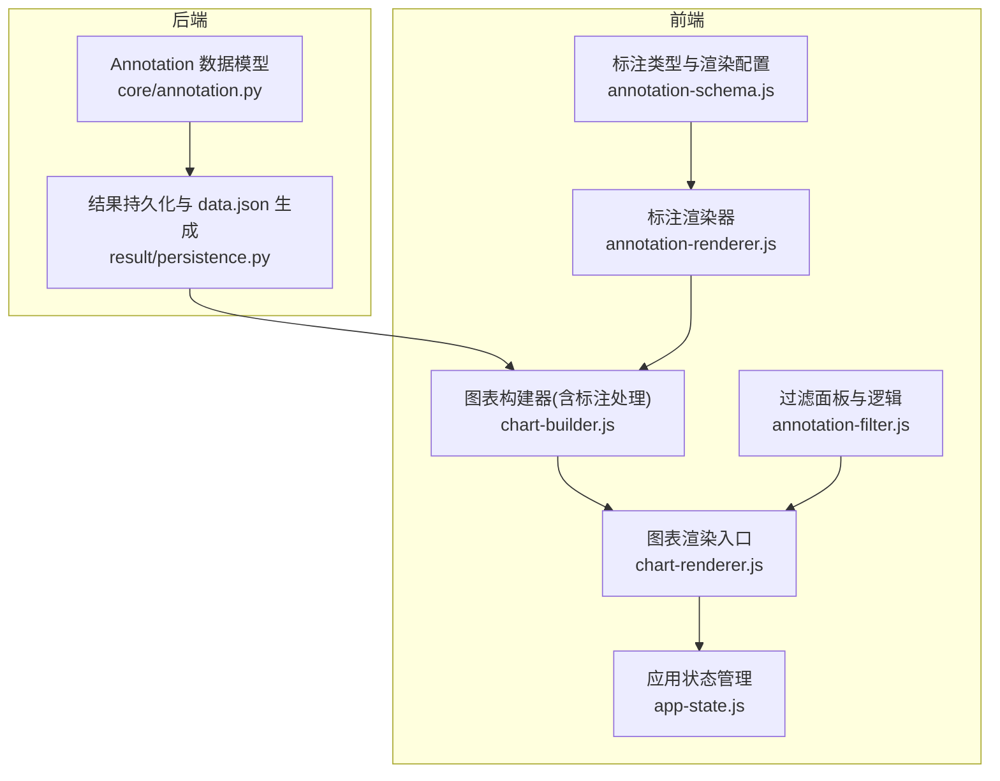
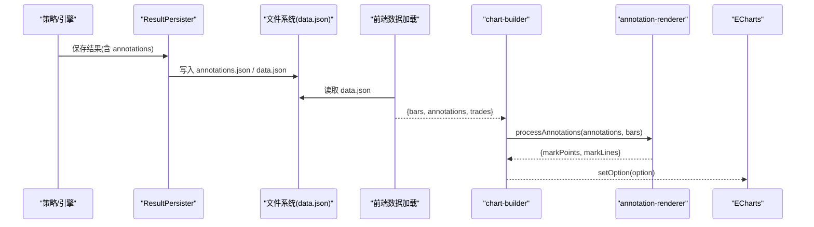
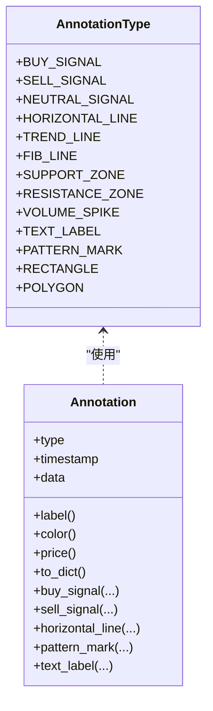
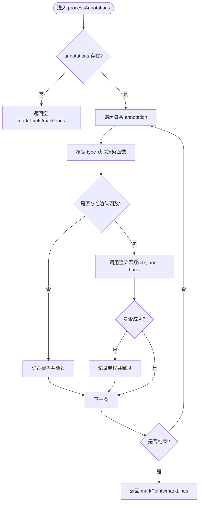
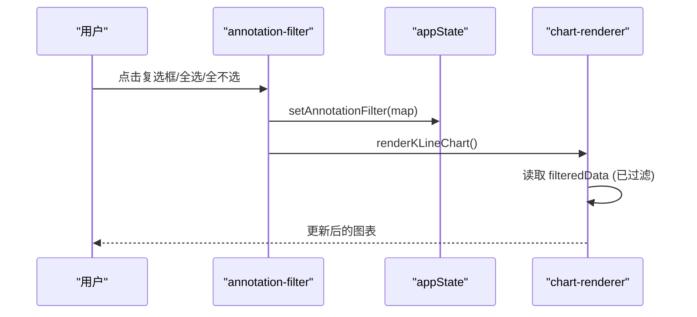
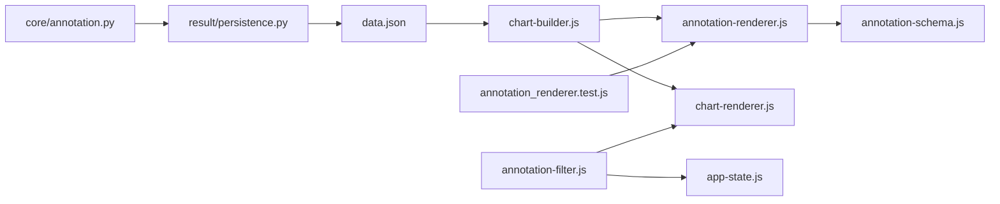

# 形态可视化标注

<cite>
**本文引用的文件**   
- [src/caisen/core/annotation.py](file://src/caisen/core/annotation.py)
- [src/caisen/frontend/src/js/annotation-schema.js](file://src/caisen/frontend/src/js/annotation-schema.js)
- [src/caisen/frontend/src/js/annotation-renderer.js](file://src/caisen/frontend/src/js/annotation-renderer.js)
- [src/caisen/frontend/src/js/annotation-filter.js](file://src/caisen/frontend/src/js/annotation-filter.js)
- [src/caisen/frontend/src/js/chart-builder.js](file://src/caisen/frontend/src/js/chart-builder.js)
- [src/caisen/frontend/src/js/chart-renderer.js](file://src/caisen/frontend/src/js/chart-renderer.js)
- [src/caisen/frontend/src/js/app-state.js](file://src/caisen/frontend/src/js/app-state.js)
- [src/caisen/result/persistence.py](file://src/caisen/result/persistence.py)
- [docs/adr/0005-visualization-annotations.md](file://docs/adr/0005-visualization-annotations.md)
- [tests/js/annotation_renderer.test.js](file://tests/js/annotation_renderer.test.js)
</cite>

## 目录
1. [简介](#简介)
2. [项目结构](#项目结构)
3. [核心组件](#核心组件)
4. [架构总览](#架构总览)
5. [详细组件分析](#详细组件分析)
6. [依赖关系分析](#依赖关系分析)
7. [性能与可扩展性](#性能与可扩展性)
8. [故障排查指南](#故障排查指南)
9. [结论](#结论)
10. [附录](#附录)

## 简介
本文件面向 Caisen 量化回测系统的“形态可视化标注”能力，系统性阐述从后端数据模型到前端渲染的完整链路。内容涵盖：
- Annotation 数据模型定义（类型、时间戳、data 字段语义）
- 后端持久化流程与 data.json 生成
- 前端渲染机制（ECharts markPoints/markLines）
- 过滤器与交互（按类型/形态筛选、时间轴联动、详情查看）
- 多时间框架叠加显示与冲突处理策略
- 自定义样式与主题配置
- 导出与分享方案

## 项目结构
围绕形态可视化标注的关键代码分布在以下模块：
- 后端数据模型与持久化：core/annotation.py、result/persistence.py
- 前端模式与渲染：frontend/src/js/annotation-schema.js、annotation-renderer.js、chart-builder.js、chart-renderer.js
- 过滤与状态：frontend/src/js/annotation-filter.js、app-state.js
- 设计决策参考：docs/adr/0005-visualization-annotations.md
- 测试用例：tests/js/annotation_renderer.test.js

图示来源
- [src/caisen/core/annotation.py:1-139](file://src/caisen/core/annotation.py#L1-L139)
- [src/caisen/result/persistence.py:135-202](file://src/caisen/result/persistence.py#L135-L202)
- [src/caisen/frontend/src/js/annotation-schema.js:1-128](file://src/caisen/frontend/src/js/annotation-schema.js#L1-L128)
- [src/caisen/frontend/src/js/annotation-renderer.js:1-437](file://src/caisen/frontend/src/js/annotation-renderer.js#L1-L437)
- [src/caisen/frontend/src/js/chart-builder.js:115-170](file://src/caisen/frontend/src/js/chart-builder.js#L115-L170)
- [src/caisen/frontend/src/js/chart-renderer.js:95-137](file://src/caisen/frontend/src/js/chart-renderer.js#L95-L137)
- [src/caisen/frontend/src/js/app-state.js:1-79](file://src/caisen/frontend/src/js/app-state.js#L1-L79)
- [src/caisen/frontend/src/js/annotation-filter.js:1-176](file://src/caisen/frontend/src/js/annotation-filter.js#L1-L176)

章节来源
- [docs/adr/0005-visualization-annotations.md:1-23](file://docs/adr/0005-visualization-annotations.md#L1-L23)

## 核心组件
- Annotation 数据模型（Python）
  - 统一类型枚举 AnnotationType，覆盖点位、线条、区域、文本、图形等标注类别
  - Annotation 数据类包含 type、timestamp、data 三要素；提供 to_dict 序列化与便捷构造方法
- 前端 Schema 与渲染配置（JS）
  - ANNOTATION_TYPES 与 ANNOTATION_CONFIG 作为单一真相源，定义所有支持的标注类型及默认视觉属性
- 渲染器（JS）
  - processAnnotations 将 annotations 转换为 ECharts markPoints/markLines
  - 各类型渲染函数负责坐标映射、样式合并、边界校验
- 图表构建器（JS）
  - buildKLineOption 组装 K 线、成交量、MA、标注、交易标记等 series
  - 内置 large data 优化与 markPoint/markLine 过滤
- 图表渲染器（JS）
  - renderKLineChart 驱动 ECharts 实例初始化与 setOption，支持懒加载与 resize 防抖
- 过滤与状态（JS）
  - appState 集中管理图表实例、数据、缩放、均线开关、注解过滤 Map
  - annotation-filter 提供按类型/形态筛选 UI 与事件绑定

章节来源
- [src/caisen/core/annotation.py:13-139](file://src/caisen/core/annotation.py#L13-L139)
- [src/caisen/frontend/src/js/annotation-schema.js:8-102](file://src/caisen/frontend/src/js/annotation-schema.js#L8-L102)
- [src/caisen/frontend/src/js/annotation-renderer.js:15-59](file://src/caisen/frontend/src/js/annotation-renderer.js#L15-L59)
- [src/caisen/frontend/src/js/chart-builder.js:115-170](file://src/caisen/frontend/src/js/chart-builder.js#L115-L170)
- [src/caisen/frontend/src/js/chart-renderer.js:95-137](file://src/caisen/frontend/src/js/chart-renderer.js#L95-L137)
- [src/caisen/frontend/src/js/app-state.js:1-79](file://src/caisen/frontend/src/js/app-state.js#L1-L79)
- [src/caisen/frontend/src/js/annotation-filter.js:42-176](file://src/caisen/frontend/src/js/annotation-filter.js#L42-L176)

## 架构总览
后端以 Annotation 为契约，持久化为 JSON；前端通过 data.json 读取并渲染至 ECharts。

图示来源
- [src/caisen/result/persistence.py:135-202](file://src/caisen/result/persistence.py#L135-L202)
- [src/caisen/frontend/src/js/chart-builder.js:115-170](file://src/caisen/frontend/src/js/chart-builder.js#L115-L170)
- [src/caisen/frontend/src/js/annotation-renderer.js:15-36](file://src/caisen/frontend/src/js/annotation-renderer.js#L15-L36)

## 详细组件分析

### Annotation 数据模型（后端）
- 字段说明
  - type: 标注类型（如 buy_signal、pattern_mark、horizontal_line 等）
  - timestamp: 主时间点（ISO 字符串或 datetime）
  - data: 扩展字段字典，常见键包括 label、color、price、points、pattern、neckline、start/end 等
- 关键行为
  - to_dict 递归序列化，确保 datetime 可被 JSON 编码
  - 便捷工厂方法：buy_signal、sell_signal、horizontal_line、pattern_mark、text_label 等

图示来源
- [src/caisen/core/annotation.py:13-139](file://src/caisen/core/annotation.py#L13-L139)

章节来源
- [src/caisen/core/annotation.py:13-139](file://src/caisen/core/annotation.py#L13-L139)

### 前端 Schema 与渲染配置
- ANNOTATION_TYPES：与后端枚举保持同步的类型常量集合
- ANNOTATION_CONFIG：每种类型的默认颜色、符号、线型、字号等视觉配置
- 工具函数：getSupportedAnnotationTypes、isAnnotationTypeSupported、getAnnotationConfig

章节来源
- [src/caisen/frontend/src/js/annotation-schema.js:8-128](file://src/caisen/frontend/src/js/annotation-schema.js#L8-L128)

### 标注渲染器（前端）
- processAnnotations：遍历 annotations，根据 type 分派到具体渲染函数，输出 markPoints/markLines
- 典型渲染器
  - 点位类：renderBuySignal/renderSellSignal/renderNeutralSignal
  - 线条类：renderHorizontalLine/renderTrendLine
  - 区域类：renderSupportZone/renderResistanceZone
  - 文本类：renderTextLabel
  - 图形类：renderRectangle/renderPolygon
  - 形态类：renderPatternMark（支持 points 连线、可选 neckline 虚线、关键点圆点）
- 坐标映射：基于 bars 的时间戳查找对应索引，结合 close 价格形成 [index, price] 坐标
- 健壮性：对无效数值、缺失 bar、未知类型进行容错与日志

图示来源
- [src/caisen/frontend/src/js/annotation-renderer.js:15-36](file://src/caisen/frontend/src/js/annotation-renderer.js#L15-L36)

章节来源
- [src/caisen/frontend/src/js/annotation-renderer.js:77-437](file://src/caisen/frontend/src/js/annotation-renderer.js#L77-L437)

### 图表构建器（前端）
- buildKLineOption：组装 K 线、成交量、MA、标注、交易标记等系列
- 标注处理：processAnnotations 生成 markPoints/markLines，并与交易标记合并
- 大数据优化：当 bars 数量较大时限制 markPoints 数量、启用 large/sampling 等
- Tooltip 增强：在 tooltip 中附加当前时间戳下的标注标签信息

章节来源
- [src/caisen/frontend/src/js/chart-builder.js:115-170](file://src/caisen/frontend/src/js/chart-builder.js#L115-L170)
- [src/caisen/frontend/src/js/chart-builder.js:644-663](file://src/caisen/frontend/src/js/chart-builder.js#L644-L663)
- [src/caisen/frontend/src/js/chart-builder.js:669-712](file://src/caisen/frontend/src/js/chart-builder.js#L669-L712)
- [src/caisen/frontend/src/js/chart-builder.js:568-632](file://src/caisen/frontend/src/js/chart-builder.js#L568-L632)

### 图表渲染器（前端）
- renderKLineChart：若已有实例则 setOption，否则 init 新实例
- 懒加载与防抖：IntersectionObserver 延迟初始化，resize 统一防抖
- 错误降级：setOption 失败时尝试简化 option（清空 markPoint/markLine）

章节来源
- [src/caisen/frontend/src/js/chart-renderer.js:95-137](file://src/caisen/frontend/src/js/chart-renderer.js#L95-L137)
- [src/caisen/frontend/src/js/chart-renderer.js:179-197](file://src/caisen/frontend/src/js/chart-renderer.js#L179-L197)

### 过滤与交互（前端）
- 过滤面板：buildFilterPanel 动态生成“形态标注/信号标注/线条标注”分组复选框
- 过滤逻辑：filterAnnotations 依据 appState.annotationFilter Map 过滤 annotations
- 交互事件：全选/全不选/切换单个类型，更新状态后触发重新渲染
- 状态管理：appState 维护 annotationFilter Map，并提供 get/set/toggle 方法

图示来源
- [src/caisen/frontend/src/js/annotation-filter.js:60-130](file://src/caisen/frontend/src/js/annotation-filter.js#L60-L130)
- [src/caisen/frontend/src/js/annotation-filter.js:135-166](file://src/caisen/frontend/src/js/annotation-filter.js#L135-L166)
- [src/caisen/frontend/src/js/app-state.js:18-45](file://src/caisen/frontend/src/js/app-state.js#L18-L45)
- [src/caisen/frontend/src/js/chart-renderer.js:95-137](file://src/caisen/frontend/src/js/chart-renderer.js#L95-L137)

章节来源
- [src/caisen/frontend/src/js/annotation-filter.js:1-176](file://src/caisen/frontend/src/js/annotation-filter.js#L1-L176)
- [src/caisen/frontend/src/js/app-state.js:1-79](file://src/caisen/frontend/src/js/app-state.js#L1-L79)

### 后端标注数据的生成与持久化
- ResultPersister.save：保存 meta/equity/trades/annotations/metrics/bars，并生成 data.json
- save_visualization：聚合各文件为 data.json，供前端直接加载
- load/load_visualization：读取 data.json 或拆分文件

章节来源
- [src/caisen/result/persistence.py:59-133](file://src/caisen/result/persistence.py#L59-L133)
- [src/caisen/result/persistence.py:135-202](file://src/caisen/result/persistence.py#L135-L202)
- [src/caisen/result/persistence.py:204-258](file://src/caisen/result/persistence.py#L204-L258)

## 依赖关系分析
- 前后端契约：Annotation 类型与 data 字段约定由 core/annotation.py 定义，前端 schema 与之对齐
- 渲染管线：chart-builder 依赖 annotation-renderer 与 utils，最终注入 ECharts option
- 状态与交互：annotation-filter 与 app-state 协同，控制可见性与重绘
- 测试保障：annotation_renderer.test.js 验证类型、渲染器映射与基本行为

图示来源
- [src/caisen/core/annotation.py:13-139](file://src/caisen/core/annotation.py#L13-L139)
- [src/caisen/result/persistence.py:135-202](file://src/caisen/result/persistence.py#L135-L202)
- [src/caisen/frontend/src/js/chart-builder.js:115-170](file://src/caisen/frontend/src/js/chart-builder.js#L115-L170)
- [src/caisen/frontend/src/js/annotation-renderer.js:15-59](file://src/caisen/frontend/src/js/annotation-renderer.js#L15-L59)
- [src/caisen/frontend/src/js/annotation-schema.js:8-102](file://src/caisen/frontend/src/js/annotation-schema.js#L8-L102)
- [src/caisen/frontend/src/js/chart-renderer.js:95-137](file://src/caisen/frontend/src/js/chart-renderer.js#L95-L137)
- [src/caisen/frontend/src/js/annotation-filter.js:42-176](file://src/caisen/frontend/src/js/annotation-filter.js#L42-L176)
- [tests/js/annotation_renderer.test.js:34-133](file://tests/js/annotation_renderer.test.js#L34-L133)

章节来源
- [tests/js/annotation_renderer.test.js:34-133](file://tests/js/annotation_renderer.test.js#L34-L133)

## 性能与可扩展性
- 大数据优化
  - 当 bars > 5000 启用 large 模式；> 10000 关闭动画并限制 markPoints 数量
  - MA 计算预置，切换显示无需重算
- 渲染稳定性
  - 坐标有效性校验、异常捕获与降级选项
- 可扩展性
  - 新增标注类型仅需在 schema 与 renderer 中注册，并在 filter 面板补充分组即可

[本节为通用指导，不直接分析具体文件]

## 故障排查指南
- 常见问题
  - 标注未显示：检查 timestamp 是否能匹配到 bars 索引；确认 price/close 有效
  - 类型不支持：确认前端 schema 与后端枚举一致
  - 渲染报错：查看控制台错误日志，必要时启用降级 option
- 定位建议
  - 在 chart-renderer 的错误处理分支观察降级路径
  - 在 annotation-renderer 的 try/catch 中定位具体类型渲染问题
  - 使用测试用例快速验证类型映射与基础渲染

章节来源
- [src/caisen/frontend/src/js/chart-renderer.js:179-197](file://src/caisen/frontend/src/js/chart-renderer.js#L179-L197)
- [src/caisen/frontend/src/js/annotation-renderer.js:21-33](file://src/caisen/frontend/src/js/annotation-renderer.js#L21-L33)
- [tests/js/annotation_renderer.test.js:48-60](file://tests/js/annotation_renderer.test.js#L48-L60)

## 结论
Caisen 的形态可视化标注体系以后端 Annotation 模型为核心契约，通过 data.json 贯通前后端；前端以 schema 驱动的渲染器将标注转为 ECharts markPoints/markLines，配合过滤面板与状态管理实现灵活的交互体验。整体架构清晰、可扩展性强，具备完善的健壮性与性能优化措施。

[本节为总结性内容，不直接分析具体文件]

## 附录

### 标注数据模型字段说明
- type：标注类型（与后端 AnnotationType 保持一致）
- timestamp：主时间点（用于定位 K 线索引）
- data：
  - label：显示文本
  - color：颜色（覆盖默认配置）
  - price：价格（水平线、支撑/阻力区、文本标签等）
  - points：关键点列表（形态标记、多边形等），元素可为时间戳或对象（含 timestamp/price/label）
  - pattern：形态名称（如 w_bottom、m_top、head_and_shoulders_bottom 等）
  - neckline：头肩形态的颈线价格
  - start/end：起止时间戳（趋势线、矩形等）

章节来源
- [src/caisen/core/annotation.py:40-139](file://src/caisen/core/annotation.py#L40-L139)
- [src/caisen/frontend/src/js/annotation-schema.js:8-102](file://src/caisen/frontend/src/js/annotation-schema.js#L8-L102)

### 多时间框架叠加显示与冲突处理
- 叠加方式
  - 不同时间框架的数据分别加载为独立的 bars 序列，各自生成对应的 markPoints/markLines
  - 通过 ECharts 的多个 xAxis/yAxis 或独立图表实例展示，避免坐标混淆
- 冲突处理
  - 同一时间戳出现多条重叠标注时，优先显示高 z-index 的系列（如 K 线 > 标注 > 指标）
  - 对极大数据集限制 markPoints 数量，避免遮挡与性能问题
  - 通过过滤面板按类型/形态组合显示，降低视觉拥挤

[本节为概念性说明，不直接分析具体文件]

### 自定义标注样式与主题配置
- 全局默认样式：在 annotation-schema.js 的 ANNOTATION_CONFIG 中调整颜色、线宽、符号大小等
- 单条覆盖：在 annotation.data.color 等字段上指定覆盖值
- 主题切换：通过 constants.js 中的 CHART_COLORS/PATTERN_COLORS 统一管理配色

章节来源
- [src/caisen/frontend/src/js/annotation-schema.js:36-102](file://src/caisen/frontend/src/js/annotation-schema.js#L36-L102)

### 导出与分享功能
- 图片导出：通过 ECharts toolbox 的“保存图片”功能导出当前视图
- 数据导出：data.json 包含 bars、annotations、trades、metrics 等，可直接分享
- 运行结果归档：runs/{run_id}/data.json 便于回溯与协作

章节来源
- [src/caisen/frontend/src/js/chart-builder.js:211-227](file://src/caisen/frontend/src/js/chart-builder.js#L211-L227)
- [src/caisen/result/persistence.py:135-202](file://src/caisen/result/persistence.py#L135-L202)