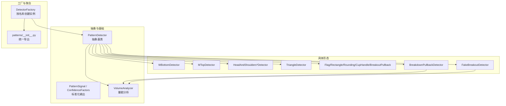
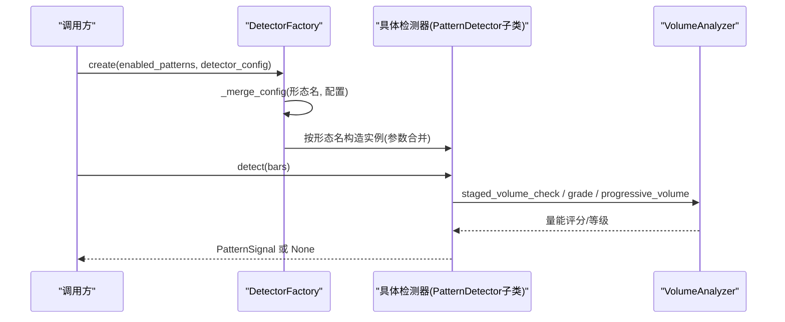
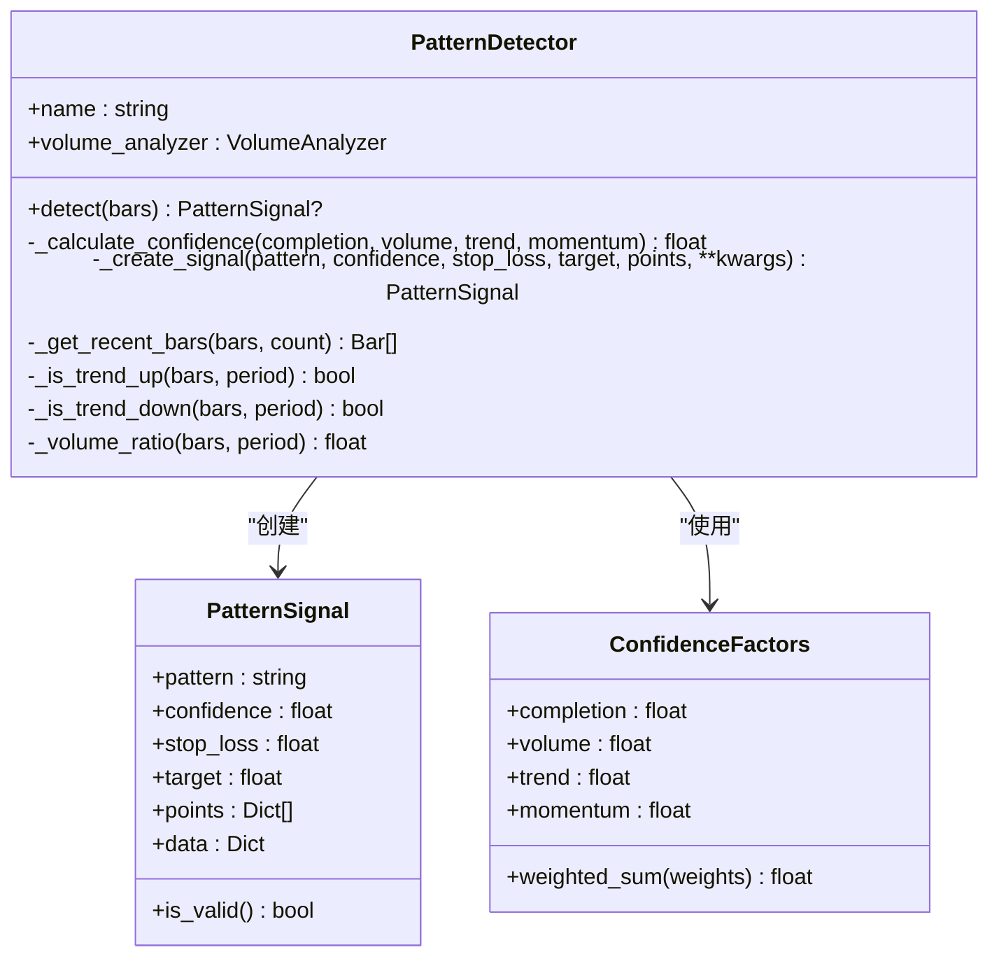
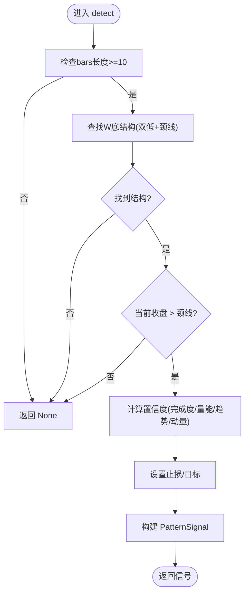
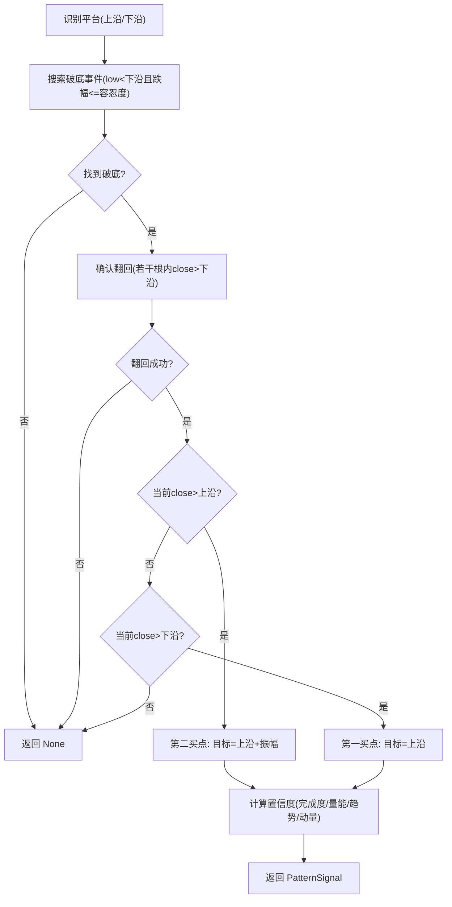
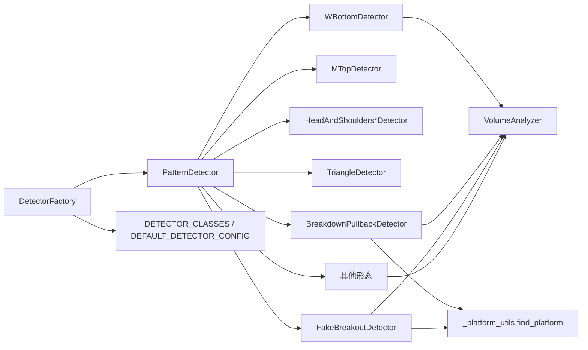

# 形态检测器框架

<cite>
**本文引用的文件**   
- [detector.py](file://src/caisen/strategy/algorithm/detector.py)
- [factory.py](file://src/caisen/strategy/algorithm/caisen_components/factory.py)
- [patterns/__init__.py](file://src/caisen/strategy/algorithm/patterns/__init__.py)
- [w_bottom.py](file://src/caisen/strategy/algorithm/patterns/w_bottom.py)
- [m_top.py](file://src/caisen/strategy/algorithm/patterns/m_top.py)
- [head_shoulders.py](file://src/caisen/strategy/algorithm/patterns/head_shoulders.py)
- [triangle.py](file://src/caisen/strategy/algorithm/patterns/triangle.py)
- [other.py](file://src/caisen/strategy/algorithm/patterns/other.py)
- [breakdown_pullback.py](file://src/caisen/strategy/algorithm/patterns/breakdown_pullback.py)
- [fake_breakout.py](file://src/caisen/strategy/algorithm/patterns/fake_breakout.py)
- [_platform_utils.py](file://src/caisen/strategy/algorithm/patterns/_platform_utils.py)
- [volume_analyzer.py](file://src/caisen/strategy/algorithm/caisen_components/volume_analyzer.py)
</cite>

## 目录
1. [简介](#简介)
2. [项目结构](#项目结构)
3. [核心组件](#核心组件)
4. [架构总览](#架构总览)
5. [详细组件分析](#详细组件分析)
6. [依赖关系分析](#依赖关系分析)
7. [性能与优化](#性能与优化)
8. [故障排查指南](#故障排查指南)
9. [结论](#结论)
10. [附录：开发指南与配置调优](#附录开发指南与配置调优)

## 简介
本文件面向 Caisen 量化回测系统中的“形态检测器框架”，系统性阐述以下要点：
- 检测器抽象基类的设计模式与接口规范（纯函数式 detect、无内部状态）
- 生命周期管理、参数验证机制与结果标准化输出格式
- 检测器工厂模式的实现原理，支持动态加载与注册自定义形态检测器的扩展机制
- 形态检测通用流程：数据预处理、特征提取、形态匹配、确认条件验证等
- 检测器开发最佳实践、性能优化技巧与调试方法
- 检测器配置管理与参数调优策略

## 项目结构
形态检测器相关代码集中在 strategy/algorithm 下，采用“基类 + 具体形态 + 工厂”的分层组织方式：
- 抽象基类与信号模型：detector.py
- 具体形态实现：patterns/*
- 检测器工厂：caisen_components/factory.py
- 量能分析工具：caisen_components/volume_analyzer.py
- 平台识别工具：patterns/_platform_utils.py

图示来源
- [detector.py:80-244](file://src/caisen/strategy/algorithm/detector.py#L80-L244)
- [factory.py:54-237](file://src/caisen/strategy/algorithm/caisen_components/factory.py#L54-L237)
- [patterns/__init__.py:1-27](file://src/caisen/strategy/algorithm/patterns/__init__.py#L1-L27)
- [w_bottom.py:11-285](file://src/caisen/strategy/algorithm/patterns/w_bottom.py#L11-L285)
- [m_top.py:11-227](file://src/caisen/strategy/algorithm/patterns/m_top.py#L11-L227)
- [head_shoulders.py:11-323](file://src/caisen/strategy/algorithm/patterns/head_shoulders.py#L11-L323)
- [triangle.py:11-239](file://src/caisen/strategy/algorithm/patterns/triangle.py#L11-L239)
- [other.py:11-576](file://src/caisen/strategy/algorithm/patterns/other.py#L11-L576)
- [breakdown_pullback.py:17-259](file://src/caisen/strategy/algorithm/patterns/breakdown_pullback.py#L17-L259)
- [fake_breakout.py:299-511](file://src/caisen/strategy/algorithm/patterns/fake_breakout.py#L299-L511)

章节来源
- [detector.py:80-244](file://src/caisen/strategy/algorithm/detector.py#L80-L244)
- [factory.py:54-237](file://src/caisen/strategy/algorithm/caisen_components/factory.py#L54-L237)
- [patterns/__init__.py:1-27](file://src/caisen/strategy/algorithm/patterns/__init__.py#L1-L27)

## 核心组件
- 抽象基类 PatternDetector
  - 纯函数接口：detect(bars) -> Optional[PatternSignal]
  - 无内部交易状态，可重复调用，便于并行测试与回测
  - 内置置信度计算辅助：_calculate_confidence
  - 信号构造辅助：_create_signal
  - 趋势与量比辅助：_is_trend_up/down、_volume_ratio
  - 最近K线切片：_get_recent_bars
- 标准化输出 PatternSignal
  - 字段：pattern、confidence、stop_loss、target、points、data
  - is_valid：confidence>0 且 stop_loss>0
- 置信度因子 ConfidenceFactors
  - 四因子：completion、volume、trend、momentum
  - weighted_sum：默认权重 completion=0.4, volume=0.3, trend=0.2, momentum=0.1
- 检测器工厂 DetectorFactory
  - DETECTOR_CLASSES：名称到类的映射
  - DEFAULT_DETECTOR_CONFIG：各形态默认参数
  - create：根据 enabled_patterns 与 detector_config 合并并实例化
  - _merge_config：默认配置与传入配置合并
  - _create_detector：按形态名选择构造参数

章节来源
- [detector.py:18-181](file://src/caisen/strategy/algorithm/detector.py#L18-L181)
- [detector.py:125-244](file://src/caisen/strategy/algorithm/detector.py#L125-L244)
- [factory.py:22-137](file://src/caisen/strategy/algorithm/caisen_components/factory.py#L22-L137)
- [factory.py:139-237](file://src/caisen/strategy/algorithm/caisen_components/factory.py#L139-L237)

## 架构总览
下图展示从工厂创建到具体检测器执行 detect 的端到端流程。

图示来源
- [factory.py:81-111](file://src/caisen/strategy/algorithm/caisen_components/factory.py#L81-L111)
- [factory.py:113-137](file://src/caisen/strategy/algorithm/caisen_components/factory.py#L113-L137)
- [factory.py:139-237](file://src/caisen/strategy/algorithm/caisen_components/factory.py#L139-L237)
- [detector.py:125-181](file://src/caisen/strategy/algorithm/detector.py#L125-L181)
- [w_bottom.py:243-285](file://src/caisen/strategy/algorithm/patterns/w_bottom.py#L243-L285)
- [breakdown_pullback.py:218-259](file://src/caisen/strategy/algorithm/patterns/breakdown_pullback.py#L218-L259)
- [other.py:156-179](file://src/caisen/strategy/algorithm/patterns/other.py#L156-L179)

## 详细组件分析

### 抽象基类与信号模型
- 设计要点
  - 纯函数式 detect：输入 bars，输出 PatternSignal 或 None；不维护跨调用状态
  - 统一的置信度计算入口：_calculate_confidence，封装四因子加权
  - 统一的信号构造入口：_create_signal，保证输出字段一致
  - 通用工具：趋势判断、量比计算、最近K线切片
- 复杂度
  - detect 时间复杂度 O(n)，n 为 bars 长度（多数形态仅扫描固定窗口）
  - 空间复杂度 O(1)~O(k)，k 为局部窗口大小
- 错误处理
  - 输入不足时直接返回 None
  - 除零保护（如历史均量为0时返回1.0）

图示来源
- [detector.py:80-181](file://src/caisen/strategy/algorithm/detector.py#L80-L181)
- [detector.py:18-78](file://src/caisen/strategy/algorithm/detector.py#L18-L78)

章节来源
- [detector.py:80-244](file://src/caisen/strategy/algorithm/detector.py#L80-L244)

### W底形态检测器
- 形态逻辑
  - 在近期窗口内寻找两个相近低点，中间高点作为颈线
  - 当前收盘价突破颈线即触发信号
- 置信度
  - 完成度：两低点对称性
  - 成交量：三阶段量能（形成期缩量、突破期放量、确认期）
  - 趋势：上升趋势共振加分
  - 动量：突破力度
- 止损/目标
  - 止损：双底最低点 × 系数
  - 目标：颈线振幅或最小盈利目标取大值

图示来源
- [w_bottom.py:49-81](file://src/caisen/strategy/algorithm/patterns/w_bottom.py#L49-L81)
- [w_bottom.py:191-241](file://src/caisen/strategy/algorithm/patterns/w_bottom.py#L191-L241)
- [w_bottom.py:243-285](file://src/caisen/strategy/algorithm/patterns/w_bottom.py#L243-L285)

章节来源
- [w_bottom.py:11-285](file://src/caisen/strategy/algorithm/patterns/w_bottom.py#L11-L285)

### M头形态检测器
- 形态逻辑
  - 在近期窗口内寻找两个相近高点，中间低点作为颈线
  - 当前收盘价跌破颈线即触发空头信号
- 置信度
  - 完成度：两高点对称性
  - 成交量：跌破放量加分
  - 趋势：下降趋势共振加分
  - 动量：跌破力度
- 止损/目标
  - 止损：最高点 × 系数（高于最高）
  - 目标：颈线振幅向下投影

章节来源
- [m_top.py:11-227](file://src/caisen/strategy/algorithm/patterns/m_top.py#L11-L227)

### 头肩顶/底形态检测器
- 形态逻辑
  - 头部为三个极值中最低/最高的点，左右肩高度相近
  - 颈线由肩部之间的高/低点确定
  - 底：突破颈线做多；顶：跌破颈线做空
- 置信度
  - 完成度：两肩对称性
  - 成交量：突破/跌破放量加分
  - 趋势：与方向一致的长期趋势共振加分
  - 动量：突破/跌破力度

章节来源
- [head_shoulders.py:11-323](file://src/caisen/strategy/algorithm/patterns/head_shoulders.py#L11-L323)

### 三角整理形态检测器
- 形态逻辑
  - 至少3个递减高点与3个递增低点，上下趋势线收敛
  - 向上突破上轨做多，向下跌破下轨做空
- 置信度
  - 完成度：收敛紧密程度
  - 成交量：突破放量加分
  - 趋势：与突破方向一致的长期趋势共振加分
  - 动量：突破力度

章节来源
- [triangle.py:11-239](file://src/caisen/strategy/algorithm/patterns/triangle.py#L11-L239)

### 旗形/矩形/圆弧底/杯柄/过前高等形态
- 旗形 FlagDetector
  - 先找旗杆（大幅涨跌），再找旗面（窄幅整理），突破方向延续原趋势
  - 量能确认：突破放量提升置信度
- 矩形 RectangleDetector
  - 水平区间整理，突破上沿做多，跌破下沿做空
  - 量能确认：突破放量提升置信度
- 圆弧底 RoundingBottomDetector
  - 缓慢筑底后上涨，突破颈线做多
  - 量能确认：后半段量能逐步递增更佳
- 杯柄 CupHandleDetector
  - 杯身圆弧形，柄部短暂回调，突破柄部高点做多
  - 量能确认：突破放量提升置信度
- 过前高 BreakoutPullbackDetector
  - 突破前期高点后回踩再涨做多
  - 量能确认：突破放量提升置信度

章节来源
- [other.py:11-576](file://src/caisen/strategy/algorithm/patterns/other.py#L11-L576)

### 破底翻检测器
- 形态逻辑
  - 识别整理平台（上沿/下沿）
  - 破底事件：low 跌破下沿但跌幅不超过容忍度
  - 翻回确认：若干根K线内 close 回到下沿之上
  - 买点类型：站回下沿（第一买点）、突破上沿（第二买点）
- 置信度
  - 完成度：破底深度越浅、翻回越快越高
  - 分阶段量能：拉回缩量、突破放量
  - 趋势：前期下跌趋势共振更强
  - 动量：翻回力度

图示来源
- [breakdown_pullback.py:47-128](file://src/caisen/strategy/algorithm/patterns/breakdown_pullback.py#L47-L128)
- [breakdown_pullback.py:177-216](file://src/caisen/strategy/algorithm/patterns/breakdown_pullback.py#L177-L216)
- [breakdown_pullback.py:218-259](file://src/caisen/strategy/algorithm/patterns/breakdown_pullback.py#L218-L259)

章节来源
- [breakdown_pullback.py:17-259](file://src/caisen/strategy/algorithm/patterns/breakdown_pullback.py#L17-L259)

### 假突破检测器
- 形态逻辑
  - 识别整理平台（上沿/下沿）
  - 假突破事件：high 突破上沿但幅度不超过容忍度
  - 跌回确认：若干根K线内 close 回到上沿之下
  - 信号强度：跌回平台内 vs 跌破平台下沿
- 五大特征评估 FakeBreakoutFeatures
  - 量能不足、快速回返颈线、回到形态内部、跳空缺口未填补、量价背离
  - 加权合成 fake_probability，用于置信度加成
- 置信度
  - 完成度：假突破幅度越浅越好，跌破下沿更高
  - 量能：假突破放量（诱多出货）
  - 趋势：突破前上涨趋势末期共振更强
  - 动量：跌回力度

章节来源
- [fake_breakout.py:18-297](file://src/caisen/strategy/algorithm/patterns/fake_breakout.py#L18-L297)
- [fake_breakout.py:299-511](file://src/caisen/strategy/algorithm/patterns/fake_breakout.py#L299-L511)

## 依赖关系分析
- 模块耦合
  - 所有具体形态均继承自 PatternDetector，复用置信度与工具方法
  - 部分形态通过 patterns/_platform_utils.find_platform 识别平台
  - 量能分析统一委托给 VolumeAnalyzer
- 外部依赖
  - Bar 类型来自 core.bar（类型提示引用）
- 潜在循环依赖
  - 通过 TYPE_CHECKING 避免运行时导入循环
- 扩展点
  - 新增形态只需：
    1) 在 patterns/* 中实现 PatternDetector 子类
    2) 在 factory.DETECTOR_CLASSES 与 DEFAULT_DETECTOR_CONFIG 中注册
    3) 在 patterns/__init__.py 中导出

图示来源
- [detector.py:80-244](file://src/caisen/strategy/algorithm/detector.py#L80-L244)
- [factory.py:22-137](file://src/caisen/strategy/algorithm/caisen_components/factory.py#L22-L137)
- [breakdown_pullback.py:11-12](file://src/caisen/strategy/algorithm/patterns/breakdown_pullback.py#L11-L12)
- [fake_breakout.py:11-12](file://src/caisen/strategy/algorithm/patterns/fake_breakout.py#L11-L12)

章节来源
- [factory.py:22-137](file://src/caisen/strategy/algorithm/caisen_components/factory.py#L22-L137)
- [patterns/__init__.py:1-27](file://src/caisen/strategy/algorithm/patterns/__init__.py#L1-L27)

## 性能与优化
- 时间复杂度
  - 大多数形态仅扫描固定窗口（如最近10~30根），整体 O(n) 线性
  - 三角形态需排序与斜率计算，常数级开销
- 内存占用
  - 仅保留必要局部切片，避免全量拷贝
- 优化建议
  - 批量检测时复用 VolumeAnalyzer 实例，减少重复初始化
  - 对长序列进行滑动窗口增量更新（若后续扩展）
  - 将耗时指标（如均线、波动率）缓存至 bars 元数据中，避免重复计算
  - 合理设置 min_bars 与 lookback_period，避免不必要的回溯

## 故障排查指南
- 常见问题
  - 输入 bars 数量不足：各形态 detect 开头有长度校验，不足直接返回 None
  - 历史均量为0：量比计算包含除零保护，返回1.0
  - 形态未注册：工厂无法识别名称，将被跳过
- 定位步骤
  - 打印 PatternSignal.is_valid 与 confidence、stop_loss、target 是否合理
  - 检查 VolumeAnalyzer 的量能等级与分阶段评分是否符合预期
  - 核对工厂配置合并顺序：默认配置 → 传入配置覆盖
- 日志与断点
  - 在 detect 入口与关键分支处添加断点，观察 intermediate 变量（如 neckline、amplitude）
  - 使用 _create_signal 的 data 字段记录诊断信息（如 break_pct、volume_ratio）

章节来源
- [detector.py:182-244](file://src/caisen/strategy/algorithm/detector.py#L182-L244)
- [factory.py:98-111](file://src/caisen/strategy/algorithm/caisen_components/factory.py#L98-L111)

## 结论
该形态检测器框架以纯函数式抽象为核心，提供统一信号输出与置信度计算，配合工厂模式实现可扩展的形态注册与参数合并。各形态遵循一致的检测流程与风控参数约定，便于集成到回测引擎与实盘系统中。

## 附录：开发指南与配置调优

### 检测器开发最佳实践
- 继承基类
  - 实现 detect(bars) -> Optional[PatternSignal]
  - 使用 _calculate_confidence 与 _create_signal 保证一致性
- 参数设计
  - 使用合理的默认值，并通过工厂 DEFAULT_DETECTOR_CONFIG 暴露
  - 将易变参数（如容差、周期）置于 __init__，保持 detect 无副作用
- 结果标准化
  - 确保 stop_loss 与 target 非零且符合方向逻辑
  - points 包含可视化关键点（timestamp、price、label）
  - data 携带诊断信息（如 neckline、amplitude、direction）

章节来源
- [detector.py:125-181](file://src/caisen/strategy/algorithm/detector.py#L125-L181)
- [w_bottom.py:135-189](file://src/caisen/strategy/algorithm/patterns/w_bottom.py#L135-L189)

### 性能优化技巧
- 控制扫描窗口：尽量使用 _get_recent_bars 限制范围
- 复用工具：共享 VolumeAnalyzer 实例，避免重复创建
- 提前剪枝：在 detect 开头做快速失败（长度、阈值）
- 避免重复计算：将常用指标缓存于 bars 元数据或外部缓存

章节来源
- [detector.py:182-244](file://src/caisen/strategy/algorithm/detector.py#L182-L244)

### 调试方法
- 单测驱动：针对典型形态构造 bars 样本，断言 PatternSignal 字段
- 可视化辅助：利用 points 列表在图表中标注关键点
- 日志增强：在 _calculate_*_confidence 中记录四因子得分

章节来源
- [w_bottom.py:191-241](file://src/caisen/strategy/algorithm/patterns/w_bottom.py#L191-L241)
- [m_top.py:179-226](file://src/caisen/strategy/algorithm/patterns/m_top.py#L179-L226)

### 配置管理与参数调优策略
- 工厂配置合并
  - 默认配置：DEFAULT_DETECTOR_CONFIG
  - 传入配置：detector_config[pattern_name] 覆盖默认
- 关键参数
  - tolerance/min_neckline_height：控制形态严格度
  - stop_loss_factor/min_profit_pct：风控与目标收益
  - lookback_period/min_bars/max_amplitude：窗口与振幅约束
- 调优建议
  - 先用保守参数（较大窗口、较严容差）降低误报
  - 逐步放宽参数，结合历史回测统计调整
  - 针对不同品种/周期分别调参，避免一刀切

章节来源
- [factory.py:38-51](file://src/caisen/strategy/algorithm/caisen_components/factory.py#L38-L51)
- [factory.py:113-137](file://src/caisen/strategy/algorithm/caisen_components/factory.py#L113-L137)