# 形态识别系统

<cite>
**本文引用的文件**   
- [detector.py](file://src/caisen/strategy/algorithm/detector.py)
- [caisen_config.py](file://src/caisen/strategy/algorithm/caisen_config.py)
- [factory.py](file://src/caisen/strategy/algorithm/caisen_components/factory.py)
- [volume_analyzer.py](file://src/caisen/strategy/algorithm/caisen_components/volume_analyzer.py)
- [aggregator.py](file://src/caisen/strategy/algorithm/caisen_components/aggregator.py)
- [position_manager.py](file://src/caisen/strategy/algorithm/caisen_components/position_manager.py)
- [patterns/__init__.py](file://src/caisen/strategy/algorithm/patterns/__init__.py)
- [w_bottom.py](file://src/caisen/strategy/algorithm/patterns/w_bottom.py)
- [head_shoulders.py](file://src/caisen/strategy/algorithm/patterns/head_shoulders.py)
- [triangle.py](file://src/caisen/strategy/algorithm/patterns/triangle.py)
- [other.py](file://src/caisen/strategy/algorithm/patterns/other.py)
- [breakdown_pullback.py](file://src/caisen/strategy/algorithm/patterns/breakdown_pullback.py)
- [fake_breakout.py](file://src/caisen/strategy/algorithm/patterns/fake_breakout.py)
- [cai_sen.py](file://src/caisen/strategy/algorithm/cai_sen.py)
</cite>

## 目录
1. [引言](#引言)
2. [项目结构](#项目结构)
3. [核心组件](#核心组件)
4. [架构总览](#架构总览)
5. [详细组件分析](#详细组件分析)
6. [依赖关系分析](#依赖关系分析)
7. [性能与复杂度](#性能与复杂度)
8. [可视化与前端渲染](#可视化与前端渲染)
9. [组合策略与多时间框架](#组合策略与多时间框架)
10. [参数配置与阈值调优指南](#参数配置与阈值调优指南)
11. [故障排查](#故障排查)
12. [结论](#结论)

## 引言
本文件面向 Caisen 量化回测系统中的“蔡森十二形态识别”模块，系统性阐述其理论基础、检测逻辑、插件化架构、置信度模型、量能确认、风控与可视化标注机制，并提供参数调优与实战评估建议。该体系以纯函数式检测器为核心，通过工厂模式动态装配，结合信号聚合与仓位管理，形成可插拔、可扩展的形态识别与交易决策闭环。

## 项目结构
形态识别子系统位于 strategy.algorithm 下，围绕以下层次组织：
- 抽象层：PatternDetector 基类与 PatternSignal/ConfidenceFactors 数据模型
- 组件层：DetectorFactory（检测器工厂）、SignalAggregator（信号聚合）、PositionManager（仓位管理）、VolumeAnalyzer（量能分析）
- 形态实现层：各具体形态检测器（W底、头肩顶/底、三角、旗形、矩形、圆弧底、杯柄、过前高、破底翻、假突破等）
- 策略编排层：CaiSenStrategy 负责流程编排与决策

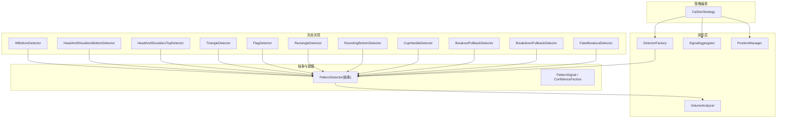

图表来源
- [cai_sen.py:36-245](file://src/caisen/strategy/algorithm/cai_sen.py#L36-L245)
- [factory.py:54-237](file://src/caisen/strategy/algorithm/caisen_components/factory.py#L54-L237)
- [aggregator.py:42-177](file://src/caisen/strategy/algorithm/caisen_components/aggregator.py#L42-L177)
- [position_manager.py:24-170](file://src/caisen/strategy/algorithm/caisen_components/position_manager.py#L24-L170)
- [detector.py:80-244](file://src/caisen/strategy/algorithm/detector.py#L80-L244)
- [volume_analyzer.py:15-287](file://src/caisen/strategy/algorithm/caisen_components/volume_analyzer.py#L15-L287)
- [patterns/__init__.py:1-27](file://src/caisen/strategy/algorithm/patterns/__init__.py#L1-L27)

章节来源
- [cai_sen.py:36-245](file://src/caisen/strategy/algorithm/cai_sen.py#L36-L245)
- [patterns/__init__.py:1-27](file://src/caisen/strategy/algorithm/patterns/__init__.py#L1-L27)

## 核心组件
- 抽象接口与数据模型
  - PatternDetector：定义 detect(bars) 纯函数接口，提供趋势判断、量比计算、置信度加权等通用能力
  - PatternSignal：封装形态名称、置信度、止损/目标价、关键点 points 及扩展 data
  - ConfidenceFactors：完成度、成交量、趋势共振、动量四因子加权求和
- 量能分析器 VolumeAnalyzer
  - 分阶段量能检查（形成期缩量、突破期放量、确认期递增/持续）
  - 突破等级评估（弱/正常/强）
  - 量价背离与渐进量能检测
- 检测器工厂 DetectorFactory
  - 根据 enabled_patterns 与 detector_config 合并默认配置创建具体检测器实例
- 信号聚合 SignalAggregator
  - 过滤无效信号、按权重加权评分、选择最佳信号
- 仓位管理 PositionManager
  - 开仓/平仓、止损/止盈触发、回调通知、持仓期间假突破风险预警

章节来源
- [detector.py:18-180](file://src/caisen/strategy/algorithm/detector.py#L18-L180)
- [detector.py:125-244](file://src/caisen/strategy/algorithm/detector.py#L125-L244)
- [volume_analyzer.py:15-157](file://src/caisen/strategy/algorithm/caisen_components/volume_analyzer.py#L15-L157)
- [volume_analyzer.py:158-287](file://src/caisen/strategy/algorithm/caisen_components/volume_analyzer.py#L158-L287)
- [factory.py:54-237](file://src/caisen/strategy/algorithm/caisen_components/factory.py#L54-L237)
- [aggregator.py:42-177](file://src/caisen/strategy/algorithm/caisen_components/aggregator.py#L42-L177)
- [position_manager.py:24-170](file://src/caisen/strategy/algorithm/caisen_components/position_manager.py#L24-L170)

## 架构总览
CaiSenStrategy 在每根 K 线执行如下流程：
- 更新 bars 历史
- 并行调用各检测器 detect(bars) 获取信号
- 使用 SignalAggregator 进行加权聚合，选出最佳信号
- 若最佳信号置信度超过阈值且无持仓，则开仓并生成可视化标注
- 逐根 K 线检查止损/止盈，必要时平仓

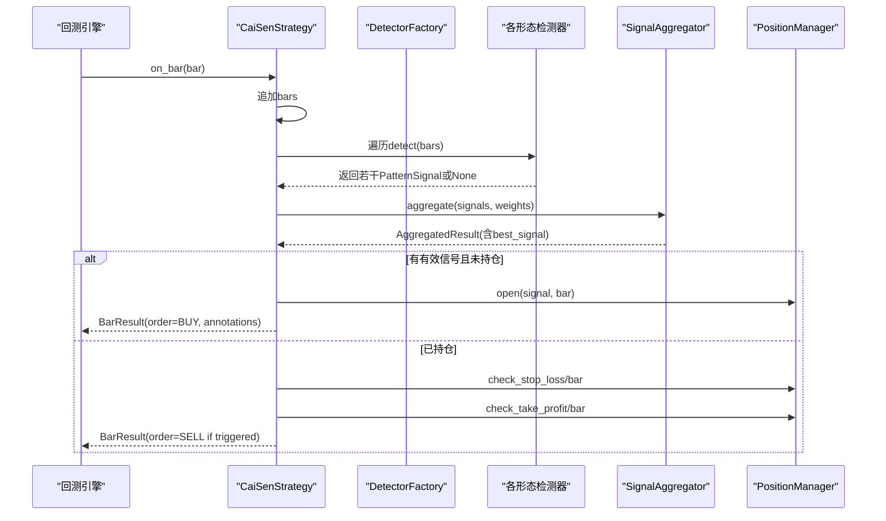

图表来源
- [cai_sen.py:178-221](file://src/caisen/strategy/algorithm/cai_sen.py#L178-L221)
- [aggregator.py:59-110](file://src/caisen/strategy/algorithm/caisen_components/aggregator.py#L59-L110)
- [position_manager.py:89-147](file://src/caisen/strategy/algorithm/caisen_components/position_manager.py#L89-L147)

## 详细组件分析

### 抽象与通用能力（PatternDetector）
- 纯函数接口：detect(bars) 无内部状态，便于测试与并行
- 通用工具：
  - _is_trend_up/_is_trend_down：基于近期收盘价比较的趋势判定
  - _volume_ratio：近N日均量对比历史均量的放大倍数
  - _calculate_confidence：四因子加权求和，输出0~1置信度
  - _create_signal：统一构造 PatternSignal，包含 points 用于可视化

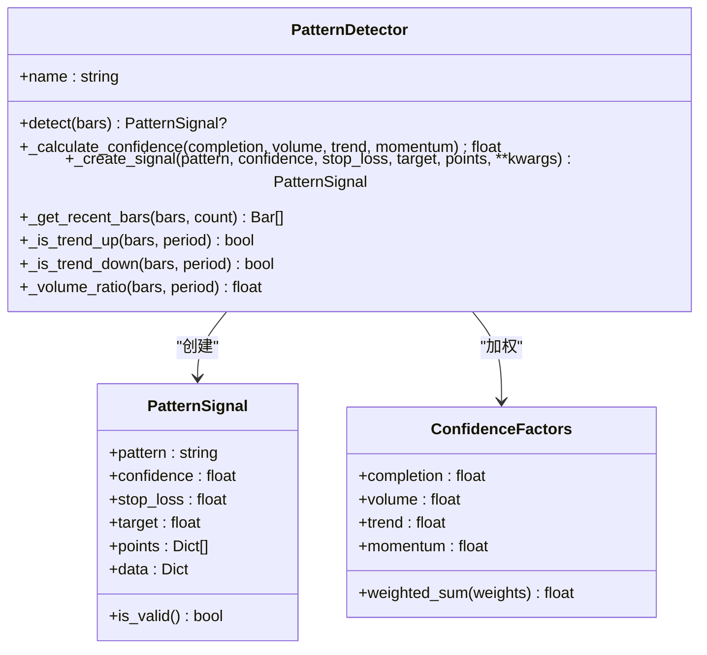

图表来源
- [detector.py:80-180](file://src/caisen/strategy/algorithm/detector.py#L80-L180)
- [detector.py:18-78](file://src/caisen/strategy/algorithm/detector.py#L18-L78)

章节来源
- [detector.py:80-244](file://src/caisen/strategy/algorithm/detector.py#L80-L244)

### 量能分析器（VolumeAnalyzer）
- 分阶段量能检查：支持 shrink/expand/progressive 三种预期
- 突破等级：weak/normal/strong 三档
- 量价背离：价格创新高但量能未跟上时提示风险
- 渐进量能：关键时间点成交量逐步增大

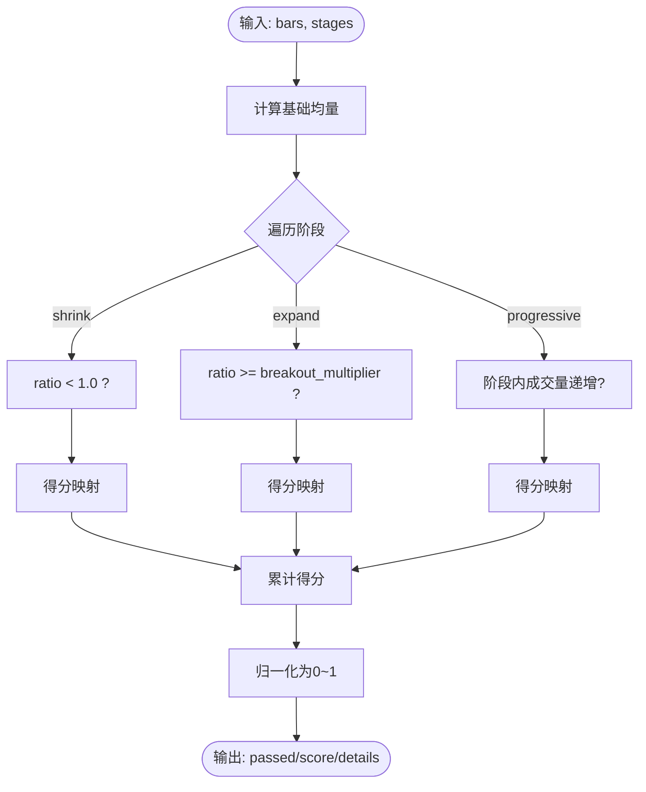

图表来源
- [volume_analyzer.py:55-125](file://src/caisen/strategy/algorithm/caisen_components/volume_analyzer.py#L55-L125)
- [volume_analyzer.py:225-287](file://src/caisen/strategy/algorithm/caisen_components/volume_analyzer.py#L225-L287)

章节来源
- [volume_analyzer.py:15-287](file://src/caisen/strategy/algorithm/caisen_components/volume_analyzer.py#L15-L287)

### 检测器工厂（DetectorFactory）
- 维护 DETECTOR_CLASSES 映射与 DEFAULT_DETECTOR_CONFIG 默认参数
- create(enabled_patterns, detector_config) 合并配置并实例化具体检测器
- 支持覆盖默认止损系数与最小盈利目标

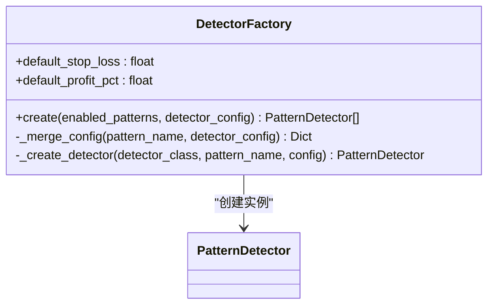

图表来源
- [factory.py:54-237](file://src/caisen/strategy/algorithm/caisen_components/factory.py#L54-L237)

章节来源
- [factory.py:54-237](file://src/caisen/strategy/algorithm/caisen_components/factory.py#L54-L237)

### 信号聚合（SignalAggregator）
- 过滤 None 与低于阈值的信号
- 按 weights 加权累加 total_score
- 选择 best_signal（最高置信度）

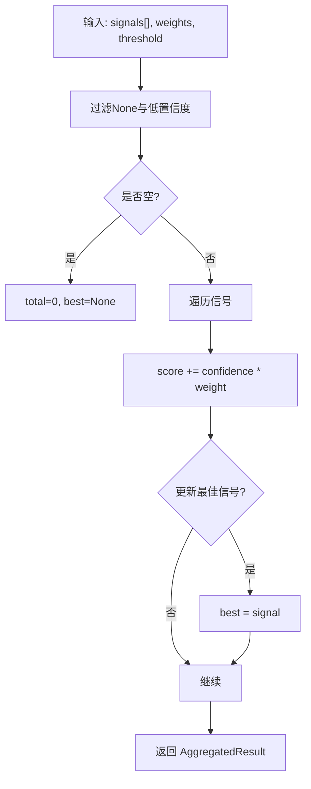

图表来源
- [aggregator.py:59-110](file://src/caisen/strategy/algorithm/caisen_components/aggregator.py#L59-L110)

章节来源
- [aggregator.py:42-177](file://src/caisen/strategy/algorithm/caisen_components/aggregator.py#L42-L177)

### 仓位管理（PositionManager）
- 开仓记录 entry_price/stop_loss/target/entry_bar
- 止损：bar.low < stop_loss 触发
- 止盈：bar.high >= target 触发
- 回调：on_stop_loss/on_take_profit/on_reset
- 假突破预警：FakeBreakoutWarning 在持仓期间评估风险

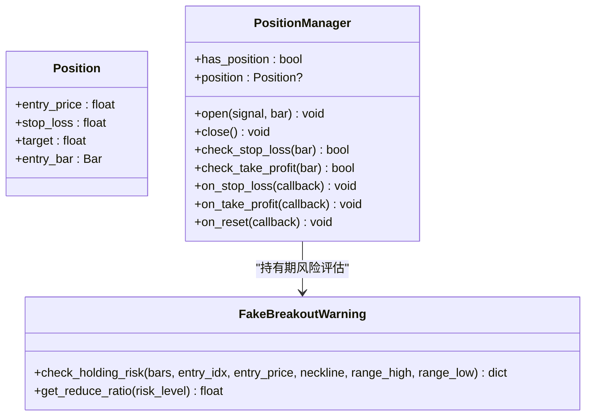

图表来源
- [position_manager.py:15-170](file://src/caisen/strategy/algorithm/caisen_components/position_manager.py#L15-L170)
- [position_manager.py:172-285](file://src/caisen/strategy/algorithm/caisen_components/position_manager.py#L172-L285)

章节来源
- [position_manager.py:24-285](file://src/caisen/strategy/algorithm/caisen_components/position_manager.py#L24-L285)

### 形态检测器详解

#### W底（WBottomDetector）
- 条件：双底容差、颈线高度、突破颈线确认
- 置信度：完成度（双底对称性）、三阶段量能、趋势共振、动量
- 止损/目标：振幅度量与固定比例目标

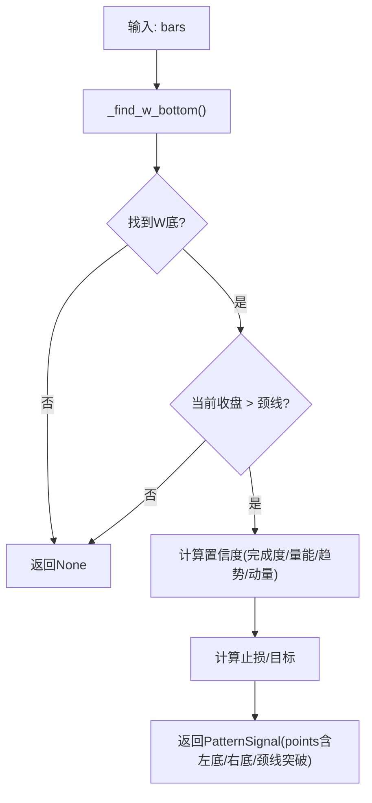

图表来源
- [w_bottom.py:49-189](file://src/caisen/strategy/algorithm/patterns/w_bottom.py#L49-L189)
- [w_bottom.py:191-285](file://src/caisen/strategy/algorithm/patterns/w_bottom.py#L191-L285)

章节来源
- [w_bottom.py:1-285](file://src/caisen/strategy/algorithm/patterns/w_bottom.py#L1-L285)

#### 头肩顶/底（HeadAndShouldersBottomDetector / HeadAndShouldersTopDetector）
- 条件：头部最低/最高，两肩高度相近，颈线突破/跌破确认
- 置信度：两肩对称性、量能、趋势共振、动量
- 止损/目标：以颈线与头部距离为振幅

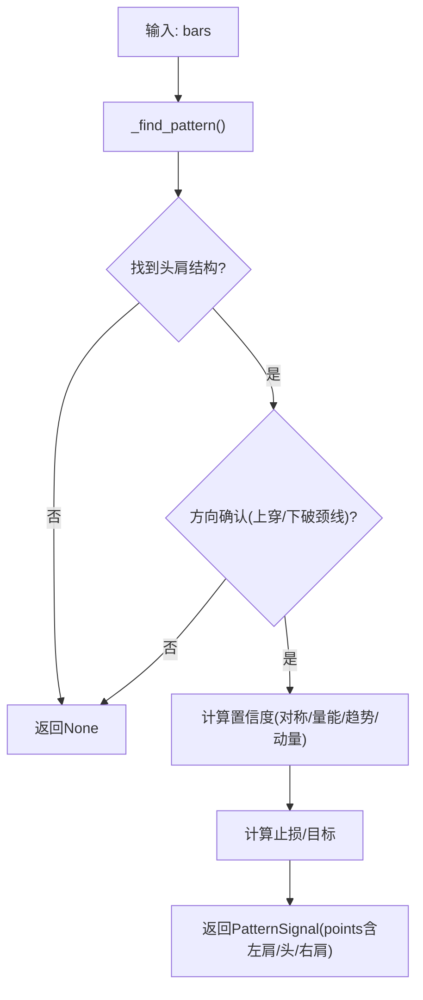

图表来源
- [head_shoulders.py:43-170](file://src/caisen/strategy/algorithm/patterns/head_shoulders.py#L43-L170)
- [head_shoulders.py:199-323](file://src/caisen/strategy/algorithm/patterns/head_shoulders.py#L199-L323)

章节来源
- [head_shoulders.py:1-323](file://src/caisen/strategy/algorithm/patterns/head_shoulders.py#L1-L323)

#### 三角形（TriangleDetector）
- 条件：至少3个高点递减、3个低点递增，上下轨收敛
- 方向：向上突破上轨做多；向下跌破下轨做空
- 置信度：收敛紧密度、量能、趋势共振、动量

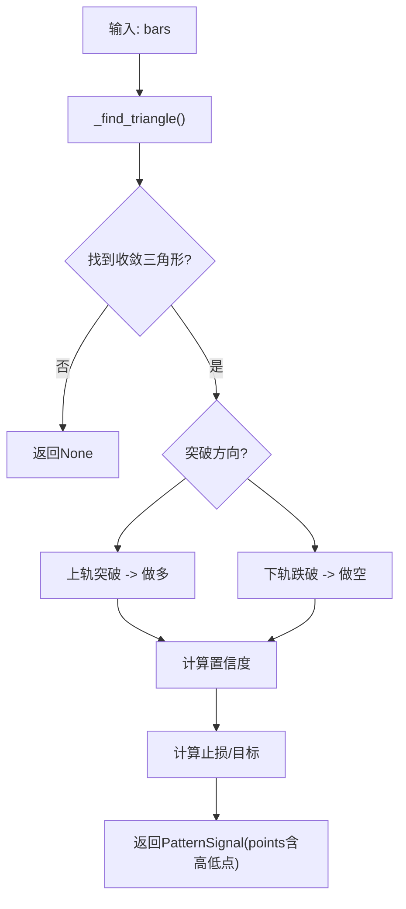

图表来源
- [triangle.py:39-193](file://src/caisen/strategy/algorithm/patterns/triangle.py#L39-L193)
- [triangle.py:195-239](file://src/caisen/strategy/algorithm/patterns/triangle.py#L195-L239)

章节来源
- [triangle.py:1-239](file://src/caisen/strategy/algorithm/patterns/triangle.py#L1-L239)

#### 旗形/矩形/圆弧底/杯柄/过前高（Flag/Rectangle/RoundingBottom/CupHandle/BreakoutPullback）
- 旗形：寻找旗杆与旗面，突破旗面上沿/下沿确认
- 矩形：水平区间波动，突破上沿/下沿确认
- 圆弧底：圆弧筑底后向上突破颈线，后半段量能递增更佳
- 杯柄：杯身+柄部，突破柄部高点确认
- 过前高：突破历史高点后回踩再涨

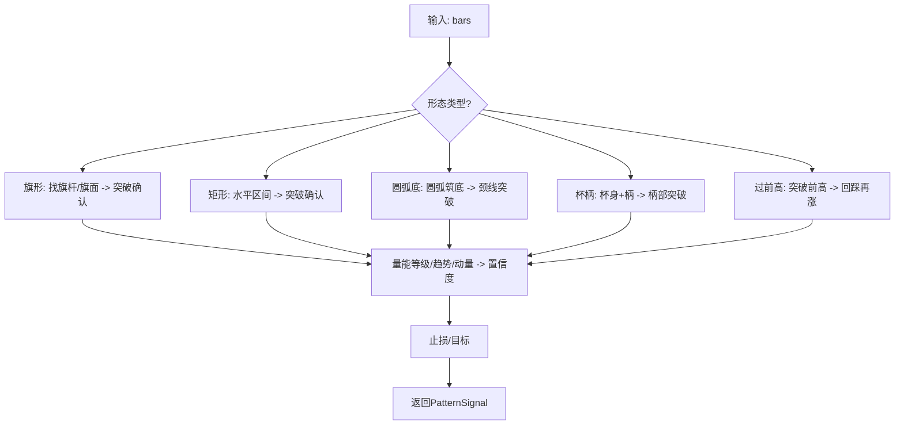

图表来源
- [other.py:11-179](file://src/caisen/strategy/algorithm/patterns/other.py#L11-L179)
- [other.py:182-291](file://src/caisen/strategy/algorithm/patterns/other.py#L182-L291)
- [other.py:293-401](file://src/caisen/strategy/algorithm/patterns/other.py#L293-L401)
- [other.py:403-507](file://src/caisen/strategy/algorithm/patterns/other.py#L403-L507)
- [other.py:509-576](file://src/caisen/strategy/algorithm/patterns/other.py#L509-L576)

章节来源
- [other.py:1-576](file://src/caisen/strategy/algorithm/patterns/other.py#L1-L576)

#### 破底翻（BreakdownPullbackDetector）
- 条件：平台整理 → 破底（跌幅有限）→ 快速站回平台下沿之上
- 买点：第一买点（站回颈线），第二买点（突破平台上沿）
- 置信度：破底深度越浅越好、拉回越快越好、量能分阶段确认、前期下跌趋势共振

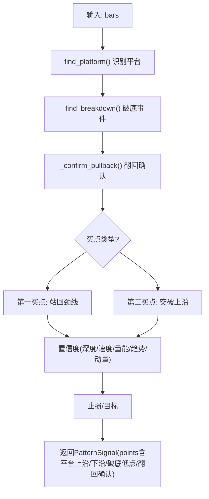

图表来源
- [breakdown_pullback.py:47-128](file://src/caisen/strategy/algorithm/patterns/breakdown_pullback.py#L47-L128)
- [breakdown_pullback.py:177-259](file://src/caisen/strategy/algorithm/patterns/breakdown_pullback.py#L177-L259)

章节来源
- [breakdown_pullback.py:1-259](file://src/caisen/strategy/algorithm/patterns/breakdown_pullback.py#L1-L259)

#### 假突破（FakeBreakoutDetector）
- 条件：平台整理 → 假突破（小幅上破）→ 跌回平台内部/下沿
- 五大特征评估：量能不足、快速回返、回到区间、缺口未补、量价背离
- 置信度：融合四因子与五大特征加权概率

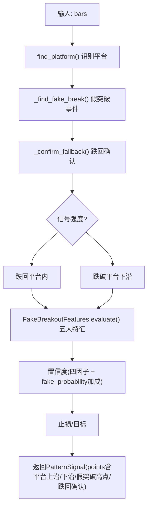

图表来源
- [fake_breakout.py:331-424](file://src/caisen/strategy/algorithm/patterns/fake_breakout.py#L331-L424)
- [fake_breakout.py:18-296](file://src/caisen/strategy/algorithm/patterns/fake_breakout.py#L18-L296)

章节来源
- [fake_breakout.py:1-511](file://src/caisen/strategy/algorithm/patterns/fake_breakout.py#L1-L511)

## 依赖关系分析
- 检测器对 VolumeAnalyzer 的依赖：多数形态在置信度中引入量能维度
- 策略对工厂与聚合器的依赖：解耦形态实现与流程编排
- 平台工具：BreakdownPullback/FakeBreakout 复用 find_platform 工具（由 _platform_utils 提供）

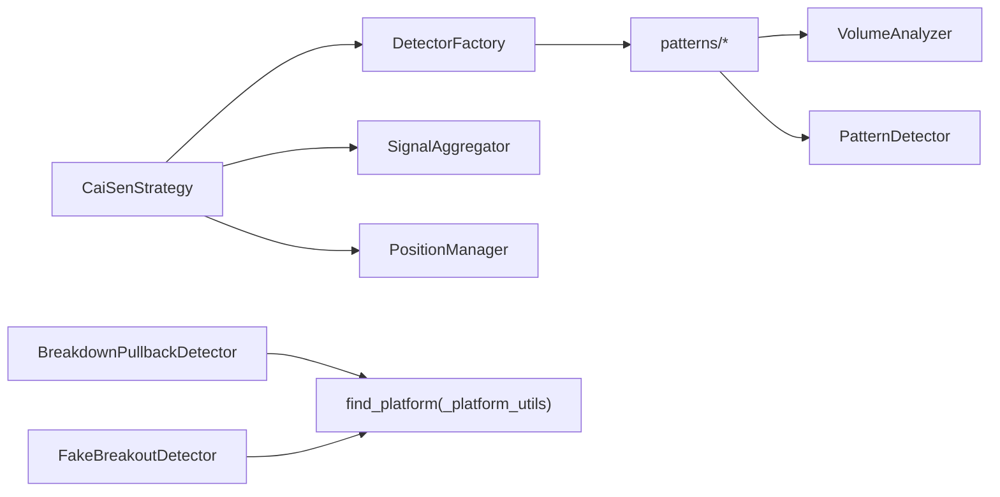

图表来源
- [cai_sen.py:36-245](file://src/caisen/strategy/algorithm/cai_sen.py#L36-L245)
- [factory.py:54-237](file://src/caisen/strategy/algorithm/caisen_components/factory.py#L54-L237)
- [volume_analyzer.py:15-287](file://src/caisen/strategy/algorithm/caisen_components/volume_analyzer.py#L15-L287)
- [breakdown_pullback.py:1-259](file://src/caisen/strategy/algorithm/patterns/breakdown_pullback.py#L1-L259)
- [fake_breakout.py:1-511](file://src/caisen/strategy/algorithm/patterns/fake_breakout.py#L1-L511)

章节来源
- [patterns/__init__.py:1-27](file://src/caisen/strategy/algorithm/patterns/__init__.py#L1-L27)

## 性能与复杂度
- 时间复杂度
  - 单根K线：每个检测器 O(N)（N为窗口长度，通常常数级如10~30）
  - 全量检测：O(M×N)，M为检测器数量
- 空间复杂度
  - 主要存储 bars 历史与少量中间变量，内存占用线性于 bars 长度
- 优化建议
  - 合理设置 min_bars 与 lookback_period，避免过长窗口
  - 对不满足最小长度的 bars 直接短路返回
  - 将频繁计算的指标（如均线、量比）缓存或增量更新

[本节为通用指导，无需源码引用]

## 可视化与前端渲染
- 后端标注
  - CaiSenStrategy._make_pattern_annotation 将 PatternSignal.points 转换为 Annotation，包含 pattern、points、confidence、stop_loss、target、label 等字段
- 前端渲染
  - 前端通过 annotation-renderer 与 chart-renderer 读取标注数据并在图表上绘制形态关键点与标签
- 关键点格式
  - points 元素包含 timestamp、price、label，用于定位与展示

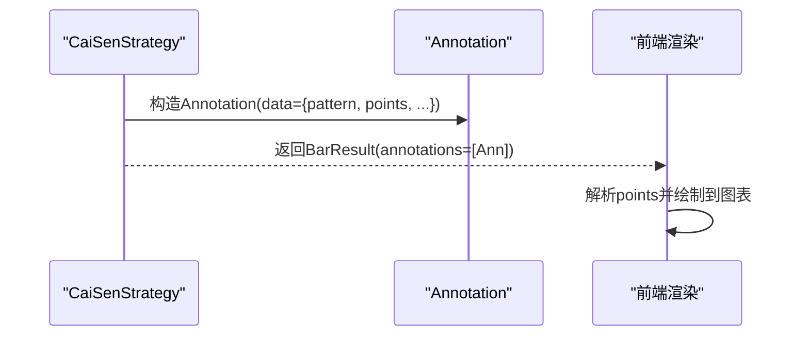

图表来源
- [cai_sen.py:223-236](file://src/caisen/strategy/algorithm/cai_sen.py#L223-L236)

章节来源
- [cai_sen.py:223-236](file://src/caisen/strategy/algorithm/cai_sen.py#L223-L236)

## 组合策略与多时间框架
- 组合策略
  - 通过 DetectorFactory 启用多种形态检测器，SignalAggregator 按权重聚合，CaiSenStrategy 依据阈值与仓位管理做出决策
- 多时间框架
  - 可在不同周期分别运行 CaiSenStrategy，得到多时间框架的信号集合，再进行跨周期加权或优先级排序（例如大周期趋势共振增强小周期信号）
- 形态组合
  - 可将多个形态信号作为独立因子，结合趋势、量能、波动率等外部因子构建更稳健的组合评分

[本节为概念性说明，无需源码引用]

## 参数配置与阈值调优指南
- 全局策略参数（示例路径）
  - 配置文件加载：CaiSenStrategy.from_config 从 YAML 读取 strategy/risk/enabled_patterns/detectors 等
  - 参考：configs/strategies/cai_sen_v2.yaml（实际路径见工程）
- 检测器默认参数（DEFAULT_DETECTOR_CONFIG）
  - w_bottom：tolerance、stop_loss_factor、min_profit_pct
  - m_top：tolerance、stop_loss_factor、min_profit_pct
  - head_and_shoulders：shoulder_tolerance、stop_loss_factor、min_profit_pct
  - triangle：min_bars、min_highs、min_lows、stop_loss_factor、min_profit_pct
  - flag：min_bars、max_bars、stop_loss_factor、min_profit_pct
  - rectangle：min_bars、max_amplitude、stop_loss_factor、min_profit_pct
  - rounding_bottom：min_bars、stop_loss_factor、min_profit_pct
  - cup_handle：min_bars、stop_loss_factor、min_profit_pct
  - breakout_pullback：lookback_period、stop_loss_factor、min_profit_pct
  - breakdown_pullback：min_bars、lookback_period、max_amplitude、min_platform_bars、max_pullback_bars、breakdown_tolerance、stop_loss_factor、min_profit_pct
  - fake_breakout：min_bars、lookback_period、max_amplitude、min_platform_bars、max_fallback_bars、fake_tolerance、stop_loss_factor、min_profit_pct
- 置信度阈值
  - CaiSenStrategy.threshold 控制入场门槛，建议从 0.6 起调，结合回测胜率与盈亏比优化
- 量能参数
  - VolumeAnalyzer.base_period 与 breakout_multiplier 影响量能评分与等级划分
- 调优建议
  - 先固定趋势与动量权重，调整完成度与量能权重
  - 针对震荡市降低突破幅度要求，提高量能阈值；趋势市放宽量能要求，强调动量与趋势共振
  - 对不同品种/周期分别校准 min_bars、lookback_period 与容忍度参数

章节来源
- [factory.py:38-51](file://src/caisen/strategy/algorithm/caisen_components/factory.py#L38-L51)
- [cai_sen.py:56-79](file://src/caisen/strategy/algorithm/cai_sen.py#L56-L79)
- [volume_analyzer.py:24-32](file://src/caisen/strategy/algorithm/caisen_components/volume_analyzer.py#L24-L32)

## 故障排查
- 常见问题
  - 未检测到任何信号：检查 bars 长度是否满足各检测器最小窗口；确认 enabled_patterns 与 detector_config 是否正确
  - 信号过多噪音：提高 CaiSenStrategy.threshold；收紧 breakouts 的 tolerance 与 max_amplitude
  - 止损频繁触发：适当放宽 stop_loss_factor；结合趋势共振与量能等级过滤低质量信号
  - 假突破误判：提升 FakeBreakoutFeatures 的权重或提高 warning_threshold
- 调试手段
  - 打印 PatternSignal.points 与 confidence，观察关键点与置信度构成
  - 使用 SignalAggregator.aggregate_with_detection 一步调试检测+聚合流程
  - 利用 PositionManager 的回调输出止损/止盈触发详情

章节来源
- [aggregator.py:112-136](file://src/caisen/strategy/algorithm/caisen_components/aggregator.py#L112-L136)
- [position_manager.py:65-147](file://src/caisen/strategy/algorithm/caisen_components/position_manager.py#L65-L147)

## 结论
本形态识别系统以纯函数式检测器为核心，借助工厂模式与信号聚合实现高内聚、低耦合的可插拔架构。通过四因子置信度与分阶段量能确认，系统在经典技术形态（W底、头肩顶/底、三角、旗形、矩形、圆弧底、杯柄、过前高、破底翻、假突破等）上具备稳健的检测能力。配合可视化的标注系统与仓位管理，形成了从形态识别到交易执行的完整闭环。建议在实盘前针对不同品种与周期进行参数校准与回测验证，并结合多时间框架与组合策略进一步提升稳定性与收益风险比。