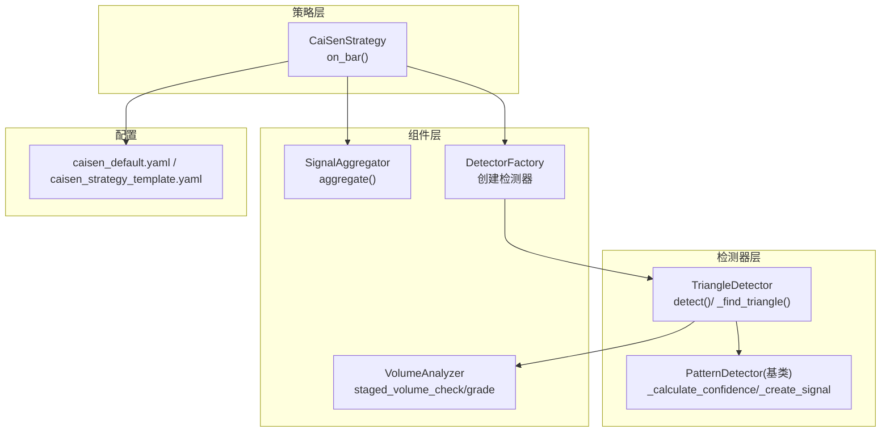
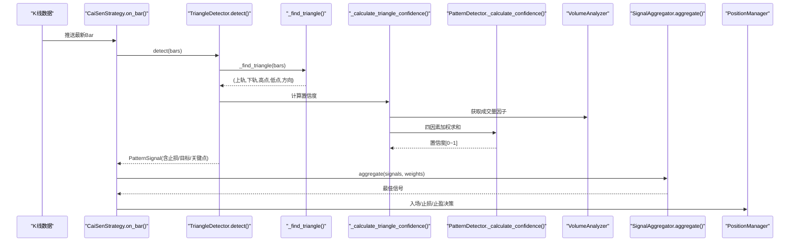
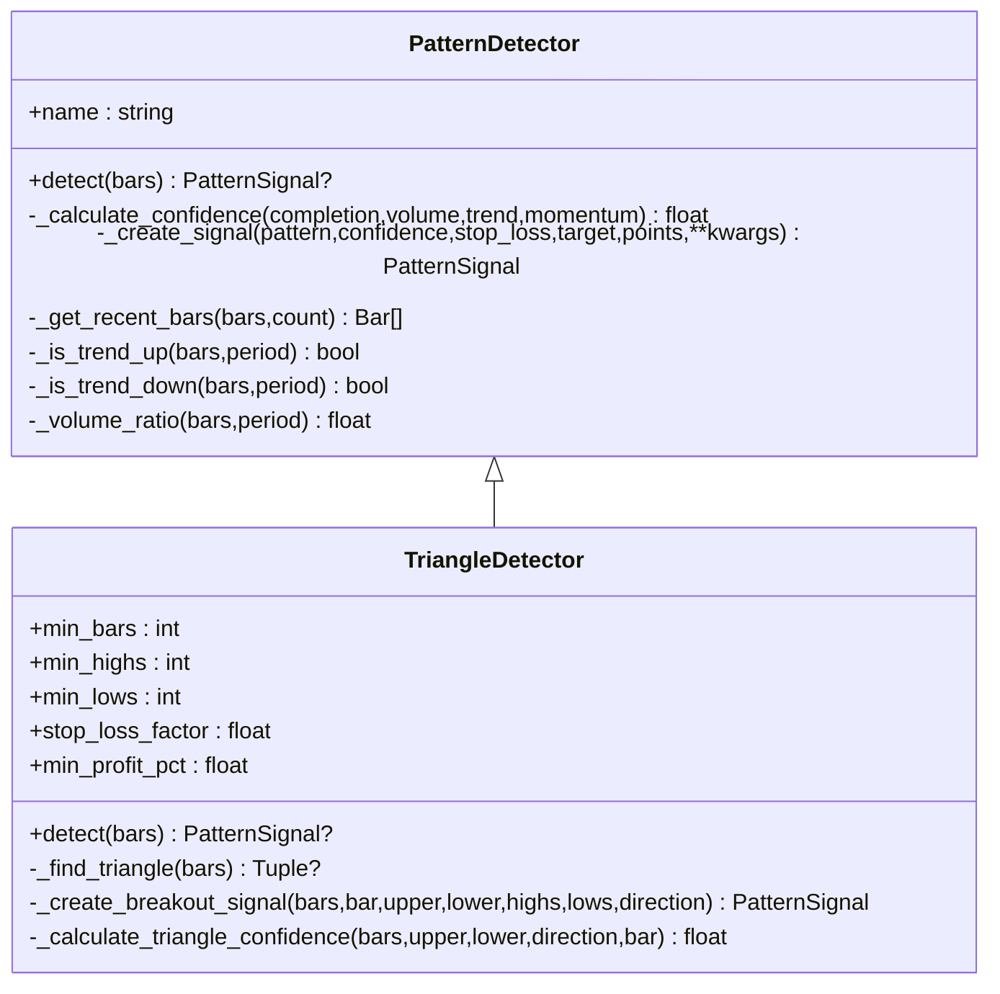
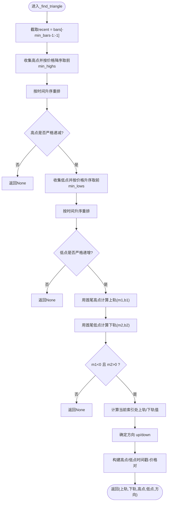
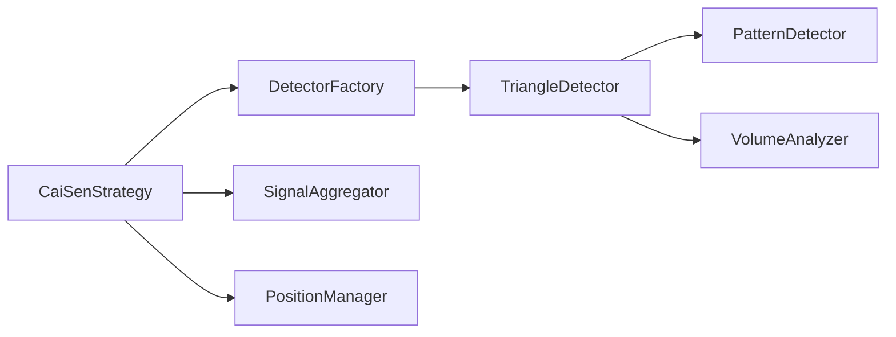

# 三角形态识别

<cite>
**本文引用的文件列表**
- [triangle.py](file://src/caisen/strategy/algorithm/patterns/triangle.py)
- [detector.py](file://src/caisen/strategy/algorithm/detector.py)
- [volume_analyzer.py](file://src/caisen/strategy/algorithm/caisen_components/volume_analyzer.py)
- [aggregator.py](file://src/caisen/strategy/algorithm/caisen_components/aggregator.py)
- [factory.py](file://src/caisen/strategy/algorithm/caisen_components/factory.py)
- [patterns/__init__.py](file://src/caisen/strategy/algorithm/patterns/__init__.py)
- [caisen_default.yaml](file://configs/strategies/caisen_default.yaml)
- [caisen_strategy_template.yaml](file://examples/caisen_strategy_template.yaml)
- [cai_sen.py](file://src/caisen/strategy/algorithm/cai_sen.py)
</cite>

## 目录
1. [简介](#简介)
2. [项目结构](#项目结构)
3. [核心组件](#核心组件)
4. [架构总览](#架构总览)
5. [详细组件分析](#详细组件分析)
6. [依赖关系分析](#依赖关系分析)
7. [性能与复杂度](#性能与复杂度)
8. [参数配置与调优建议](#参数配置与调优建议)
9. [突破方向与置信度计算](#突破方向与置信度计算)
10. [交易信号生成机制](#交易信号生成机制)
11. [故障排查指南](#故障排查指南)
12. [结论](#结论)
13. [附录：示例与回测结果分析](#附录示例与回测结果分析)

## 简介
本文件面向 Caisen 量化回测系统中的“三角整理形态”识别能力，聚焦对称三角形的数学原理、算法实现与策略集成。文档将深入解释：
- 对称三角形的高点下降趋势、低点上升趋势与两趋势线收敛的判定逻辑
- TriangleDetector 类中 _find_triangle 的检测流程（至少3个递减高点、3个递增低点）
- 趋势线斜率计算与收敛验证
- 突破方向判断、置信度四因素加权（完成度、成交量、趋势、动量）
- 交易信号生成与风控参数（止损、目标价）
- 关键参数配置与调优建议（min_bars、min_highs/min_lows、stop_loss_factor 等）

## 项目结构
三角形态识别位于策略算法模块的 patterns 子包中，并通过 DetectorFactory 注册到策略框架，最终由 CaiSenStrategy 在 on_bar 中统一调度检测与决策。

图表来源
- [triangle.py:11-73](file://src/caisen/strategy/algorithm/patterns/triangle.py#L11-L73)
- [detector.py:80-180](file://src/caisen/strategy/algorithm/detector.py#L80-L180)
- [volume_analyzer.py:15-126](file://src/caisen/strategy/algorithm/caisen_components/volume_analyzer.py#L15-L126)
- [aggregator.py:42-110](file://src/caisen/strategy/algorithm/caisen_components/aggregator.py#L42-L110)
- [factory.py:1-40](file://src/caisen/strategy/algorithm/caisen_components/factory.py#L1-L40)
- [caisen_default.yaml:26-50](file://configs/strategies/caisen_default.yaml#L26-L50)
- [caisen_strategy_template.yaml:26-36](file://examples/caisen_strategy_template.yaml#L26-L36)
- [cai_sen.py:178-221](file://src/caisen/strategy/algorithm/cai_sen.py#L178-L221)

章节来源
- [triangle.py:11-73](file://src/caisen/strategy/algorithm/patterns/triangle.py#L11-L73)
- [detector.py:80-180](file://src/caisen/strategy/algorithm/detector.py#L80-L180)
- [volume_analyzer.py:15-126](file://src/caisen/strategy/algorithm/caisen_components/volume_analyzer.py#L15-L126)
- [aggregator.py:42-110](file://src/caisen/strategy/algorithm/caisen_components/aggregator.py#L42-L110)
- [factory.py:1-40](file://src/caisen/strategy/algorithm/caisen_components/factory.py#L1-L40)
- [caisen_default.yaml:26-50](file://configs/strategies/caisen_default.yaml#L26-L50)
- [caisen_strategy_template.yaml:26-36](file://examples/caisen_strategy_template.yaml#L26-L36)
- [cai_sen.py:178-221](file://src/caisen/strategy/algorithm/cai_sen.py#L178-L221)

## 核心组件
- TriangleDetector：对称三角形检测器，负责寻找高点下降、低点上升且收敛的趋势线，并在价格突破时生成信号。
- PatternDetector（基类）：提供统一的纯函数接口 detect(bars)，以及置信度加权计算、趋势判断、成交量放大倍数等通用工具方法。
- VolumeAnalyzer：按蔡森理论进行分阶段量能评估，支持放量/缩量/递增等多阶段校验。
- SignalAggregator：聚合多个检测器的信号并计算综合评分，选择最佳信号。
- DetectorFactory：根据配置动态创建各形态检测器实例。
- CaiSenStrategy：策略编排入口，在每根K线触发检测、聚合与下单决策。

章节来源
- [triangle.py:11-73](file://src/caisen/strategy/algorithm/patterns/triangle.py#L11-L73)
- [detector.py:80-180](file://src/caisen/strategy/algorithm/detector.py#L80-L180)
- [volume_analyzer.py:15-126](file://src/caisen/strategy/algorithm/caisen_components/volume_analyzer.py#L15-L126)
- [aggregator.py:42-110](file://src/caisen/strategy/algorithm/caisen_components/aggregator.py#L42-L110)
- [factory.py:1-40](file://src/caisen/strategy/algorithm/caisen_components/factory.py#L1-L40)
- [cai_sen.py:178-221](file://src/caisen/strategy/algorithm/cai_sen.py#L178-L221)

## 架构总览
下图展示了从 K 线输入到三角形态信号输出的完整调用链，包括检测、置信度计算、信号聚合与策略执行。

图表来源
- [triangle.py:39-73](file://src/caisen/strategy/algorithm/patterns/triangle.py#L39-L73)
- [triangle.py:74-143](file://src/caisen/strategy/algorithm/patterns/triangle.py#L74-L143)
- [triangle.py:195-238](file://src/caisen/strategy/algorithm/patterns/triangle.py#L195-L238)
- [detector.py:125-149](file://src/caisen/strategy/algorithm/detector.py#L125-L149)
- [volume_analyzer.py:127-156](file://src/caisen/strategy/algorithm/caisen_components/volume_analyzer.py#L127-L156)
- [aggregator.py:59-110](file://src/caisen/strategy/algorithm/caisen_components/aggregator.py#L59-L110)
- [cai_sen.py:178-221](file://src/caisen/strategy/algorithm/cai_sen.py#L178-L221)

## 详细组件分析

### TriangleDetector 类分析
TriangleDetector 继承自 PatternDetector，采用纯函数式接口设计，无内部状态，便于并行测试与回测。

图表来源
- [detector.py:80-180](file://src/caisen/strategy/algorithm/detector.py#L80-L180)
- [triangle.py:11-73](file://src/caisen/strategy/algorithm/patterns/triangle.py#L11-L73)

#### _find_triangle 方法流程
该方法的核心是：
- 选取最近 min_bars+1 根K线（不含当前），用于寻找历史高低点
- 从高到低排序取前 min_highs 个高点，再按时间顺序排列，检查是否严格递减
- 从低到高排序取前 min_lows 个低点，再按时间顺序排列，检查是否严格递增
- 使用首尾两点计算上下趋势线的斜率与截距，要求上轨斜率为负、下轨斜率为正（收敛）
- 计算当前索引处的上轨/下轨价格，确定潜在突破方向
- 返回上轨、下轨、高点序列、低点序列与方向

图表来源
- [triangle.py:74-143](file://src/caisen/strategy/algorithm/patterns/triangle.py#L74-L143)

章节来源
- [triangle.py:74-143](file://src/caisen/strategy/algorithm/patterns/triangle.py#L74-L143)

#### 突破方向判断与信号创建
- 若方向为 up 且当前收盘价高于上轨，则视为向上突破，生成做多信号
- 若方向为 down 且当前收盘价低于下轨，则视为向下突破，生成做空信号
- 止损与目标价基于振幅（上轨-下轨）与 stop_loss_factor 计算
- 信号包含关键点（高点/低点的时间戳与价格）、上下轨价格、方向与振幅

章节来源
- [triangle.py:39-73](file://src/caisen/strategy/algorithm/patterns/triangle.py#L39-L73)
- [triangle.py:145-193](file://src/caisen/strategy/algorithm/patterns/triangle.py#L145-L193)

#### 置信度计算方法（四因素加权）
置信度由四个维度加权求和得到：
- 完成度 completion：振幅相对均价越小，形态越紧凑，完成度越高
- 成交量 volume：近期均量与历史均量的比值映射至[0,1]
- 趋势 trend：依据方向判断近周期涨跌，顺势给予较高权重
- 动量 momentum：突破幅度相对于阈值归一化，限制上限

加权默认权重：completion=0.4、volume=0.3、trend=0.2、momentum=0.1。

章节来源
- [triangle.py:195-238](file://src/caisen/strategy/algorithm/patterns/triangle.py#L195-L238)
- [detector.py:125-149](file://src/caisen/strategy/algorithm/detector.py#L125-L149)

### 成交量分析器 VolumeAnalyzer
VolumeAnalyzer 提供多阶段量能评估与等级划分，支持：
- 基础均量计算
- 分阶段期望校验（缩量/放量/递增）
- 突破时的量能等级（weak/normal/strong）
- 量价背离检测与关键点量能递增性检查

这些能力可被其他形态或策略扩展使用，以增强信号质量。

章节来源
- [volume_analyzer.py:15-126](file://src/caisen/strategy/algorithm/caisen_components/volume_analyzer.py#L15-L126)
- [volume_analyzer.py:127-156](file://src/caisen/strategy/algorithm/caisen_components/volume_analyzer.py#L127-L156)

### 信号聚合器 SignalAggregator
SignalAggregator 负责：
- 过滤无效信号（None 或置信度过低）
- 按模式名称权重加权求和，得到 total_score
- 选择置信度最高的 best_signal
- 提供便捷方法 aggregate_with_detection 一步完成检测与聚合

章节来源
- [aggregator.py:42-110](file://src/caisen/strategy/algorithm/caisen_components/aggregator.py#L42-L110)

### 检测器工厂 DetectorFactory
DetectorFactory 根据配置字典与启用开关创建具体检测器实例，其中 triangle 对应 TriangleDetector。

章节来源
- [factory.py:1-40](file://src/caisen/strategy/algorithm/caisen_components/factory.py#L1-L40)
- [patterns/__init__.py:1-27](file://src/caisen/strategy/algorithm/patterns/__init__.py#L1-L27)

### 策略编排 CaiSenStrategy
CaiSenStrategy 在 on_bar 中：
- 累积 bars
- 遍历所有检测器获取 signals
- 通过 SignalAggregator 聚合评分
- 当最佳信号置信度超过阈值且未持仓时，构造入场订单（含止损与目标）
- 检查止损/止盈条件并平仓

章节来源
- [cai_sen.py:178-221](file://src/caisen/strategy/algorithm/cai_sen.py#L178-L221)

## 依赖关系分析
- TriangleDetector 依赖 PatternDetector 提供的通用方法与数据结构
- TriangleDetector 内部使用 VolumeAnalyzer 的成交量因子计算
- CaiSenStrategy 依赖 DetectorFactory 创建检测器，依赖 SignalAggregator 聚合信号，依赖 PositionManager 管理仓位
- 配置文件控制形态开关与权重

图表来源
- [triangle.py:11-73](file://src/caisen/strategy/algorithm/patterns/triangle.py#L11-L73)
- [detector.py:80-180](file://src/caisen/strategy/algorithm/detector.py#L80-L180)
- [volume_analyzer.py:15-126](file://src/caisen/strategy/algorithm/caisen_components/volume_analyzer.py#L15-L126)
- [factory.py:1-40](file://src/caisen/strategy/algorithm/caisen_components/factory.py#L1-L40)
- [aggregator.py:42-110](file://src/caisen/strategy/algorithm/caisen_components/aggregator.py#L42-L110)
- [cai_sen.py:178-221](file://src/caisen/strategy/algorithm/cai_sen.py#L178-L221)

## 性能与复杂度
- 时间复杂度
  - _find_triangle：排序操作主导，O(k log k)，k=min_highs 或 min_lows；整体近似 O(min_highs log min_highs + min_lows log min_lows)
  - 趋势线与收敛判断：常数时间
  - 置信度计算：成交量与趋势判断均为线性扫描，O(period)
- 空间复杂度
  - 存储最近 min_bars+1 根K线及高低点集合，近似 O(min_bars)
- 优化建议
  - 合理设置 min_bars 避免过长窗口导致计算开销增大
  - 调整 min_highs/min_lows 平衡灵敏度与稳定性
  - 在高频场景下可缓存近期均值与趋势指标以减少重复计算

[本节为一般性讨论，不直接分析具体文件，故无章节来源]

## 参数配置与调优建议
- min_bars：最小K线数，决定检测窗口的长度。过小易误报，过大延迟信号。建议根据品种波动性与周期调整，常见范围 11-30。
- min_highs/min_lows：高低点数量下限，影响形态稳定性。通常设为 3 以上，确保趋势线有足够支撑。
- stop_loss_factor：止损系数，用于计算止损价。做多时以 lower_trendline 为基础乘以该系数，做空时以 upper_trendline 为基础乘以略大于1的值。建议结合品种波动率与回撤容忍度调优。
- min_profit_pct：最小盈利目标，用于过滤低盈亏比的信号。
- 形态权重：在配置文件中定义 TRIANGLE 的权重，影响与其他形态的综合评分。
- 成交量确认：可通过 VolumeAnalyzer 的阶段校验提升信号质量。

章节来源
- [triangle.py:24-37](file://src/caisen/strategy/algorithm/patterns/triangle.py#L24-L37)
- [caisen_default.yaml:20-24](file://configs/strategies/caisen_default.yaml#L20-L24)
- [caisen_default.yaml:39-50](file://configs/strategies/caisen_default.yaml#L39-L50)
- [caisen_strategy_template.yaml:26-36](file://examples/caisen_strategy_template.yaml#L26-L36)

## 突破方向与置信度计算
- 突破方向判断
  - 上轨斜率为负、下轨斜率为正，形成收敛三角形
  - 当前收盘价高于上轨 → 向上突破（做多）
  - 当前收盘价低于下轨 → 向下跌破（做空）
- 置信度四因素
  - 完成度：振幅相对均价越小越好
  - 成交量：近期均量与历史均量比值映射至[0,1]
  - 趋势：顺势方向赋予更高权重
  - 动量：突破幅度相对阈值的归一化值
- 加权公式
  - 默认权重：completion=0.4、volume=0.3、trend=0.2、momentum=0.1
  - 最终置信度裁剪至[0,1]

章节来源
- [triangle.py:195-238](file://src/caisen/strategy/algorithm/patterns/triangle.py#L195-L238)
- [detector.py:125-149](file://src/caisen/strategy/algorithm/detector.py#L125-L149)

## 交易信号生成机制
- 入场条件
  - 检测到突破（上穿/下穿）
  - 置信度达到策略阈值
  - 当前未持仓
- 止损与目标
  - 做多：止损=下轨×stop_loss_factor；目标=入场价+振幅
  - 做空：止损=上轨×1.02；目标=入场价-振幅
- 信号数据结构
  - pattern：形态名称
  - confidence：置信度
  - stop_loss/target：风控参数
  - points：关键点（时间戳与价格）
  - data：额外信息（如上下轨、方向、振幅）

章节来源
- [triangle.py:145-193](file://src/caisen/strategy/algorithm/patterns/triangle.py#L145-L193)
- [detector.py:151-180](file://src/caisen/strategy/algorithm/detector.py#L151-L180)
- [cai_sen.py:198-221](file://src/caisen/strategy/algorithm/cai_sen.py#L198-L221)

## 故障排查指南
- 未检测到三角形
  - 检查 min_bars 是否过小导致窗口不足
  - 检查 min_highs/min_lows 是否过高导致无法找到足够高低点
  - 确认高点递减与低点递增条件过于严格
- 频繁假突破
  - 提高置信度阈值
  - 增加成交量确认（VolumeAnalyzer 阶段校验）
  - 调整 stop_loss_factor 使止损更贴近趋势线
- 信号延迟
  - 降低 min_bars 或放宽收敛条件
  - 适当减小 min_highs/min_lows
- 置信度偏低
  - 检查成交量是否显著放大
  - 观察趋势是否与突破方向一致
  - 调整四因素权重以提升敏感性与稳定性

章节来源
- [triangle.py:74-143](file://src/caisen/strategy/algorithm/patterns/triangle.py#L74-L143)
- [triangle.py:195-238](file://src/caisen/strategy/algorithm/patterns/triangle.py#L195-L238)
- [volume_analyzer.py:127-156](file://src/caisen/strategy/algorithm/caisen_components/volume_analyzer.py#L127-L156)

## 结论
TriangleDetector 通过对称三角形的几何特征与统计因子相结合，提供了稳健的形态识别与信号生成能力。其纯函数接口设计便于测试与集成，配合 VolumeAnalyzer 的分阶段量能评估与 SignalAggregator 的多形态聚合，能够在复杂市场中提高信号质量与鲁棒性。通过合理配置参数与权重，可在不同品种与周期上取得较好的回测表现。

[本节为总结性内容，不直接分析具体文件，故无章节来源]

## 附录：示例与回测结果分析
- 示例配置
  - 在模板配置中启用 triangle_enabled=true，并设置形态权重与风险参数
- 回测流程
  - 使用 CaiSenStrategy.from_config 加载配置
  - 运行回测引擎，记录信号与绩效指标
- 结果分析要点
  - 关注胜率、盈亏比、最大回撤与夏普比率
  - 对比启用/禁用三角形态的差异，评估其对整体收益的贡献
  - 分析失败案例中的假突破与震荡行情，优化参数与阈值

章节来源
- [caisen_strategy_template.yaml:26-36](file://examples/caisen_strategy_template.yaml#L26-L36)
- [caisen_default.yaml:39-50](file://configs/strategies/caisen_default.yaml#L39-L50)
- [cai_sen.py:55-79](file://src/caisen/strategy/algorithm/cai_sen.py#L55-L79)