# 其他持续形态

<cite>
**本文引用的文件**   
- [other.py](file://src/caisen/strategy/algorithm/patterns/other.py)
- [triangle.py](file://src/caisen/strategy/algorithm/patterns/triangle.py)
- [head_shoulders.py](file://src/caisen/strategy/algorithm/patterns/head_shoulders.py)
- [m_top.py](file://src/caisen/strategy/algorithm/patterns/m_top.py)
- [detector.py](file://src/caisen/strategy/algorithm/detector.py)
- [volume_analyzer.py](file://src/caisen/strategy/algorithm/caisen_components/volume_analyzer.py)
- [factory.py](file://src/caisen/strategy/algorithm/caisen_components/factory.py)
- [__init__.py](file://src/caisen/strategy/algorithm/patterns/__init__.py)
</cite>

## 目录
1. [引言](#引言)
2. [项目结构](#项目结构)
3. [核心组件](#核心组件)
4. [架构总览](#架构总览)
5. [详细组件分析](#详细组件分析)
6. [依赖关系分析](#依赖关系分析)
7. [性能与优化建议](#性能与优化建议)
8. [故障排查指南](#故障排查指南)
9. [结论](#结论)
10. [附录：参数配置与回测要点](#附录：参数配置与回测要点)

## 引言
本章节面向 Caisen 量化回测系统中的“其他持续形态”识别能力，覆盖旗形整理、矩形整理、圆弧底/顶、杯柄形态等经典持续形态的识别算法与实现细节。文档将解释每种形态的价格特征、成交量规律与突破确认条件，说明检测逻辑中的边界确定、时间周期约束、突破力度验证等关键技术点，并提供参数配置选项、置信度评估方法、风险控制措施以及实战回测建议。

## 项目结构
“其他持续形态”相关代码集中在策略算法模块的 patterns 子包中，并通过统一的 PatternDetector 基类提供纯函数式接口；量能分析由 VolumeAnalyzer 提供分阶段评估；工厂类负责按配置实例化具体检测器。

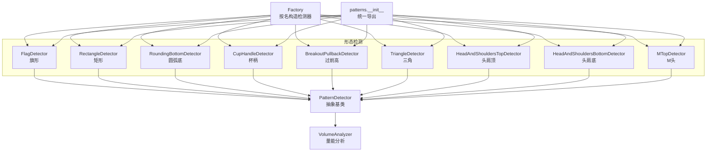

图表来源
- [other.py:11-576](file://src/caisen/strategy/algorithm/patterns/other.py#L11-L576)
- [triangle.py:11-239](file://src/caisen/strategy/algorithm/patterns/triangle.py#L11-L239)
- [head_shoulders.py:11-323](file://src/caisen/strategy/algorithm/patterns/head_shoulders.py#L11-L323)
- [m_top.py:11-227](file://src/caisen/strategy/algorithm/patterns/m_top.py#L11-L227)
- [detector.py:80-244](file://src/caisen/strategy/algorithm/detector.py#L80-L244)
- [volume_analyzer.py:15-287](file://src/caisen/strategy/algorithm/caisen_components/volume_analyzer.py#L15-L287)
- [factory.py:178-204](file://src/caisen/strategy/algorithm/caisen_components/factory.py#L178-L204)
- [__init__.py:1-27](file://src/caisen/strategy/algorithm/patterns/__init__.py#L1-L27)

章节来源
- [other.py:11-576](file://src/caisen/strategy/algorithm/patterns/other.py#L11-L576)
- [triangle.py:11-239](file://src/caisen/strategy/algorithm/patterns/triangle.py#L11-L239)
- [head_shoulders.py:11-323](file://src/caisen/strategy/algorithm/patterns/head_shoulders.py#L11-L323)
- [m_top.py:11-227](file://src/caisen/strategy/algorithm/patterns/m_top.py#L11-L227)
- [detector.py:80-244](file://src/caisen/strategy/algorithm/detector.py#L80-L244)
- [volume_analyzer.py:15-287](file://src/caisen/strategy/algorithm/caisen_components/volume_analyzer.py#L15-L287)
- [factory.py:178-204](file://src/caisen/strategy/algorithm/caisen_components/factory.py#L178-L204)
- [__init__.py:1-27](file://src/caisen/strategy/algorithm/patterns/__init__.py#L1-L27)

## 核心组件
- 统一信号模型与置信度计算
  - PatternSignal：包含形态名称、置信度、止损价、目标价、关键点及扩展数据。
  - ConfidenceFactors：完成度、成交量、趋势共振、动量四个因子加权求和得到综合置信度。
  - PatternDetector：纯函数接口 detect(bars)，内置趋势判断、成交量放大倍数计算、信号创建等通用方法。
- 量能分析器
  - VolumeAnalyzer：提供基础均量、阶段量能检查（缩量/放量/递增）、突破时量能等级（弱/正常/强）、量价背离检测、多点递增检查等。

章节来源
- [detector.py:18-180](file://src/caisen/strategy/algorithm/detector.py#L18-L180)
- [detector.py:125-244](file://src/caisen/strategy/algorithm/detector.py#L125-L244)
- [volume_analyzer.py:15-287](file://src/caisen/strategy/algorithm/caisen_components/volume_analyzer.py#L15-L287)

## 架构总览
各形态检测器继承自 PatternDetector，内部通过 VolumeAnalyzer 进行量能评估，最终返回 PatternSignal。工厂类根据配置字符串或字典动态构建检测器实例，便于策略配置驱动。

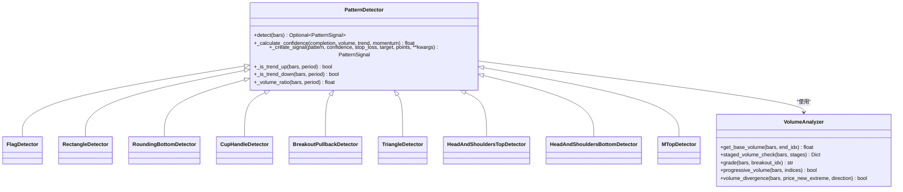

图表来源
- [detector.py:80-244](file://src/caisen/strategy/algorithm/detector.py#L80-L244)
- [volume_analyzer.py:15-287](file://src/caisen/strategy/algorithm/caisen_components/volume_analyzer.py#L15-L287)
- [other.py:11-576](file://src/caisen/strategy/algorithm/patterns/other.py#L11-L576)
- [triangle.py:11-239](file://src/caisen/strategy/algorithm/patterns/triangle.py#L11-L239)
- [head_shoulders.py:11-323](file://src/caisen/strategy/algorithm/patterns/head_shoulders.py#L11-L323)
- [m_top.py:11-227](file://src/caisen/strategy/algorithm/patterns/m_top.py#L11-L227)

## 详细组件分析

### 旗形整理（Flag）
- 价格特征
  - 先出现一段明显涨跌（旗杆），随后进入窄幅收敛整理（旗面）。
  - 上升旗形向上突破上沿买入；下降旗形向下跌破下沿卖出。
- 成交量规律
  - 旗面整理期应相对缩量；突破时应放量，量能等级越高置信度越高。
- 突破确认条件
  - 当前收盘价突破旗面上沿/跌破下沿即触发信号。
- 检测逻辑与技术要点
  - 旗杆判定：在窗口内寻找幅度超过平均价格的阈值，并判断方向。
  - 旗面判定：在最近K线区间内取高低点，要求振幅相对较小。
  - 置信度：结合量能等级（强/正常/弱）与形态宽度占比等因素。
- 参数配置
  - min_bars：最小K线数
  - max_bars：用于定位旗杆的窗口大小
  - stop_loss_factor：止损系数
  - min_profit_pct：最小盈利目标
- 风险与风控
  - 止损参考旗面另一侧边界乘以系数；目标为突破价加减旗杆高度。
- 性能优化建议
  - 限制最近窗口长度，避免全量扫描；对旗面宽度做快速过滤。

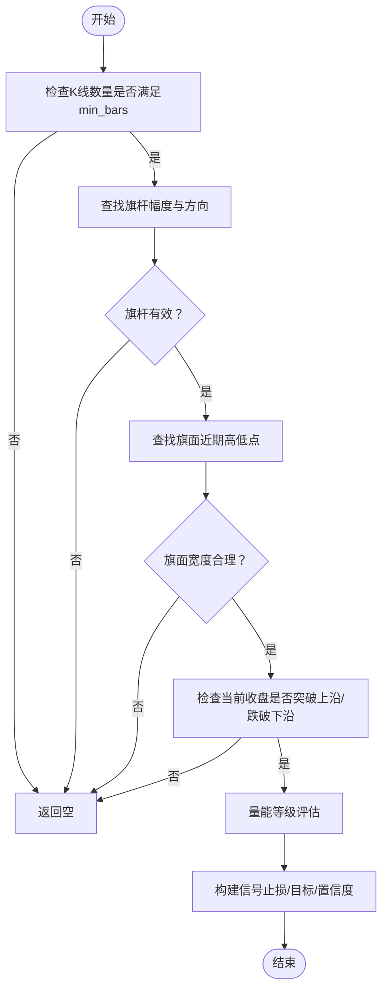

图表来源
- [other.py:32-179](file://src/caisen/strategy/algorithm/patterns/other.py#L32-L179)

章节来源
- [other.py:11-179](file://src/caisen/strategy/algorithm/patterns/other.py#L11-L179)

### 矩形整理（Rectangle）
- 价格特征
  - 价格在水平区间内波动，形成上下两条近似水平的边界。
  - 向上突破上沿买入；向下跌破下沿卖出。
- 成交量规律
  - 突破时应放量，量能越强置信度越高。
- 突破确认条件
  - 当前收盘价突破上沿或跌破下沿。
- 检测逻辑与技术要点
  - 在指定窗口内计算最高/最低价作为边界，并要求振幅不超过阈值。
  - 置信度考虑完成度（振幅越小越紧凑）、量能等级、趋势共振与动量。
- 参数配置
  - min_bars：最小K线数
  - max_amplitude：最大振幅比例
  - stop_loss_factor：止损系数
  - min_profit_pct：最小盈利目标
- 风险与风控
  - 止损位于另一侧边界附近；目标为突破价加减振幅。
- 性能优化建议
  - 使用滑动窗口维护高低点，减少重复计算。

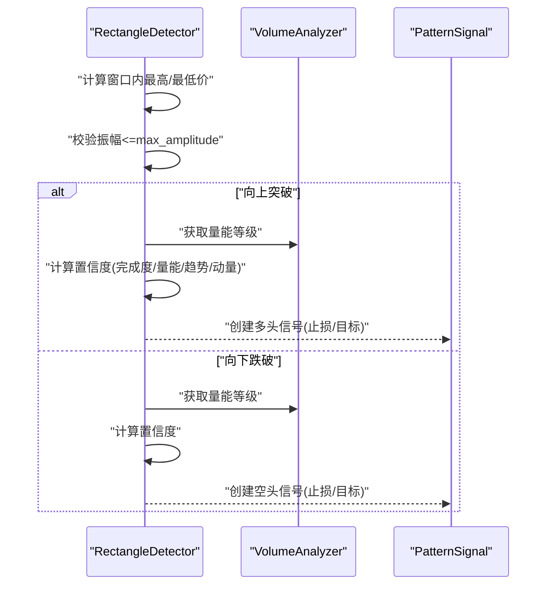

图表来源
- [other.py:182-291](file://src/caisen/strategy/algorithm/patterns/other.py#L182-L291)

章节来源
- [other.py:182-291](file://src/caisen/strategy/algorithm/patterns/other.py#L182-L291)

### 圆弧底（Rounding Bottom）
- 价格特征
  - 缓慢筑底形成圆弧形低点，随后向上突破颈线。
- 成交量规律
  - 后半段量能逐步递增更佳；突破时放量提升置信度。
- 突破确认条件
  - 当前收盘价高于颈线。
- 检测逻辑与技术要点
  - 在窗口内寻找最低点（应在中间区域），左侧高点最大值作为颈线。
  - 通过关键索引检查量能是否递增，并结合量能等级调整置信度。
- 参数配置
  - min_bars：最小K线数
  - stop_loss_factor：止损系数
  - min_profit_pct：最小盈利目标
- 风险与风控
  - 止损位于圆弧低点附近；目标为颈线加振幅。
- 性能优化建议
  - 仅扫描必要区间，避免全量遍历；对颈线位置做快速剪枝。

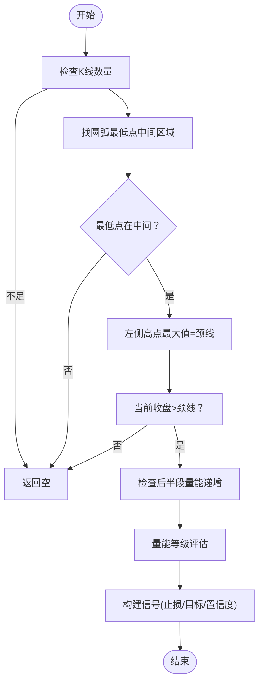

图表来源
- [other.py:293-370](file://src/caisen/strategy/algorithm/patterns/other.py#L293-L370)

章节来源
- [other.py:293-370](file://src/caisen/strategy/algorithm/patterns/other.py#L293-L370)

### 杯柄形态（Cup Handle）
- 价格特征
  - 杯身呈圆弧形上涨，柄部短暂回调，突破柄部高点后买入。
- 成交量规律
  - 突破时应放量，量能等级越高置信度越高。
- 突破确认条件
  - 当前收盘价高于柄部高点。
- 检测逻辑与技术要点
  - 简化实现：在窗口内找最高点（右侧），其前最低点为杯底，再在其间找柄部高点。
  - 置信度基于量能等级与形态尺寸。
- 参数配置
  - min_bars：最小K线数
  - stop_loss_factor：止损系数
  - min_profit_pct：最小盈利目标
- 风险与风控
  - 止损位于杯底附近；目标为突破价加杯深。
- 性能优化建议
  - 限定搜索范围，避免多次全量扫描。

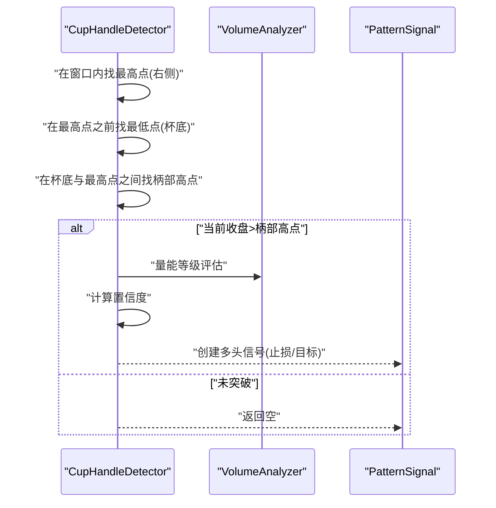

图表来源
- [other.py:403-470](file://src/caisen/strategy/algorithm/patterns/other.py#L403-L470)

章节来源
- [other.py:403-470](file://src/caisen/strategy/algorithm/patterns/other.py#L403-L470)

### 过前高（Breakout Pullback）
- 价格特征
  - 价格突破前期高点后，若再次上涨则视为强势延续。
- 成交量规律
  - 突破时应放量，量能等级影响置信度。
- 突破确认条件
  - 当前收盘价高于过去N根K线的最高价。
- 检测逻辑与技术要点
  - 在lookback_period窗口内找前高，比较当前收盘与前高。
  - 置信度基于量能等级与突破幅度。
- 参数配置
  - lookback_period：回溯窗口
  - stop_loss_factor：止损系数
  - min_profit_pct：最小盈利目标
- 风险与风控
  - 止损位于前高附近；目标为突破价加突破幅度。
- 性能优化建议
  - 维护滚动最大值，降低复杂度。

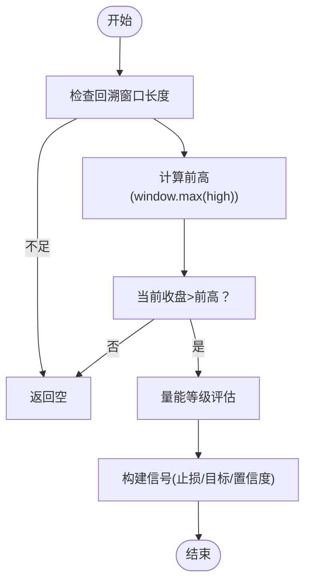

图表来源
- [other.py:509-576](file://src/caisen/strategy/algorithm/patterns/other.py#L509-L576)

章节来源
- [other.py:509-576](file://src/caisen/strategy/algorithm/patterns/other.py#L509-L576)

### 对称三角形（Triangle）
- 价格特征
  - 高点下降、低点上升，两趋势线收敛；向上突破上轨买入，向下跌破下轨卖出。
- 成交量规律
  - 突破时应放量，量能越大置信度越高。
- 突破确认条件
  - 当前收盘价突破上轨或跌破下轨。
- 检测逻辑与技术要点
  - 选取至少3个递减的高点与3个递增的低点，计算两条趋势线斜率，要求收敛。
  - 置信度考虑完成度（收敛程度）、量能、趋势与动量。
- 参数配置
  - min_bars：最小K线数
  - min_highs/min_lows：最少高/低点数
  - stop_loss_factor：止损系数
  - min_profit_pct：最小盈利目标
- 风险与风控
  - 止损位于另一条趋势线附近；目标为突破价加减振幅（上下轨差值）。
- 性能优化建议
  - 使用滑动窗口维护候选高/低点，避免重复排序。

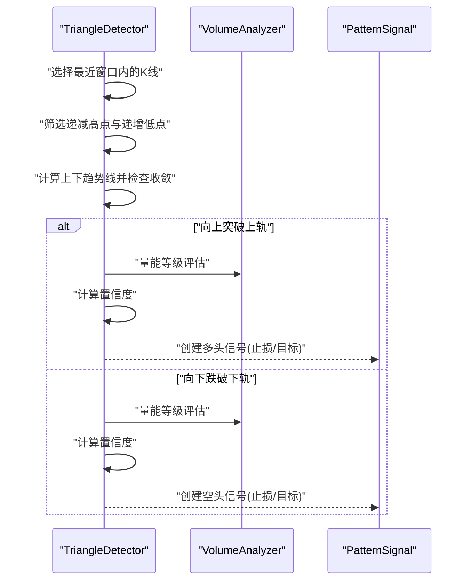

图表来源
- [triangle.py:11-239](file://src/caisen/strategy/algorithm/patterns/triangle.py#L11-L239)

章节来源
- [triangle.py:11-239](file://src/caisen/strategy/algorithm/patterns/triangle.py#L11-L239)

### 头肩顶/底（Head & Shoulders）
- 价格特征
  - 头肩底：左肩、头部（最低点）、右肩后向上突破颈线；头肩顶：左肩、头部（最高点）、右肩后向下跌破颈线。
- 成交量规律
  - 突破/跌破时应放量，量能等级影响置信度。
- 突破确认条件
  - 头肩底：收盘>颈线；头肩顶：收盘<颈线。
- 检测逻辑与技术要点
  - 在窗口内寻找中间区域的头，左右肩在容差范围内匹配，颈线为两肩之间的极值。
  - 置信度考虑两肩对称性、量能、趋势与动量。
- 参数配置
  - shoulder_tolerance：两肩容差
  - shoulder_height_min/max：肩部相对头部的高度范围
  - stop_loss_factor：止损系数
  - min_profit_pct：最小盈利目标
- 风险与风控
  - 头肩底止损位于头部低点附近；头肩顶止损位于头部高点附近；目标为颈线加减振幅。
- 性能优化建议
  - 限定头部搜索区间，缩小候选集。

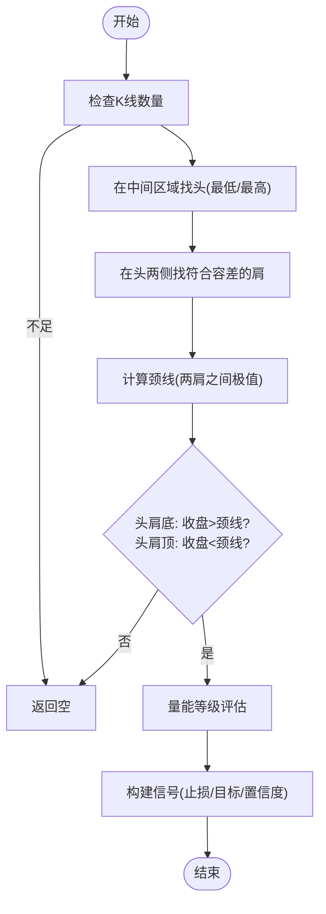

图表来源
- [head_shoulders.py:11-323](file://src/caisen/strategy/algorithm/patterns/head_shoulders.py#L11-L323)

章节来源
- [head_shoulders.py:11-323](file://src/caisen/strategy/algorithm/patterns/head_shoulders.py#L11-L323)

### M头（双顶）
- 价格特征
  - 两个相近高点后颈线跌破，形成看跌反转。
- 成交量规律
  - 跌破时放量增强信号可信度。
- 突破确认条件
  - 当前收盘价低于颈线。
- 检测逻辑与技术要点
  - 在前半段找第一个高点，在后半段找与之接近的第二个高点，两者之间低点作为颈线，并检查颈线深度。
  - 置信度考虑两顶对称性、量能、趋势与动量。
- 参数配置
  - tolerance：双顶容差
  - min_neckline_depth：颈线最小深度
  - stop_loss_factor：止损系数
  - min_profit_pct：最小盈利目标
- 风险与风控
  - 止损位于两顶较高者之上；目标为颈线减振幅。
- 性能优化建议
  - 固定窗口内直接扫描，避免复杂回溯。

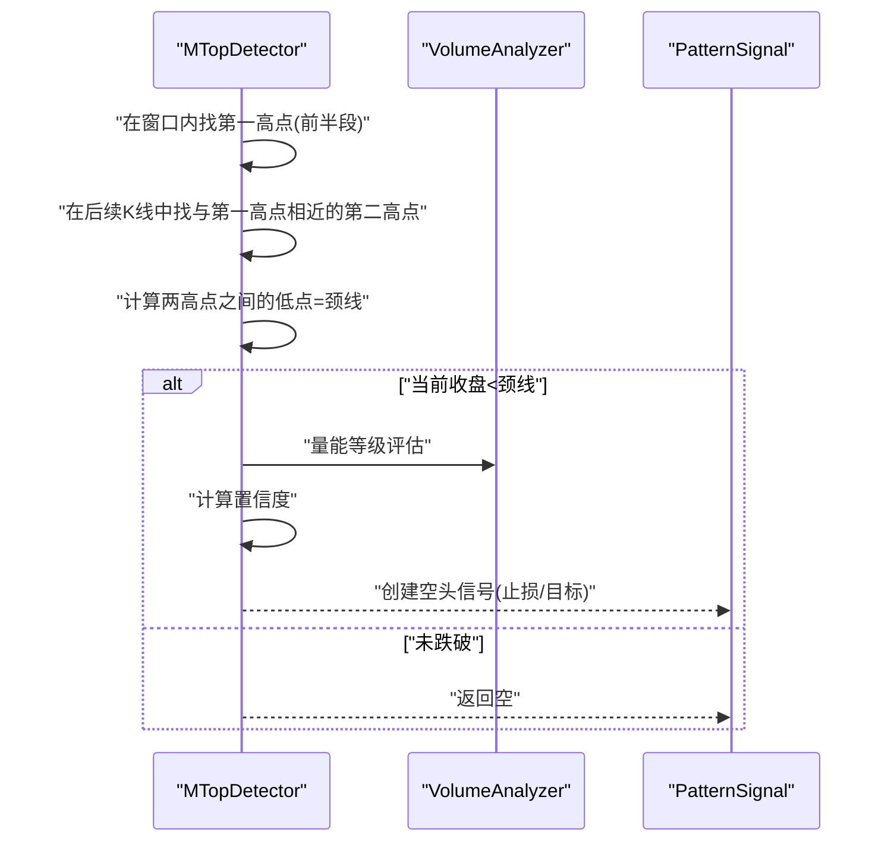

图表来源
- [m_top.py:11-227](file://src/caisen/strategy/algorithm/patterns/m_top.py#L11-L227)

章节来源
- [m_top.py:11-227](file://src/caisen/strategy/algorithm/patterns/m_top.py#L11-L227)

## 依赖关系分析
- 检测器与量能分析器的耦合
  - 所有检测器通过 PatternDetector 初始化 VolumeAnalyzer，并在 detect 流程中调用 grade/staged_volume_check 等方法进行量能评估。
- 工厂模式与配置驱动
  - Factory 根据 pattern_name 与配置字典实例化对应检测器，支持不同形态的参数注入。
- 统一导出
  - patterns.__init__ 集中导出所有检测器，便于上层注册与加载。

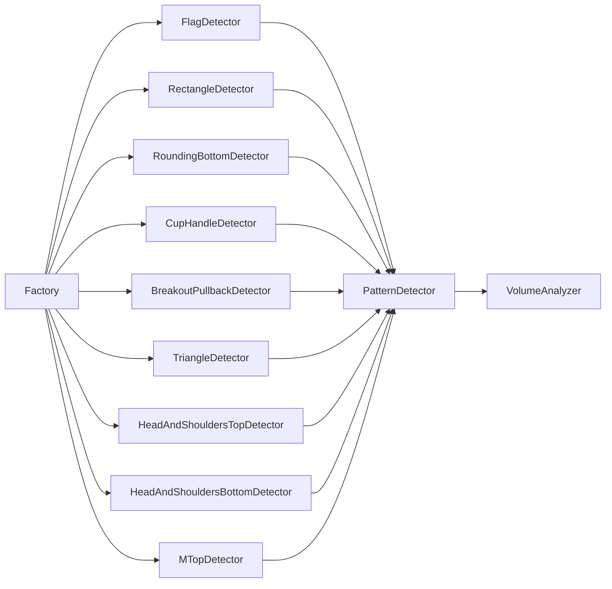

图表来源
- [factory.py:178-204](file://src/caisen/strategy/algorithm/caisen_components/factory.py#L178-L204)
- [detector.py:80-244](file://src/caisen/strategy/algorithm/detector.py#L80-L244)
- [volume_analyzer.py:15-287](file://src/caisen/strategy/algorithm/caisen_components/volume_analyzer.py#L15-L287)
- [__init__.py:1-27](file://src/caisen/strategy/algorithm/patterns/__init__.py#L1-L27)

章节来源
- [factory.py:178-204](file://src/caisen/strategy/algorithm/caisen_components/factory.py#L178-L204)
- [detector.py:80-244](file://src/caisen/strategy/algorithm/detector.py#L80-L244)
- [volume_analyzer.py:15-287](file://src/caisen/strategy/algorithm/caisen_components/volume_analyzer.py#L15-L287)
- [__init__.py:1-27](file://src/caisen/strategy/algorithm/patterns/__init__.py#L1-L27)

## 性能与优化建议
- 窗口与复杂度控制
  - 各检测器均采用固定窗口（如 min_bars、max_bars、lookback_period），避免全量扫描，降低时间复杂度。
- 增量维护
  - 对高频调用的指标（如窗口最大值、均值）可采用滑动窗口维护，减少重复计算。
- 量能评估优化
  - VolumeAnalyzer 的基础均量与阶段评分可缓存，避免重复计算；突破等级 grade 可直接复用。
- 并行与批处理
  - 由于 detect 为纯函数接口，可对多标的或多时间序列并行执行，提高吞吐。
- 参数自适应
  - 针对不同市场波动率，可动态调整 max_amplitude、tolerance 等参数，提升稳定性。

[本节为通用指导，不直接分析具体文件]

## 故障排查指南
- 常见错误与定位
  - 未检测到信号：检查输入 bars 长度是否满足各检测器最小要求；确认形态边界与容差参数是否过于严格。
  - 置信度过低：查看量能等级是否为 weak；必要时放宽量能阈值或调整完成度权重。
  - 止损/目标异常：确认 stop_loss_factor 与形态尺寸计算是否正确，避免极端行情下的不合理设置。
- 调试建议
  - 打印 PatternSignal.data 中的额外字段（如 neckline、amplitude、volume_grade）辅助定位。
  - 使用 VolumeAnalyzer.staged_volume_check 输出阶段详情，观察各阶段量能是否符合预期。

章节来源
- [detector.py:18-180](file://src/caisen/strategy/algorithm/detector.py#L18-L180)
- [volume_analyzer.py:55-125](file://src/caisen/strategy/algorithm/caisen_components/volume_analyzer.py#L55-L125)

## 结论
“其他持续形态”检测器以统一接口与量能分析为核心，覆盖了旗形、矩形、圆弧底、杯柄、过前高等经典持续形态。通过完成度、量能、趋势与动量的多维置信度评估，配合合理的止损与目标设定，能够在不同市场环境下提供稳健的信号。建议在实战中结合历史回测与参数优化，持续提升信号质量与风险控制效果。

[本节为总结性内容，不直接分析具体文件]

## 附录：参数配置与回测要点
- 参数配置清单（示例）
  - 旗形：min_bars、max_bars、stop_loss_factor、min_profit_pct
  - 矩形：min_bars、max_amplitude、stop_loss_factor、min_profit_pct
  - 圆弧底：min_bars、stop_loss_factor、min_profit_pct
  - 杯柄：min_bars、stop_loss_factor、min_profit_pct
  - 过前高：lookback_period、stop_loss_factor、min_profit_pct
  - 三角：min_bars、min_highs、min_lows、stop_loss_factor、min_profit_pct
  - 头肩顶/底：shoulder_tolerance、shoulder_height_min、shoulder_height_max、stop_loss_factor、min_profit_pct
  - M头：tolerance、min_neckline_depth、stop_loss_factor、min_profit_pct
- 回测要点
  - 不同市场环境（趋势/震荡）下，适当调整容差与振幅阈值。
  - 结合成交量分级与阶段量能检查，过滤弱信号。
  - 使用工厂类按配置批量实例化检测器，统一回测流程。

章节来源
- [factory.py:178-204](file://src/caisen/strategy/algorithm/caisen_components/factory.py#L178-L204)
- [other.py:11-576](file://src/caisen/strategy/algorithm/patterns/other.py#L11-L576)
- [triangle.py:11-239](file://src/caisen/strategy/algorithm/patterns/triangle.py#L11-L239)
- [head_shoulders.py:11-323](file://src/caisen/strategy/algorithm/patterns/head_shoulders.py#L11-L323)
- [m_top.py:11-227](file://src/caisen/strategy/algorithm/patterns/m_top.py#L11-L227)