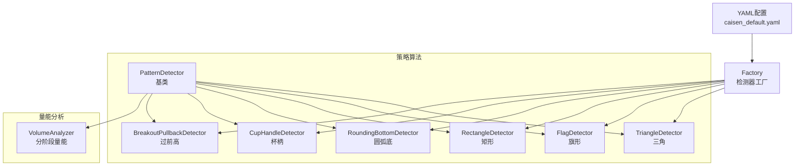
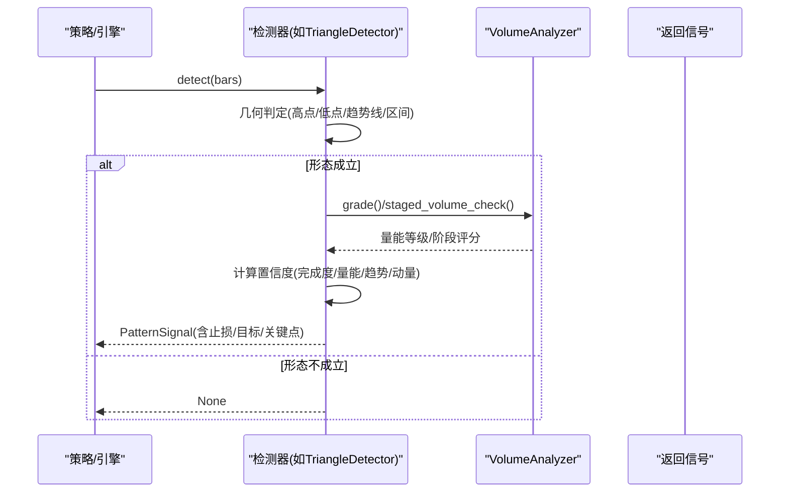
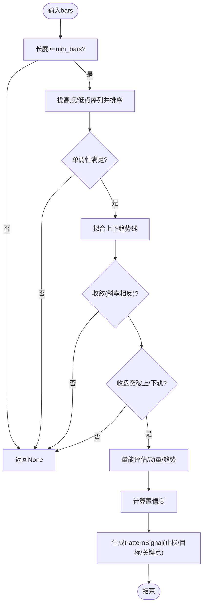
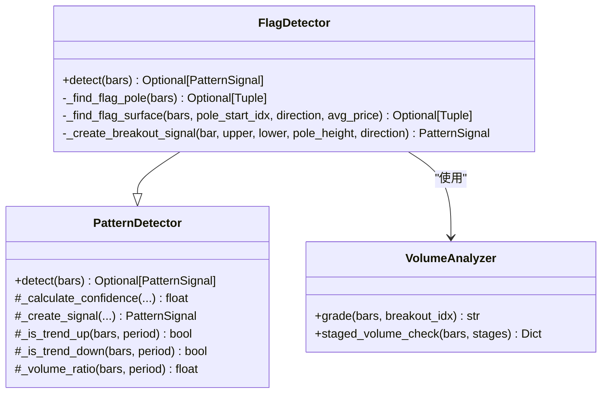
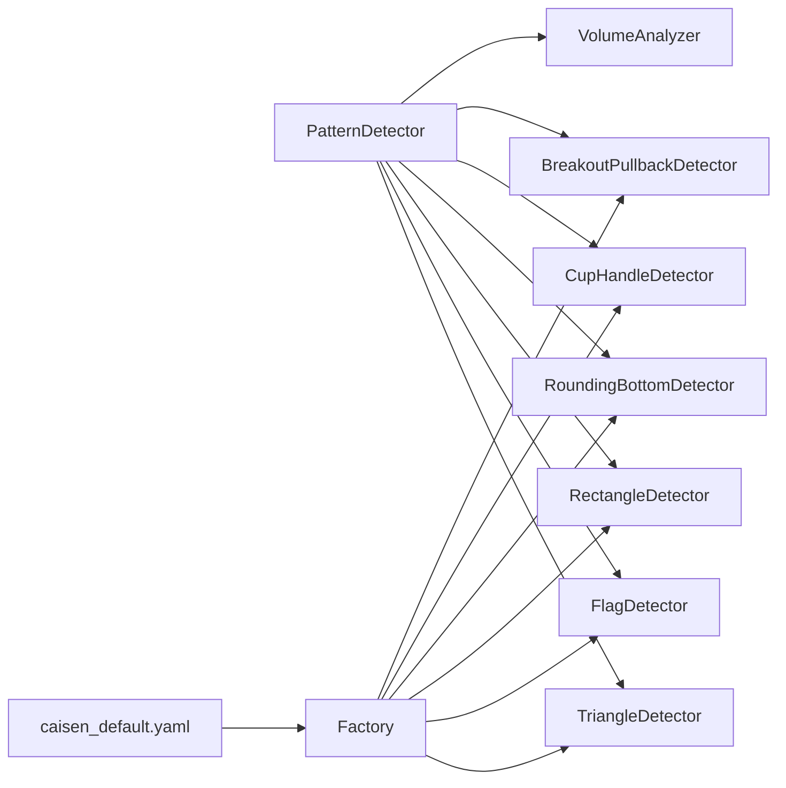

# 持续形态识别

<cite>
**本文引用的文件列表**
- [detector.py](file://src/caisen/strategy/algorithm/detector.py)
- [triangle.py](file://src/caisen/strategy/algorithm/patterns/triangle.py)
- [other.py](file://src/caisen/strategy/algorithm/patterns/other.py)
- [volume_analyzer.py](file://src/caisen/strategy/algorithm/caisen_components/volume_analyzer.py)
- [factory.py](file://src/caisen/strategy/algorithm/caisen_components/factory.py)
- [caisen_default.yaml](file://configs/strategies/caisen_default.yaml)
- [test_cai_sen.py](file://tests/test_cai_sen.py)
</cite>

## 目录
1. [引言](#引言)
2. [项目结构](#项目结构)
3. [核心组件](#核心组件)
4. [架构总览](#架构总览)
5. [详细组件分析](#详细组件分析)
6. [依赖关系分析](#依赖关系分析)
7. [性能与复杂度](#性能与复杂度)
8. [参数配置与优化](#参数配置与优化)
9. [交易策略建议与风控](#交易策略建议与风控)
10. [故障排查指南](#故障排查指南)
11. [结论](#结论)
12. [附录：回测与实战案例指引](#附录回测与实战案例指引)

## 引言
本文件面向 Caisen 量化回测系统的“持续形态识别”能力，系统性地梳理三角整理、旗形、矩形整理、圆弧底/顶、杯柄等经典持续形态的识别算法、价格收敛特征、成交量萎缩规律与突破确认条件；解释形态构建过程中的趋势延续逻辑与突破方向判断方法；给出每种形态的参数配置项（形态大小限制、时间周期约束、突破力度验证等）；并提供交易策略建议、风险控制措施以及历史回测与实战案例的组织方式。

## 项目结构
持续形态识别相关代码集中在策略算法模块中，采用“纯函数接口 + 可插拔检测器”的设计：
- 基类与信号定义：统一抽象 PatternDetector 与 PatternSignal，提供置信度计算、趋势判断、量能工具等通用能力。
- 具体形态检测器：三角形、旗形、矩形、圆弧底/顶、杯柄、过前高等实现各自 detect(bars) 流程。
- 量能分析器：VolumeAnalyzer 提供分阶段量能评估、放量等级、量价背离与递增检查。
- 工厂与配置：通过工厂按名称创建检测器，结合 YAML 配置启用/禁用特定形态并设置权重。

图表来源
- [detector.py:80-180](file://src/caisen/strategy/algorithm/detector.py#L80-L180)
- [triangle.py:11-73](file://src/caisen/strategy/algorithm/patterns/triangle.py#L11-L73)
- [other.py:11-180](file://src/caisen/strategy/algorithm/patterns/other.py#L11-L180)
- [volume_analyzer.py:15-126](file://src/caisen/strategy/algorithm/caisen_components/volume_analyzer.py#L15-L126)
- [factory.py:178-204](file://src/caisen/strategy/algorithm/caisen_components/factory.py#L178-L204)
- [caisen_default.yaml:26-50](file://configs/strategies/caisen_default.yaml#L26-L50)

章节来源
- [detector.py:80-180](file://src/caisen/strategy/algorithm/detector.py#L80-L180)
- [triangle.py:11-73](file://src/caisen/strategy/algorithm/patterns/triangle.py#L11-L73)
- [other.py:11-180](file://src/caisen/strategy/algorithm/patterns/other.py#L11-L180)
- [volume_analyzer.py:15-126](file://src/caisen/strategy/algorithm/caisen_components/volume_analyzer.py#L15-L126)
- [factory.py:178-204](file://src/caisen/strategy/algorithm/caisen_components/factory.py#L178-L204)
- [caisen_default.yaml:26-50](file://configs/strategies/caisen_default.yaml#L26-L50)

## 核心组件
- 形态信号与置信度
  - PatternSignal：包含形态名称、置信度、止损价、目标价、关键点及扩展数据。
  - ConfidenceFactors：完成度、量能、趋势共振、动量四因子加权求和得到综合置信度。
- 检测器基类 PatternDetector
  - 纯函数接口 detect(bars)，无内部状态，便于并行测试与回测。
  - 内置工具：趋势判断、近期K线切片、成交量放大倍数、置信度加权计算。
- 量能分析器 VolumeAnalyzer
  - 基础均量、分阶段量能检查（形成期缩量、突破期放量、确认期递增）、放量等级分级、量价背离检测、多点递增检查。

章节来源
- [detector.py:18-78](file://src/caisen/strategy/algorithm/detector.py#L18-L78)
- [detector.py:125-180](file://src/caisen/strategy/algorithm/detector.py#L125-L180)
- [volume_analyzer.py:15-126](file://src/caisen/strategy/algorithm/caisen_components/volume_analyzer.py#L15-L126)

## 架构总览
持续形态识别的整体流程如下：
- 策略侧传入 bars 序列至各检测器的 detect(bars)。
- 检测器执行形态几何判定（高点/低点序列、趋势线、区间边界等）。
- 若满足形态条件，则调用量能分析器进行阶段量能评估与放量等级判定。
- 根据完成度、量能、趋势、动量计算置信度，生成 PatternSignal。
- 上层策略依据置信度阈值与仓位管理规则决定是否下单。

图表来源
- [detector.py:112-180](file://src/caisen/strategy/algorithm/detector.py#L112-L180)
- [triangle.py:39-73](file://src/caisen/strategy/algorithm/patterns/triangle.py#L39-L73)
- [other.py:32-74](file://src/caisen/strategy/algorithm/patterns/other.py#L32-L74)
- [volume_analyzer.py:127-156](file://src/caisen/strategy/algorithm/caisen_components/volume_analyzer.py#L127-L156)

## 详细组件分析

### 三角整理（对称三角形）
- 形态特征
  - 至少3个高点递减、至少3个低点递增，两趋势线收敛。
  - 向上突破上沿为多头信号，向下跌破下沿为空头信号。
- 关键算法要点
  - 选取最近窗口内的高点/低点序列，排序后校验单调性。
  - 基于首尾两点拟合上下趋势线，要求斜率一负一正（收敛）。
  - 当前收盘价突破对应边界即触发信号。
- 置信度构成
  - 完成度：振幅相对均价越小，完成度越高。
  - 量能：使用成交量放大倍数参与打分。
  - 趋势：与突破方向一致的趋势加分。
  - 动量：突破幅度归一化到动量因子。
- 目标与止损
  - 目标价：以形态振幅作为度量，突破价加减振幅。
  - 止损价：反向边界附近乘以系数或固定比例。

图表来源
- [triangle.py:74-143](file://src/caisen/strategy/algorithm/patterns/triangle.py#L74-L143)
- [triangle.py:195-238](file://src/caisen/strategy/algorithm/patterns/triangle.py#L195-L238)
- [detector.py:224-243](file://src/caisen/strategy/algorithm/detector.py#L224-L243)

章节来源
- [triangle.py:11-73](file://src/caisen/strategy/algorithm/patterns/triangle.py#L11-L73)
- [triangle.py:74-143](file://src/caisen/strategy/algorithm/patterns/triangle.py#L74-L143)
- [triangle.py:195-238](file://src/caisen/strategy/algorithm/patterns/triangle.py#L195-L238)
- [detector.py:224-243](file://src/caisen/strategy/algorithm/detector.py#L224-L243)

### 旗形整理
- 形态特征
  - 先出现一段明显“旗杆”，随后进入窄幅“旗面”整理，最终沿原趋势方向突破。
- 关键算法要点
  - 在限定窗口内寻找显著波幅作为旗杆，判断方向。
  - 在后续窗口内确定旗面上/下边界，要求旗面宽度小于旗杆且振幅受限。
  - 收盘价突破旗面边界即触发信号。
- 量能确认
  - 使用量能等级（弱/正常/强）调整置信度；突破应放量。
- 目标与止损
  - 目标价：突破价加减旗杆高度。
  - 止损价：反向边界附近乘以系数或固定比例。

图表来源
- [other.py:11-180](file://src/caisen/strategy/algorithm/patterns/other.py#L11-L180)
- [detector.py:80-180](file://src/caisen/strategy/algorithm/detector.py#L80-L180)
- [volume_analyzer.py:127-156](file://src/caisen/strategy/algorithm/caisen_components/volume_analyzer.py#L127-L156)

章节来源
- [other.py:11-180](file://src/caisen/strategy/algorithm/patterns/other.py#L11-L180)

### 矩形整理
- 形态特征
  - 价格在水平区间内多次触碰上下边界，形成箱体。
- 关键算法要点
  - 在最近窗口内取最高/最低作为上下边界，要求振幅不超过上限。
  - 收盘价突破上/下边界即触发信号。
- 置信度构成
  - 完成度：振幅相对均值越小越紧凑。
  - 量能：放量等级影响置信度。
  - 趋势：与突破方向一致加分。
- 目标与止损
  - 目标价：突破价加减振幅。
  - 止损价：反向边界附近乘以系数或固定比例。

章节来源
- [other.py:182-291](file://src/caisen/strategy/algorithm/patterns/other.py#L182-L291)

### 圆弧底/顶
- 形态特征
  - 缓慢筑底（或筑顶），底部（顶部）位于中间区域，颈线由左侧高点（右侧低点）决定。
- 关键算法要点
  - 在窗口内定位最低点（或最高点）位置需处于中间段。
  - 颈线由左侧高点（或右侧低点）的最大值确定。
  - 圆弧底：收盘价突破颈线触发买入信号；圆弧顶：跌破颈线触发卖出信号。
- 量能确认
  - 后半段量能逐步递增更佳；突破时放量提升置信度。
- 目标与止损
  - 目标价：颈线加减振幅（颈线减最低点）。
  - 止损价：最低点附近乘以系数。

章节来源
- [other.py:293-401](file://src/caisen/strategy/algorithm/patterns/other.py#L293-L401)

### 杯柄形态
- 形态特征
  - 杯身呈圆弧形上涨，随后出现短暂回调（柄部），再向上突破柄部高点。
- 关键算法要点
  - 在窗口内定位杯底与杯右肩高点，柄部高点位于两者之间。
  - 收盘价突破柄部高点触发买入信号。
- 量能确认
  - 突破时应放量，量能等级影响置信度。
- 目标与止损
  - 目标价：突破价加减杯身高差。
  - 止损价：杯底附近乘以系数。

章节来源
- [other.py:403-507](file://src/caisen/strategy/algorithm/patterns/other.py#L403-L507)

### 过前高（突破回踩再涨）
- 形态特征
  - 价格突破前期高点后回踩，再次上涨形成二次启动。
- 关键算法要点
  - 在回看窗口内取前高，当前价突破前高即视为信号。
- 量能确认
  - 突破时放量提升置信度。
- 目标与止损
  - 目标价：突破价加减突破幅度。
  - 止损价：前高附近乘以系数。

章节来源
- [other.py:509-576](file://src/caisen/strategy/algorithm/patterns/other.py#L509-L576)

## 依赖关系分析
- 检测器对基类的依赖
  - 所有形态检测器继承自 PatternDetector，复用趋势判断、量能工具与置信度计算。
- 量能分析器
  - 被多个检测器用于放量等级与阶段量能评估，确保突破有效性。
- 工厂与配置
  - Factory 根据名称与配置实例化具体检测器；YAML 控制形态开关与权重。

图表来源
- [detector.py:80-180](file://src/caisen/strategy/algorithm/detector.py#L80-L180)
- [triangle.py:11-73](file://src/caisen/strategy/algorithm/patterns/triangle.py#L11-L73)
- [other.py:11-180](file://src/caisen/strategy/algorithm/patterns/other.py#L11-L180)
- [volume_analyzer.py:15-126](file://src/caisen/strategy/algorithm/caisen_components/volume_analyzer.py#L15-L126)
- [factory.py:178-204](file://src/caisen/strategy/algorithm/caisen_components/factory.py#L178-L204)
- [caisen_default.yaml:26-50](file://configs/strategies/caisen_default.yaml#L26-L50)

章节来源
- [factory.py:178-204](file://src/caisen/strategy/algorithm/caisen_components/factory.py#L178-L204)
- [caisen_default.yaml:26-50](file://configs/strategies/caisen_default.yaml#L26-L50)

## 性能与复杂度
- 时间复杂度
  - 三角：排序高点/低点 O(k log k)，k 为窗口大小；线性扫描趋势线与突破判定。
  - 旗形/矩形/圆弧/杯柄/过前高：主要涉及窗口内的极值查找与简单统计，近似 O(k)。
- 空间复杂度
  - 主要为窗口切片与临时数组，O(k)。
- 优化建议
  - 滑动窗口增量维护极值与统计量，避免重复全量扫描。
  - 对趋势线拟合可采用稳健回归以降低极端值影响。
  - 量能计算可缓存基础均量，减少重复计算。

[本节为通用性能讨论，无需源码引用]

## 参数配置与优化
- 形态级参数（示例）
  - 三角：最小K线数、最少高低点数、止损系数、最小盈利目标。
  - 旗形：最小/最大K线窗口、止损系数、最小盈利目标。
  - 矩形：最小K线数、最大振幅、止损系数、最小盈利目标。
  - 圆弧底/顶：最小K线数、止损系数、最小盈利目标。
  - 杯柄：最小K线数、止损系数、最小盈利目标。
  - 过前高：回看周期、止损系数、最小盈利目标。
- 量能分析器参数
  - base_period：基础均量计算周期。
  - breakout_multiplier：突破放量倍数阈值。
- 策略级配置（YAML）
  - patterns：各形态开关。
  - pattern_weights：形态质量权重（用于综合评分）。
  - 平台/破底翻/仓位/风控等全局参数。

章节来源
- [triangle.py:24-37](file://src/caisen/strategy/algorithm/patterns/triangle.py#L24-L37)
- [other.py:19-30](file://src/caisen/strategy/algorithm/patterns/other.py#L19-L30)
- [other.py:190-201](file://src/caisen/strategy/algorithm/patterns/other.py#L190-L201)
- [other.py:301-310](file://src/caisen/strategy/algorithm/patterns/other.py#L301-L310)
- [other.py:412-421](file://src/caisen/strategy/algorithm/patterns/other.py#L412-L421)
- [other.py:517-526](file://src/caisen/strategy/algorithm/patterns/other.py#L517-L526)
- [volume_analyzer.py:24-32](file://src/caisen/strategy/algorithm/caisen_components/volume_analyzer.py#L24-L32)
- [caisen_default.yaml:1-50](file://configs/strategies/caisen_default.yaml#L1-L50)

## 交易策略建议与风控
- 入场条件
  - 形态成立且收盘价有效突破边界。
  - 量能等级达到“正常”或以上，最好“强”。
  - 置信度高于策略阈值（可通过网格搜索优化）。
- 出场与止损
  - 固定止损：反向边界附近乘以系数。
  - 移动止损：随价格上涨动态上移，锁定利润。
  - 目标达成：以形态振幅或前高/颈线为目标分批止盈。
- 仓位管理
  - 首次轻仓试单，确认后加仓。
  - 多标的分散持仓，控制单笔风险敞口。
- 过滤与增强
  - 结合趋势共振（与突破方向一致的均线/趋势判断）。
  - 量价背离过滤：创新高但量能未跟上时谨慎。
  - 假突破识别：快速回落至区间内或回到颈线以下时减仓/止损。

[本节为通用策略建议，无需源码引用]

## 故障排查指南
- 常见问题
  - 无信号输出：检查 bars 长度是否满足最小窗口；确认形态开关已启用。
  - 信号过多：提高置信度阈值或放宽量能要求；增大形态最小K线数。
  - 假突破频繁：加强量能确认（放量等级）；引入回踩确认或缩短持有期。
- 调试建议
  - 打印 PatternSignal 的 confidence、stop_loss、target 与 points。
  - 查看 VolumeAnalyzer 的阶段评分与放量等级。
  - 使用单元测试构造典型形态数据验证检测器行为。

章节来源
- [test_cai_sen.py:63-118](file://tests/test_cai_sen.py#L63-L118)
- [test_cai_sen.py:168-195](file://tests/test_cai_sen.py#L168-L195)

## 结论
Caisen 的持续形态识别模块以统一的纯函数接口组织多种经典形态检测器，结合分阶段量能分析与多维置信度模型，能够在三角、旗形、矩形、圆弧底/顶、杯柄等形态上提供稳定的突破信号。通过合理的参数配置与风控措施，可在回测与实盘中获得较好的趋势延续收益。

[本节为总结性内容，无需源码引用]

## 附录：回测与实战案例指引
- 回测组织
  - 使用策略入口加载 YAML 配置，启用所需形态与权重。
  - 运行回测引擎，收集信号与成交记录，输出指标与可视化。
- 实战案例
  - 选择流动性好、波动适中的标的，按日线/小时线观察形态构建过程。
  - 关注量能变化：形成期缩量、突破期放量、确认期回踩缩量。
  - 严格执行止损与分批止盈，避免过度追涨杀跌。

[本节为方法论说明，无需源码引用]