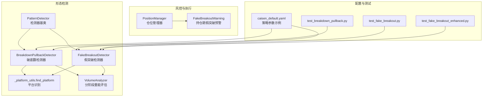
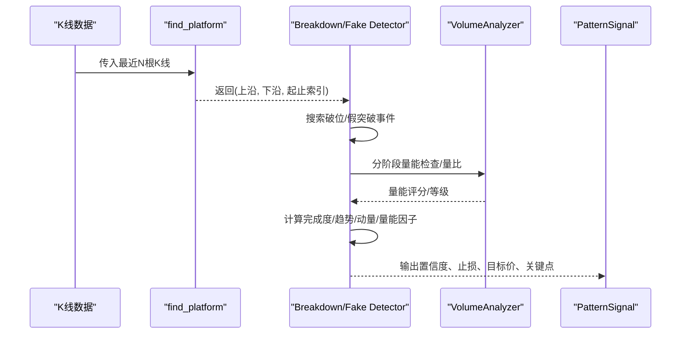
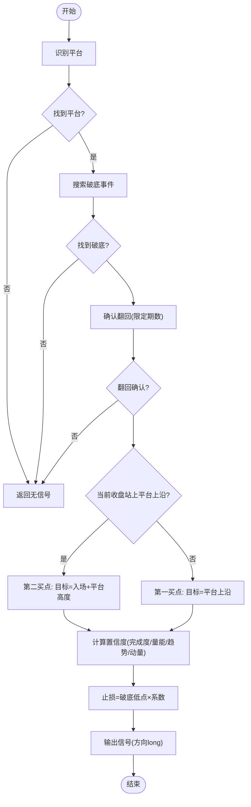
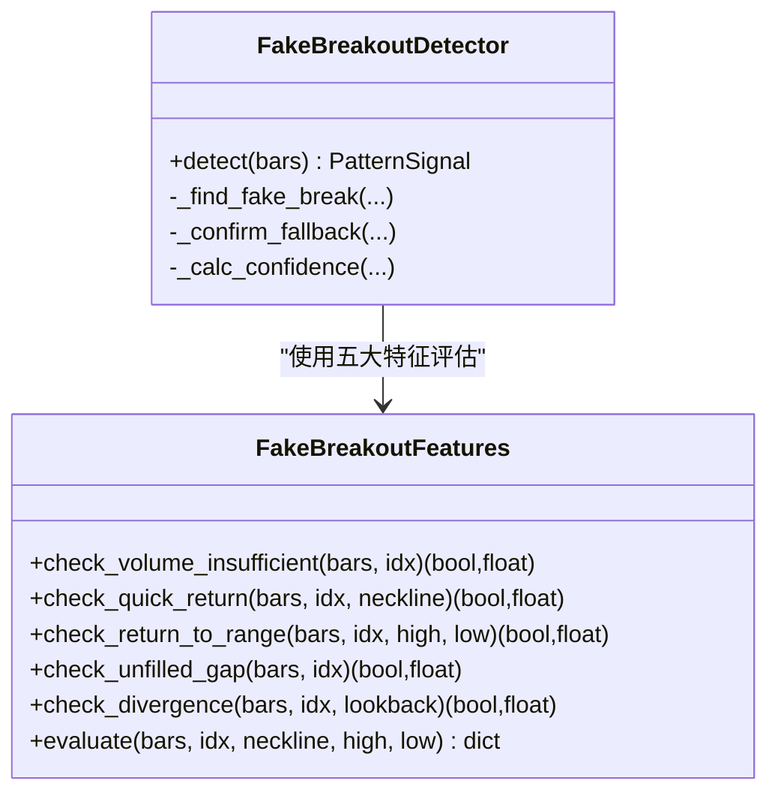
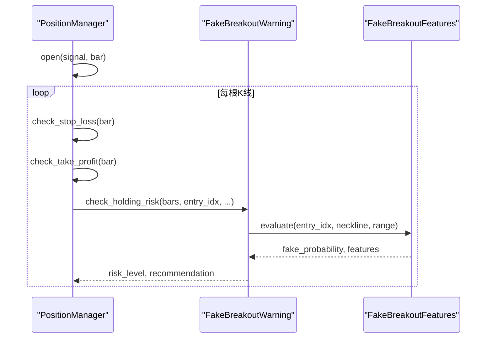
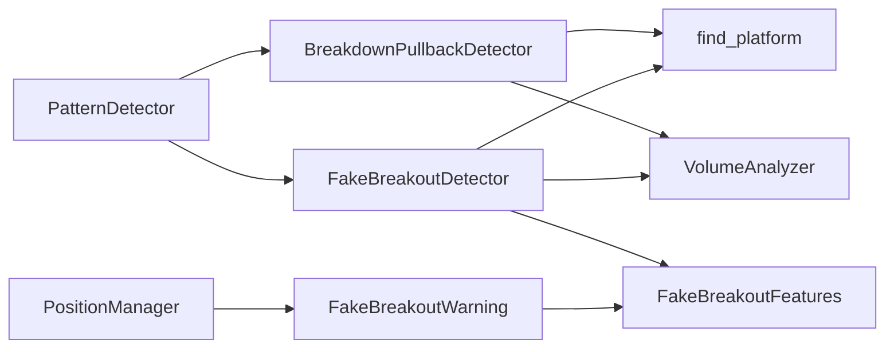

# 突破与假突破形态

<cite>
**本文引用的文件列表**
- [breakdown_pullback.py](file://src/caisen/strategy/algorithm/patterns/breakdown_pullback.py)
- [fake_breakout.py](file://src/caisen/strategy/algorithm/patterns/fake_breakout.py)
- [_platform_utils.py](file://src/caisen/strategy/algorithm/patterns/_platform_utils.py)
- [detector.py](file://src/caisen/strategy/algorithm/detector.py)
- [volume_analyzer.py](file://src/caisen/strategy/algorithm/caisen_components/volume_analyzer.py)
- [position_manager.py](file://src/caisen/strategy/algorithm/caisen_components/position_manager.py)
- [caisen_default.yaml](file://configs/strategies/caisen_default.yaml)
- [test_breakdown_pullback.py](file://tests/test_breakdown_pullback.py)
- [test_fake_breakout.py](file://tests/test_fake_breakout.py)
- [test_fake_breakout_enhanced.py](file://tests/test_fake_breakout_enhanced.py)
</cite>

## 目录
1. [简介](#简介)
2. [项目结构](#项目结构)
3. [核心组件](#核心组件)
4. [架构总览](#架构总览)
5. [详细组件分析](#详细组件分析)
6. [依赖关系分析](#依赖关系分析)
7. [性能考量](#性能考量)
8. [故障排查指南](#故障排查指南)
9. [结论](#结论)
10. [附录](#附录)

## 简介
本文件围绕 Caisen 量化回测系统中的“突破与假突破”形态识别能力，系统性阐述以下要点：
- 突破回调（破底翻）与假突破的识别算法与市场行为解释
- 真突破与假突破的关键判别指标：成交量变化、价格回撤幅度、时间确认等
- 突破回调的入场时机选择与止损设置策略
- 假突破识别的参数配置选项：突破力度阈值、回调深度限制、时间过滤条件等
- 突破交易的风险管理与仓位控制方法
- 实战案例与统计分析思路（基于测试用例与可复现实验路径）

## 项目结构
与突破/假突破相关的代码主要位于策略算法模块中，包含平台识别工具、检测器基类、具体形态检测器、量能分析器以及仓位管理器等。

图表来源
- [detector.py:80-150](file://src/caisen/strategy/algorithm/detector.py#L80-L150)
- [breakdown_pullback.py:17-128](file://src/caisen/strategy/algorithm/patterns/breakdown_pullback.py#L17-L128)
- [fake_breakout.py:299-424](file://src/caisen/strategy/algorithm/patterns/fake_breakout.py#L299-L424)
- [_platform_utils.py:12-74](file://src/caisen/strategy/algorithm/patterns/_platform_utils.py#L12-L74)
- [volume_analyzer.py:15-125](file://src/caisen/strategy/algorithm/caisen_components/volume_analyzer.py#L15-L125)
- [position_manager.py:24-170](file://src/caisen/strategy/algorithm/caisen_components/position_manager.py#L24-L170)
- [caisen_default.yaml:1-50](file://configs/strategies/caisen_default.yaml#L1-L50)

章节来源
- [detector.py:80-150](file://src/caisen/strategy/algorithm/detector.py#L80-L150)
- [breakdown_pullback.py:17-128](file://src/caisen/strategy/algorithm/patterns/breakdown_pullback.py#L17-L128)
- [fake_breakout.py:299-424](file://src/caisen/strategy/algorithm/patterns/fake_breakout.py#L299-L424)
- [_platform_utils.py:12-74](file://src/caisen/strategy/algorithm/patterns/_platform_utils.py#L12-L74)
- [volume_analyzer.py:15-125](file://src/caisen/strategy/algorithm/caisen_components/volume_analyzer.py#L15-L125)
- [position_manager.py:24-170](file://src/caisen/strategy/algorithm/caisen_components/position_manager.py#L24-L170)
- [caisen_default.yaml:1-50](file://configs/strategies/caisen_default.yaml#L1-L50)

## 核心组件
- 平台识别工具：在回看窗口内寻找振幅受限且长度足够的整理区间，输出上沿、下沿及起止索引。
- 破底翻检测器：识别“跌破平台下沿后快速站回”的底部反转信号，支持第一买点（站回颈线）与第二买点（突破平台上沿）。
- 假突破检测器：识别“短暂突破平台上沿后跌回内部”的顶部陷阱信号，并融合五大特征进行加权评分。
- 量能分析器：按阶段评估放量/缩量是否符合预期，提供分级与背离检测。
- 仓位管理器：负责开仓、止损/止盈检查，并提供持仓期间的假突破风险预警。

章节来源
- [_platform_utils.py:12-74](file://src/caisen/strategy/algorithm/patterns/_platform_utils.py#L12-L74)
- [breakdown_pullback.py:17-128](file://src/caisen/strategy/algorithm/patterns/breakdown_pullback.py#L17-L128)
- [fake_breakout.py:299-424](file://src/caisen/strategy/algorithm/patterns/fake_breakout.py#L299-L424)
- [volume_analyzer.py:15-125](file://src/caisen/strategy/algorithm/caisen_components/volume_analyzer.py#L15-L125)
- [position_manager.py:24-170](file://src/caisen/strategy/algorithm/caisen_components/position_manager.py#L24-L170)

## 架构总览
下图展示从K线输入到信号输出的关键流程，包括平台识别、形态判定、置信度计算与风控参数生成。

图表来源
- [_platform_utils.py:12-74](file://src/caisen/strategy/algorithm/patterns/_platform_utils.py#L12-L74)
- [breakdown_pullback.py:47-128](file://src/caisen/strategy/algorithm/patterns/breakdown_pullback.py#L47-L128)
- [fake_breakout.py:331-424](file://src/caisen/strategy/algorithm/patterns/fake_breakout.py#L331-L424)
- [volume_analyzer.py:55-125](file://src/caisen/strategy/algorithm/caisen_components/volume_analyzer.py#L55-L125)
- [detector.py:125-180](file://src/caisen/strategy/algorithm/detector.py#L125-L180)

## 详细组件分析

### 平台识别工具 find_platform
- 功能：在回看窗口内滑动扫描，寻找振幅不超过阈值的连续区间，并以“长度×(1-振幅/最大振幅)”为评分，选出最优平台。
- 输出：平台上沿、下沿、起止索引；若找不到则返回空。
- 复杂度：近似 O(W^2)，W 为回看窗口长度；可通过调整 lookback_period 控制成本。

章节来源
- [_platform_utils.py:12-74](file://src/caisen/strategy/algorithm/patterns/_platform_utils.py#L12-L74)

### 破底翻检测器 BreakdownPullbackDetector
- 识别逻辑：
  - 平台识别后，在平台结束后寻找“低点到下沿跌幅不超过容忍度”的破底事件。
  - 在限定K线数内确认“收盘价回到下沿之上”的翻回。
  - 根据当前收盘价是否站上平台上沿区分第一买点与第二买点。
- 置信度四因子：
  - 完成度：破底越浅、翻回越快，完成度越高；第二买点额外加分。
  - 量能：分阶段量能评分（拉回应缩量、突破应放量），或整体量比。
  - 趋势：前期下跌趋势共振更强。
  - 动量：翻回力度（相对下沿的涨幅）。
- 止损与目标：
  - 止损：破底最低点 × 止损系数（小于1）。
  - 目标：第一买点目标为平台上沿；第二买点目标为入场价+平台高度。

图表来源
- [breakdown_pullback.py:47-128](file://src/caisen/strategy/algorithm/patterns/breakdown_pullback.py#L47-L128)
- [breakdown_pullback.py:130-176](file://src/caisen/strategy/algorithm/patterns/breakdown_pullback.py#L130-L176)
- [breakdown_pullback.py:177-259](file://src/caisen/strategy/algorithm/patterns/breakdown_pullback.py#L177-L259)

章节来源
- [breakdown_pullback.py:17-128](file://src/caisen/strategy/algorithm/patterns/breakdown_pullback.py#L17-L128)
- [breakdown_pullback.py:130-176](file://src/caisen/strategy/algorithm/patterns/breakdown_pullback.py#L130-L176)
- [breakdown_pullback.py:177-259](file://src/caisen/strategy/algorithm/patterns/breakdown_pullback.py#L177-L259)

### 假突破检测器 FakeBreakoutDetector 与五大特征
- 识别逻辑：
  - 平台识别后，在平台结束后寻找“高点上穿平台上沿但突破幅度不超过容忍度”的事件。
  - 在限定K线数内确认“收盘价回到平台上沿之下”。
  - 根据是否跌破平台下沿区分信号强度（跌破下沿为更强看空信号）。
- 五大特征评估（加权概率）：
  - 量能不足：突破当根量低于均量的倍数阈值。
  - 快速回返：突破后若干根内回到颈线附近。
  - 回到形态内部：价格重新进入整理区间。
  - 跳空缺口未填补：向上跳空但未有效回补。
  - 量价背离：价格接近前高但成交量未创新高。
- 置信度融合：基础四因子 + 五大特征加权概率加成。

图表来源
- [fake_breakout.py:18-297](file://src/caisen/strategy/algorithm/patterns/fake_breakout.py#L18-L297)
- [fake_breakout.py:299-511](file://src/caisen/strategy/algorithm/patterns/fake_breakout.py#L299-L511)

章节来源
- [fake_breakout.py:18-297](file://src/caisen/strategy/algorithm/patterns/fake_breakout.py#L18-L297)
- [fake_breakout.py:299-511](file://src/caisen/strategy/algorithm/patterns/fake_breakout.py#L299-L511)

### 量能分析器 VolumeAnalyzer
- 分阶段量能检查：对“形成期/突破期/确认期”分别评估放量或缩量的合理性，给出通过与否与得分。
- 量级分级：将突破时的量级分为弱/正常/强。
- 量价背离与递增检查：用于辅助判断动能衰减或增强。

章节来源
- [volume_analyzer.py:15-125](file://src/caisen/strategy/algorithm/caisen_components/volume_analyzer.py#L15-L125)
- [volume_analyzer.py:127-224](file://src/caisen/strategy/algorithm/caisen_components/volume_analyzer.py#L127-L224)

### 仓位管理器 PositionManager 与假突破预警
- 开仓/平仓：依据信号中的止损和目标价执行。
- 止损/止盈：最低价跌破止损或最高价达到目标即触发。
- 假突破预警：在持仓期间持续评估五大特征，按风险等级建议持有、减仓或退出。

图表来源
- [position_manager.py:89-170](file://src/caisen/strategy/algorithm/caisen_components/position_manager.py#L89-L170)
- [position_manager.py:172-285](file://src/caisen/strategy/algorithm/caisen_components/position_manager.py#L172-L285)
- [fake_breakout.py:225-297](file://src/caisen/strategy/algorithm/patterns/fake_breakout.py#L225-L297)

章节来源
- [position_manager.py:89-170](file://src/caisen/strategy/algorithm/caisen_components/position_manager.py#L89-L170)
- [position_manager.py:172-285](file://src/caisen/strategy/algorithm/caisen_components/position_manager.py#L172-L285)

## 依赖关系分析
- 检测器基类提供通用能力：置信度加权、趋势判断、量比计算、信号构造。
- 两个形态检测器共享平台识别工具与量能分析器。
- 假突破检测器内置五大特征评估器，并在信号中附带评估结果。
- 仓位管理器依赖信号中的止损/目标价，并在持仓期调用假突破预警。

图表来源
- [detector.py:80-150](file://src/caisen/strategy/algorithm/detector.py#L80-L150)
- [breakdown_pullback.py:17-128](file://src/caisen/strategy/algorithm/patterns/breakdown_pullback.py#L17-L128)
- [fake_breakout.py:299-424](file://src/caisen/strategy/algorithm/patterns/fake_breakout.py#L299-L424)
- [position_manager.py:24-170](file://src/caisen/strategy/algorithm/caisen_components/position_manager.py#L24-L170)

章节来源
- [detector.py:80-150](file://src/caisen/strategy/algorithm/detector.py#L80-L150)
- [breakdown_pullback.py:17-128](file://src/caisen/strategy/algorithm/patterns/breakdown_pullback.py#L17-L128)
- [fake_breakout.py:299-424](file://src/caisen/strategy/algorithm/patterns/fake_breakout.py#L299-L424)
- [position_manager.py:24-170](file://src/caisen/strategy/algorithm/caisen_components/position_manager.py#L24-L170)

## 性能考量
- 平台识别采用滑动窗口双重循环，时间复杂度与回看窗口平方相关。建议在高频场景下调小 lookback_period 或限制 min_platform_bars。
- 量能分析器的分阶段检查会遍历多个阶段区间，注意避免重复计算；可在上层缓存阶段边界。
- 假突破五大特征评估涉及多窗口统计（如均量、前高/前量），建议复用历史统计值以减少重复计算。
- 置信度计算为常数时间操作，开销较小。

[本节为一般性指导，不直接分析具体文件]

## 故障排查指南
- 无信号问题：
  - 检查数据长度是否满足 min_bars。
  - 检查平台是否存在（lookback_period、max_amplitude、min_platform_bars 是否过于严格）。
  - 检查破底/假突破容忍度是否过小导致无法命中。
- 信号过少或过多：
  - 放宽/收紧 max_pullback_bars / max_fallback_bars 以调节时间确认窗口。
  - 调整 breakdown_tolerance / fake_tolerance 以控制“假突破”与“真突破”的边界。
- 置信度异常：
  - 检查量能阶段划分是否正确（起始/结束索引）。
  - 检查趋势判断周期是否合理（默认20根）。
- 持仓预警误报：
  - 调整 warning_threshold 以降低/提高敏感度。
  - 核查入场索引是否越界或无效。

章节来源
- [test_breakdown_pullback.py:36-71](file://tests/test_breakdown_pullback.py#L36-L71)
- [test_fake_breakout.py:36-58](file://tests/test_fake_breakout.py#L36-L58)
- [test_fake_breakout_enhanced.py:463-562](file://tests/test_fake_breakout_enhanced.py#L463-L562)

## 结论
Caisen 的突破与假突破形态体系以“平台识别 + 形态判定 + 量能验证 + 置信度融合 + 风控执行”为主线，既强调技术形态的结构完整性，又重视量能与时间维度的多重确认。通过可调参数与分层置信度，系统能够在不同市场环境下灵活平衡胜率与盈亏比，并为实战提供清晰的入场、止损与风险管理指引。

[本节为总结性内容，不直接分析具体文件]

## 附录

### 真突破与假突破的区别特征
- 成交量变化：
  - 真突破：突破时放量显著（通常≥1.5倍均量），后续确认期维持放量或健康缩量回踩。
  - 假突破：突破时量能不足或出现量价背离，随后快速回落。
- 价格回撤幅度：
  - 真突破：突破后回踩不破关键支撑（如下沿/颈线），或仅轻微回撤。
  - 假突破：突破幅度有限（容忍范围内），随后跌回平台内部甚至跌破下沿。
- 时间确认：
  - 真突破：在限定时间内站稳关键位（如站上平台上沿）。
  - 假突破：在限定时间内未能站稳，迅速跌回。

章节来源
- [volume_analyzer.py:127-156](file://src/caisen/strategy/algorithm/caisen_components/volume_analyzer.py#L127-L156)
- [breakdown_pullback.py:87-101](file://src/caisen/strategy/algorithm/patterns/breakdown_pullback.py#L87-L101)
- [fake_breakout.py:369-384](file://src/caisen/strategy/algorithm/patterns/fake_breakout.py#L369-L384)

### 突破回调的入场时机与止损设置
- 入场时机：
  - 第一买点：翻回确认后收盘价站上平台下沿。
  - 第二买点：进一步站上平台上沿，置信度更高。
- 止损设置：
  - 以破底最低点乘以止损系数（小于1）作为止损价。
- 目标价：
  - 第一买点目标为平台上沿；第二买点目标为入场价+平台高度。

章节来源
- [breakdown_pullback.py:87-101](file://src/caisen/strategy/algorithm/patterns/breakdown_pullback.py#L87-L101)
- [breakdown_pullback.py:100-101](file://src/caisen/strategy/algorithm/patterns/breakdown_pullback.py#L100-L101)

### 假突破识别的参数配置选项
- 突破力度阈值：
  - fake_tolerance：控制“假突破”的最大突破幅度比例。
  - volume_threshold：量能不足的倍数阈值（低于此值视为量能不足）。
- 回调深度限制：
  - max_fallback_bars：假突破后确认跌回的K线窗口。
  - return_bars：五大特征中“快速回返”的时间窗口。
- 时间过滤条件：
  - lookback_period：平台识别的回看窗口。
  - min_platform_bars：平台最少K线数。
  - volume_period：均量计算周期。

章节来源
- [fake_breakout.py:309-329](file://src/caisen/strategy/algorithm/patterns/fake_breakout.py#L309-L329)
- [fake_breakout.py:29-43](file://src/caisen/strategy/algorithm/patterns/fake_breakout.py#L29-L43)
- [_platform_utils.py:12-33](file://src/caisen/strategy/algorithm/patterns/_platform_utils.py#L12-L33)

### 突破交易的风险管理与仓位控制
- 止损/止盈：
  - 止损：依据信号 stop_loss；止盈：依据信号 target。
- 移动止损：
  - 配置文件支持 trailing_stop_pct 与开关，用于动态保护利润。
- 仓位控制：
  - first_position_pct：第一买点轻仓试单。
  - second_position_pct：第二买点确认加仓。
- 假突破预警：
  - 持仓期间评估五大特征，按风险等级建议持有、减仓或退出。

章节来源
- [caisen_default.yaml:16-24](file://configs/strategies/caisen_default.yaml#L16-L24)
- [position_manager.py:109-147](file://src/caisen/strategy/algorithm/caisen_components/position_manager.py#L109-L147)
- [position_manager.py:172-285](file://src/caisen/strategy/algorithm/caisen_components/position_manager.py#L172-L285)

### 实战案例与统计分析思路
- 单元测试覆盖典型场景：
  - 破底翻：无平台、跌破未翻回、深跌破、第一/第二买点、置信度范围、止损与目标价正确性。
  - 假突破：真突破不触发、浅刺破回落、跌破下沿更强信号、方向为 short、置信度范围。
  - 五大特征：量能不足、快速回返、回到区间、跳空未填、量价背离、综合评估与推荐。
- 统计与分析建议：
  - 在不同品种与周期上批量运行，收集信号样本，统计胜率、盈亏比、最大回撤。
  - 对比不同参数组合（如 tolerance、return_bars、volume_threshold）下的表现差异。
  - 结合量能分级与五大特征评分，筛选高置信度信号以提升稳定性。

章节来源
- [test_breakdown_pullback.py:36-131](file://tests/test_breakdown_pullback.py#L36-L131)
- [test_fake_breakout.py:36-114](file://tests/test_fake_breakout.py#L36-L114)
- [test_fake_breakout_enhanced.py:58-379](file://tests/test_fake_breakout_enhanced.py#L58-L379)