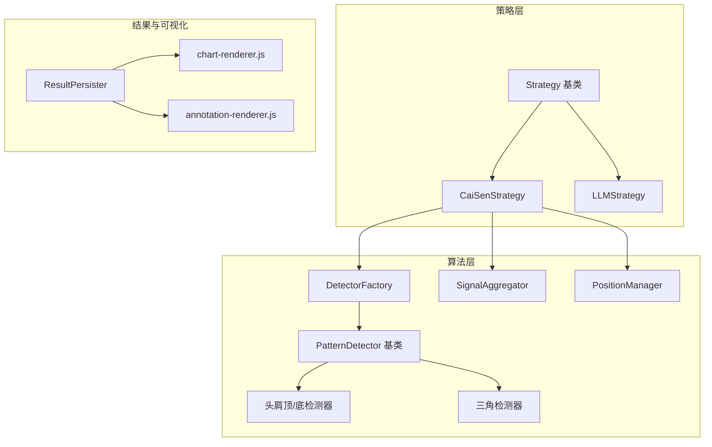
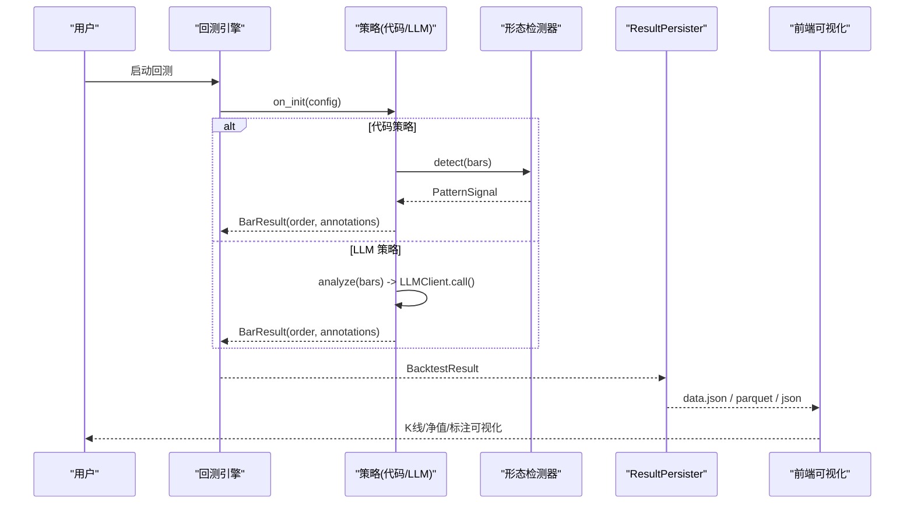
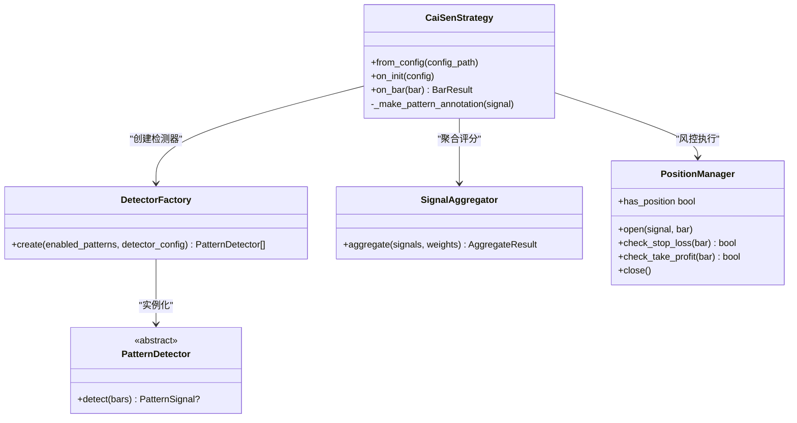
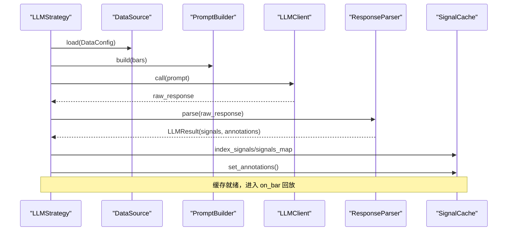
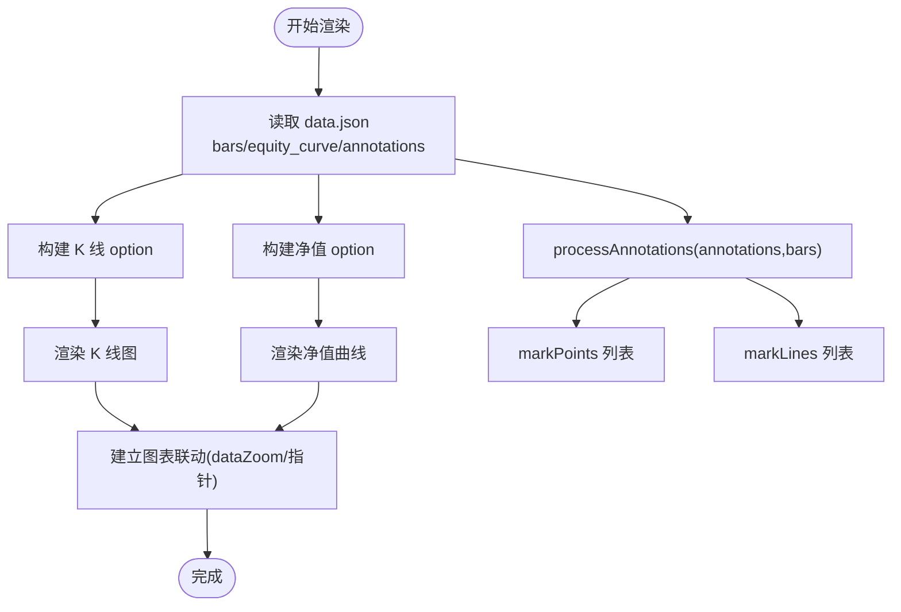
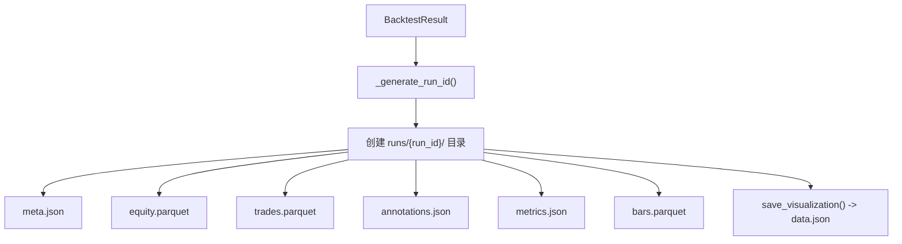
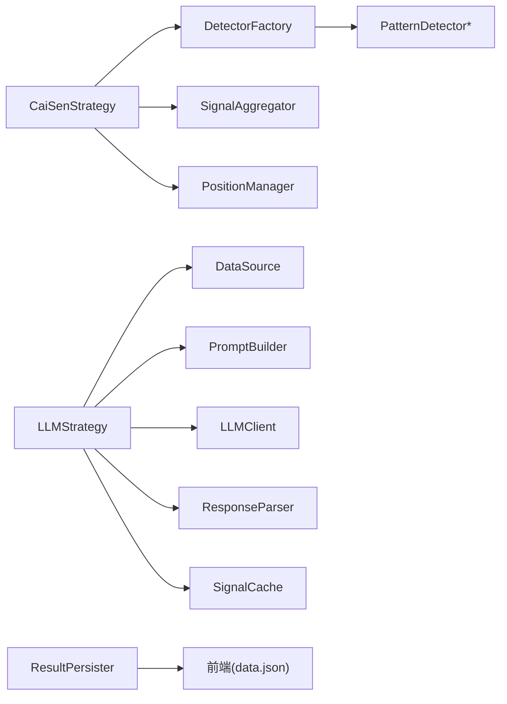

# 核心特性

<cite>
**本文引用的文件**   
- [src/caisen/strategy/base.py](file://src/caisen/strategy/base.py)
- [src/caisen/strategy/algorithm/cai_sen.py](file://src/caisen/strategy/algorithm/cai_sen.py)
- [src/caisen/strategy/algorithm/detector.py](file://src/caisen/strategy/algorithm/detector.py)
- [src/caisen/strategy/algorithm/patterns/head_shoulders.py](file://src/caisen/strategy/algorithm/patterns/head_shoulders.py)
- [src/caisen/strategy/algorithm/patterns/triangle.py](file://src/caisen/strategy/algorithm/patterns/triangle.py)
- [src/caisen/strategy/algorithm/caisen_components/factory.py](file://src/caisen/strategy/algorithm/caisen_components/factory.py)
- [src/caisen/strategy/llm/strategy.py](file://src/caisen/strategy/llm/strategy.py)
- [src/caisen/strategy/llm/client.py](file://src/caisen/strategy/llm/client.py)
- [src/caisen/core/annotation.py](file://src/caisen/core/annotation.py)
- [src/caisen/result/persistence.py](file://src/caisen/result/persistence.py)
- [src/caisen/frontend/src/js/chart-renderer.js](file://src/caisen/frontend/src/js/chart-renderer.js)
- [src/caisen/frontend/src/js/annotation-renderer.js](file://src/caisen/frontend/src/js/annotation-renderer.js)
- [configs/strategies/caisen_default.yaml](file://configs/strategies/caisen_default.yaml)
- [examples/caisen_strategy_template.yaml](file://examples/caisen_strategy_template.yaml)
- [README.md](file://README.md)
</cite>

## 目录
1. [简介](#简介)
2. [项目结构](#项目结构)
3. [核心组件](#核心组件)
4. [架构总览](#架构总览)
5. [详细组件分析](#详细组件分析)
6. [依赖分析](#依赖分析)
7. [性能考虑](#性能考虑)
8. [故障排查指南](#故障排查指南)
9. [结论](#结论)
10. [附录](#附录)

## 简介
本文件面向 Caisen 量化回测系统的“核心特性”，聚焦以下能力：
- 代码策略开发框架与 Strategy 基类的使用和扩展机制
- LLM 策略的离线预计算、自主决策与集成方式
- 蔡森十二形态识别系统（头肩顶/底、三角、旗形等）的检测算法与配置
- 可视化报告（K线图、净值曲线、交易标注、形态标记）的渲染机制
- 结果持久化系统（Parquet 存储与自动 run_id 管理）

每个特性均提供使用示例与配置选项，帮助快速上手与二次开发。

## 项目结构
Caisen 采用分层模块化设计：
- 策略层：Strategy 抽象基类 + 具体策略（代码策略、LLM 策略）
- 算法层：形态检测器（纯函数接口）、信号聚合与仓位管理
- 数据与结果：数据源、回测结果持久化（Parquet/JSON）
- 前端可视化：ECharts 图表与标注渲染

图示来源
- [src/caisen/strategy/base.py:19-37](file://src/caisen/strategy/base.py#L19-L37)
- [src/caisen/strategy/algorithm/cai_sen.py:36-136](file://src/caisen/strategy/algorithm/cai_sen.py#L36-L136)
- [src/caisen/strategy/algorithm/detector.py:80-124](file://src/caisen/strategy/algorithm/detector.py#L80-L124)
- [src/caisen/strategy/algorithm/patterns/head_shoulders.py:11-91](file://src/caisen/strategy/algorithm/patterns/head_shoulders.py#L11-L91)
- [src/caisen/strategy/algorithm/patterns/triangle.py:11-72](file://src/caisen/strategy/algorithm/patterns/triangle.py#L11-L72)
- [src/caisen/strategy/algorithm/caisen_components/factory.py:54-111](file://src/caisen/strategy/algorithm/caisen_components/factory.py#L54-L111)
- [src/caisen/result/persistence.py:59-133](file://src/caisen/result/persistence.py#L59-L133)
- [src/caisen/frontend/src/js/chart-renderer.js:95-137](file://src/caisen/frontend/src/js/chart-renderer.js#L95-L137)
- [src/caisen/frontend/src/js/annotation-renderer.js:15-36](file://src/caisen/frontend/src/js/annotation-renderer.js#L15-L36)

章节来源
- [README.md:1-12](file://README.md#L1-L12)

## 核心组件
- 策略基类 Strategy：定义 on_init/on_bar/on_session_end/reset 生命周期钩子，统一返回 BarResult（订单+标注）。
- CaiSenStrategy：组合多形态检测器，通过 DetectorFactory 创建，SignalAggregator 聚合评分，PositionManager 风控执行。
- LLMStrategy：离线预计算模式，on_init 一次性拉取数据并调用 LLM 生成 signals/annotations，on_bar 回放查缓存输出订单。
- 结果持久化 ResultPersister：保存 meta/equity/trades/annotations/bars/metrics/data.json，自动生成 run_id。
- 可视化渲染：chart-renderer.js 负责 K 线与净值图；annotation-renderer.js 将 Annotation 转为 ECharts markPoints/markLines。

章节来源
- [src/caisen/strategy/base.py:19-37](file://src/caisen/strategy/base.py#L19-L37)
- [src/caisen/strategy/algorithm/cai_sen.py:174-245](file://src/caisen/strategy/algorithm/cai_sen.py#L174-L245)
- [src/caisen/strategy/llm/strategy.py:131-235](file://src/caisen/strategy/llm/strategy.py#L131-L235)
- [src/caisen/result/persistence.py:59-133](file://src/caisen/result/persistence.py#L59-L133)
- [src/caisen/frontend/src/js/chart-renderer.js:95-137](file://src/caisen/frontend/src/js/chart-renderer.js#L95-L137)
- [src/caisen/frontend/src/js/annotation-renderer.js:15-36](file://src/caisen/frontend/src/js/annotation-renderer.js#L15-L36)

## 架构总览
下图展示从策略到可视化与持久化的端到端流程。

图示来源
- [src/caisen/strategy/base.py:22-33](file://src/caisen/strategy/base.py#L22-L33)
- [src/caisen/strategy/algorithm/cai_sen.py:178-221](file://src/caisen/strategy/algorithm/cai_sen.py#L178-L221)
- [src/caisen/strategy/llm/strategy.py:98-179](file://src/caisen/strategy/llm/strategy.py#L98-L179)
- [src/caisen/result/persistence.py:63-133](file://src/caisen/result/persistence.py#L63-L133)
- [src/caisen/frontend/src/js/chart-renderer.js:95-137](file://src/caisen/frontend/src/js/chart-renderer.js#L95-L137)

## 详细组件分析

### 代码策略框架与 Strategy 基类
- 生命周期
  - on_init：回测开始前初始化（如加载外部资源、预热指标）
  - on_bar：逐根 K 线处理，返回 BarResult（包含 Order 与 Annotation）
  - on_session_end：回测结束清理
  - reset：重置状态以便重复运行
- 扩展机制
  - 继承 Strategy，实现 on_bar 即可接入回测引擎
  - 通过 BarResult 携带订单与标注，统一对接可视化与结果持久化

使用示例（路径）
- 参考模板与 README 中的策略示例
  - [examples/caisen_strategy_template.yaml:1-59](file://examples/caisen_strategy_template.yaml#L1-L59)
  - [README.md:237-289](file://README.md#L237-L289)

章节来源
- [src/caisen/strategy/base.py:19-37](file://src/caisen/strategy/base.py#L19-L37)

### CaiSenStrategy（蔡森十二形态组合策略）
- 组件化架构
  - DetectorFactory：按 enabled_patterns 动态创建检测器实例
  - SignalAggregator：对多个检测器信号加权聚合，输出 best_signal
  - PositionManager：持仓管理与止损/止盈触发
- 决策流程
  - 入场：best_signal.confidence >= threshold 且未持仓时买入
  - 止损/止盈：根据 PositionManager 规则平仓
  - 标注：为入场点生成 PATTERN_MARK 标注，便于可视化

图示来源
- [src/caisen/strategy/algorithm/cai_sen.py:36-136](file://src/caisen/strategy/algorithm/cai_sen.py#L36-L136)
- [src/caisen/strategy/algorithm/caisen_components/factory.py:54-111](file://src/caisen/strategy/algorithm/caisen_components/factory.py#L54-L111)
- [src/caisen/strategy/algorithm/detector.py:80-124](file://src/caisen/strategy/algorithm/detector.py#L80-L124)

章节来源
- [src/caisen/strategy/algorithm/cai_sen.py:174-245](file://src/caisen/strategy/algorithm/cai_sen.py#L174-L245)
- [src/caisen/strategy/algorithm/caisen_components/factory.py:113-237](file://src/caisen/strategy/algorithm/caisen_components/factory.py#L113-L237)

#### 蔡森十二形态检测算法要点
- 头肩顶/底
  - 条件：左肩/右肩高度相近，头部最低/最高，颈线突破/跌破确认
  - 置信度：完成度（对称性）、成交量放大、趋势共振、动量强度
  - 关键点：points 包含左肩/头/右肩坐标，用于绘制形态连线与颈线
  - 参考实现
    - [src/caisen/strategy/algorithm/patterns/head_shoulders.py:11-91](file://src/caisen/strategy/algorithm/patterns/head_shoulders.py#L11-L91)
    - [src/caisen/strategy/algorithm/patterns/head_shoulders.py:173-247](file://src/caisen/strategy/algorithm/patterns/head_shoulders.py#L173-L247)
- 三角整理
  - 条件：至少3个高点下降、3个低点上升，两趋势线收敛
  - 方向：上轨突破做多，下轨跌破做空
  - 置信度：收敛紧密度、成交量、趋势、突破力度
  - 参考实现
    - [src/caisen/strategy/algorithm/patterns/triangle.py:11-72](file://src/caisen/strategy/algorithm/patterns/triangle.py#L11-L72)
- 其他形态（由工厂映射）
  - W底、M头、旗形、矩形、圆弧底、杯柄、过前高、破底翻、假突破等
  - 参考工厂映射与默认参数
    - [src/caisen/strategy/algorithm/caisen_components/factory.py:23-51](file://src/caisen/strategy/algorithm/caisen_components/factory.py#L23-L51)

章节来源
- [src/caisen/strategy/algorithm/patterns/head_shoulders.py:93-170](file://src/caisen/strategy/algorithm/patterns/head_shoulders.py#L93-L170)
- [src/caisen/strategy/algorithm/patterns/triangle.py:74-143](file://src/caisen/strategy/algorithm/patterns/triangle.py#L74-L143)
- [src/caisen/strategy/algorithm/caisen_components/factory.py:23-51](file://src/caisen/strategy/algorithm/caisen_components/factory.py#L23-L51)

#### 配置与开关
- YAML 配置项（示例）
  - 平台参数、破底翻参数、仓位管理、风险控制、形态开关与权重
  - 参考
    - [configs/strategies/caisen_default.yaml:1-50](file://configs/strategies/caisen_default.yaml#L1-L50)
    - [examples/caisen_strategy_template.yaml:1-59](file://examples/caisen_strategy_template.yaml#L1-L59)
- 运行时启用
  - 通过 DetectorFactory 的 enabled_patterns 控制启用的形态集合
  - 参考
    - [src/caisen/strategy/algorithm/caisen_components/factory.py:81-111](file://src/caisen/strategy/algorithm/caisen_components/factory.py#L81-L111)

章节来源
- [configs/strategies/caisen_default.yaml:1-50](file://configs/strategies/caisen_default.yaml#L1-L50)
- [examples/caisen_strategy_template.yaml:1-59](file://examples/caisen_strategy_template.yaml#L1-L59)
- [src/caisen/strategy/algorithm/caisen_components/factory.py:81-111](file://src/caisen/strategy/algorithm/caisen_components/factory.py#L81-L111)

### LLM 策略（离线预计算架构）
- 设计思路
  - on_init：一次性加载 bars，构建 Prompt，调用 LLMClient.call，解析响应为 signals/annotations，写入缓存
  - on_bar：按时间戳查询缓存，结合当前持仓状态生成 Order；首次调用时批量发出所有 annotations
- 关键组件
  - PromptBuilder：组装上下文与规则
  - LLMClient：封装 API 调用（OpenAIProvider 等）
  - ResponseParser：解析 JSON/结构化响应
  - SignalCache：signals 索引与 annotations 缓存
- 批处理
  - analyze 支持分批调用 LLM，避免长序列推理导致的截断风险

图示来源
- [src/caisen/strategy/llm/strategy.py:98-179](file://src/caisen/strategy/llm/strategy.py#L98-L179)
- [src/caisen/strategy/llm/client.py:21-38](file://src/caisen/strategy/llm/client.py#L21-L38)

章节来源
- [src/caisen/strategy/llm/strategy.py:131-235](file://src/caisen/strategy/llm/strategy.py#L131-L235)
- [src/caisen/strategy/llm/client.py:8-19](file://src/caisen/strategy/llm/client.py#L8-L19)

### 可视化报告与标注渲染
- K 线图与净值曲线
  - chart-renderer.js 负责构建 ECharts option、懒加载与联动同步（dataZoom/axisPointer）
- 标注渲染
  - annotation-renderer.js 将 Annotation 转换为 markPoints/markLines，支持买卖信号、水平线、趋势线、形态标记、支撑/阻力区、文本标签、矩形/多边形等
- 标注类型契约
  - core/annotation.py 定义 AnnotationType 与 Annotation 数据结构，前后端共享

图示来源
- [src/caisen/frontend/src/js/chart-renderer.js:95-137](file://src/caisen/frontend/src/js/chart-renderer.js#L95-L137)
- [src/caisen/frontend/src/js/annotation-renderer.js:15-36](file://src/caisen/frontend/src/js/annotation-renderer.js#L15-L36)
- [src/caisen/core/annotation.py:13-82](file://src/caisen/core/annotation.py#L13-L82)

章节来源
- [src/caisen/frontend/src/js/chart-renderer.js:254-332](file://src/caisen/frontend/src/js/chart-renderer.js#L254-L332)
- [src/caisen/frontend/src/js/annotation-renderer.js:43-59](file://src/caisen/frontend/src/js/annotation-renderer.js#L43-L59)
- [src/caisen/core/annotation.py:39-82](file://src/caisen/core/annotation.py#L39-L82)

### 结果持久化系统（Parquet 与 run_id）
- 保存内容
  - meta.json：元数据（run_id、策略名、标的、区间、资金、收益、交易数等）
  - equity.parquet：净值曲线
  - trades.parquet：交易记录
  - annotations.json：可视化标注
  - metrics.json：绩效指标
  - bars.parquet：K 线数据
  - data.json：前端可视化综合文件
- run_id 生成
  - 格式：{策略名}_{YYYYMMDD}_{序号}，同日同名递增
- 可视化数据生成
  - save_visualization 汇总各文件为 data.json，供前端直接加载

图示来源
- [src/caisen/result/persistence.py:17-39](file://src/caisen/result/persistence.py#L17-L39)
- [src/caisen/result/persistence.py:63-133](file://src/caisen/result/persistence.py#L63-L133)
- [src/caisen/result/persistence.py:135-201](file://src/caisen/result/persistence.py#L135-L201)

章节来源
- [src/caisen/result/persistence.py:59-133](file://src/caisen/result/persistence.py#L59-L133)
- [src/caisen/result/persistence.py:204-245](file://src/caisen/result/persistence.py#L204-L245)

## 依赖分析
- 策略与检测器
  - CaiSenStrategy 依赖 DetectorFactory 创建具体检测器，再经 SignalAggregator 聚合后交由 PositionManager 执行
- LLM 策略
  - LLMStrategy 依赖 DataSource/PromptBuilder/LLMClient/ResponseParser/SignalCache，解耦清晰
- 可视化与持久化
  - ResultPersister 产出 Parquet/JSON 与 data.json，前端 chart-renderer.js 与 annotation-renderer.js 消费 data.json

图示来源
- [src/caisen/strategy/algorithm/cai_sen.py:107-136](file://src/caisen/strategy/algorithm/cai_sen.py#L107-L136)
- [src/caisen/strategy/algorithm/caisen_components/factory.py:81-111](file://src/caisen/strategy/algorithm/caisen_components/factory.py#L81-L111)
- [src/caisen/strategy/llm/strategy.py:30-68](file://src/caisen/strategy/llm/strategy.py#L30-L68)
- [src/caisen/result/persistence.py:135-201](file://src/caisen/result/persistence.py#L135-L201)

章节来源
- [src/caisen/strategy/algorithm/cai_sen.py:107-136](file://src/caisen/strategy/algorithm/cai_sen.py#L107-L136)
- [src/caisen/strategy/llm/strategy.py:30-68](file://src/caisen/strategy/llm/strategy.py#L30-L68)
- [src/caisen/result/persistence.py:135-201](file://src/caisen/result/persistence.py#L135-L201)

## 性能考虑
- 前端渲染优化
  - 懒加载：IntersectionObserver 延迟初始化图表容器
  - 防抖：窗口 resize 事件统一防抖，减少重绘开销
  - 联动：WeakSet 跟踪已绑定图表，避免重复监听
- 策略侧
  - LLM 策略支持分批 analyze，降低单次 token 消耗与截断风险
  - 检测器为纯函数接口，无内部状态，利于并行测试与复用

章节来源
- [src/caisen/frontend/src/js/chart-renderer.js:59-90](file://src/caisen/frontend/src/js/chart-renderer.js#L59-L90)
- [src/caisen/frontend/src/js/chart-renderer.js:29-46](file://src/caisen/frontend/src/js/chart-renderer.js#L29-L46)
- [src/caisen/strategy/llm/strategy.py:98-129](file://src/caisen/strategy/llm/strategy.py#L98-L129)
- [src/caisen/strategy/algorithm/detector.py:80-124](file://src/caisen/strategy/algorithm/detector.py#L80-L124)

## 故障排查指南
- 前端图表异常
  - 若 ECharts 初始化或 setOption 失败，chart-renderer.js 会尝试简化配置（移除复杂 markPoint/markLine）进行降级渲染
  - 检查 data.json 是否存在且字段完整
- 标注缺失或错位
  - 确认 annotations.json 中 timestamp 与 bars 的时间对齐
  - 检查 annotation type 是否在渲染器支持列表中
- LLM 策略无信号
  - 检查 PromptBuilder 是否可用、LLMClient 是否成功返回响应
  - 查看缓存是否成功索引 signals 与 annotations
- 结果无法加载
  - 确认 runs/{run_id}/data.json 存在，或分别检查 parquet/json 文件完整性

章节来源
- [src/caisen/frontend/src/js/chart-renderer.js:179-197](file://src/caisen/frontend/src/js/chart-renderer.js#L179-L197)
- [src/caisen/frontend/src/js/annotation-renderer.js:43-59](file://src/caisen/frontend/src/js/annotation-renderer.js#L43-L59)
- [src/caisen/strategy/llm/strategy.py:131-179](file://src/caisen/strategy/llm/strategy.py#L131-L179)
- [src/caisen/result/persistence.py:204-245](file://src/caisen/result/persistence.py#L204-L245)

## 结论
Caisen 以清晰的策略抽象与组件化形态检测为核心，结合 LLM 离线预计算与完善的可视化/持久化体系，形成从策略研发到结果呈现的一体化闭环。通过 DetectorFactory 与统一的 Annotation 契约，系统具备良好的可扩展性与可维护性。

## 附录

### 使用示例与配置清单
- 运行回测（模拟数据）
  - 命令参考
    - [README.md:52-74](file://README.md#L52-L74)
- 查看与启动可视化服务
  - 命令参考
    - [README.md:76-96](file://README.md#L76-L96)
- 编写自定义策略
  - 模板与说明
    - [examples/caisen_strategy_template.yaml:1-59](file://examples/caisen_strategy_template.yaml#L1-L59)
    - [README.md:237-289](file://README.md#L237-L289)
- CaiSen 策略配置项
  - 平台/破底翻/风控/形态开关与权重
    - [configs/strategies/caisen_default.yaml:1-50](file://configs/strategies/caisen_default.yaml#L1-L50)