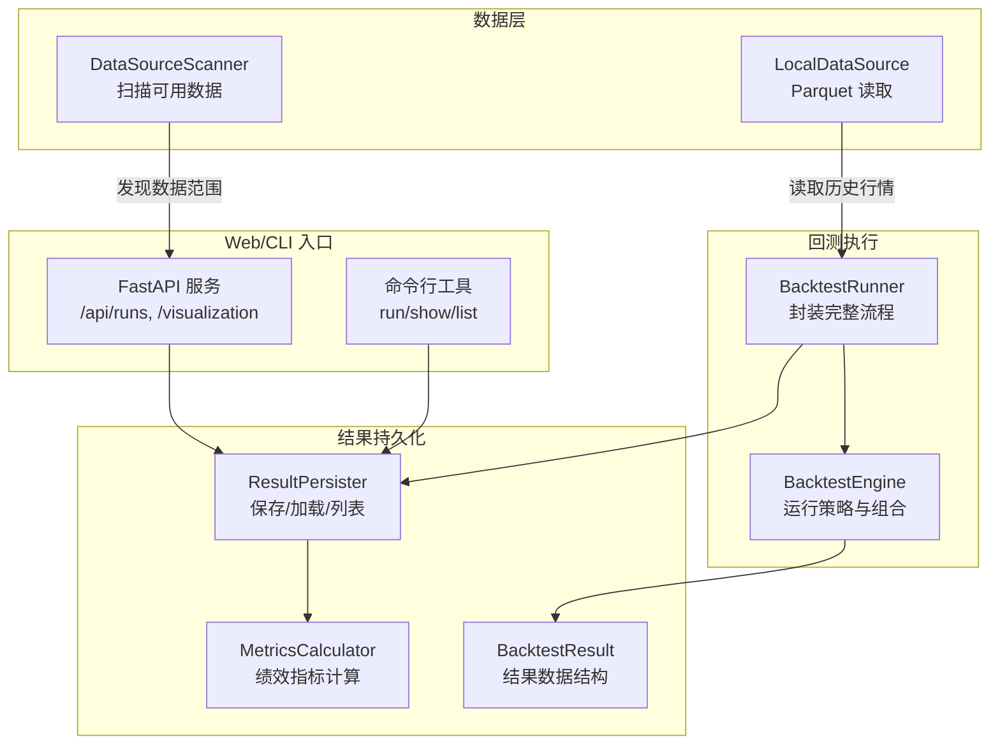
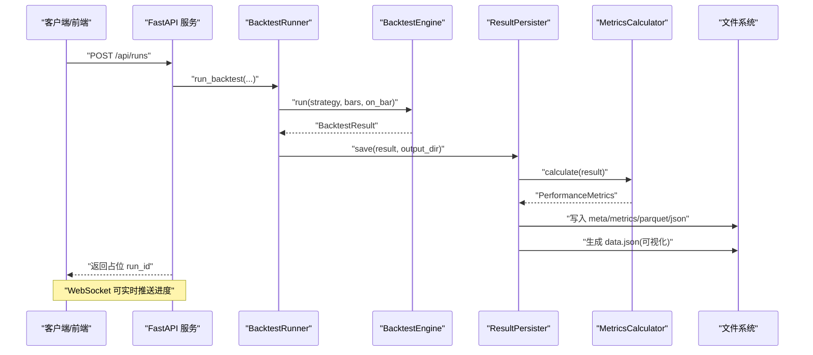
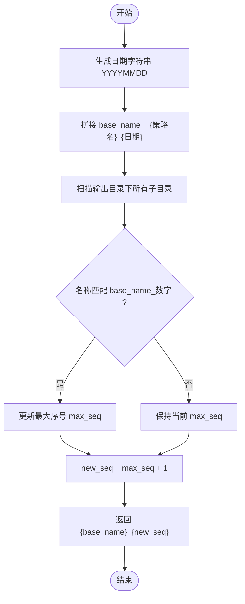
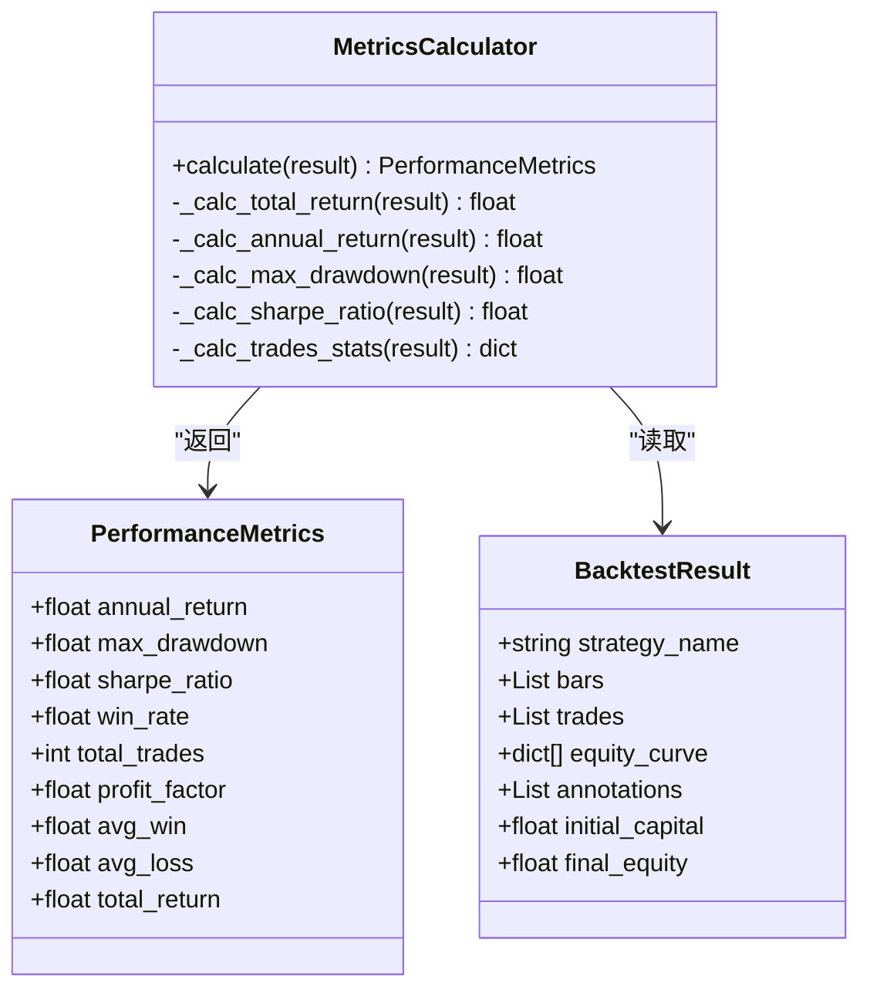
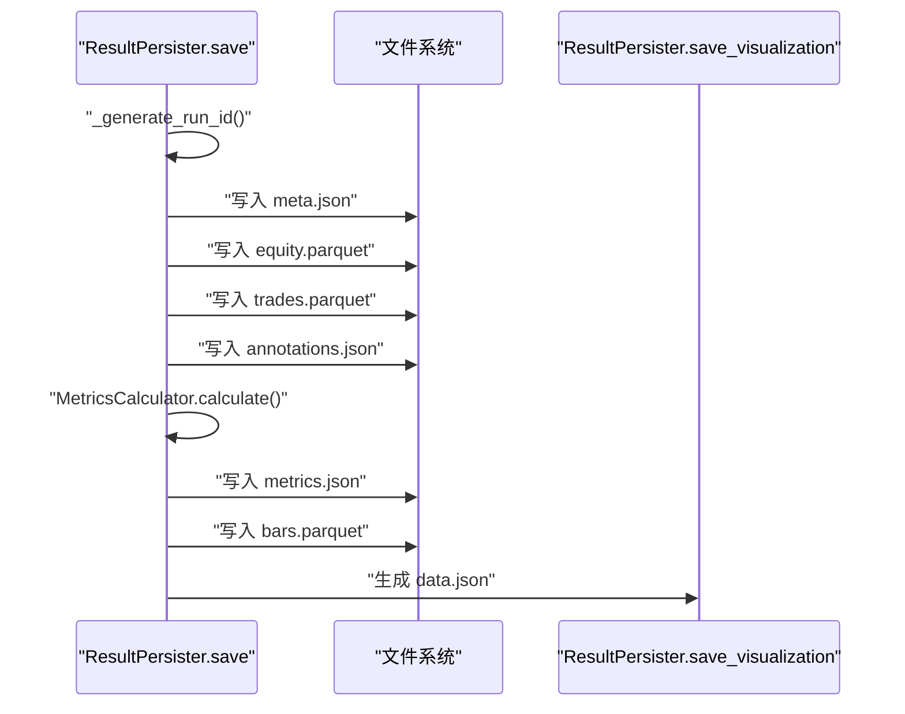
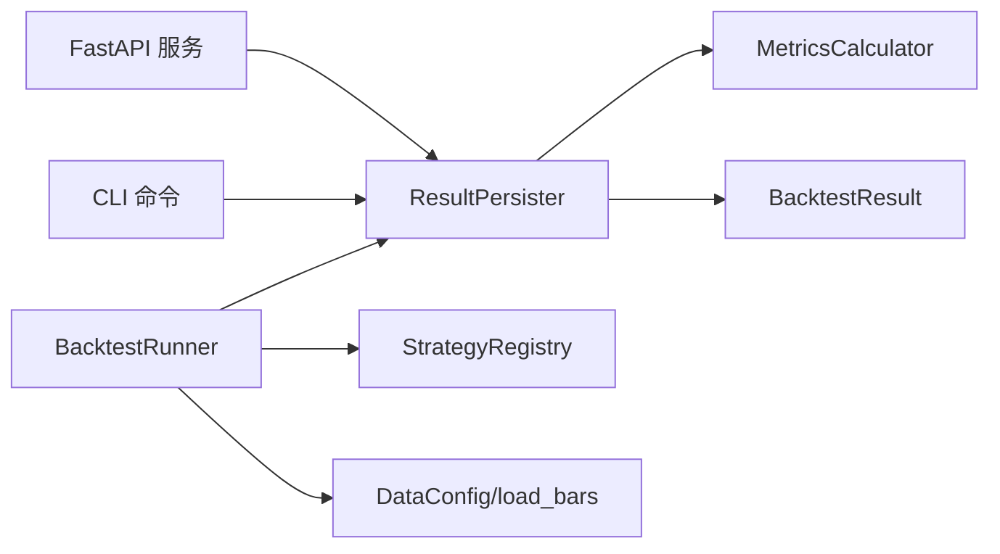

# 结果持久化系统

<cite>
**本文引用的文件**   
- [src/caisen/result/persistence.py](file://src/caisen/result/persistence.py)
- [src/caisen/result/calculator.py](file://src/caisen/result/calculator.py)
- [src/caisen/result/metrics.py](file://src/caisen/result/metrics.py)
- [src/caisen/result/types.py](file://src/caisen/result/types.py)
- [src/caisen/backtest/runner.py](file://src/caisen/backtest/runner.py)
- [src/caisen/core/engine.py](file://src/caisen/core/engine.py)
- [src/caisen/web/main.py](file://src/caisen/web/main.py)
- [src/caisen/cli/main.py](file://src/caisen/cli/main.py)
- [src/caisen/data/local_source.py](file://src/caisen/data/local_source.py)
- [src/caisen/data/scanner.py](file://src/caisen/data/scanner.py)
- [docs/adr/0002-parquet-data-storage.md](file://docs/adr/0002-parquet-data-storage.md)
- [tests/test_result_persister.py](file://tests/test_result_persister.py)
</cite>

## 目录
1. [简介](#简介)
2. [项目结构](#项目结构)
3. [核心组件](#核心组件)
4. [架构总览](#架构总览)
5. [详细组件分析](#详细组件分析)
6. [依赖关系分析](#依赖关系分析)
7. [性能与压缩策略](#性能与压缩策略)
8. [故障排查指南](#故障排查指南)
9. [结论](#结论)
10. [附录：结果文件结构与字段定义](#附录结果文件结构与字段定义)

## 简介
本文件面向 Caisen 量化回测系统的“结果持久化”能力，系统性说明基于 Parquet 的高性能存储方案、自动 run_id 生成机制、绩效指标计算引擎、元数据管理、结果文件结构规范、批量查询与分析工具、迁移与兼容性策略，以及导出与第三方集成接口。目标是帮助使用者快速理解并高效利用回测结果的存储、检索与可视化。

## 项目结构
结果持久化相关代码集中在 result 模块，并通过 backtest runner、web API 和 CLI 暴露使用入口；历史行情数据采用 Parquet 格式（ADR-0002），结果中的净值曲线、交易记录、K线等也采用 Parquet 以提升读写效率。

图示来源
- [src/caisen/backtest/runner.py:26-94](file://src/caisen/backtest/runner.py#L26-L94)
- [src/caisen/core/engine.py:19-91](file://src/caisen/core/engine.py#L19-L91)
- [src/caisen/result/persistence.py:59-133](file://src/caisen/result/persistence.py#L59-L133)
- [src/caisen/result/calculator.py:34-79](file://src/caisen/result/calculator.py#L34-L79)
- [src/caisen/result/types.py:9-32](file://src/caisen/result/types.py#L9-L32)
- [src/caisen/web/main.py:107-201](file://src/caisen/web/main.py#L107-L201)
- [src/caisen/cli/main.py:179-191](file://src/caisen/cli/main.py#L179-L191)
- [src/caisen/data/local_source.py:68-131](file://src/caisen/data/local_source.py#L68-L131)
- [src/caisen/data/scanner.py:39-52](file://src/caisen/data/scanner.py#L39-L52)

章节来源
- [docs/adr/0002-parquet-data-storage.md:1-13](file://docs/adr/0002-parquet-data-storage.md#L1-L13)
- [src/caisen/backtest/runner.py:26-94](file://src/caisen/backtest/runner.py#L26-L94)
- [src/caisen/core/engine.py:19-91](file://src/caisen/core/engine.py#L19-L91)
- [src/caisen/result/persistence.py:59-133](file://src/caisen/result/persistence.py#L59-L133)
- [src/caisen/result/calculator.py:34-79](file://src/caisen/result/calculator.py#L34-L79)
- [src/caisen/result/types.py:9-32](file://src/caisen/result/types.py#L9-L32)
- [src/caisen/web/main.py:107-201](file://src/caisen/web/main.py#L107-L201)
- [src/caisen/cli/main.py:179-191](file://src/caisen/cli/main.py#L179-L191)
- [src/caisen/data/local_source.py:68-131](file://src/caisen/data/local_source.py#L68-L131)
- [src/caisen/data/scanner.py:39-52](file://src/caisen/data/scanner.py#L39-L52)

## 核心组件
- ResultPersister：负责将一次回测的 BacktestResult 持久化为多文件（meta.json、metrics.json、annotations.json、equity.parquet、trades.parquet、bars.parquet、data.json），并提供 load/load_visualization/list_runs 等便捷方法。
- MetricsCalculator：统一的绩效指标计算入口，输出 PerformanceMetrics 数据容器。
- BacktestResult：一次 Run 的结构化结果容器（不含计算逻辑）。
- BacktestRunner：封装从参数解析、策略实例化、数据加载、引擎运行到结果持久化的完整流程。
- Web/CLI 入口：提供 HTTP 与命令行访问点，支持列出、查看、触发回测与进度推送。

章节来源
- [src/caisen/result/persistence.py:59-133](file://src/caisen/result/persistence.py#L59-L133)
- [src/caisen/result/calculator.py:34-79](file://src/caisen/result/calculator.py#L34-L79)
- [src/caisen/result/types.py:9-32](file://src/caisen/result/types.py#L9-L32)
- [src/caisen/backtest/runner.py:26-94](file://src/caisen/backtest/runner.py#L26-L94)
- [src/caisen/web/main.py:107-201](file://src/caisen/web/main.py#L107-L201)
- [src/caisen/cli/main.py:179-191](file://src/caisen/cli/main.py#L179-L191)

## 架构总览
下图展示一次典型回测从触发到结果落盘的端到端流程，包括并行进度推送与可视化数据生成。

图示来源
- [src/caisen/web/main.py:107-132](file://src/caisen/web/main.py#L107-L132)
- [src/caisen/backtest/runner.py:26-94](file://src/caisen/backtest/runner.py#L26-L94)
- [src/caisen/core/engine.py:33-91](file://src/caisen/core/engine.py#L33-L91)
- [src/caisen/result/persistence.py:62-133](file://src/caisen/result/persistence.py#L62-L133)
- [src/caisen/result/calculator.py:45-79](file://src/caisen/result/calculator.py#L45-L79)

## 详细组件分析

### 自动 run_id 生成机制
- 命名规则：{策略名}_{YYYYMMDD}_{序号}，序号在同日同名策略下递增。
- 冲突处理：通过正则匹配已有目录，取最大序号后 +1，保证唯一性。
- 版本管理：前端按 created_at 排序为 v0/v1...，便于同一策略的多版本对比。

图示来源
- [src/caisen/result/persistence.py:17-39](file://src/caisen/result/persistence.py#L17-L39)
- [src/caisen/frontend/src/js/runs-list.js:111-120](file://src/caisen/frontend/src/js/runs-list.js#L111-L120)

章节来源
- [src/caisen/result/persistence.py:17-39](file://src/caisen/result/persistence.py#L17-L39)
- [tests/test_result_persister.py:77-112](file://tests/test_result_persister.py#L77-L112)
- [src/caisen/frontend/src/js/runs-list.js:111-120](file://src/caisen/frontend/src/js/runs-list.js#L111-L120)

### 绩效指标计算引擎
- 输入：BacktestResult（含 equity_curve、trades、initial_capital、final_equity）。
- 输出：PerformanceMetrics（年化收益率、最大回撤、夏普比率、胜率、盈亏比、平均盈利/亏损、总交易数、总收益率）。
- 关键实现要点：
  - 年化收益：以交易日 250 天折算。
  - 最大回撤：基于净值序列峰值-谷值的最小值。
  - 夏普比率：无风险利率为 0，按日收益率均值/标准差再乘以 sqrt(250)。
  - 交易统计：按时间顺序配对多空订单，计算每笔闭环利润，汇总胜率与盈亏比。

图示来源
- [src/caisen/result/calculator.py:17-79](file://src/caisen/result/calculator.py#L17-L79)
- [src/caisen/result/types.py:9-32](file://src/caisen/result/types.py#L9-L32)

章节来源
- [src/caisen/result/calculator.py:45-185](file://src/caisen/result/calculator.py#L45-L185)
- [src/caisen/result/metrics.py:1-10](file://src/caisen/result/metrics.py#L1-L10)
- [tests/test_backtest_result.py:200-233](file://tests/test_backtest_result.py#L200-L233)

### 结果持久化与可视化数据生成
- 保存内容：
  - meta.json：元数据（run_id、策略名、品种、频率、起止时间、bar_count、初始/最终净值、总收益率、创建时间等）。
  - metrics.json：绩效指标。
  - annotations.json：可视化标注。
  - equity.parquet：净值曲线。
  - trades.parquet：交易记录。
  - bars.parquet：K线数据（用于可视化）。
  - data.json：前端可视化综合文件（聚合上述数据）。
- 生成 data.json：从 meta/metrics/bars/equity/trades/annotations 组装，供前端直接消费。

图示来源
- [src/caisen/result/persistence.py:62-133](file://src/caisen/result/persistence.py#L62-L133)
- [src/caisen/result/persistence.py:135-201](file://src/caisen/result/persistence.py#L135-L201)

章节来源
- [src/caisen/result/persistence.py:62-133](file://src/caisen/result/persistence.py#L62-L133)
- [src/caisen/result/persistence.py:135-201](file://src/caisen/result/persistence.py#L135-L201)
- [tests/test_result_persister.py:149-185](file://tests/test_result_persister.py#L149-L185)

### Web/CLI 批量查询与分析
- Web API：
  - GET /api/runs：列出有效 run（要求存在 meta.json 且 data.json 或 bars.parquet 之一，且 bar_count != 0），附带 metrics.json 以便前端对比。
  - GET /api/runs/{run_id}：获取详情（包含 equity_curve、trades、annotations、metrics、bars 等）。
  - GET /api/runs/{run_id}/visualization：获取 data.json。
  - POST /api/runs：异步触发回测，立即返回占位 run_id。
  - WebSocket /ws/runs/{run_id}/progress：实时推送进度与完成状态。
- CLI：
  - caisen run：运行回测并持久化结果。
  - caisen show-result <run_id>：打印关键指标。
  - caisen list-runs：列出所有 run。
  - caisen web：启动前后端服务。

章节来源
- [src/caisen/web/main.py:134-201](file://src/caisen/web/main.py#L134-L201)
- [src/caisen/web/main.py:247-303](file://src/caisen/web/main.py#L247-L303)
- [src/caisen/cli/main.py:179-233](file://src/caisen/cli/main.py#L179-L233)

## 依赖关系分析
- ResultPersister 依赖：
  - pandas（Parquet 读写）
  - json（元数据与标注）
  - MetricsCalculator（指标计算）
  - BacktestResult（结果结构）
- BacktestRunner 依赖：
  - StrategyRegistry（策略注册表）
  - DataConfig/load_bars（数据加载）
  - ResultPersister（结果持久化）
- Web/CLI 依赖：
  - FastAPI/uvicorn（Web 服务）
  - ResultPersister（查询与加载）

图示来源
- [src/caisen/result/persistence.py:59-133](file://src/caisen/result/persistence.py#L59-L133)
- [src/caisen/backtest/runner.py:26-94](file://src/caisen/backtest/runner.py#L26-L94)
- [src/caisen/web/main.py:107-201](file://src/caisen/web/main.py#L107-L201)
- [src/caisen/cli/main.py:179-233](file://src/caisen/cli/main.py#L179-L233)

章节来源
- [src/caisen/result/persistence.py:59-133](file://src/caisen/result/persistence.py#L59-L133)
- [src/caisen/backtest/runner.py:26-94](file://src/caisen/backtest/runner.py#L26-L94)
- [src/caisen/web/main.py:107-201](file://src/caisen/web/main.py#L107-L201)
- [src/caisen/cli/main.py:179-233](file://src/caisen/cli/main.py#L179-L233)

## 性能与压缩策略
- 选择 Parquet 的原因：列式存储具备高压缩率与快速过滤查询能力，适合时序数据的 OLAP 场景（参考 ADR-0002）。
- 结果侧优化：
  - 大对象列（如 positions）在写入前转为字符串，避免复杂类型序列化问题。
  - 仅当数据非空时写入对应 parquet/json，减少冗余。
  - data.json 聚合常用视图，降低前端多次 IO 开销。
- 历史数据读取：
  - LocalDataSource 支持按文件名模式筛选日期区间，减少不必要 I/O。
  - DataSourceScanner 解析文件名推断数据范围，辅助前端下拉菜单。

章节来源
- [docs/adr/0002-parquet-data-storage.md:1-13](file://docs/adr/0002-parquet-data-storage.md#L1-L13)
- [src/caisen/result/persistence.py:97-128](file://src/caisen/result/persistence.py#L97-L128)
- [src/caisen/data/local_source.py:91-131](file://src/caisen/data/local_source.py#L91-L131)
- [src/caisen/data/scanner.py:39-52](file://src/caisen/data/scanner.py#L39-L52)

## 故障排查指南
- 常见错误与定位：
  - 策略未注册：检查 StrategyRegistry 是否已加载目标策略类。
  - 数据为空：确认 DataConfig 的时间范围与本地 Parquet 文件覆盖范围一致。
  - 结果缺失：确认 runs 目录下是否存在 meta.json 与 data.json 或 bars.parquet。
  - 路径安全：Web API 对 run_id 进行路径校验，防止路径遍历。
- 建议步骤：
  - 使用 CLI list-runs 验证结果目录结构。
  - 使用 show-result 查看关键指标是否生成。
  - 通过 /api/runs/{run_id}/visualization 获取 data.json 进行前端调试。
  - 若 bar_count=0，将被视为无效 run 并被过滤。

章节来源
- [src/caisen/backtest/runner.py:124-143](file://src/caisen/backtest/runner.py#L124-L143)
- [src/caisen/backtest/runner.py:146-163](file://src/caisen/backtest/runner.py#L146-L163)
- [src/caisen/web/main.py:28-39](file://src/caisen/web/main.py#L28-L39)
- [src/caisen/web/main.py:134-183](file://src/caisen/web/main.py#L134-L183)
- [src/caisen/cli/main.py:219-233](file://src/caisen/cli/main.py#L219-L233)

## 结论
Caisen 的结果持久化系统以 Parquet 为核心，结合 JSON 元数据与聚合 data.json，实现了高性能、易查询、可视化的回测结果管理。自动 run_id 与版本标签提升了策略迭代的可追溯性；统一的指标计算引擎确保评估口径一致；Web/CLI 提供了便捷的批量查询与分析入口。整体设计兼顾性能与易用性，适合大规模回测与持续优化。

## 附录：结果文件结构与字段定义
- 目录结构（每个 run 一个目录）：
  - meta.json：元数据
  - metrics.json：绩效指标
  - annotations.json：可视化标注
  - equity.parquet：净值曲线
  - trades.parquet：交易记录
  - bars.parquet：K线数据
  - data.json：前端可视化聚合文件

- meta.json 关键字段（示例说明）：
  - run_id：唯一标识
  - strategy_name：策略名称
  - symbol/freq/start/end/bar_count：数据源信息
  - initial_capital/final_equity/total_return：资金与收益概览
  - total_trades：总交易数
  - created_at：创建时间

- metrics.json 关键字段：
  - annual_return：年化收益率
  - max_drawdown：最大回撤
  - sharpe_ratio：夏普比率
  - win_rate：胜率
  - total_trades：总交易数
  - profit_factor：盈亏比
  - avg_win/avg_loss：平均盈利/亏损
  - total_return：总收益率

- equity.parquet 字段（示意）：
  - timestamp：时间戳
  - equity：净值
  - cash：现金
  - positions：持仓快照

- trades.parquet 字段（示意）：
  - timestamp/symbol/side/quantity/price/commission/slippage/order_id

- bars.parquet 字段（示意）：
  - timestamp/symbol/open/high/low/close/volume

- data.json 结构（示意）：
  - meta：策略与数据摘要
  - metrics：指标字典
  - bars/equity_curve/trades/annotations：原始数据数组

章节来源
- [src/caisen/result/persistence.py:83-133](file://src/caisen/result/persistence.py#L83-L133)
- [src/caisen/result/persistence.py:135-201](file://src/caisen/result/persistence.py#L135-L201)
- [src/caisen/result/calculator.py:17-79](file://src/caisen/result/calculator.py#L17-L79)
- [tests/test_result_persister.py:149-185](file://tests/test_result_persister.py#L149-L185)