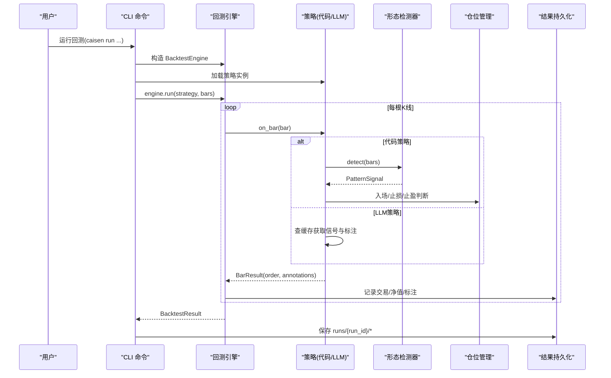
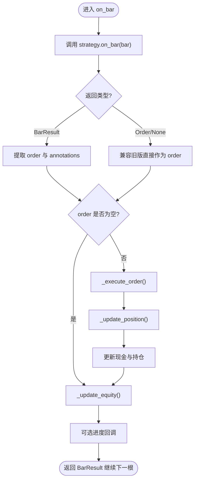
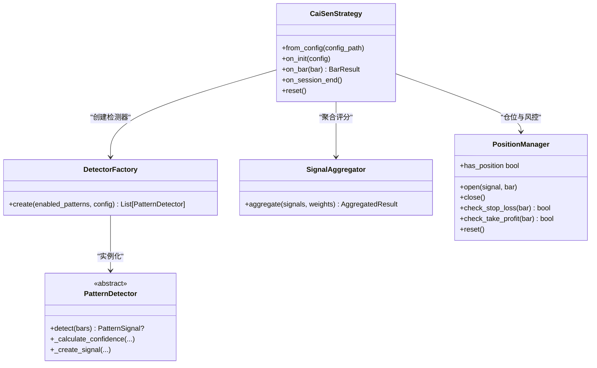
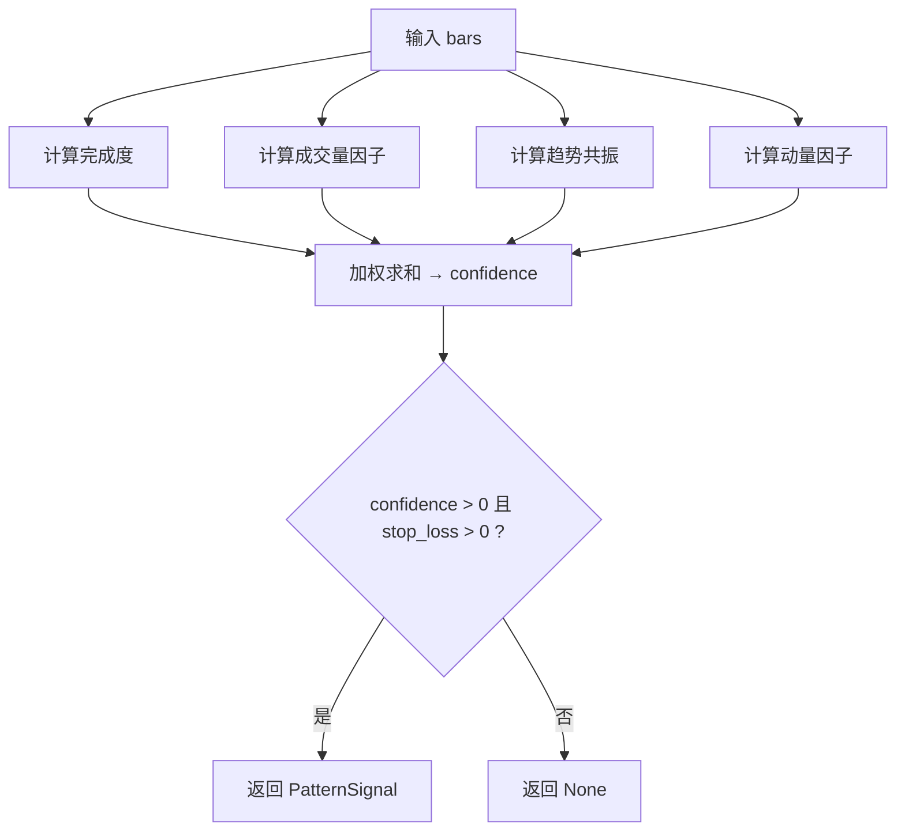
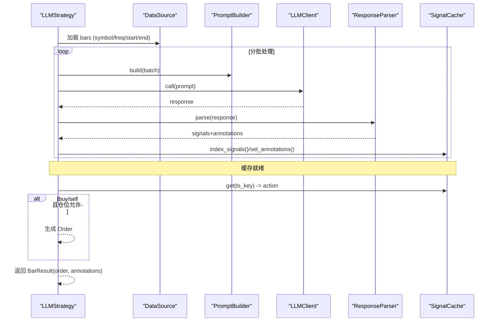
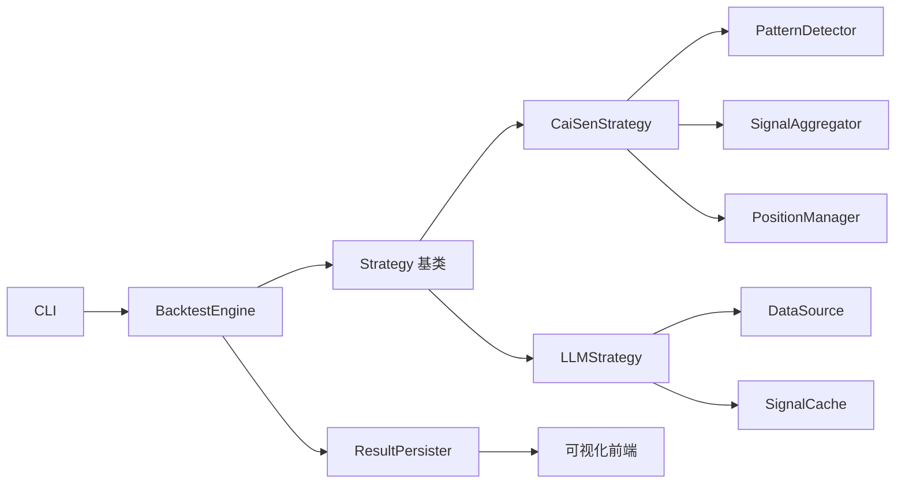

# 项目介绍

<cite>
**本文引用的文件**   
- [README.md](file://README.md)
- [project.yaml](file://configs/project.yaml)
- [engine.py](file://src/caisen/core/engine.py)
- [base.py](file://src/caisen/strategy/base.py)
- [cai_sen.py](file://src/caisen/strategy/algorithm/cai_sen.py)
- [detector.py](file://src/caisen/strategy/algorithm/detector.py)
- [0011-caisen-components.md](file://docs/adr/0011-caisen-components.md)
- [0004-llm-strategy-architecture.md](file://docs/adr/0004-llm-strategy-architecture.md)
- [0017-confidence-factors-model.md](file://docs/adr/0017-confidence-factors-model.md)
- [0006-compare-mode-code-llm.md](file://docs/adr/0006-compare-mode-code-llm.md)
- [main.py](file://src/caisen/cli/main.py)
- [caisen_backtest.py](file://examples/cai_sen_backtest.py)
- [config_llm_example.yaml](file://configs/strategies/config_llm_example.yaml)
</cite>

## 目录
1. [引言](#引言)
2. [项目结构](#项目结构)
3. [核心组件](#核心组件)
4. [架构总览](#架构总览)
5. [详细组件分析](#详细组件分析)
6. [依赖关系分析](#依赖关系分析)
7. [性能与可扩展性](#性能与可扩展性)
8. [故障排查指南](#故障排查指南)
9. [结论](#结论)
10. [附录：面向初学者的概念框架](#附录面向初学者的概念框架)

## 引言
Caisen 量化回测系统聚焦“形态驱动交易”的实战化落地，围绕蔡森十二形态识别体系，提供代码策略与 LLM 策略双模式支持。系统以可配置、可观测、可对比为核心设计理念，将形态检测、信号聚合、仓位风控与可视化报告解耦，形成从数据到决策再到绩效评估的闭环。

- 核心目标
  - 以形态为交易信号源，构建高解释性的量化策略框架
  - 统一策略接口，兼容传统代码策略与大模型策略
  - 提供可视化标注与结果持久化，便于复盘与优化
- 设计理念
  - 组件化：检测器、聚合器、仓位管理职责清晰
  - 纯函数式检测：提升可测试性与可重复性
  - 离线预计算（LLM）：降低在线成本，提高稳定性
  - 对比模式：同一逻辑在代码与 LLM 间横向验证

## 项目结构
仓库采用分层与模块化组织方式：
- CLI 入口与命令编排
- 回测引擎与核心数据结构
- 策略基类与具体实现（代码策略、LLM 策略）
- 形态检测器与置信度因子模型
- 结果持久化与可视化前端
- 配置与示例脚本

```mermaid
graph TB
subgraph "CLI"
CLI["命令行入口<br/>run/list/show/web/optimize"]
end
subgraph "核心"
Engine["回测引擎<br/>BacktestEngine"]
Base["策略基类<br/>Strategy"]
Config["项目配置<br/>project.yaml"]
end
subgraph "策略层"
CodeStrat["代码策略<br/>CaiSenStrategy / MACrossStrategy"]
LLMStrat["LLM 策略<br/>LLMStrategy"]
Detector["形态检测器<br/>PatternDetector + 四因子置信度"]
end
subgraph "数据与结果"
Data["数据加载<br/>本地/模拟"]
Persist["结果持久化<br/>runs/{run_id}/*"]
Frontend["可视化前端<br/>HTML+ECharts"]
end
CLI --> Engine
Engine --> Base
Engine --> Data
Engine --> Persist
CodeStrat --> Detector
LLMStrat --> Data
LLMStrat --> Persist
Frontend --> Persist
Config --> CLI
```

图表来源
- [main.py:63-191](file://src/caisen/cli/main.py#L63-L191)
- [engine.py:19-91](file://src/caisen/core/engine.py#L19-L91)
- [base.py:19-37](file://src/caisen/strategy/base.py#L19-L37)
- [project.yaml:1-13](file://configs/project.yaml#L1-L13)

章节来源
- [README.md:1-120](file://README.md#L1-L120)
- [project.yaml:1-13](file://configs/project.yaml#L1-L13)

## 核心组件
- 回测引擎
  - 负责策略生命周期管理、订单执行、持仓与净值更新、进度回调与结果封装
- 策略基类
  - 定义 on_init/on_bar/on_session_end/reset 等标准接口，屏蔽差异
- 蔡森策略（V2 组件化）
  - 通过 DetectorFactory 创建检测器，SignalAggregator 聚合评分，PositionManager 管理仓位与风控
- 形态检测器
  - 纯函数 detect(bars) 接口；内置四因子置信度模型（完成度、成交量、趋势共振、动量）
- LLM 策略
  - 离线预计算：on_init 一次性拉取历史并调用 LLM，缓存 signals 与 annotations；on_bar 逐帧回放
- CLI 与可视化
  - run/list/show/web/optimize 命令；结果持久化为 runs/{run_id}/*，前端渲染 K 线、净值曲线与标注

章节来源
- [engine.py:19-91](file://src/caisen/core/engine.py#L19-L91)
- [base.py:19-37](file://src/caisen/strategy/base.py#L19-L37)
- [cai_sen.py:36-245](file://src/caisen/strategy/algorithm/cai_sen.py#L36-L245)
- [detector.py:80-181](file://src/caisen/strategy/algorithm/detector.py#L80-L181)
- [0011-caisen-components.md:1-88](file://docs/adr/0011-caisen-components.md#L1-L88)
- [0004-llm-strategy-architecture.md:1-13](file://docs/adr/0004-llm-strategy-architecture.md#L1-L13)
- [0017-confidence-factors-model.md:1-48](file://docs/adr/0017-confidence-factors-model.md#L1-L48)
- [main.py:63-191](file://src/caisen/cli/main.py#L63-L191)

## 架构总览
系统由“输入—处理—输出”三层构成：
- 输入层：本地 Parquet 或模拟数据，按品种/频率/时间窗加载
- 处理层：回测引擎驱动策略，策略内部组合检测器与风控模块；LLM 策略采用离线预计算
- 输出层：交易记录、净值曲线、可视化标注与指标汇总，持久化后供前端展示



图表来源
- [main.py:63-191](file://src/caisen/cli/main.py#L63-L191)
- [engine.py:33-91](file://src/caisen/core/engine.py#L33-L91)
- [cai_sen.py:178-221](file://src/caisen/strategy/algorithm/cai_sen.py#L178-L221)
- [detector.py:112-123](file://src/caisen/strategy/algorithm/detector.py#L112-L123)
- [0004-llm-strategy-architecture.md:1-13](file://docs/adr/0004-llm-strategy-architecture.md#L1-L13)

## 详细组件分析

### 回测引擎（BacktestEngine）
- 职责
  - 策略初始化与结束钩子
  - 每根 bar 的策略调用与订单执行
  - 滑点、手续费、数量计算与持仓更新
  - 净值曲线与进度回调
- 关键流程
  - on_bar 返回 BarResult（兼容旧版 Order/None）
  - _execute_order 计算成交价、数量、佣金与滑点
  - _update_position 维护多/空仓与均价
  - _update_equity 追加净值快照



图表来源
- [engine.py:33-91](file://src/caisen/core/engine.py#L33-L91)
- [engine.py:93-210](file://src/caisen/core/engine.py#L93-L210)

章节来源
- [engine.py:19-210](file://src/caisen/core/engine.py#L19-L210)

### 蔡森策略 V2（组件化）
- 设计要点
  - 编排层只做流程控制：检测→聚合→决策
  - DetectorFactory 根据 enabled_patterns 与 detectors 配置创建检测器
  - SignalAggregator 加权聚合各形态信号，得到综合评分与最佳信号
  - PositionManager 管理开平仓、止损/止盈与回调
- 置信度模型
  - 四因子加权：完成度、成交量、趋势共振、动量
  - 权重可通过配置文件调整



图表来源
- [cai_sen.py:36-245](file://src/caisen/strategy/algorithm/cai_sen.py#L36-L245)
- [detector.py:80-181](file://src/caisen/strategy/algorithm/detector.py#L80-L181)
- [0011-caisen-components.md:1-88](file://docs/adr/0011-caisen-components.md#L1-L88)
- [0017-confidence-factors-model.md:1-48](file://docs/adr/0017-confidence-factors-model.md#L1-L48)

章节来源
- [cai_sen.py:36-245](file://src/caisen/strategy/algorithm/cai_sen.py#L36-L245)
- [0011-caisen-components.md:1-88](file://docs/adr/0011-caisen-components.md#L1-L88)
- [0017-confidence-factors-model.md:1-48](file://docs/adr/0017-confidence-factors-model.md#L1-L48)

### 形态检测器与置信度因子
- 纯函数接口
  - detect(bars) 接收完整 K 线列表，返回 PatternSignal 或 None
  - 无内部状态，便于并行与单元测试
- 置信度因子
  - completion/volume/trend/momentum 四维加权求和，默认权重可在配置中覆盖
  - 辅助方法：趋势方向判断、成交量放大倍数等



图表来源
- [detector.py:18-78](file://src/caisen/strategy/algorithm/detector.py#L18-L78)
- [detector.py:125-181](file://src/caisen/strategy/algorithm/detector.py#L125-L181)
- [0017-confidence-factors-model.md:1-48](file://docs/adr/0017-confidence-factors-model.md#L1-L48)

章节来源
- [detector.py:80-181](file://src/caisen/strategy/algorithm/detector.py#L80-L181)
- [0017-confidence-factors-model.md:1-48](file://docs/adr/0017-confidence-factors-model.md#L1-L48)

### LLM 策略（离线预计算）
- 架构思路
  - on_init 一次性拉取历史数据，构建 Prompt，调用 LLM 生成 signals 与 annotations，写入缓存
  - on_bar 逐帧回放，查询缓存返回 Order，并在首次调用时附带全部标注
- 优势
  - 避免在线推理延迟与不稳定
  - 支持批量分批处理，防止长上下文截断
  - 可与代码策略进行对比评估



图表来源
- [strategy.py:131-225](file://src/caisen/strategy/llm/strategy.py#L131-L225)
- [0004-llm-strategy-architecture.md:1-13](file://docs/adr/0004-llm-strategy-architecture.md#L1-L13)

章节来源
- [strategy.py:15-235](file://src/caisen/strategy/llm/strategy.py#L15-L235)
- [0004-llm-strategy-architecture.md:1-13](file://docs/adr/0004-llm-strategy-architecture.md#L1-L13)

### CLI 与可视化
- 命令
  - run：加载策略与数据，运行回测并保存结果
  - list-runs：列出所有回测记录
  - show-result：查看指定 run 的关键指标
  - web：启动前后端服务，打开可视化报告
  - optimize：网格搜索优化蔡森策略参数
- 可视化
  - 结果保存在 runs/{run_id}/*，包含 meta/data/bars/trades/equity/annotations/metrics
  - 前端基于 HTML+ECharts 渲染 K 线、净值曲线与形态标注

章节来源
- [main.py:63-191](file://src/caisen/cli/main.py#L63-L191)
- [README.md:187-235](file://README.md#L187-L235)

## 依赖关系分析
- 组件耦合
  - 回测引擎仅依赖策略抽象接口，低耦合
  - 蔡森策略依赖检测器工厂、聚合器与仓位管理器，职责清晰
  - LLM 策略依赖数据源、提示构建器、客户端与响应解析器，通过注入降低硬编码
- 外部依赖
  - 数据：本地 Parquet 或模拟数据
  - 大模型：OpenAI 等 Provider（通过配置选择）
  - 可视化：ECharts 前端渲染



图表来源
- [main.py:63-191](file://src/caisen/cli/main.py#L63-L191)
- [engine.py:19-91](file://src/caisen/core/engine.py#L19-L91)
- [cai_sen.py:36-245](file://src/caisen/strategy/algorithm/cai_sen.py#L36-L245)
- [strategy.py:15-235](file://src/caisen/strategy/llm/strategy.py#L15-L235)

章节来源
- [main.py:63-191](file://src/caisen/cli/main.py#L63-L191)
- [engine.py:19-91](file://src/caisen/core/engine.py#L19-L91)
- [cai_sen.py:36-245](file://src/caisen/strategy/algorithm/cai_sen.py#L36-L245)
- [strategy.py:15-235](file://src/caisen/strategy/llm/strategy.py#L15-L235)

## 性能与可扩展性
- 性能特性
  - 检测器纯函数化，易于并行与增量计算
  - LLM 策略离线预计算，减少在线延迟与抖动
  - 结果持久化使用高效格式，便于前端快速加载
- 可扩展点
  - 新增形态检测器：继承 PatternDetector，实现 detect
  - 扩展置信度因子：在 ConfidenceFactors 中增加维度与权重
  - 替换 LLM Provider：实现统一 client.call 接口
  - 自定义仓位风控：扩展 PositionManager 行为

[本节为通用指导，不直接分析具体文件]

## 故障排查指南
- 常见问题
  - 未找到数据：使用 --mock 生成模拟数据或检查 data_dir 与符号/频率/时间范围
  - 策略未加载：确认策略名或文件路径正确，内置策略映射是否匹配
  - LLM 调用失败：检查 provider、api_key、model 与网络连通性
  - 可视化无法打开：确认后端 API 端口与前端代理地址一致
- 定位建议
  - 查看 runs/{run_id}/meta.json 与 metrics.json 了解运行元信息与指标
  - 使用 show-result 快速核对关键指标
  - 对 LLM 策略，检查缓存目录与批处理日志

章节来源
- [main.py:149-191](file://src/caisen/cli/main.py#L149-L191)
- [README.md:187-235](file://README.md#L187-L235)

## 结论
Caisen 以形态为信号源，结合组件化设计与双模式策略，提供了从数据到决策再到可视化的完整回测体验。其核心价值在于：
- 形态驱动的高解释性策略框架
- 代码与 LLM 策略的可对比验证
- 可配置的置信度因子与风控机制
- 完善的可视化与结果持久化

[本节为总结性内容，不直接分析具体文件]

## 附录：面向初学者的概念框架
- 量化回测基本概念
  - 回测：用历史数据验证策略假设，评估收益、回撤与风险
  - 信号：买入/卖出触发条件，通常来自技术指标或形态识别
  - 订单与成交：策略发出订单，引擎按滑点与手续费执行
  - 净值曲线：随时间变化的账户价值轨迹
- 技术形态分析的重要性
  - 形态反映市场心理与供需变化，具备较强可解释性
  - 通过置信度因子过滤低质量信号，提升稳健性
- 理解路径建议
  - 先跑通示例与模拟数据，熟悉 CLI 与可视化
  - 阅读蔡森策略配置与组件拆分文档，理解检测器与风控
  - 尝试替换 LLM 策略，观察与代码策略的差异
  - 逐步引入真实数据，迭代优化参数与因子权重

[本节为概念性内容，不直接分析具体文件]