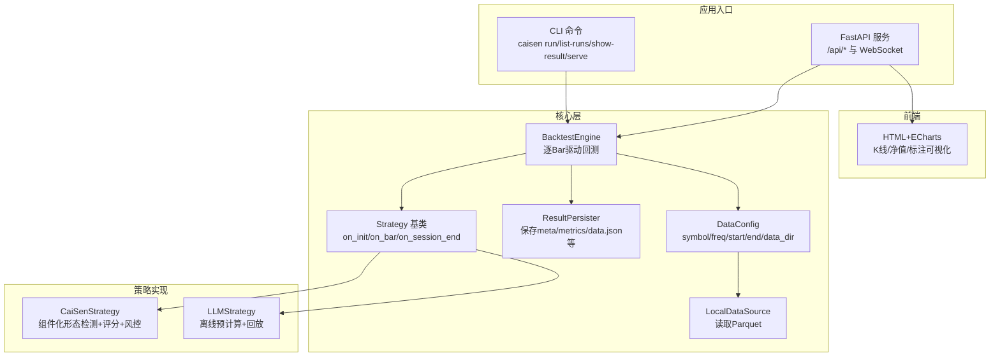
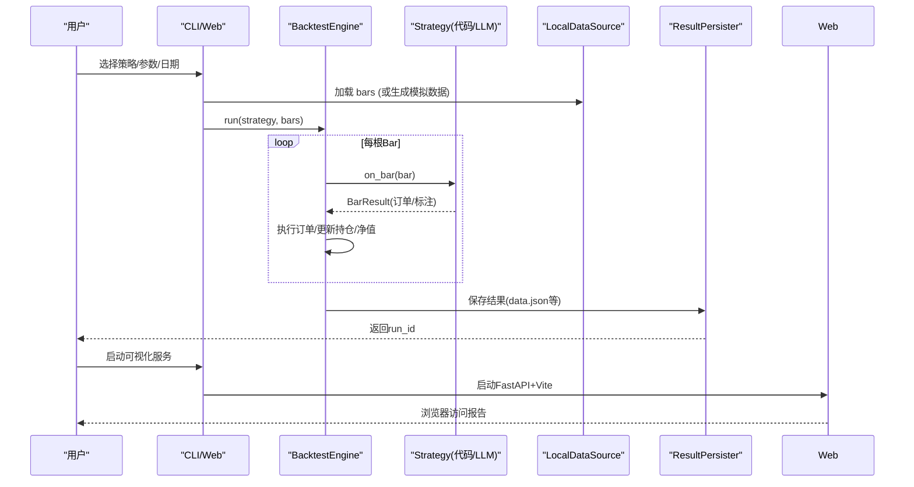
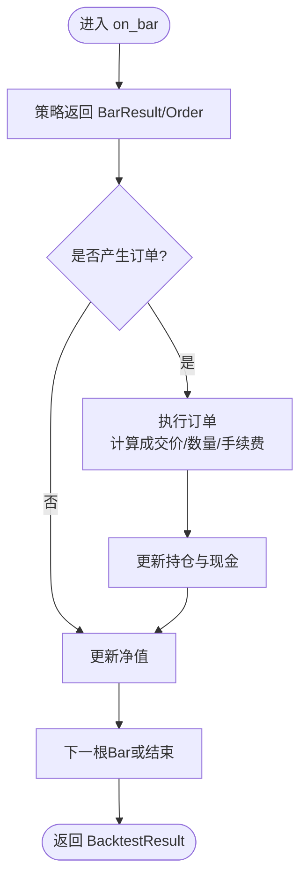
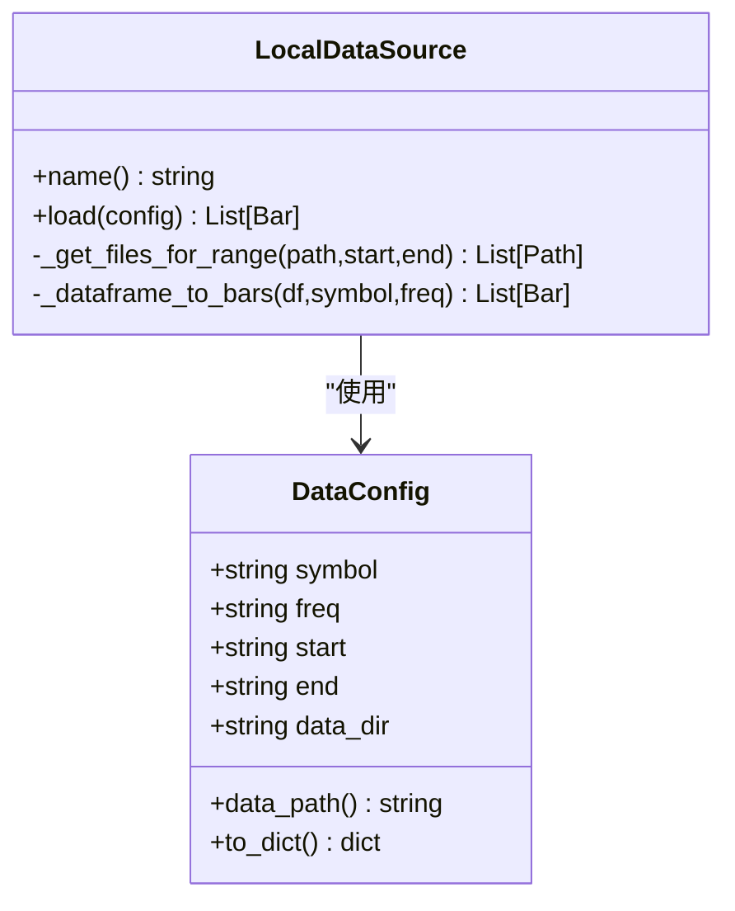
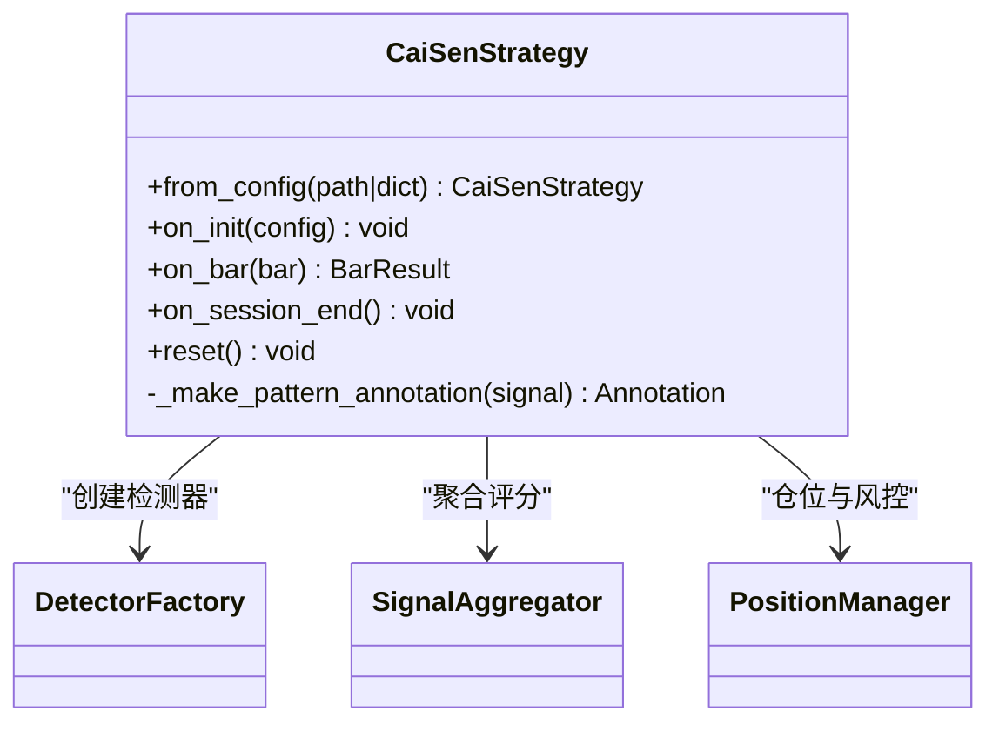
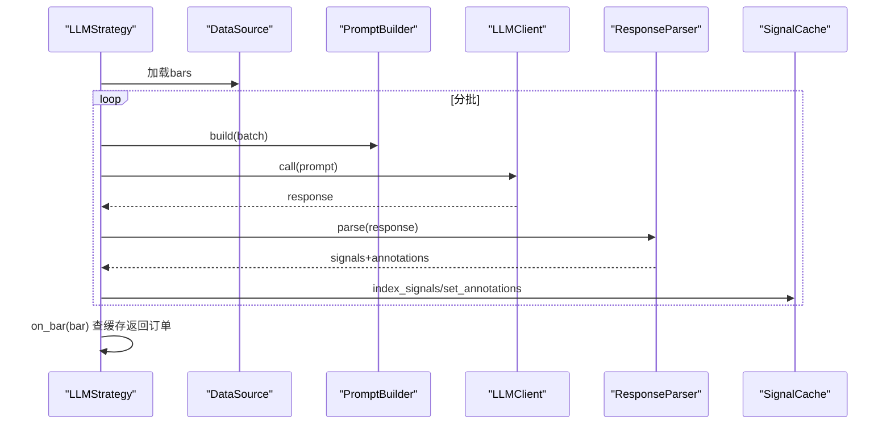
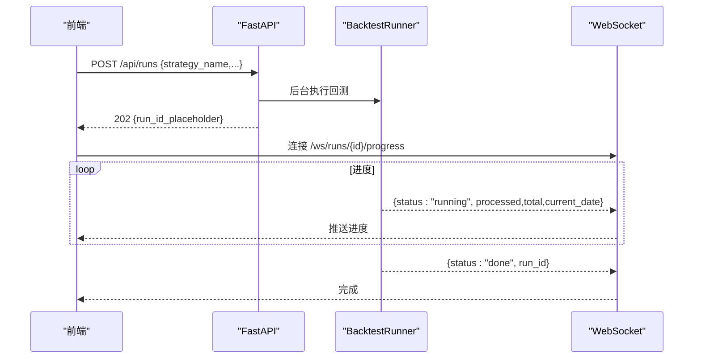
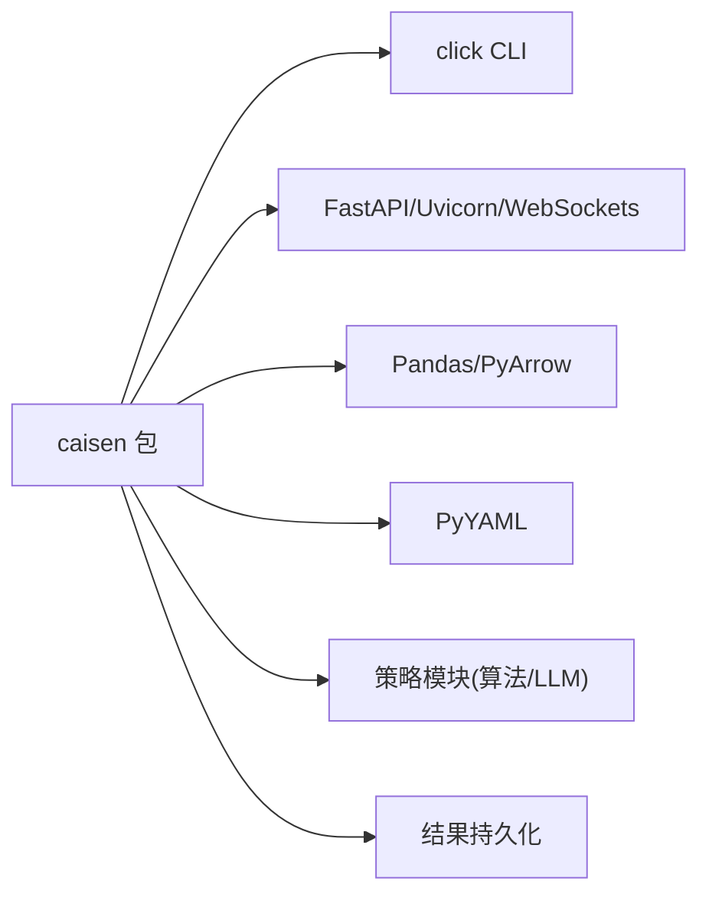

# 项目概述

<cite>
**本文引用的文件**   
- [README.md](file://README.md)
- [pyproject.toml](file://pyproject.toml)
- [src/caisen/__init__.py](file://src/caisen/__init__.py)
- [configs/project.yaml](file://configs/project.yaml)
- [docs/README.md](file://docs/README.md)
- [src/caisen/core/engine.py](file://src/caisen/core/engine.py)
- [src/caisen/strategy/base.py](file://src/caisen/strategy/base.py)
- [src/caisen/cli/main.py](file://src/caisen/cli/main.py)
- [src/caisen/web/main.py](file://src/caisen/web/main.py)
- [src/caisen/data/local_source.py](file://src/caisen/data/local_source.py)
- [src/caisen/data/config.py](file://src/caisen/data/config.py)
- [src/caisen/result/persistence.py](file://src/caisen/result/persistence.py)
- [src/caisen/strategy/algorithm/cai_sen.py](file://src/caisen/strategy/algorithm/cai_sen.py)
- [src/caisen/strategy/llm/strategy.py](file://src/caisen/strategy/llm/strategy.py)
- [examples/caisen_strategy_template.yaml](file://examples/caisen_strategy_template.yaml)
</cite>

## 目录
1. [简介](#简介)
2. [项目结构](#项目结构)
3. [核心组件](#核心组件)
4. [架构总览](#架构总览)
5. [详细组件分析](#详细组件分析)
6. [依赖关系分析](#依赖关系分析)
7. [性能与可扩展性](#性能与可扩展性)
8. [故障排查指南](#故障排查指南)
9. [结论](#结论)
10. [附录：快速开始与常用工作流](#附录快速开始与常用工作流)

## 简介
Caisen 量化回测系统是一个以“形态驱动交易”为核心理念的量化平台，支持代码策略与大语言模型（LLM）策略双模式。系统内置蔡森十二形态识别能力，提供可视化报告、结果持久化、参数优化与前后端一体化服务。技术栈采用 Python + JavaScript + FastAPI + ECharts，兼顾易用性与扩展性，既适合初学者入门量化回测，也满足专业开发者的深度定制需求。

## 项目结构
仓库采用分层与模块化组织方式：
- src/caisen：核心库，包含回测引擎、策略框架、数据加载、结果持久化、Web 服务与前端资源
- configs：全局与策略配置模板
- examples：示例策略与配置文件
- docs：文档与架构决策记录（ADR）
- tests：单元测试与集成测试
- runs：回测输出目录（按 run_id 分目录）

图表来源
- [src/caisen/cli/main.py:63-191](file://src/caisen/cli/main.py#L63-L191)
- [src/caisen/web/main.py:54-288](file://src/caisen/web/main.py#L54-L288)
- [src/caisen/core/engine.py:19-91](file://src/caisen/core/engine.py#L19-L91)
- [src/caisen/strategy/base.py:19-37](file://src/caisen/strategy/base.py#L19-L37)
- [src/caisen/data/config.py:11-51](file://src/caisen/data/config.py#L11-L51)
- [src/caisen/data/local_source.py:15-80](file://src/caisen/data/local_source.py#L15-L80)
- [src/caisen/result/persistence.py:62-136](file://src/caisen/result/persistence.py#L62-L136)

章节来源
- [README.md:1-120](file://README.md#L1-L120)
- [docs/README.md:1-45](file://docs/README.md#L1-L45)

## 核心组件
- 回测引擎：基于 Bar 驱动的逐根 K 线执行，负责订单撮合、持仓更新、净值曲线与进度回调。
- 策略框架：抽象出 on_init/on_bar/on_session_end 生命周期，统一返回 BarResult（含订单与标注）。
- 数据管理：通过 DataConfig 描述标的、频率与时间范围；LocalDataSource 从本地 Parquet 读取并兼容中英文列名。
- 结果持久化：生成 meta.json、metrics.json、bars/trades/equity.parquet、annotations.json 与 data.json，便于前端渲染。
- Web 服务：FastAPI 提供 REST 与 WebSocket 接口，支持后台运行回测与实时进度推送。
- 前端可视化：ECharts 渲染 K 线图、净值曲线、买卖信号与形态标注。

章节来源
- [src/caisen/core/engine.py:19-91](file://src/caisen/core/engine.py#L19-L91)
- [src/caisen/strategy/base.py:19-37](file://src/caisen/strategy/base.py#L19-L37)
- [src/caisen/data/config.py:11-51](file://src/caisen/data/config.py#L11-L51)
- [src/caisen/data/local_source.py:15-80](file://src/caisen/data/local_source.py#L15-L80)
- [src/caisen/result/persistence.py:62-136](file://src/caisen/result/persistence.py#L62-L136)
- [src/caisen/web/main.py:54-288](file://src/caisen/web/main.py#L54-L288)

## 架构总览
系统采用“后端服务 + 前端可视化 + 可插拔策略”的分层架构。CLI 与 Web 作为统一入口，调用 BacktestEngine 驱动策略执行；数据由 DataConfig + LocalDataSource 提供；结果经 ResultPersister 落盘；前端通过 API 获取 data.json 进行渲染。

图表来源
- [src/caisen/cli/main.py:63-191](file://src/caisen/cli/main.py#L63-L191)
- [src/caisen/core/engine.py:33-91](file://src/caisen/core/engine.py#L33-L91)
- [src/caisen/data/local_source.py:39-80](file://src/caisen/data/local_source.py#L39-L80)
- [src/caisen/result/persistence.py:62-136](file://src/caisen/result/persistence.py#L62-L136)
- [src/caisen/web/main.py:231-288](file://src/caisen/web/main.py#L231-L288)

## 详细组件分析

### 回测引擎（BacktestEngine）
- 职责：初始化策略、逐Bar驱动、订单执行、滑点与手续费处理、仓位与现金更新、净值曲线构建、进度回调。
- 关键流程：
  - on_bar 接收策略返回的 BarResult（兼容旧版 Order/None），将订单交由 _execute_order 执行。
  - _calculate_quantity 支持固定数量、按可用资金全仓、按仓位比例下单。
  - _update_position 维护多/空仓与均价，_update_equity 写入净值序列。
- 复杂度：O(N)，N 为 Bar 数量；内存主要消耗在 bars、trades、equity_curve 与 annotations。

图表来源
- [src/caisen/core/engine.py:33-91](file://src/caisen/core/engine.py#L33-L91)
- [src/caisen/core/engine.py:93-209](file://src/caisen/core/engine.py#L93-L209)

章节来源
- [src/caisen/core/engine.py:19-209](file://src/caisen/core/engine.py#L19-L209)

### 策略框架（Strategy 基类）
- 生命周期：on_init 初始化、on_bar 每根Bar决策、on_session_end 收尾、reset 重置状态。
- 契约：on_bar 返回 BarResult（包含本Bar的订单与标注），向后兼容返回 Order/None。
- 优势：统一策略接入面，便于代码策略与 LLM 策略共存。

章节来源
- [src/caisen/strategy/base.py:19-37](file://src/caisen/strategy/base.py#L19-L37)

### 数据管理（DataConfig + LocalDataSource）
- DataConfig：定义 symbol、freq、start、end、data_dir，校验支持的 freq 常量。
- LocalDataSource：按 {data_dir}/{symbol}/{freq}/date.parquet 或 {start}_{end}.parquet 读取，支持单文件或区间文件；兼容中英文列名映射；按时间范围过滤并排序。

图表来源
- [src/caisen/data/config.py:11-51](file://src/caisen/data/config.py#L11-L51)
- [src/caisen/data/local_source.py:15-199](file://src/caisen/data/local_source.py#L15-L199)

章节来源
- [src/caisen/data/config.py:11-51](file://src/caisen/data/config.py#L11-L51)
- [src/caisen/data/local_source.py:15-199](file://src/caisen/data/local_source.py#L15-L199)

### 结果持久化（ResultPersister）
- 保存内容：meta.json、metrics.json、bars/trades/equity.parquet、annotations.json、data.json。
- data.json：面向前端的综合视图数据，聚合元信息、指标、K线、净值、交易与标注。
- 列表与加载：list_runs/load/load_visualization 提供便捷查询。

章节来源
- [src/caisen/result/persistence.py:62-277](file://src/caisen/result/persistence.py#L62-L277)

### 蔡森形态策略（CaiSenStrategy）
- 设计理念：组件化拆分——DetectorFactory 创建检测器、SignalAggregator 聚合评分、PositionManager 管理仓位与风控；策略只做编排与决策。
- 形态覆盖：W底、M头、头肩顶/底、三角、旗形、矩形、圆弧底、杯柄、突破回踩、破底翻、假突破等（可通过 enabled_patterns 控制）。
- 决策流程：检测信号 → 加权聚合 → 阈值触发入场 → 止损/止盈出场 → 输出 BarResult 与形态标注。
- 配置：支持 from_config 从 YAML 加载权重、阈值、风控与启用开关。

图表来源
- [src/caisen/strategy/algorithm/cai_sen.py:36-245](file://src/caisen/strategy/algorithm/cai_sen.py#L36-L245)

章节来源
- [src/caisen/strategy/algorithm/cai_sen.py:36-245](file://src/caisen/strategy/algorithm/cai_sen.py#L36-L245)
- [examples/caisen_strategy_template.yaml:1-59](file://examples/caisen_strategy_template.yaml#L1-L59)

### LLM 策略（LLMStrategy）
- 设计模式：离线预计算。on_init 一次性拉取数据，调用 PromptBuilder + LLMClient + ResponseParser 批量分析，缓存 signals 与 annotations；on_bar 回放时查缓存返回订单。
- 分批推理：analyze 支持 batch_size 分批，避免长上下文导致的响应截断。
- 提供商：默认 OpenAIProvider，支持 base_url、model、temperature 等配置。

图表来源
- [src/caisen/strategy/llm/strategy.py:15-235](file://src/caisen/strategy/llm/strategy.py#L15-L235)

章节来源
- [src/caisen/strategy/llm/strategy.py:15-235](file://src/caisen/strategy/llm/strategy.py#L15-L235)

### Web 服务与可视化
- FastAPI 提供：
  - /api/runs 触发回测（后台线程执行，立即返回占位 run_id）
  - /api/runs/{id} 与 /api/runs/{id}/visualization 获取结果与 data.json
  - /ws/runs/{id}/progress WebSocket 实时推送进度
  - 静态资源路由：/js/*、/src/css/*、/report.html
- 前端：index.html 与 report.html 配合 ECharts 渲染 K 线、净值、交易与标注。

图表来源
- [src/caisen/web/main.py:93-118](file://src/caisen/web/main.py#L93-L118)
- [src/caisen/web/main.py:231-288](file://src/caisen/web/main.py#L231-L288)

章节来源
- [src/caisen/web/main.py:54-303](file://src/caisen/web/main.py#L54-L303)

## 依赖关系分析
- 运行时依赖：pyyaml、pandas、pyarrow、click、fastapi、uvicorn、websockets
- 构建与脚本：hatchling 打包，entry points 注册 caisen 命令
- 可选依赖：pytest、pytest-cov、vitest、ruff（开发与测试）

图表来源
- [pyproject.toml:11-22](file://pyproject.toml#L11-L22)

章节来源
- [pyproject.toml:1-64](file://pyproject.toml#L1-64)

## 性能与可扩展性
- 数据 I/O：Parquet 列式存储提升读写效率；LocalDataSource 支持按文件名模式筛选，减少不必要读取。
- 回测主循环：O(N) 线性遍历，内存占用与 bars/trades/equity_curve/annotations 规模成正比；建议对超长序列分批或采样。
- LLM 策略：analyze 支持分批推理，避免 token 超限；缓存机制使 on_bar 回放阶段开销极低。
- Web 服务：异步 FastAPI + 后台线程执行回测，WebSocket 推送进度，前端按需拉取 data.json，降低首屏负载。
- 可扩展点：新增数据源（实现 BaseDataSource）、新增策略（继承 Strategy）、新增可视化标注类型（AnnotationType）。

## 故障排查指南
- 无数据报错：当未找到对应 symbol/freq 的 parquet 文件时会抛出 DataNotFoundError；可使用 --mock 生成模拟数据验证流程。
- 列名不匹配：若缺少 timestamp/open/high/low/close/volume 任一字段，会抛出 DataValidationError；请检查数据列名映射。
- 策略未注册：Web 创建回测前会校验策略是否在注册表内，未注册将返回 422。
- 结果缺失：list_runs 仅返回存在 meta.json 且具备 data.json 或 bars.parquet 的有效 run；若 bar_count==0 视为无效。
- 端口冲突：项目全局配置 api_port 默认 8001，如被占用需修改 configs/project.yaml 或命令行参数。

章节来源
- [src/caisen/data/local_source.py:53-80](file://src/caisen/data/local_source.py#L53-L80)
- [src/caisen/data/local_source.py:139-199](file://src/caisen/data/local_source.py#L139-L199)
- [src/caisen/web/main.py:93-118](file://src/caisen/web/main.py#L93-L118)
- [src/caisen/web/main.py:120-169](file://src/caisen/web/main.py#L120-L169)
- [configs/project.yaml:1-13](file://configs/project.yaml#L1-L13)

## 结论
Caisen 以“形态驱动交易”为核心，结合代码策略与 LLM 策略双模式，构建了从数据到策略、从回测到可视化的完整闭环。其清晰的架构边界、统一的策略契约与高效的持久化方案，使得系统既易于上手又具备良好的扩展性。对于初学者，可从模拟数据与均线交叉策略起步；对于资深开发者，可深入形态检测器、LLM 提示工程与前端可视化定制。

## 附录：快速开始与常用工作流
- 安装与环境
  - 要求：Python 3.10+
  - 安装：pip install -e .
  - 验证：caisen --help
- 快速回测（模拟数据）
  - 运行均线交叉策略：caisen run -s MACrossStrategy --mock
  - 指定标的与日期：caisen run -s MACrossStrategy --mock --symbol ag --start 2024-01-01 --end 2024-12-31
- 查看结果
  - 列出所有回测：caisen list-runs
  - 查看详情：caisen show-result <RUN_ID>
- 启动可视化服务
  - 启动服务：caisen serve
  - 指定端口与直接打开某次回测：caisen serve --port 8080 --run-id <RUN_ID>
- 使用真实数据
  - 准备本地 Parquet 数据：{data_dir}/{symbol}/{freq}/{date}.parquet
  - 运行回测：caisen run -s MACrossStrategy --symbol ag --start 2024-01-01 --end 2024-12-31
- 编写自定义策略
  - 继承 Strategy 基类，实现 on_bar 返回 BarResult（或兼容 Order/None）
  - 参考示例：examples/caisen_strategy_template.yaml 与 README 中的策略示例路径
- 常用工作流
  - 数据准备 → 策略编写/选择 → 回测运行 → 结果持久化 → 可视化分析 → 参数优化与迭代

章节来源
- [README.md:13-117](file://README.md#L13-L117)
- [README.md:237-289](file://README.md#L237-L289)
- [src/caisen/cli/main.py:63-191](file://src/caisen/cli/main.py#L63-L191)
- [src/caisen/web/main.py:235-295](file://src/caisen/web/main.py#L235-L295)
- [examples/caisen_strategy_template.yaml:1-59](file://examples/caisen_strategy_template.yaml#L1-L59)